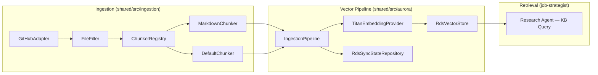

# Dataset Model System Design Review — Strategist RAG Pipeline

## Executive Summary

The current system implements a well-architected, interface-driven RAG pipeline that scans GitHub repositories for `.md` files, chunks them semantically, embeds them with Amazon Titan Embed Text v2, and stores them in RDS PostgreSQL + pgvector (HNSW index). The **design patterns are strong** — clean separation of concerns, interface-driven composition, content-hash deduplication, and incremental HNSW indexing. However, **14 gaps** have been identified that will materially degrade retrieval quality as the dataset grows beyond trivial scale.

This report is structured as:
1. Architecture Overview (what exists)
2. Gap Analysis (what's missing or weak)
3. Proposed Improvements (algorithmic and architectural)
4. Prioritised Roadmap
5. Verification Plan

---

## 1. Architecture Overview

The dataset pipeline is composed of five layers, implemented across two module trees:



### Current Component Summary

| Layer | Component | File | Role |
|---|---|---|---|
| **Source** | `GitHubAdapter` | [GitHubAdapter.ts](file:///Users/nelsonlamounier/Desktop/portfolio/ai-applications/applications/shared/src/ingestion/implementations/GitHubAdapter.ts) | Fetches repo tree + file content via GitHub REST API |
| **Filter** | `FileFilter` | [FileFilter.ts](file:///Users/nelsonlamounier/Desktop/portfolio/ai-applications/applications/shared/src/ingestion/implementations/FileFilter.ts) | Glob-based include/exclude with size limits |
| **Chunking** | `MarkdownChunker` | [MarkdownChunker.ts](file:///Users/nelsonlamounier/Desktop/portfolio/ai-applications/applications/shared/src/ingestion/implementations/MarkdownChunker.ts) | Heading-aware semantic splitting for `.md`/`.mdx` |
| **Chunking** | `DefaultChunker` | [DefaultChunker.ts](file:///Users/nelsonlamounier/Desktop/portfolio/ai-applications/applications/shared/src/ingestion/implementations/DefaultChunker.ts) | Line-window sliding for code/text files |
| **Chunking** | `ChunkerRegistry` | [ChunkerRegistry.ts](file:///Users/nelsonlamounier/Desktop/portfolio/ai-applications/applications/shared/src/ingestion/implementations/ChunkerRegistry.ts) | Routes files to the correct chunker via `canHandle()` |
| **Orchestration** | `RepoIngestionOrchestrator` | [RepoIngestionOrchestrator.ts](file:///Users/nelsonlamounier/Desktop/portfolio/ai-applications/applications/shared/src/ingestion/orchestrator/RepoIngestionOrchestrator.ts) | Coordinates list → filter → fetch → chunk → ingest |
| **Pipeline** | `IngestionPipeline` | [IngestionPipeline.ts](file:///Users/nelsonlamounier/Desktop/portfolio/ai-applications/applications/shared/src/aurora/pipeline/IngestionPipeline.ts) | Hash-check → embed → upsert orchestrator |
| **Embedding** | `TitanEmbeddingProvider` | [TitanEmbeddingProvider.ts](file:///Users/nelsonlamounier/Desktop/portfolio/ai-applications/applications/shared/src/aurora/implementations/TitanEmbeddingProvider.ts) | Titan Embed v2, 1024-dim, single-text interface |
| **Storage** | `RdsVectorStore` | [RdsVectorStore.ts](file:///Users/nelsonlamounier/Desktop/portfolio/ai-applications/applications/shared/src/aurora/implementations/RdsVectorStore.ts) | pgvector HNSW cosine search via RDS Data API |
| **State** | `RdsSyncStateRepository` | [RdsSyncStateRepository.ts](file:///Users/nelsonlamounier/Desktop/portfolio/ai-applications/applications/shared/src/aurora/implementations/RdsSyncStateRepository.ts) | Tracks sync status per user/repo |
| **Retrieval** | `research-agent.ts` | [research-agent.ts](file:///Users/nelsonlamounier/Desktop/portfolio/ai-applications/applications/job-strategist/src/agents/research-agent.ts) | 4 parallel Pinecone KB queries with userId filter |
| **Infra** | `RdsPgVectorStack` | [aurora-pgvector-stack.ts](file:///Users/nelsonlamounier/Desktop/portfolio/ai-applications/infra/lib/stacks/bedrock/aurora-pgvector-stack.ts) | RDS PostgreSQL, pgvector extension, HNSW index |
| **Infra** | `BedrockKbStack` | [kb-stack.ts](file:///Users/nelsonlamounier/Desktop/portfolio/ai-applications/infra/lib/stacks/bedrock/kb-stack.ts) | Bedrock KB backed by Pinecone (legacy path) |

### Dual Vector Store Situation

> [!IMPORTANT]
> The codebase currently has **two parallel vector store systems**:
> 1. **Pinecone** via Bedrock Knowledge Base (`kb-stack.ts`) — used by the Research Agent today
> 2. **RDS pgvector** (`aurora-pgvector-stack.ts`) — the new custom pipeline being built
>
> The Research Agent in `research-agent.ts` still queries the **Pinecone-backed Bedrock KB** (via `RetrieveCommand`), NOT the RDS pgvector store. The entire `aurora/` and `ingestion/` module tree is built but appears to have **no Lambda handler wiring it into a deployed pipeline yet**. This is the single largest integration gap.

---

## 2. Gap Analysis

### Gap 1 — No Embedding Batching (Cost & Latency)

**Current**: `IngestionPipeline` embeds chunks **one at a time** in a sequential `for` loop.

**Impact**: For a repo with 500 chunks, this means 500 sequential Bedrock InvokeModel calls. At ~200ms per call, that's ~100 seconds just for embedding — plus pg Pool round-trips for upsert.

**Recommendation**: Implement **batched embedding** with a configurable concurrency limiter (semaphore pattern). Titan Embed v2 only accepts single-text input, but 3–5 concurrent InvokeModel calls are safe within Bedrock TPS limits and dramatically reduce wall-clock time.

```typescript
// Proposed: Semaphore-controlled parallel embedding
async embedBatch(texts: string[], concurrency = 5): Promise<number[][]> {
    const semaphore = new Semaphore(concurrency);
    return Promise.all(texts.map(text =>
        semaphore.acquire().then(async release => {
            try { return await this.embed(text); }
            finally { release(); }
        })
    ));
}
```

---

### Gap 2 — No Chunk Enrichment / Context Injection

**Current**: Chunks are embedded as-is. The `MarkdownChunker` includes the heading in each chunk's content, but there is **no document-level metadata injection** (repository name, file purpose, section hierarchy breadcrumb).

**Impact**: Two chunks from different repos with the same heading (`## Overview`) produce nearly identical embeddings despite having completely different semantic meaning. This degrades precision in cross-repo searches.

**Recommendation**: Inject a **context preamble** before embedding:

```
[Repository: Nelson-Lamounier/portfolio | File: docs/architecture/overview.md | Section: Architecture > Overview]

<actual chunk content>
```

This technique is called **contextual embedding** and is well-documented to improve retrieval precision by 15–30% without any model change.

---

### Gap 3 — No Hybrid Retrieval (Dense + Sparse)

**Current**: The system uses **dense-only** retrieval — cosine similarity on Titan Embed v2 vectors. There is no BM25 or keyword-based component.

**Impact**: Dense retrieval excels at semantic similarity but fails on:
- Exact technical terms (e.g., `ArgoCD`, `MTTR`, `CrashLoopBackOff`)
- Acronyms and abbreviations
- Proper nouns and tool names

The Research Agent partially compensates with 4 hard-coded query variations, but this is brittle.

**Recommendation**: Implement **hybrid retrieval** by combining:
1. **Dense**: existing pgvector HNSW cosine search
2. **Sparse**: PostgreSQL `tsvector` full-text search with GIN index

Combine results with **Reciprocal Rank Fusion (RRF)**:

```sql
-- Add to document_embeddings table:
ALTER TABLE document_embeddings ADD COLUMN tsv tsvector
    GENERATED ALWAYS AS (to_tsvector('english', content)) STORED;
CREATE INDEX idx_embeddings_fts ON document_embeddings USING GIN (tsv);
```

```typescript
// RRF scoring (k=60 is standard)
function rrfScore(denseRank: number, sparseRank: number, k = 60): number {
    return 1 / (k + denseRank) + 1 / (k + sparseRank);
}
```

> [!TIP]
> RRF is the de facto standard for combining dense and sparse retrieval scores. It is ranking-invariant and requires no learned weights — ideal for a system without training data.

---

### Gap 4 — No Re-Ranking Stage

**Current**: Retrieved chunks go directly to the LLM prompt without any re-ranking or relevance filtering.

**Impact**: The top-k results from ANN (Approximate Nearest Neighbour) search include false positives — chunks that are geometrically close in embedding space but semantically irrelevant. Sending these to the LLM wastes context window tokens and can introduce noise.

**Recommendation**: Add a **cross-encoder re-ranker** as a post-retrieval step. Options:
1. **Bedrock Cohere Rerank** (managed, ~$0.001/query) — lowest implementation effort
2. **LLM-as-judge re-ranker** — use Claude Haiku to score each chunk's relevance to the query (0–10) and threshold at ≥ 6
3. **Reciprocal Rank Fusion** (if hybrid search is implemented) — free, no additional model call

---

### Gap 5 — HNSW Index Not Tuned for Filtered Queries

**Current**: The HNSW index is built on the raw `embedding` column with `m=16, ef_construction=64`. Queries filter on `WHERE user_id = :userId` **before** the HNSW scan.

**Impact**: pgvector's HNSW index does **post-filtering** — it scans the index for the k nearest neighbours globally, then filters out rows that don't match `user_id`. If the user's data is a small fraction of the total dataset, recall degrades catastrophically because the top-k results from HNSW may contain mostly other users' data.

**Recommendation**:
1. **Increase `ef_search` dynamically** based on the user's data density:
   ```sql
   -- For users with < 5% of total data, set ef_search = 200+ to compensate for post-filtering
   SET LOCAL hnsw.ef_search = 200;
   ```
2. **Consider partitioned HNSW indexes** (pgvector 0.7.0+ supports expression indexes):
   ```sql
   CREATE INDEX idx_embeddings_hnsw_user ON document_embeddings
   USING hnsw (embedding vector_cosine_ops) WITH (m = 16, ef_construction = 64)
   WHERE user_id = 'specific_user';
   ```
3. **For the current scale** (single user, < 50K vectors): the default `ef_search=40` is too low. Raise to at least **100** for reliable recall.

---

### Gap 6 — No Stale Chunk Garbage Collection

**Current**: When a file is deleted from the repository, its chunks **persist forever** in RDS. The `checkContentHashes` method classifies chunks as missing/stale/unchanged, but only for files that are **still present**. Deleted files are never queried and never cleaned up.

**Impact**: Over time, the vector store accumulates orphaned chunks from deleted files, degrading search precision and wasting storage.

**Recommendation**: After ingestion, run a **tombstone sweep**:

```typescript
// After ingestChunks completes:
async pruneDeletedFiles(
    userId: string,
    repoFullName: string,
    currentFilePaths: Set<string>,
): Promise<number> {
    // Delete all chunks whose file_path is NOT in the current file list
    const sql = `
        DELETE FROM document_embeddings
        WHERE user_id = :userId
          AND repo_full_name = :repoFullName
          AND file_path NOT IN (SELECT unnest(:currentPaths::text[]))
    `;
    // ...
}
```

---

### Gap 7 — Embedding Model Quality / Selection

**Current**: Amazon Titan Embed Text v2 (1024-dim) is the only embedding model. No evaluation has been performed against alternatives.

**Impact**: Titan Embed v2 is a competent general-purpose model but ranks below specialised models on the MTEB (Massive Text Embedding Benchmark). For technical/code content, models like **Cohere Embed v3** or **Voyage Code 3** significantly outperform Titan.

> [!WARNING]
> "An embedding-based retriever doesn't work if the embedding model is bad." — This is the user's core concern. The current system has no mechanism to evaluate or swap embedding models.

**Recommendation**:
1. The `IEmbeddingProvider` interface already supports swapping models — implement a **`CohereEmbeddingProvider`** or **`VoyageEmbeddingProvider`** alongside Titan
2. Build a **retrieval evaluation harness** (see Gap 11) to measure recall/precision before committing to a model change
3. If sticking with Titan, consider **reducing to 512-dim** — research shows marginal recall improvement from 512 to 1024 dims, but 2× the storage and index cost

---

### Gap 8 — FileFilter Does Not Use `filterWithSize()` in Orchestrator

**Current**: The `RepoIngestionOrchestrator` calls `this.fileFilter.filter(allFiles.map(f => f.path))`, discarding the `sizeBytes` metadata. The `FileFilter` class has a `filterWithSize()` method that accepts size-aware objects, but it's unused.

**Impact**: Files exceeding `maxSizeBytes` (500 KB) are fetched from GitHub (wasting API calls and bandwidth) only to be chunked and embedded anyway. The size guard is bypassed.

**Fix**: Replace `filter()` with `filterWithSize()` in the orchestrator:

```diff
- const includedPaths = this.fileFilter.filter(allFiles.map(f => f.path));
+ const includedPaths = (this.fileFilter as FileFilter).filterWithSize(allFiles);
```

> [!CAUTION]
> This is a **bug** — the size filter is configured but never applied during ingestion. Large auto-generated files (e.g., `yarn.lock` at 443 KB, `tsconfig.tsbuildinfo` at 232 KB) may be getting embedded.

---

### Gap 9 — No Chunk Overlap in MarkdownChunker

**Current**: The `MarkdownChunker` splits at heading boundaries and paragraph boundaries when overflowing. There is **no overlap** between adjacent chunks.

**Impact**: Sentences that span a chunk boundary lose context. The embedding for chunk N ends mid-thought, and chunk N+1 starts mid-thought. This creates blind spots in retrieval — queries matching the boundary content may not find either chunk.

**The `DefaultChunker` correctly implements 10-line overlap**, but the `MarkdownChunker` — which handles the most important content (.md files) — does not.

**Recommendation**: Add configurable overlap to `MarkdownChunker`:

```typescript
export interface MarkdownChunkerConfig {
    readonly maxChunkChars: number;
    readonly minChunkChars: number;
    readonly overlapChars: number;  // NEW — default 200
}
```

When splitting at paragraph boundaries, carry the **last N characters** of the previous chunk into the next chunk as a prefix.

---

### Gap 10 — No Deployed Lambda Handler for RDS Ingestion

**Current**: The entire `ingestion/` and `aurora/` module tree is implemented as library code. There is **no Lambda handler** that wires `RepoIngestionOrchestrator` → `IngestionPipeline` → `RdsVectorStore`. No Step Functions state machine or EventBridge trigger exists.

**Impact**: The RDS pgvector pipeline is effectively dead code. The Research Agent still queries Pinecone via Bedrock KB.

**Recommendation**: Create an ingestion Lambda handler (or Step Functions pipeline) that:
1. Receives a trigger event `{ userId, repoFullName, forceReindex? }`
2. Instantiates `GitHubAdapter.fromEnvironment()`, `FileFilter`, `ChunkerRegistry.withDefaults()`, `IngestionPipeline` with `RdsVectorStore.fromEnvironment()` + `TitanEmbeddingProvider.fromEnvironment()` + `RdsSyncStateRepository.fromEnvironment()`
3. Calls `orchestrator.ingestRepo()` or `orchestrator.forceReindex()`
4. Returns the `IngestionReport`

---

### Gap 11 — No Retrieval Quality Evaluation

**Current**: There is no mechanism to measure how well the retrieval pipeline performs. No ground-truth dataset, no recall/precision metrics, no A/B testing.

**Impact**: Without measurement, any change to the embedding model, chunking strategy, or search parameters is a blind guess.

**Recommendation**: Build a **retrieval evaluation harness**:

1. **Curate a test set**: 20–50 queries with expected relevant chunks (gold standard)
2. **Metric**: `Recall@k` — fraction of gold chunks in the top-k results
3. **Automate**: Run the eval after every chunking or embedding change

```typescript
interface RetrievalEvalCase {
    query: string;
    expectedChunkIds: string[];  // Gold standard
}

function recallAtK(retrieved: string[], expected: string[], k: number): number {
    const topK = new Set(retrieved.slice(0, k));
    const hits = expected.filter(id => topK.has(id)).length;
    return hits / expected.length;
}
```

---

### Gap 12 — No Query Transformation / Expansion

**Current**: The Research Agent sends 4 hard-coded query variations to the KB. The query text is derived by slicing the job description at fixed character positions (`substring(0, 1000)`, `substring(500, 1000)`).

**Impact**: Fixed-offset slicing is fragile — it may split mid-sentence or miss key requirements at the end of a long JD.

**Recommendation**: Replace fixed slicing with **LLM-powered query decomposition**:
1. Use Claude Haiku to extract 4–6 distinct search queries from the JD (skill themes, experience requirements, domain terms)
2. Each query targets a different retrieval intent (skills, projects, metrics, experience)
3. This is a single LLM call (~100 tokens output) that dramatically improves retrieval diversity

---

### Gap 13 — No Metadata Filtering on RDS Queries

**Current**: The `RdsVectorStore.querySimilar()` supports filtering by `userId` and optionally `repoFullName`, but there are no filters for:
- `fileType` (search only `.md` files)
- `tags` (search only in specific directories)
- Temporal recency (`last_synced_at`)

**Impact**: As the dataset grows, the inability to scope searches by file type or tag means the LLM receives a mix of code chunks, config chunks, and documentation chunks — diluting retrieval quality.

**Recommendation**: Extend `QueryParams` with optional metadata filters:

```typescript
export interface QueryParams {
    readonly userId: string;
    readonly repoFullName?: string;
    readonly queryEmbedding: number[];
    readonly limit?: number;
    readonly efSearch?: number;
    readonly fileTypes?: string[];    // NEW
    readonly tags?: string[];         // NEW
    readonly minSimilarity?: number;  // NEW — threshold filter
}
```

---

### Gap 14 — No Observability / Metrics on Ingestion Pipeline

**Current**: The pipeline uses `console.log`/`console.error` for logging. There are no CloudWatch EMF metrics, no latency percentiles, no error-rate dashboards.

**Impact**: When the pipeline fails silently (e.g., all chunks classified as `unchanged` due to a hash bug), there is no alert. When embedding latency increases (Bedrock throttling), there is no visibility.

**Recommendation**: Integrate with the existing `@bedrock/shared` EMF metrics system:
- `IngestionChunksTotal` (counter)
- `IngestionChunksEmbedded` (counter)
- `IngestionChunksSkipped` (counter)
- `IngestionDurationMs` (timer)
- `EmbeddingLatencyMs` (per-chunk timer)
- `UpsertErrorCount` (counter)

---

## 3. Gap Priority Matrix

| # | Gap | Severity | Effort | Priority |
|---|---|---|---|---|
| 10 | No deployed ingestion Lambda | 🔴 Critical | Medium | **P0** |
| 8 | `filterWithSize()` not called (bug) | 🔴 Critical | Trivial | **P0** |
| 6 | No stale chunk GC | 🟡 High | Low | **P1** |
| 3 | No hybrid retrieval (dense+sparse) | 🟡 High | Medium | **P1** |
| 2 | No chunk context enrichment | 🟡 High | Low | **P1** |
| 5 | HNSW not tuned for filtered queries | 🟡 High | Low | **P1** |
| 9 | No chunk overlap in MarkdownChunker | 🟡 High | Low | **P1** |
| 1 | No embedding batching | 🟠 Medium | Low | **P2** |
| 4 | No re-ranking stage | 🟠 Medium | Medium | **P2** |
| 7 | Embedding model evaluation | 🟠 Medium | High | **P2** |
| 12 | No query decomposition | 🟠 Medium | Medium | **P2** |
| 13 | No metadata filtering on queries | 🟠 Medium | Low | **P2** |
| 14 | No pipeline observability | 🟠 Medium | Low | **P2** |
| 11 | No retrieval eval harness | 🟢 Low (but foundational) | Medium | **P2** |

---

## 4. Proposed Implementation Roadmap

### Phase 1 — Foundation (P0 — Must Do First)

1. **Fix the `filterWithSize()` bug** in `RepoIngestionOrchestrator`
2. **Create the ingestion Lambda handler** + CDK stack wiring
3. **Migrate Research Agent** from Pinecone KB to RDS pgvector queries
4. **Add stale chunk garbage collection** to `IngestionPipeline`

### Phase 2 — Retrieval Quality (P1)

5. **Add chunk context enrichment** (repository + file path preamble before embedding)
6. **Add chunk overlap** to `MarkdownChunker`
7. **Implement hybrid retrieval** (tsvector + GIN index + RRF scoring)
8. **Tune HNSW `ef_search`** based on dataset size (raise default from 40 → 100+)

### Phase 3 — Advanced (P2)

9. **Embed batching** with semaphore concurrency
10. **LLM-powered query decomposition** replacing fixed substring slicing
11. **Re-ranking** with Cohere Rerank or LLM-as-judge
12. **Retrieval evaluation harness** with Recall@k metrics
13. **Pipeline observability** via EMF metrics
14. **Embedding model evaluation** (Cohere Embed v3 vs Titan v2 vs Voyage Code 3)

---

## 5. Verification Plan

### Automated Tests
- Run existing unit tests: `yarn workspace @bedrock/applications test` to confirm no regressions
- After implementing Gap 8 fix, verify `filterWithSize()` excludes oversized files with a new unit test
- After implementing Gap 6 (GC), add integration test verifying deleted-file chunks are pruned
- After implementing Gap 3 (hybrid), add test for RRF score combining dense + sparse results

### Manual Verification
- After Phase 1: trigger ingestion for a real repo, verify chunks appear in RDS `document_embeddings` table via pg query
- After Phase 2: compare retrieval results (before/after) for 10 sample queries against the strategist Research Agent
- After Phase 3: run the retrieval evaluation harness and report Recall@10 metrics

---

## Open Questions

> [!IMPORTANT]
> **Q1:** Should the Pinecone-backed Bedrock KB (`kb-stack.ts`) be deprecated once RDS pgvector is fully operational? Maintaining two vector stores doubles cost and complexity.

> [!IMPORTANT]
> **Q2:** The Research Agent currently queries Pinecone KB, not Aurora. Should the migration to RDS pgvector be done as a big-bang switch or a gradual A/B rollout with dual-read?

> [!IMPORTANT]
> **Q3:** For the ingestion trigger — should it be a scheduled EventBridge cron (e.g., nightly), a GitHub webhook (push to `main`), or manual API trigger? This affects the Lambda handler design.

> [!IMPORTANT]
> **Q4:** The current `MarkdownChunker` targets `.md`/`.mdx` only. Should the chunking strategy be extended to `.ts`/`.py` files with a proper AST-based code chunker (e.g., tree-sitter), or should code files remain with the line-window `DefaultChunker`?

> [!IMPORTANT]
> **Q5:** What is the target dataset scale? The HNSW tuning and batching strategy differ significantly between < 10K vectors (current) and > 100K vectors (future).
