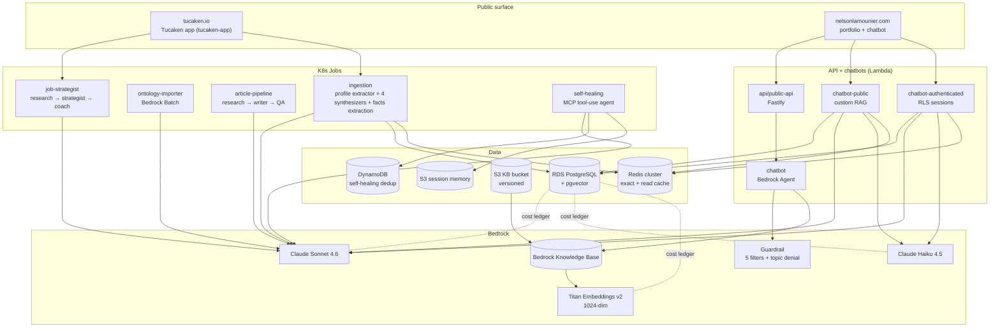

<!-- @format -->

# ai-applications

**The AI/ML backend for [Tucaken](https://tucaken.io) — a SaaS that turns a
developer's real code into a job-tailored, evidence-backed resume.** A job-seeker connects their GitHub
account; Tucaken verifies which skills they can actually prove from their
repositories, then — given a specific job description — generates a resume
tailored to that role using only skills the candidate can defend in an interview.

**Who it's for:** software engineers applying for jobs who want a resume that is
tailored per posting *and* honest — grounded in what their code shows, not
keyword stuffing.

**The problem it solves:** resumes claim skills candidates can't prove, tailoring
to each job is slow and manual, and candidates can't see how they truly match a
role. Tucaken grounds every skill in concrete repository evidence (files,
commits, PRs), reads each job description into a canonical required-skill list,
assesses the candidate's verified evidence against it (verified / partial / gap),
and writes a tailored resume through a multi-agent Bedrock pipeline.

**This repo's role:** the AI/ML backend — GitHub ingestion, skill-evidence
extraction, the JD-strategist, multi-agent resume synthesis, and project
case-study generation. The user-facing web app, dashboard, and authenticated API
live in the sibling **`tucaken-app`** repo, which dispatches jobs to this backend
and renders the results.

## Under the hood

Production AI/ML platform on AWS Bedrock — TypeScript, AWS CDK, RDS PostgreSQL +
pgvector, Redis cluster, managed Amazon EKS, and a multi-agent synthesis
pipeline. Powers the chatbot, job strategist, article pipeline, ingestion
(including its deterministic facts extraction), and self-healing agent
that also back [nelsonlamounier.com](https://nelsonlamounier.com).

## What it does

The repository is a Yarn 4 workspace monorepo of **11 services** built
on a shared TypeScript foundation. The services share one Bedrock
account, one RDS PostgreSQL instance (`k8s-dev-platform-rds`), one Redis
cluster, and one managed Amazon EKS cluster (`k8s-eks-development`;
provisioned by the `tucaken-infra` repo, with in-cluster GitOps
manifests in `kubernetes-bootstrap`).

The platform answers two questions: *"what's in this engineer's
portfolio?"* (chatbot + RAG + per-user embeddings) and *"how does the
portfolio compare against the engineer's stated resume?"* (multi-agent
synthesis pipeline producing identity, role-archetype fit, resume
reconciliation, and a resume-readiness diagnostic).

## Why this exists

Most AI projects pile new LLM calls on top of every problem. This
codebase is a worked example of the opposite discipline: **LLMs where
the input is unstructured and the action space is open; deterministic
parsers where the input is structured and the output must be
reproducible**. Two ADRs record the pair: [ADR
0001](docs/decisions/0001-deterministic-over-llm-extraction.md)
formalises the decommission of LLM-based technology extraction in
favour of a deterministic pipeline; the self-healing agent is the
counter-case where an LLM is the right tool. The platform pays the
LLM cost only where the alternative is brittle hand-coded runbooks.

Every Bedrock invocation goes through one shared cost ledger
(`prompt_invocations`,
[migration 011](applications/platform-rds-bootstrap/migrations/011_prompt_observability.sql)
and [013](applications/platform-rds-bootstrap/migrations/013_bedrock_cost_tracking.sql)),
through one PII scrubber, and — for cacheable paths — through one of
three caches sharing a single domain vocabulary
([CONTEXT.md](CONTEXT.md) lines 6-26). The cross-cutting concerns
live in `applications/shared/`; the services compose them rather
than re-implementing them.

## Highlights

+ **80 versioned SQL migrations** across the platform's ontology,
  user, billing, and observability schemas — RDS PostgreSQL + pgvector
  + Postgres RLS for user-scoped data
  ([applications/platform-rds-bootstrap/migrations/](applications/platform-rds-bootstrap/migrations/)).
+ **Self-healing Bedrock agent** with a native MCP tool-use loop,
  Cognito M2M-authenticated Gateway, **DRY_RUN=true** default,
  cross-container DynamoDB dedup, per-alarm S3 session memory, and a
  20,000-token-per-invocation hard cap
  ([applications/self-healing/src/index.ts](applications/self-healing/src/index.ts);
  [concept doc](docs/concepts/self-healing-agent.md)).
+ **Multi-agent profile synthesis chain**: 5 Bedrock-backed agents
  (Extractor → Mirror+Reveal → Direction → Reconciliation →
  Diagnostic narrator) over a deterministic aggregate, each with
  forced tool-use, zod schema validation, per-item grounding check,
  and must-not-throw semantics
  ([concept doc](docs/concepts/profile-synthesis-chain.md)).
+ **Deterministic facts extraction** (formerly a standalone
  tech-extractor service, retired 2026-07-18 and folded into
  ingestion's facts stage) that decommissioned an LLM enricher with a
  measured 6-iteration parity engagement; recall rose **0.368 → 0.673**
  on KBS and **0.253 → 0.548** on TUC across the engagement
  ([parity decommission artefact](applications/ingestion/docs/tech-extractor/parity/2026-05-27-decommission.md)).
+ **Three-tier caching architecture** with shared `scope` + `kbTag`
  invalidation vocabulary: `RedisExactCache` (hash-keyed AI-gen),
  `RedisReadCache` (BFF read-through, shared cluster, different
  prefix), `PgSemanticCache` (pgvector cosine on embedded queries)
  ([concept doc](docs/concepts/caching-tiers.md)).
+ **Six-layer defence-in-depth** on the chatbot path: API Gateway →
  `InputSanitiser` → Bedrock Guardrail (5 content filters + topic
  denial) → agent instruction → `OutputSanitiser` → audit log; with
  a separate Haiku-backed grounding verifier that fail-safes to
  `NOT_GROUNDED` on any parse ambiguity
  ([concept doc](docs/concepts/bedrock-rag-surface.md)).
+ **10 GitHub Actions deploy workflows** (per service) sharing two
  reusable workflows (`_build-push-image.yml`, `_deploy-stack.yml`);
  per-environment ECR + SSM-stored image URI for ArgoCD-driven sync.

## Architecture



The cross-cutting code in `applications/shared/` provides the
`OntologyResolver`, `PiiScrubber`, `TitanEmbeddingProvider`, the
three cache classes, `BedrockGroundingVerifier`, the hexagonal RDS
repository pattern, the observability primitives (OTel + EMF +
Pushgateway), and the per-user `recordBedrockCost` ledger.

## Tech stack

+ **Language**: TypeScript end-to-end (services, infra, scripts)
+ **Runtime**: Node 22 (Lambda + K8s Jobs)
+ **AI**: AWS Bedrock — Claude Sonnet 4.6 (generation), Claude Haiku
  4.5 (verifier + low-cost classification), Amazon Titan Embeddings
  v2 (1024-dim, pgvector)
+ **Database**: RDS PostgreSQL + pgvector (HNSW indexes); Postgres
  RLS for user-scoped data; 80 numbered migrations with
  [ROLLBACK](applications/platform-rds-bootstrap/ROLLBACK.md)
  documentation
+ **Vector store**: pgvector (semantic cache + per-user embeddings +
  skill-evidence retrieval), colocated with the relational data; see
  [ADR 0002](docs/decisions/0002-pgvector-over-pinecone-for-cache.md)
+ **Cache**: Redis cluster shared between `RedisExactCache` and
  `RedisReadCache` (key-prefix isolated); pgvector semantic cache
+ **Compute**: AWS Lambda (Bedrock + chatbot + outcome tracker) +
  Kubernetes Jobs (long-running extraction + synthesis pipelines)
+ **Infrastructure**: AWS CDK with `@cdklabs/generative-ai-cdk-constructs`
  for Bedrock; cdk-nag aspects; hexagonal project factory
  pattern
+ **Orchestration**: EventBridge → SQS FIFO → Lambda (self-healing);
  Step Functions (bootstrap remediation); ArgoCD (workload sync from
  sibling cluster repo)
+ **Observability**: OpenTelemetry (`withSpan`, ADOT layer) + EMF
  metrics + Pushgateway for K8s Jobs; per-user spend ledger;
  CloudWatch token-budget alarms
+ **Security**: Cognito (user auth + M2M client credentials),
  CloudFront WAF, AWS Comprehend (planned), regex `PiiScrubber`,
  input/output sanitisers, Bedrock Guardrail
+ **CI/CD**: 10 GitHub Actions deploy workflows + 2 reusable
  workflows; per-environment ECR + SSM-stored image URIs;
  ArgoCD-driven sync from a sibling cluster repo
+ **Tooling**: Yarn 4 workspaces, Jest (+ contract + smoke), `just`
  task runner, esbuild bundling (NodejsFunction)

## Key design decisions

1. **Deterministic over LLM where structural** — [ADR 0001](docs/decisions/0001-deterministic-over-llm-extraction.md)
   records the 6-iteration parity engagement that decommissioned the
   `BedrockChunkEnricher.technologies` role.
2. **Self-hosted pgvector over a managed vector store** — [ADR 0002](docs/decisions/0002-pgvector-over-pinecone-for-cache.md)
   records choosing pgvector, colocated with the relational data, for
   the semantic cache + per-user embeddings rather than a separate
   managed vector service.
3. **MCP tool-use for self-healing, not Bedrock action groups** —
   [self-healing concept](docs/concepts/self-healing-agent.md)
   documents the trade. Action groups bake the catalogue into the
   agent; MCP `tools/list` discovery lets the Gateway evolve
   independently.
4. **`scope` + `kbTag` as platform-wide invalidation vocabulary** —
   [CONTEXT.md](CONTEXT.md) is the glossary; the three cache classes
   and the per-user spend ledger all consume the same terms.
5. **Six-layer defence-in-depth on the chatbot** — [bedrock-rag-surface](docs/concepts/bedrock-rag-surface.md)
   pairs lambda-side sanitisers with the Bedrock Guardrail (input
   `HIGH`, output `NONE` for `PROMPT_ATTACK` to avoid blocking KB
   content discussing security) and a separate Haiku grounding
   verifier defaulting to `NOT_GROUNDED` on any ambiguity.

## Repository structure

```text
.
├── api/                       — Fastify HTTP layer (public-api)
├── applications/              — 11 services + shared module
│   ├── shared/                — hexagonal RDS, observability, security, cache
│   ├── chatbot-public/
│   ├── chatbot-authenticated/
│   ├── ingestion/             — profile extractor + 4 synthesizer agents + facts extraction
│   ├── ontology-importer/     — Bedrock Batch tier-2 ontology import
│   ├── self-healing/          — Bedrock MCP tool-use agent
│   ├── article-pipeline/      — research → writer → QA agents
│   ├── job-strategist/        — research → strategist → coach agents
│   ├── synthetic-monitor/     — E2E probe runner
│   ├── platform-job-watcher/  — cross-platform job-source poller
│   ├── resume-import-processor/
│   └── platform-rds-bootstrap/migrations/  — 80 numbered SQL migrations
├── infra/                     — AWS CDK (aspects, constructs, factories, stacks)
├── packages/script-utils/     — shared CLI tooling
├── scripts/smoke/             — E2E smoke tests against deployed env
├── content/articles/          — long-form engineering write-ups
├── docs/                      — concepts, decisions, projects, runbooks, troubleshooting
├── rag-checklist/             — per-service RAG deploy checklists
├── CONTEXT.md                 — domain glossary
└── justfile                   — task runner index
```

A full snapshot of the tree is at
[docs/repo-structure.md](docs/repo-structure.md).

## Running locally

```bash
# Install all workspaces
yarn install

# Type-check / lint / test every workspace
yarn typecheck
yarn lint
yarn test

# Build a specific service
yarn workspace @bedrock/self-healing build

# Discover all task-runner entries
just

# End-to-end smoke against a deployed dev env (requires .env.smoke)
just smoke-e2e
```

A live local "stack up" is not provided — every service is designed
to run as a Lambda or K8s Job against the deployed AWS environment.
Local development is unit-test-driven; integration testing uses the
smoke harness ([scripts/smoke/README.md](scripts/smoke/README.md))
against a development environment.

## Deploying

Each service has its own GitHub Actions deploy workflow under
[.github/workflows/](.github/workflows/). The 11 deploy workflows
share two reusable building blocks:

+ [`_build-push-image.yml`](.github/workflows/_build-push-image.yml)
  — builds the service Docker image, pushes to ECR, writes the URI
  to SSM
+ [`_deploy-stack.yml`](.github/workflows/_deploy-stack.yml) —
  invokes `cdk deploy` for stack-based services

K8s Jobs (ingestion, ontology-importer, etc.) read
their image URI from SSM at deploy time, so a code push to `develop`
re-tags the image and the next ArgoCD sync rolls the change forward
in the cluster — a managed Amazon EKS cluster provisioned by the
`tucaken-infra` repo, with in-cluster GitOps manifests in
`kubernetes-bootstrap`.

Lambda services (chatbot, public-api, self-healing) deploy directly
via CDK. The self-healing agent uses a four-stack composition
documented in [docs/projects/self-healing.md](docs/projects/self-healing.md).

## Related projects

All private, under the [`Nelson-Lamounier`](https://github.com/Nelson-Lamounier) org.

| Repository | Role |
| :- | :- |
| [`tucaken-app`](https://github.com/Nelson-Lamounier/tucaken-app) | **Product front-end** — the Next.js web app + authenticated API for [Tucaken](https://tucaken.io); dispatches jobs to this backend and renders the results. |
| [`tucaken-infra`](https://github.com/Nelson-Lamounier/tucaken-infra) | **Infrastructure (AWS CDK)** — provisions the managed Amazon EKS cluster (Karpenter, Pod Identity, Argo Rollouts) plus the cross-account CloudWatch + Grafana observability stack. *(formerly `cdk-monitoring`)* |
| [`kubernetes-bootstrap`](https://github.com/Nelson-Lamounier/kubernetes-bootstrap) | **GitOps (in-cluster)** — Argo CD manifests, Helm values, and Grafana dashboards for the EKS cluster the long-running Jobs run in. |

Cross-repo migration artefacts that have landed in this repo's
[docs/incoming/](docs/incoming/) but originate from `tucaken-infra`
(formerly `cdk-monitoring`) are marked with the literal
`<!-- Migrated from cdk-monitoring -->` header they were stamped with.

## Documentation

+ [CONTEXT.md](CONTEXT.md) — domain glossary
+ [docs/](docs/) — full documentation tree (concepts / decisions /
  projects / runbooks / troubleshooting + the engineering plans
  archive under `docs/superpowers/`)
+ [docs/repo-structure.md](docs/repo-structure.md) — generated tree
  snapshot

## License

Proprietary — all rights reserved. See [LICENSE](LICENSE).
Repository is public-for-review; no usage rights are granted.

## Disclosure

Built with Claude Code (Anthropic). Architecture, prompts, infra
design, ADRs, and the prose decisions captured in
[docs/](docs/) are authored. Code is co-produced with the assistant
under human review. The `kb-doc` skill that produced the
documentation tree is itself documented at
[docs/skills/](docs/skills/).

See [AI_USAGE.md](AI_USAGE.md) for the long-form breakdown — which
surfaces are AI-drafted, where AI suggestions were deliberately
overridden, and the verification discipline applied to keep the
documentation grounded in real code (every claim cited to a
`file.ts#Lstart-Lend` range).
