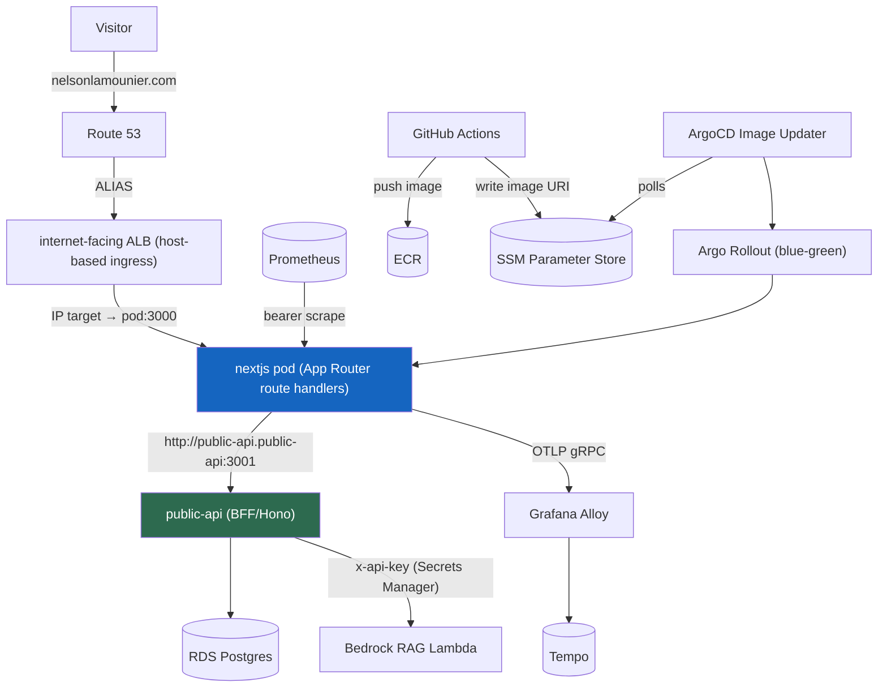

## In-Cluster Architecture

The `nextjs` pod (the container that runs the public-facing Next.js website) now holds no AWS data credentials. It talks to one address: `http://public-api.public-api:3001`, a [Kubernetes service DNS](https://kubernetes.io/docs/concepts/services-networking/service/) name that resolves to the `public-api` service regardless of which physical nodes the pods land on, how many replicas are running, or whether pods have restarted. The browser never sees this address. It only ever calls same-origin `/api/*` routes. The call to `public-api` happens server-to-server, inside the cluster.

`public-api` (a Hono service) owns every privileged dependency: RDS credentials via Secrets Manager, the Bedrock RAG Lambda API key, and the VPC-private RDS Postgres instance. RDS has no public IP and is reachable only from inside the VPC. That is the security boundary — not a firewall rule, but a network topology that makes the database unreachable by design.

ALB routing matters here. The shared `public` IngressGroup routes `api.nelsonlamounier.com` to `public-api` and the main site host to the `nextjs` service at path `/`. Because routing is by host rather than path, the site's own `/api/*` handlers are not transparently rewritten to `public-api`. The portfolio uses the Next-proxy model: route handlers fetch `public-api` in-cluster and re-serve the result. The BFF and its secrets stay off the public surface.
