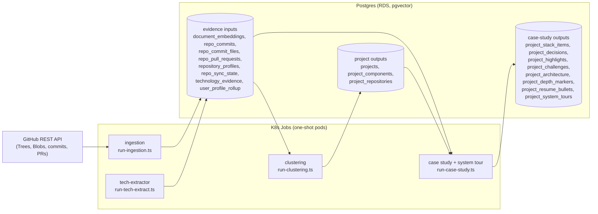

<!-- @format -->

# Projects domain

`applications/shared/src/projects` turns a user's synced GitHub repositories
into recruiter-ready portfolio artefacts: multi-repo project groupings, a
grounded case study per project, an interview-ready system tour, and
change-impact narrations. Every generated sentence traces back to evidence
rows in Postgres; the LLM never gets to invent a fact the pipeline cannot
cite.

The folder is organised into seven concern subfolders behind a single public
barrel (`index.ts`). Consumers import from `@bedrock/shared`; nothing outside
this folder imports an internal file directly.

```text
projects/
├── index.ts          public barrel (the only import surface)
├── types.ts          shared domain types (component kinds, clustering shapes)
├── clustering/       group repos into multi-repo project proposals
├── grounding/        code-grounded component-kind classification
├── case-study/       generate + persist the per-project case study
├── archetype/        archetype/stage calibration ontology
├── system-tour/      interview walkthrough derived from the case study
├── change-impact/    grounded "what changed" narration for a file
└── evidence/         repo signal derivation + retrieval metadata stamps
```

Each subfolder has its own README with a file-by-file guide. This one covers
the system as a whole: where the data comes from, how it flows, what lands in
the database, and the payload contracts.

---

## System design

Three design rules shape everything here (they mirror the repo-wide LLM
workflow pattern in `CLAUDE.md`):

1. **One structured agent call per unit of work.** Each pipeline makes a
   single Bedrock invocation with a forced `tool_use` schema. There is no
   free-text parsing: the model must emit the exact Zod-validated payload or
   the run fails loudly.
2. **Deterministic code decides, the model narrates.** Component kinds, depth
   markers, archetype classification, evidence stamps, and every citable
   number come from SQL and pure functions. The model's version of any of
   these is overridden or discarded.
3. **Grounding is enforced, not requested.** Case-study sections must cite
   commits, PRs, or files (`sourceSignals`); stack items are verified against
   the SBOM-derived `technology_evidence` table; change-impact narrations
   citing a number outside the measured set are thrown away and replaced with
   a deterministic sentence.

### Data flow



Downstream, the persisted rows feed the resume strategist (Projects section
bullets), stage-prep interview evidence, and the public portfolio render in
the tucaken app (separate repository).

---

## Source of the data and how it is ingested

The raw source is the **GitHub REST API**. The ingestion pipeline (the
`applications/ingestion` app) runs as a one-shot Kubernetes Job per repo
(`run-ingestion.ts`), authenticated with a `GITHUB_TOKEN` personal access
token (`contents:read`). It fetches:

- the full file tree (Git Trees API, `recursive=1`) and file contents (Blobs
  API),
- commits, pull requests, and contributors,
- per-commit diffs and stats.

From that raw material the ingestion run produces the evidence tables this
domain reads:

| Table | Writer | Content |
| --- | --- | --- |
| `document_embeddings` | `RdsVectorStore.upsertBatch` | Chunked repo content with **Titan Embed Text v2** embeddings (1024-dim, pgvector column). Metadata carries `fileClass` lanes (`source`, `docs`, `iac`, `ci`, `test`, `db`, `config`, `history`), lineage, and the evidence stamp (below). Commit history is chunked under synthetic `_commits/` paths. |
| `repo_commits`, `repo_commit_files`, `repo_pull_requests`, `repo_contributors` | `RdsRepoActivityStore` | Commit metadata, per-file diff stats (additions/deletions), merged PRs. Keyed `(repository_id, sha)` / `(repository_id, number)`. |
| `repository_profiles` | ingestion `RepositoryProfileRepository` | Per-repo profile: `classification`, `quality_score`, extracted tech stack. |
| `repo_sync_state` | `RdsSyncStateRepository` | The deterministic signal maps this folder derives at ingestion time: `archetype_signals` (from `evidence/repo-signals.ts`) and `evidence_topology` (from `evidence/evidence-topology.ts`). |
| `technology_evidence` | **tech-extractor** Job (separate from ingestion) | SBOM-grade technology rows with version, purl, and file:line, per source layer (`syft`, `treesitter`, `iac`, `dockerfile`). |
| `user_profile_rollup` | `RdsUserProfileRollupRepository` | Cross-repo synthesis including seniority direction, recomputed on sync. |

At the end of a successful ingestion run, `evidence/apply-evidence-stamp.ts`
back-fills authorship and tech metadata onto every chunk (see the database
classification section). The Jobs are dispatched from outside this
repository (the case-study Job, for example, is dispatched by the admin API
one project at a time); this repo owns everything from the Job entrypoint
down.

---

## Database classification

Two classifications matter when reading this domain's data.

### 1. Repository classification (`repository_profiles.classification`)

Computed deterministically at ingestion (`ingestion/src/util/classifyRepo.ts`)
and used everywhere as a trust gate:

| Value | Rule |
| --- | --- |
| `fork` | GitHub fork with fewer than 5 commits |
| `abandoned` | fewer than 3 commits |
| `tutorial` | name matches `tutorial / hello-world / learning / playground / test-` |
| `stale` | last push more than 5 years ago |
| `noise` | no README, fewer than 10 commits, no manifests |
| `project` | everything else (the only value the profile rollup counts) |

### 2. Chunk-level evidence stamp (`document_embeddings.metadata`)

`evidence/apply-evidence-stamp.ts` merges an `EvidenceStamp` JSONB patch onto
every chunk of every repo so retrieval can filter without joins:

| Key | Meaning |
| --- | --- |
| `is_fork` | hard retrieval gate; fork code is never the user's authorship |
| `repo_classification` | copy of the profile classification |
| `repo_confidence` | soft rank signal, `quality_score` 0..1 |
| `authored` | the user committed to the repo, or owns it (and it is not a fork) |
| `role_inferred` | negation of `authored`; downstream copy must not claim "built" |
| `owner_is_user` | repo owner equals the user's GitHub login |
| `repo_tech_stack` | code-derived canonical tech list |
| `file_tech_stack` | per-file tech from `technology_evidence`, for fine-grained retrieval filtering |

---

## The pipelines and their payloads

### Clustering (proposals of multi-repo projects)

`clustering/` reads repo digests and description embeddings, extracts
deterministic signals (shared naming prefixes, topics, tech stack, and
embedding-cosine pairs above 0.78), and asks a Bedrock agent (Haiku 4.5 by
default, forced tool `emit_project_groupings`) for at most 8 proposals.
`grounding/` then overrides the agent's component kinds with code-derived
classification before `persistClusteringResult` writes, in one transaction:

- `projects` (shape `multi_repo`, `is_ai_suggested=TRUE`, `is_user_confirmed=FALSE`),
- `project_components` (one per kind),
- `project_repositories` (links).

Confirmed projects are never overwritten; prior unconfirmed AI proposals are
cleared first. Payload contract (`types.ts`):

```text
ClusteringResult = { proposals: ClusteringProposal[] (max 8) }
ClusteringProposal = { name, confidence: high|medium|low, reasoning,
                       components: [{ name, kind, repositoryIds[] }] }
kind ∈ frontend|backend|infra|mobile|data|ml|docs|shared
```

### Case study (the core artefact)

`case-study/` loads a token-budgeted context for one project (commits, PRs,
KB chunks, verified stack, difficulty signals, archetype calibration), makes
one Sonnet 4.6 call (forced tool `emit_case_study`, 32k max tokens), grounds
the result, and fans it out across eight tables in one transaction. Payload
contract (`case-study/case-study-types.ts`):

```text
CaseStudy = {
  displayName, productStatement, tagline, pitch,
  stack:      StackItem[]  (max 40, category ∈ language|framework|database|
                            infrastructure|observability|ci_cd|external_service),
  decisions:  Decision[]   (max 5, confidence high|medium|low),
  highlights: Highlight[]  (max 5),
  challenges: Challenge[]  (max 5),
  architecture: { diagramFormat: mermaid|svg, diagramSource, nodes[], edges[] },
  depthMarkers: { hasTests, testCoverageSignal, hasCi, ciMaturity,
                  documentationDensity, hasDeploymentEvidence, refactorCount },
  resumeBullets: [{ angle ∈ backend|frontend|infrastructure|fullstack|
                    data_ml|product_leadership, bullets[] }]
}
```

Every stack/decision/highlight/challenge row carries `sourceSignals`
(commits, PRs, files it cites, plus a `grounding` verdict). Rows that cite
nothing are marked `NOT_VERIFIED`; stack items missing from
`technology_evidence` are marked `NOT_GROUNDED` with an explicit ungrounded
claim recorded. Depth markers are always the deterministic, loader-derived
values; the model's version is discarded.

### System tour (interview walkthrough)

`system-tour/` re-projects a finished case study (its only input) into the
order a candidate walks an architecture-review round: `area`, `context`,
`keyDecisions` (max 6), `tradeoffs` (max 6), `systemMap` (the case-study
architecture, verbatim), `outcomes` (max 6), and `whatIdChange` (max 4,
grounded improvements only). One Sonnet 4.6 call, forced tool
`emit_system_tour`, fail-fast validation, upserted into
`project_system_tours` (one row per project).

### Change impact (grounded narration of file history)

`change-impact/` computes deterministic metrics from commit diffs (churn,
net LOC, cyclomatic-complexity delta, measured perf before/after) and lets a
Sonnet call narrate them. The anti-fabrication gate is structural: every
number in the narration must appear in the measured set (`allowedNumbersFor`)
or the model's output is discarded for a deterministic sentence. The served
payload is always grounded.

---

## LLM usage at a glance

| Agent | Default model | Env override | Forced tool | Cache scope |
| --- | --- | --- | --- | --- |
| Clustering | `eu.anthropic.claude-haiku-4-5-20251001-v1:0` | `CLUSTERING_MODEL` | `emit_project_groupings` | `clustering:<userId>` |
| Case study | `eu.anthropic.claude-sonnet-4-6` | `CASE_STUDY_MODEL` | `emit_case_study` | `casestudy:<userId>:<projectId>` |
| System tour | `eu.anthropic.claude-sonnet-4-6` | `SYSTEM_TOUR_MODEL` | `emit_system_tour` | `systemtour:<userId>:<projectId>` |
| Change-impact narrator | `eu.anthropic.claude-sonnet-4-6` | `CHANGE_IMPACT_MODEL` | `emit_change_impact` | none (grounding gate instead) |

All agents honour `INFERENCE_PROFILE_ARN` and run with a zero thinking
budget (forced `tool_use` is incompatible with extended thinking). Caches are
`RedisExactCache` behind the `ISemanticCache` interface, keyed on a sha256
input hash; the case-study prompt version is folded into its hash so prompt
edits bust the cache, and refine runs bypass it. Every cache path fails open.

---

## Entrypoints

Both pipelines run as one-shot K8s Jobs in the `job-strategist` image and
report progress on the `pipeline_runs` table:

| Entrypoint | Unit of work | Status flow |
| --- | --- | --- |
| `applications/job-strategist/src/run-clustering.ts` | one user | `queued → signals_extracting → analysing → persisting → complete/failed` |
| `applications/job-strategist/src/run-case-study.ts` | one project | `queued → fetching_context → generating → grounding → persisting → complete/failed` |

The case-study Job also refreshes confirmed-project components (best-effort),
runs refine mode by default (`CASE_STUDY_DISABLE_REFINE=true` to opt out),
and generates the system tour inline after persisting (a tour failure never
fails the job). Feature flags: `projects.clustering.enabled`,
`projects.case_study.enabled`.

---

## Conventions

- **Barrel-only imports.** External code imports from `@bedrock/shared`
  (which re-exports `projects/index.ts`). New modules are born in the
  matching subfolder and re-exported through the root barrel.
- **RLS.** Writers that run outside the Job's own transaction set
  `SELECT set_config('app.current_user_id', $1, true)` inside the
  transaction (see `system-tour/system-tour-persistence.ts` for the
  reference pattern).
- **Sticky user edits.** `projects.user_overrides` flags protect
  user-edited sections; regeneration never overwrites them.
- **Idempotent regeneration.** Per-section rows key on
  `(project_id, content_hash)`; unchanged rows survive, superseded generated
  rows are pruned, user-authored (NULL-hash) rows are never touched.
- **Tests** live in each subfolder's `__tests__/` directory; `.eval.test.ts`
  files are prompt-contract evals that run with the same jest suite.
