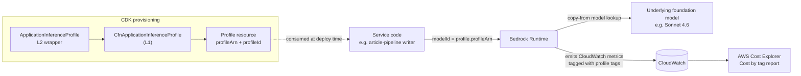

## Overview

`ApplicationInferenceProfile` is a custom L2-style CDK construct
wrapping `CfnApplicationInferenceProfile`. It creates a Bedrock
**Application Inference Profile** — an AWS feature that lets every
Bedrock invocation be tagged with **cost-allocation tags** that
propagate to AWS Cost Explorer. The construct ships in
[infra/lib/constructs/observability/application-inference-profile.ts](../../infra/lib/constructs/observability/application-inference-profile.ts)
(~110 lines) and is invoked 5+ times across the platform's CDK
stacks to attribute Bedrock spend per pipeline (article research vs
article writing vs strategist research vs self-healing).

The profile becomes the **model id** the application passes to
`InvokeModel` / `Converse` — Bedrock looks up the underlying model
from the profile and bills the call against the profile's tags.

## How it works



### Construct props — three required, one optional

`ApplicationInferenceProfileProps`
([application-inference-profile.ts:36-58](../../infra/lib/constructs/observability/application-inference-profile.ts#L36-L58)):

| Prop | Required | Constraint |
| :- | :-: | :- |
| `profileName` | yes | Pattern `^([0-9a-zA-Z][ _-]?)+$`, max 64 chars |
| `modelSourceArn` | yes | System inference profile ARN OR foundation-model ARN |
| `description` | optional | Pattern `^([0-9a-zA-Z:.][ _-]?)+$`, max 200 chars |
| `tags` | optional | `cdk.CfnTag[]` — propagate to Cost Explorer |

Two of these constraints are unusual:

- The **`profileName` regex** disallows two consecutive separators
  (so `bedrock--dev-article` is invalid). The single-separator
  alternation is the AWS API constraint, not the construct's
  invention.
- The **`description` regex** allows colons and dots (so versioned
  descriptions like `Sonnet 4.6: article research v1.2` pass) but
  still rejects pipes, slashes, and quotes.

### `modelSourceArn` — two accepted shapes

The Bedrock API accepts either a **system inference profile** ARN
or a **foundation model** ARN as the `copyFrom` source
([application-inference-profile.ts:45-49](../../infra/lib/constructs/observability/application-inference-profile.ts#L45-L49)):

- System inference profile: `arn:aws:bedrock:{region}::inference-profile/{model-id}`
- Foundation model: `arn:aws:bedrock:{region}::foundation-model/{model-id}`

The platform uses **system inference profile ARNs** (sourced from
[infra/lib/config/shared/model-registry.ts](../../infra/lib/config/shared/model-registry.ts))
because they encode the cross-region inference routing — a system
profile dispatches to the foundation model in *any* EU region,
which gives the underlying model multi-region failover without
the application code knowing about it.

### Output: `profileArn` + `profileId`

The construct exposes two readonly fields
([application-inference-profile.ts:101-102](../../infra/lib/constructs/observability/application-inference-profile.ts#L101-L102)):

```ts
public readonly profileArn: string;
public readonly profileId: string;
```

The **ARN is the model id** the application passes to Bedrock —
this is the load-bearing connection between the CDK resource and
the runtime invocation. Stacks pass the ARN through to Lambda env
vars via `ssm.StringParameter` or directly via Lambda env block
(e.g. the self-healing Lambda's `INFERENCE_PROFILE_ARN` env var,
[docs/concepts/self-healing-agent.md#dynamic-tool-discovery](self-healing-agent.md)).

### Replacement semantics

The construct's docstring is explicit
([application-inference-profile.ts:83-85](../../infra/lib/constructs/observability/application-inference-profile.ts#L83-L85)):

> All properties on the underlying CloudFormation resource require
> `Replacement` on update — changes to `profileName` or
> `modelSourceArn` will trigger resource recreation.

In CloudFormation terms: every property is `RequiresReplacement`.
Editing the source ARN of an existing profile is not possible;
CDK creates a new profile and deletes the old one. Stacks that
consume the ARN have to be deployed *after* the profile stack to
pick up the new ARN.

### Five concrete instances on develop

Four under `BedrockDataStack` for the article + strategist pipelines
([infra/lib/stacks/bedrock/data-stack.ts:249-275](../../infra/lib/stacks/bedrock/data-stack.ts#L249-L275)):

- `ArticleHaikuProfile` — article-pipeline research (Haiku 4.5)
- `ArticleSonnetProfile` — article-pipeline writer + QA (Sonnet 4.6)
- `StrategistHaikuProfile` — job-strategist research (Haiku 4.5)
- `StrategistSonnetProfile` — job-strategist strategist + coach
  (Sonnet 4.6)

One under `SelfHealingGatewayStack` for the self-healing agent
([infra/lib/stacks/self-healing/gateway-stack.ts:1156](../../infra/lib/stacks/self-healing/gateway-stack.ts#L1156)):

- `AgentSonnetProfile` — self-healing agent's ConverseCommand loop
  (Sonnet 4.6)

Each profile attaches cost tags identifying the pipeline. The
**Cost Explorer view filtered by these tags** shows
article-pipeline vs strategist vs self-healing spend separately —
the granular finance attribution AWS billing API otherwise can't
provide (Bedrock spend rolls up to a single line by default).

## Implementation in this codebase

| Concern | Location |
| :- | :- |
| Construct | [infra/lib/constructs/observability/application-inference-profile.ts](../../infra/lib/constructs/observability/application-inference-profile.ts) |
| Barrel export | [infra/lib/constructs/observability/index.ts](../../infra/lib/constructs/observability/index.ts) |
| Model registry (system ARNs) | [infra/lib/config/shared/model-registry.ts:131+](../../infra/lib/config/shared/model-registry.ts#L131) |
| Bedrock data stack (4 profiles) | [infra/lib/stacks/bedrock/data-stack.ts:249-275](../../infra/lib/stacks/bedrock/data-stack.ts#L249-L275) |
| Self-healing gateway stack (1 profile) | [infra/lib/stacks/self-healing/gateway-stack.ts:1156](../../infra/lib/stacks/self-healing/gateway-stack.ts#L1156) |

## Tradeoffs

**Why a custom construct, not raw `CfnApplicationInferenceProfile`.**
The L1 `CfnApplicationInferenceProfile` exposes the bare CloudFormation
resource — every property is a string, the model-source field is
nested under `modelSource: { copyFrom: '...' }`, and consumers have
to remember the regex constraints. The construct flattens to a
typed-props interface, documents the regex constraints in JSDoc,
and exposes `profileArn` + `profileId` as the two fields callers
actually want. Five callers each saving ~10 lines of nested-object
boilerplate is the cost-benefit.

**Why one profile per (pipeline, model) pair.** The simplest
pipeline-attribution scheme is one profile per call site. The
platform uses one profile per (pipeline, model) — Article-Haiku
covers research (which uses Haiku) and Article-Sonnet covers
writer + QA (which use Sonnet). The article-pipeline's writer
and QA share one profile because they share a model and a billing
boundary.

**Why cost-allocation tags, not CloudWatch custom metrics.** Custom
metrics would let the application emit per-pipeline cost figures
into CloudWatch directly. The platform's
[bedrock-cost-tracking](bedrock-cost-tracking.md) ledger already
does that (`prompt_invocations` per call). The Application Inference
Profile is the **second layer** — same data, different cut. Cost
Explorer's tag-based view is the canonical AWS-side cost story; the
DB ledger is the per-user attribution story. Both are needed because
they answer different questions.

**Profile changes force replacement.** Every property is
`RequiresReplacement` per the construct's docstring. A model upgrade
(Sonnet 4.6 → 4.7) means **deleting the old profile and creating a
new one** at deploy time. Lambda env vars carrying the old ARN will
break the moment the deploy happens; stacks that consume the ARN
have to be sequenced after the profile-creation stack.

## Deeper detail

- [docs/concepts/bedrock-cost-tracking.md](bedrock-cost-tracking.md)
  — the application-side cost ledger that runs *alongside* this
  AWS-side cost-allocation mechanism
- [docs/concepts/bedrock-rag-surface.md](bedrock-rag-surface.md) —
  the consumer of `ArticleSonnetProfile`, `StrategistSonnetProfile`
  via the Bedrock Agent
- [docs/concepts/self-healing-agent.md](self-healing-agent.md) —
  consumes `AgentSonnetProfile` via the `INFERENCE_PROFILE_ARN` env
  var
- (planned) docs/concepts/cdk-construct-architecture.md — the
  L1/L2/L3 distinction in CDK; this construct as a canonical
  example of "L2-style wrapper around an L1 resource for ergonomics"

## Related concepts

- [docs/concepts/project-factory.md](project-factory.md) — the
  factory that instantiates these construct instances inside each
  project's stack composition
- [docs/decisions/0001-deterministic-over-llm-extraction.md](../decisions/0001-deterministic-over-llm-extraction.md)
  — the decommissioned `BedrockChunkEnricher` was its own line in
  the Cost Explorer view under the article-pipeline tag; the
  per-token-cost drop is observable there

<!--
Evidence trail (auto-generated):
- Source: infra/lib/constructs/observability/application-inference-profile.ts (read in full on 2026-05-27)
- Source: infra/lib/stacks/bedrock/data-stack.ts (lines 249-275 on 2026-05-27)
- Source: infra/lib/stacks/self-healing/gateway-stack.ts (line 1156 on 2026-05-27)
- Source: infra/lib/config/shared/model-registry.ts (line 131 on 2026-05-27)
- Source: infra/lib/constructs/observability/index.ts (barrel export on 2026-05-27)
-->
