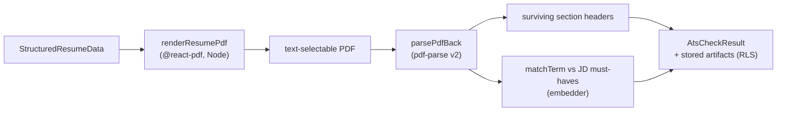

## Overview

The strategist renders the AI-authored resume to a real, text-selectable PDF and
then **re-parses that PDF** to verify an Applicant Tracking System could read it —
the standard section headers survived and the JD's must-have terms are present.
The render-then-parse-back loop is the quality gate: a resume that looks right but
parses to garbage in an ATS is caught before it ships.

## Server-side PDF render (no browser)

`renderResumePdf()` builds the resume with `@react-pdf` and renders it to a
`Buffer` in Node — no headless browser — producing a text-selectable PDF from
`StructuredResumeData`
([render-resume-pdf.ts:7-11](../../applications/job-strategist/src/render/render-resume-pdf.ts#L7-L11)).
The React-PDF module is loaded via `loadReactPdf()` and the document tree is built
by `buildResumeElement()` (`render/resume-pdf/`).

## Parse-back

`parsePdfBack()` extracts text from the rendered PDF using `pdf-parse` v2's
`PDFParse` class (a dual CJS/ESM package, safe to import) and detects which of the
standard ATS section headers survived — `Summary`, `Experience`, `Skills`,
`Projects`, `Education`, `Certifications`
([parse-back.ts:4-13](../../applications/job-strategist/src/ats/parse-back.ts#L4-L13)).
If a header doesn't survive the round-trip, an ATS won't see that section.

## The ATS check

`run-ats-check.ts` ties it together: render the resume, parse it back, then build
an `AtsCheckResult` from the parsed text. It collects the JD's must-have terms and
the grounded terms (`collectJdMustHaves`, `collectGroundedTerms`), matches them
against the parsed resume with an embedder-backed `matchTerm`, computes coverage
rows via `buildAtsCheck`, and stores the artifacts (`storeAtsArtifacts`) — all
under user RLS (`withUserRls`)
([run-ats-check.ts:6-15](../../applications/job-strategist/src/ats/run-ats-check.ts#L6-L15)).

## Implementation in this codebase

| Concern | File |
| :- | :- |
| Server-side PDF render | `applications/job-strategist/src/render/render-resume-pdf.ts`, `render/resume-pdf/` |
| Parse-back + section detection | `applications/job-strategist/src/ats/parse-back.ts` |
| ATS check orchestration | `applications/job-strategist/src/ats/run-ats-check.ts` |
| Coverage rows + keyword match | `applications/job-strategist/src/ats/{checks,jd-keywords,keyword-match}.ts` |
| Artifact persistence | `applications/job-strategist/src/ats/store-ats-artifacts.ts` |

## Tradeoffs

Rendering server-side with `@react-pdf` avoids a headless browser in the Job
(simpler, lighter) at the cost of React-PDF's layout constraints. Re-parsing the
*rendered* PDF (rather than trusting the input data) is what makes the gate
real — it measures what an ATS actually sees, not what the generator intended.
The embedder-backed term match trades exactness for catching JD terms phrased
differently in the resume.

## Deeper detail

- [skill-evidence-ledger](skill-evidence-ledger.md) — the verified evidence behind resume claims
- [anti-hallucination-guards](../patterns/anti-hallucination-guards.md) — number/vendor/doc-drift guards over the resume text

## Related concepts

- [jd-read-centralisation](jd-read-centralisation.md)

<!--
Evidence trail (auto-generated):
- Source: applications/job-strategist/src/render/render-resume-pdf.ts (read on 2026-06-16, lines 1-11)
- Source: applications/job-strategist/src/ats/parse-back.ts (read on 2026-06-16, lines 1-13)
- Source: applications/job-strategist/src/ats/run-ats-check.ts (read on 2026-06-16, lines 1-20)
-->
