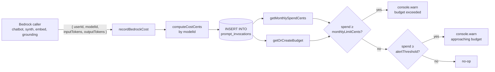

## Overview

`bedrock-cost.ts` is the platform's per-user Bedrock spend ledger.
Every Bedrock invocation that has a `userId` to attribute to —
chatbot generation, profile synthesis, repo-sync embeddings, the
grounding verifier — writes a row to `prompt_invocations` with
input/output tokens and pre-computed cost in fractional cents
([applications/shared/src/rds/bedrock-cost.ts](../../applications/shared/src/rds/bedrock-cost.ts)).
A second table, `user_token_budgets`, holds per-user monthly soft
limits.

The pattern is **single source of truth**: the model id determines
the pricing, the call site supplies the tokens, the function
computes the cost. Callers cannot fabricate cost values — they pass
`(modelId, inputTokens, outputTokens)` and the cost arithmetic
happens in one place.

## How it works



### Pricing table — single source of truth

`PRICING` maps model id → input/output cents-per-1K-tokens
([applications/shared/src/rds/bedrock-cost.ts:6-39](../../applications/shared/src/rds/bedrock-cost.ts#L6-L39)).
Five entries today (May 2026 eu-west-1 rates):

| Model id | Input cents/1K | Output cents/1K |
| :- | -: | -: |
| `eu.anthropic.claude-haiku-4-5-20251001-v1:0` | 0.080 | 0.400 |
| `anthropic.claude-haiku-4-5-20251001-v1:0` (bare) | 0.080 | 0.400 |
| `eu.anthropic.claude-sonnet-4-6-20260310-v1:0` | 0.300 | 1.500 |
| `eu.anthropic.claude-sonnet-4-6` (bare) | 0.300 | 1.500 |
| `amazon.titan-embed-text-v2:0` | 0.0026004 | 0 |

The map includes **both prefixed and bare** Anthropic model ids
because Bedrock's `ConverseCommand` API reports the bare id (no
date suffix) in its response and CloudWatch metrics, while the
SDK calls and CDK env vars typically use the EU cross-region
inference profile id (with the `eu.` prefix and date suffix). The
explicit dual entry prevents the `DEFAULT_PRICING` fallback from
silently misattributing Haiku invocations as Sonnet — a comment in
the source explains this would over-bill Haiku **~3.75×**
([bedrock-cost.ts:14-19](../../applications/shared/src/rds/bedrock-cost.ts#L14-L19)).

`DEFAULT_PRICING = { inputCentsPerK: 0.300, outputCentsPerK: 1.500 }`
([bedrock-cost.ts:40](../../applications/shared/src/rds/bedrock-cost.ts#L40)) —
Sonnet rates as a conservative floor, on the principle that
unknown-model spend should over-estimate rather than under-estimate.

### Fractional cents — why `NUMERIC(12,4)` not `INTEGER`

Haiku input pricing is **0.080 cents per 1K tokens**. A 100-token
input invocation costs `0.008` cents — below the `INTEGER` floor
of 1 cent. Migration 011 introduced cost columns as `INTEGER`; **migration 013** widened them to `NUMERIC(12,4)`
([applications/platform-rds-bootstrap/migrations/013_bedrock_cost_tracking.sql:38-41](../../applications/platform-rds-bootstrap/migrations/013_bedrock_cost_tracking.sql#L38-L41))
specifically because:

> Cost columns must store fractional cents for sub-cent model
> costs (Haiku, Titan). INTEGER would round 0.08 cents to 0,
> making budget checks blind.

`computeCostCents`
([bedrock-cost.ts:51-65](../../applications/shared/src/rds/bedrock-cost.ts#L51-L65))
rounds to 6 decimals
(`Math.round(... * 1_000_000) / 1_000_000`) before returning, so
the in-memory representation matches `NUMERIC(12,4)` storage
without floating-point drift on aggregation.

### The audit log row

`prompt_invocations` was introduced by migration 011 as the
**per-call Bedrock audit log**
([applications/platform-rds-bootstrap/migrations/011_prompt_observability.sql](../../applications/platform-rds-bootstrap/migrations/011_prompt_observability.sql)):

| Column | Purpose |
| :- | :- |
| `id`, `invoked_at` | Identity + when |
| `pipeline` | One of: `resume-import`, `repo-sync`, `chatbot-public`, `chatbot-authenticated`, `job-strategist`, `article-pipeline`, `project-clustering`, `project-case-study`, `grounding-verify`, profile pipelines — taxonomy lives in `CostRecord['pipeline']` ([bedrock-cost.ts:46](../../applications/shared/src/rds/bedrock-cost.ts#L46)) |
| `agent` | `agentName` from the agent runner, or the literal `'__direct_invoke__'` for raw Converse calls without an agent abstraction |
| `model_id` | The actual Bedrock model id used |
| `prompt_version`, `prompt_id` | Caller-supplied for prompt-versioning observability |
| `system_prompt_hash`, `output_hash` | SHA-256 of the serialised content |
| `system_prompt_tokens`, `user_message_tokens`, `output_tokens` | Token breakdown (`cache_tokens_saved` for Bedrock prompt-cache reads) |
| `input_cost_cents`, `output_cost_cents`, `total_cost_cents` | The three cost figures |
| `latency_ms`, `cache_hit` | Performance |
| `import_id`, `repo_name` | Link rows back to their source job (migration 013) |

Migration 013 added:

- `idx_prompt_invocations_user_month` (`user_id, invoked_at` INCLUDE `total_cost_cents`) — enables index-only scans on the monthly SUM aggregation ([migration 013:26-29](../../applications/platform-rds-bootstrap/migrations/013_bedrock_cost_tracking.sql#L26-L29)).
- Partial indexes on `import_id` and `repo_name` so source-job lookups skip rows that don't carry that linkage.

### Per-user budget

`user_token_budgets` is a one-row-per-user soft cap
([migration 013:30-37](../../applications/platform-rds-bootstrap/migrations/013_bedrock_cost_tracking.sql#L30-L37)):

```sql
CREATE TABLE user_token_budgets (
  user_id              UUID PRIMARY KEY REFERENCES users(id) ON DELETE CASCADE,
  monthly_limit_cents  INTEGER  NOT NULL DEFAULT 500,
  alert_threshold_pct  SMALLINT NOT NULL DEFAULT 80,
  created_at TIMESTAMPTZ NOT NULL DEFAULT NOW(),
  updated_at TIMESTAMPTZ NOT NULL DEFAULT NOW()
);
```

Defaults: **500 cents/month** (US $5), warn at **80%**. Both are
overridable per user. `getOrCreateBudget` falls back to these
defaults when no row exists
([bedrock-cost.ts:88-99](../../applications/shared/src/rds/bedrock-cost.ts#L88-L99))
so a new user is budgeted without an explicit row create.

### Post-call check — warns, does not throw

`recordBedrockCost` is called **after** the Bedrock invocation
completes, then queries the user's monthly spend + budget and emits
a `console.warn` if either threshold trips
([bedrock-cost.ts:122-142](../../applications/shared/src/rds/bedrock-cost.ts#L122-L142)):

```ts
if (spend >= budget.monthlyLimitCents) {
  console.warn('[bedrock-cost] user exceeded monthly budget', { ... });
  // NOTE(production): throw BudgetExceededError here to reject job
  // start when spend >= monthlyLimitCents (pre-flight check, not
  // post-call).
}
```

The TODO at this site is explicit: a pre-flight check before the
*next* invocation should throw `BudgetExceededError` so spend is
bounded; the post-call warn is informational only. The platform
runs at a low enough scale today that the warn-only model is
acceptable, but the bug it leaves open is: a single user can
exceed their monthly cap by the cost of one runaway request. For
the chatbot at 0.3 cents/1K Sonnet input, that's a bounded ceiling;
for an unbounded job (a self-healing agent stuck in a token-budget
loop), it would matter more — and the
[self-healing token-budget runbook](../runbooks/self-healing-token-budget.md)
addresses that case at a different layer (per-Lambda alarm).

### Fire-and-forget at the caller

Every caller wraps `recordBedrockCost` in `.catch(err => console.warn(…))`
([applications/chatbot-public/src/invoke-claude.ts:35-42](../../applications/chatbot-public/src/invoke-claude.ts#L35-L42),
[applications/shared/src/grounding/bedrock-grounding-verifier.ts:30-35](../../applications/shared/src/grounding/bedrock-grounding-verifier.ts#L30-L35),
[applications/shared/src/rds/implementations/TitanEmbeddingProvider.ts:97-101](../../applications/shared/src/rds/implementations/TitanEmbeddingProvider.ts#L97-L101))
so a Postgres outage cannot fail a chatbot response. Cost tracking
is observability — the spend already happened on Bedrock; the
*record* is what fails, and that's a recoverable miss.

The cost of fire-and-forget is **eventual loss** if Postgres is
hard-down for an extended period: rows that would have been
written are silently dropped. Mitigated by the fact that Bedrock's
own per-account cost metrics in CloudWatch + Cost Explorer remain
authoritative — the database table is for per-user attribution, not
for total-spend reconciliation.

### Pipeline labels are a taxonomy, not free text

The `pipeline` column accepts a fixed enum in the TypeScript type
([bedrock-cost.ts:43-46](../../applications/shared/src/rds/bedrock-cost.ts#L43-L46)):

```ts
pipeline: 'resume-import' | 'repo-sync' | 'profile-extraction'
        | 'retrieval-probe' | 'profile-synthesis' | 'profile-direction'
        | 'profile-reconciliation' | 'profile-diagnostic'
        | 'chatbot-public' | 'chatbot-authenticated'
        | 'job-strategist' | 'article-pipeline'
        | 'project-clustering' | 'project-case-study'
        | 'grounding-verify';
```

The database column is `TEXT` (not an enum type — the platform's
convention to avoid `CREATE TYPE` lock-step migrations) but the
caller-side type narrows the values to the supported set. Adding a
new pipeline requires touching three places: the TypeScript union,
the `PRICING` map (if a new model), and any analytics view that
groups by pipeline.

### `recordInvocationToRds` — adapter for the agent runner

The shared agent runner produces an `AgentInvocationLog` rather
than calling `recordBedrockCost` directly
([bedrock-cost.ts:154-180](../../applications/shared/src/rds/bedrock-cost.ts#L154-L180)).
`recordInvocationToRds(pool, pipeline)` returns a callback bound to
that pipeline:

```ts
const onInvocationComplete = recordInvocationToRds(pool, 'job-strategist');
// wired into BasePipelineContext
```

This adapter pattern lets the agent runner's pipelines book spend
without depending on the database — the recorder is injected at
the calling layer. The adapter skips records without a `userId`,
logging a warning, so an unattributed Converse call surfaces in
CloudWatch (via the warn) without writing a fabricated user.

## Implementation in this codebase

| Concern | Location |
| :- | :- |
| Pricing + record function | [applications/shared/src/rds/bedrock-cost.ts](../../applications/shared/src/rds/bedrock-cost.ts) |
| Audit log table | [migration 011](../../applications/platform-rds-bootstrap/migrations/011_prompt_observability.sql) |
| Budget table + index + NUMERIC widening | [migration 013](../../applications/platform-rds-bootstrap/migrations/013_bedrock_cost_tracking.sql) |
| Callers (sample) | [`chatbot-public/src/invoke-claude.ts`](../../applications/chatbot-public/src/invoke-claude.ts), [`grounding/bedrock-grounding-verifier.ts`](../../applications/shared/src/grounding/bedrock-grounding-verifier.ts), [`rds/implementations/TitanEmbeddingProvider.ts`](../../applications/shared/src/rds/implementations/TitanEmbeddingProvider.ts) |
| Tests | [applications/shared/src/rds/bedrock-cost.test.ts](../../applications/shared/src/rds/bedrock-cost.test.ts) |

## Tradeoffs

**Per-call DB write.** Every Bedrock invocation incurs one Postgres
INSERT plus two SELECTs (spend + budget). For the chatbot
(latency-sensitive surface) this is a few-millisecond addition; for
batch jobs (article-pipeline, profile-synthesis) it is noise. The
benefit is full attribution; the cost is the round-trip on every
call. A batched async writer would amortise it but at the cost of
"in-flight invocations not yet recorded" — a worse audit story.

**Warn-only enforcement.** No `BudgetExceededError` thrown today
([bedrock-cost.ts:127-132](../../applications/shared/src/rds/bedrock-cost.ts#L127-L132))
means a user can blow past their soft cap by the cost of the
in-flight call. Pre-flight check (before invocation) would be the
hard cap — the source comment marks this as a production follow-up.
Acceptable now because the chatbot's per-call cost is bounded by
`maxTokens: 1024` ([chatbot-public/src/invoke-claude.ts:30](../../applications/chatbot-public/src/invoke-claude.ts#L30))
and the self-healing agent has its own per-Lambda token-budget
alarm
([docs/runbooks/self-healing-token-budget.md](../runbooks/self-healing-token-budget.md)).

**Pricing as code, not config.** Updating the `PRICING` map
requires a code change and deploy. The benefit is reviewability and
that the cost arithmetic and the model list are version-locked.
The cost is the deploy lag when AWS/Anthropic announce price
changes. The comment at the top of the file marks the rates as
"eu-west-1, May 2026" with a "revisit when AWS/Anthropic publish
EU-specific rates" note — making the staleness checkpoint explicit.

**`DEFAULT_PRICING = Sonnet`.** Unknown model ids over-bill (Sonnet
is the most expensive in the matrix). Conservative — better to
over-attribute than to under-attribute. A genuine new model id
should be added to `PRICING` explicitly; the fallback exists for
typos and drift, not for steady-state operation.

**Bare-id duplication.** Three of the five `PRICING` entries are
explicit bare-id duplicates of EU-prefixed ids. The comment
([bedrock-cost.ts:14-19](../../applications/shared/src/rds/bedrock-cost.ts#L14-L19))
documents why: Bedrock CloudWatch reports the bare form, the SDK
uses the prefixed form, and Map keys do not collapse string
prefixes. The duplication is the right fix; the alternative
(strip-prefix-then-lookup) would silently hide an unknown bare id.

## Deeper detail

- [docs/concepts/bedrock-rag-surface.md](bedrock-rag-surface.md) —
  the chatbot Lambdas that book chatbot-public / chatbot-authenticated
  / grounding-verify pipeline rows.
- [docs/concepts/titan-embedding-provider.md](titan-embedding-provider.md)
  — the embed primitive that books `pipeline: 'repo-sync'` rows.
- [docs/runbooks/self-healing-token-budget.md](../runbooks/self-healing-token-budget.md)
  — the per-Lambda layer of cost protection complementing this
  per-user layer.
- (planned) docs/concepts/agent-runner-pattern.md — the shared
  agent runner that produces `AgentInvocationLog` records; this
  cost module is one downstream consumer of that callback.
- (planned) docs/runbooks/per-user-budget-update.md — operator
  procedure for adjusting an individual user's `monthly_limit_cents`
  or `alert_threshold_pct`.

## Related concepts

- [self-healing-agent](self-healing-agent.md) — has its own
  monthly token-budget alarm at the *Lambda* level
  ([infra/lib/stacks/self-healing/agent-stack.ts:630-660](../../infra/lib/stacks/self-healing/agent-stack.ts#L630-L660)).
  Different layer (account-wide vs per-user); complementary controls.
- [caching-tiers](caching-tiers.md) — every cache hit avoids a
  `recordBedrockCost` row. The hit/miss ratio is one input into a
  per-user spend dashboard.

<!--
Evidence trail (auto-generated):
- Source: applications/shared/src/rds/bedrock-cost.ts (read in full on 2026-05-27)
- Source: applications/platform-rds-bootstrap/migrations/011_prompt_observability.sql (read on 2026-05-27)
- Source: applications/platform-rds-bootstrap/migrations/013_bedrock_cost_tracking.sql (read in full on 2026-05-27)
- Source: applications/chatbot-public/src/invoke-claude.ts (lines 30-44 on 2026-05-27)
- Source: applications/shared/src/grounding/bedrock-grounding-verifier.ts (lines 30-35 on 2026-05-27)
- Source: applications/shared/src/rds/implementations/TitanEmbeddingProvider.ts (lines 97-101 on 2026-05-27)
- Cross-reference: docs/concepts/bedrock-rag-surface.md, docs/runbooks/self-healing-token-budget.md
-->
