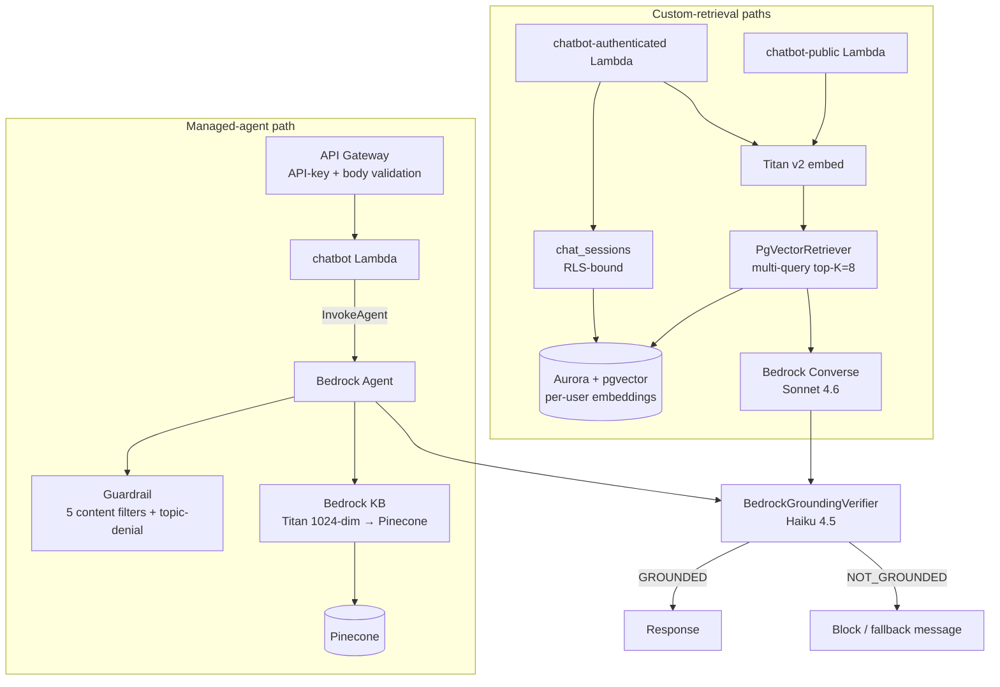

## Overview

The platform serves Retrieval-Augmented Generation through **two
parallel paths** built on top of one Bedrock surface:

1. **Managed-agent path** — a Bedrock Agent + Knowledge Base +
   Guardrail provisioned by CDK
   (`@cdklabs/generative-ai-cdk-constructs`), invoked through API
   Gateway + Lambda by the `chatbot` workspace
   ([applications/chatbot/](../../applications/chatbot/)). Used for
   the curated portfolio documentation answer surface.
2. **Custom-retrieval path** — `chatbot-public` and
   `chatbot-authenticated` Lambdas that bypass the Bedrock Agent and
   call `ConverseCommand` directly after retrieving from pgvector
   ([applications/chatbot-public/src/retrieval.ts](../../applications/chatbot-public/src/retrieval.ts),
   [applications/chatbot-authenticated/](../../applications/chatbot-authenticated/)).
   Used for per-user portfolio embeddings (resume + repository
   content) where RLS isolation matters.

The two paths share the Bedrock model surface (Sonnet 4.6 for
generation, Haiku 4.5 for the grounding verifier) and several
primitives ([PiiScrubber](pii-scrubber.md),
[TitanEmbeddingProvider](titan-embedding-provider.md), the
[BedrockGroundingVerifier](#grounding-verifier-haiku-second-pass)),
but they retrieve from **different vector stores**: the managed-agent
path retrieves from Pinecone (Bedrock KB integration); the
custom-retrieval path retrieves from pgvector colocated with the
relational data. The asymmetry is recorded in
[ADR 0002](../decisions/0002-pgvector-over-pinecone-for-cache.md).

## How it works



### Four-stack CDK topology

The managed-agent infrastructure is split into four stacks
([infra/lib/projects/bedrock/factory.ts:5-14](../../infra/lib/projects/bedrock/factory.ts#L5-L14)):

| Stack | Purpose | Lifecycle |
| :- | :- | :- |
| `BedrockDataStack` | S3 bucket for KB source documents + customer-managed KMS key | Persists across agent redeployments |
| `BedrockKbStack` | Bedrock KB backed by Pinecone, Titan Embeddings v2 (1024-dim) | Re-syncs on data source change |
| `BedrockAgentStack` | Agent + Guardrail + Agent Alias | Redeployable independently |
| `BedrockApiStack` | API Gateway + Lambda integration + usage plan | BFF-only (server-to-server) |

The Data stack is intentionally separable so that re-creating the
Agent or KB does not wipe ingested documents
([data-stack.ts:1-12](../../infra/lib/stacks/bedrock/data-stack.ts#L1-L12)).
The Agent stack reads the KB id from SSM at deploy time
([agent-stack.ts:46-54](../../infra/lib/stacks/bedrock/agent-stack.ts#L46-L54)),
so a KB stack redeploy does not force an Agent stack redeploy unless
the KB id rotated.

### Guardrail — five content filters + topic denial

The Bedrock Agent's Guardrail is provisioned in
[agent-stack.ts:91-145](../../infra/lib/stacks/bedrock/agent-stack.ts#L91-L145).
Five content filter types apply at `HIGH` strength on both input and
output:

- `SEXUAL`, `VIOLENCE`, `HATE`, `INSULTS`, `MISCONDUCT` — input and
  output both `HIGH`
- `PROMPT_ATTACK` — **input `HIGH`, output `NONE`**
  ([agent-stack.ts:132-140](../../infra/lib/stacks/bedrock/agent-stack.ts#L132-L140))

The asymmetry on `PROMPT_ATTACK` is intentional and documented in
the code: the model is not expected to *generate* attack patterns,
and output-side filtering would block legitimate KB-retrieved
content that *discusses* prompt-injection (e.g. quoting a security
section of the documentation). Blocking only the input side catches
attacks without false-positive blocks on educational output.

The topic-denial filter forbids any query outside the portfolio
scope, with example off-topic queries embedded as calibration
([agent-stack.ts:146-160](../../infra/lib/stacks/bedrock/agent-stack.ts#L146-L160)):

```text
What is the capital of France?
Explain how machine learning works
```

### Defence-in-depth layers (managed-agent path)

The `chatbot` Lambda enumerates six security layers in its header
([applications/chatbot/src/index.ts:14-21](../../applications/chatbot/src/index.ts#L14-L21)):

| Layer | Locus | What it blocks |
| :- | :- | :- |
| 1 | API Gateway | Schema violations, rate-limit bursts, missing API key |
| 2 | Lambda input guard ([InputSanitiser](pii-scrubber.md)) | Injection patterns the regex catches |
| 3 | Bedrock Guardrail | Content categories + topic denial |
| 4 | Agent instruction | Scope fence + security directives in the prompt |
| 5 | Output filter ([OutputSanitiser](../../applications/shared/src/security/output-sanitiser.ts)) | Sensitive patterns leaking |
| 6 | Audit log | Structured JSON with prompt hash + redaction flags |

The grounding verifier (next section) sits between layers 4 and 5 for
the managed-agent path, and between Converse and response for the
custom-retrieval paths.

### Custom-retrieval path — multi-query top-K

The `chatbot-public` Lambda does not call the Bedrock Agent. It
retrieves directly from pgvector through `PgVectorRetriever`
([applications/chatbot-public/src/retrieval.ts:23-40](../../applications/chatbot-public/src/retrieval.ts#L23-L40)):

```ts
const TOP_K = 8;
const [q2, q3] = expandQuery(userQuestion);
const [r1, r2, r3] = await Promise.all([
    retriever.retrieve(userId, userQuestion, opts),
    retriever.retrieve(userId, q2,           opts),
    retriever.retrieve(userId, q3,           opts),
]);
return deduplicatePassages(
    [...r1, ...r2, ...r3].sort((a, b) => b.score - a.score),
).slice(0, TOP_K);
```

Three parallel retrievals: the original question and two `expandQuery`
variations
([applications/shared/src/retrieval/implementations/PgVectorRetriever.ts:30](../../applications/shared/src/retrieval/implementations/PgVectorRetriever.ts#L30)).
Multi-query mitigates the brittleness of single-phrase embedding
similarity. Per-question retrieval options
(`{ maxProfiles: 5, maxChunks: 8, profileWeight: 1.5 }`) bias toward
repository-profile chunks over raw code chunks — profile content is
distilled summaries; code chunks are noisier per token.

Dedup uses `sourceUri + first 100 chars of text` as the collision
key
([chatbot-public/src/retrieval.ts:13-20](../../applications/chatbot-public/src/retrieval.ts#L13-L20))
— "different passages from the same source" are kept; "the same
passage retrieved twice with slightly different scores" is collapsed.

### Custom-retrieval auth — session memory with RLS

`chatbot-authenticated` adds per-user conversation memory in the
`chat_sessions` table, isolated via Postgres RLS
([applications/chatbot-authenticated/src/session.ts:5-43](../../applications/chatbot-authenticated/src/session.ts#L5-L43)):

```ts
async function setRlsUser(client: PoolClient, userId: string): Promise<void> {
    await client.query('SET LOCAL app.current_user_id = $1', [userId]);
}
```

`SET LOCAL` scopes the parameter to the transaction, so the RLS
policy that filters `chat_sessions` rows by
`current_setting('app.current_user_id')::uuid = user_id` cannot leak
across connections in the pool. Session validation and creation both
wrap the query in `BEGIN/COMMIT` to make `SET LOCAL` effective. This
is the same RLS pattern used elsewhere in the platform for
user-scoped data.

### Grounding verifier — Haiku second pass

After every generation (both paths) the
[BedrockGroundingVerifier](../../applications/shared/src/grounding/bedrock-grounding-verifier.ts)
runs a single Converse call on Claude Haiku 4.5 with the retrieved
chunks and the generated answer, asking the model to classify the
answer as `GROUNDED` or `NOT_GROUNDED`
([bedrock-grounding-verifier.ts:43-58](../../applications/shared/src/grounding/bedrock-grounding-verifier.ts#L43-L58)):

```text
Given the following source chunks:
[1] <chunk 1>
[2] <chunk 2>
…
And the following generated answer:
<answer>

Is every claim in the answer directly supported by the source chunks?
Reply on the first line with exactly GROUNDED or NOT_GROUNDED.
Then "Reason: <brief reason>".
If NOT_GROUNDED, add "Claims: <semicolon-separated unsupported claims>".
```

Parsing is permissive on the optional `Reason:`/`Claims:` lines but
**strict on the verdict**: an unparseable model output (no verdict
token at all) defaults to `NOT_GROUNDED`
([bedrock-grounding-verifier.ts:64-72](../../applications/shared/src/grounding/bedrock-grounding-verifier.ts#L64-L72)).
The verifier's docstring is explicit: *"any parse ambiguity resolves
to NOT_GROUNDED so hallucinations are never silently treated as
grounded"*
([bedrock-grounding-verifier.ts:4-7](../../applications/shared/src/grounding/bedrock-grounding-verifier.ts#L4-L7)).

Two modes are supported via `GroundingMode`: `block` (managed-agent
path uses this — a NOT_GROUNDED verdict replaces the response with a
fallback message) or `warn` (annotate-and-pass-through). The chatbot
Lambda instantiates with `mode: 'block'`
([applications/chatbot/src/index.ts:50](../../applications/chatbot/src/index.ts#L50)):

```ts
const groundingVerifier = new BedrockGroundingVerifier({ mode: 'block' });
```

The verifier's spend is recorded into `prompt_invocations` via the
optional `GroundingCostContext`
([bedrock-grounding-verifier.ts:30-35](../../applications/shared/src/grounding/bedrock-grounding-verifier.ts#L30-L35))
so the security pass is itemised in the per-user spend ledger
separately from the generation call.

### Per-path cost attribution

Both paths thread per-user cost context into the model invocations:

- The managed-agent path attributes via the agent's own per-call
  metering
  ([chatbot-public/src/invoke-claude.ts:34-44](../../applications/chatbot-public/src/invoke-claude.ts#L34-L44)).
- The custom-retrieval path passes `ChatbotCostContext { pool, userId }`
  to `invokeClaude`, which calls `recordBedrockCost` with
  `pipeline: 'chatbot-public'` and the `inputTokens`/`outputTokens`
  from the Converse response
  ([chatbot-public/src/invoke-claude.ts:11-17, 34-44](../../applications/chatbot-public/src/invoke-claude.ts#L11-L17)).

Cost recording is **fire-and-forget**: a failed insert logs a warning
but does not fail the chatbot response.

## Implementation in this codebase

| Concern | Location |
| :- | :- |
| 4-stack project factory | [infra/lib/projects/bedrock/factory.ts](../../infra/lib/projects/bedrock/factory.ts) |
| Data stack (S3 + KMS) | [infra/lib/stacks/bedrock/data-stack.ts](../../infra/lib/stacks/bedrock/data-stack.ts) |
| KB stack (Bedrock KB + Pinecone) | [infra/lib/stacks/bedrock/kb-stack.ts](../../infra/lib/stacks/bedrock/kb-stack.ts) |
| Agent stack (Agent + Guardrail + Alias) | [infra/lib/stacks/bedrock/agent-stack.ts](../../infra/lib/stacks/bedrock/agent-stack.ts) |
| API stack (API Gateway + Lambdas) | [infra/lib/stacks/bedrock/api-stack.ts](../../infra/lib/stacks/bedrock/api-stack.ts) |
| Managed-agent chatbot | [applications/chatbot/](../../applications/chatbot/) |
| Custom-retrieval (public) | [applications/chatbot-public/](../../applications/chatbot-public/) |
| Custom-retrieval (auth + sessions) | [applications/chatbot-authenticated/](../../applications/chatbot-authenticated/) |
| Multi-query retriever | [applications/shared/src/retrieval/implementations/PgVectorRetriever.ts](../../applications/shared/src/retrieval/implementations/PgVectorRetriever.ts) |
| Grounding verifier | [applications/shared/src/grounding/bedrock-grounding-verifier.ts](../../applications/shared/src/grounding/bedrock-grounding-verifier.ts) |
| Stacks README (in-repo) | [infra/lib/stacks/bedrock/README.md](../../infra/lib/stacks/bedrock/README.md) |

## Tradeoffs

**Two RAG paths, not one.** The managed-agent path is the lowest-code
implementation: Bedrock provides the orchestration, the KB integration,
the Guardrail. It is the right fit for the portfolio-documentation
answer surface, which is curated and global. The custom-retrieval
paths exist because per-user resume + repository content is *not*
global — RLS isolation, per-user retrieval cost attribution, and
user-scoped conversation memory require touching the data store
directly, and the Bedrock Agent's KB integration does not surface
those controls. Carrying both is the cost of the platform serving
both audiences (recruiters vs the portfolio owner).

**Guardrail OUTPUT=NONE on PROMPT_ATTACK.** Documented in the code
([agent-stack.ts:132-140](../../infra/lib/stacks/bedrock/agent-stack.ts#L132-L140))
as the deliberate asymmetry. The cost is that a hypothetical
compromised model *could* emit attack patterns in output; that is
an unrealistic threat model versus the realistic problem of the KB
quoting its own documentation about prompt injection and the
Guardrail blocking the answer. Input-side `HIGH` catches the actual
attack vector.

**Grounding verifier as a separate model call.** Doubles the Bedrock
invocations on every chatbot request. The grounding verdict could
in principle ride on the same Sonnet call as the answer ("here is
your answer; also self-assess if it is grounded"), but the
verification needs *adversarial* model judgement, not the generation
model's own self-grading. Running on a different (cheaper, distinct)
model — Haiku 4.5 — keeps the verdict independent of the answer's
generation incentives. The cost is real (~25% of the generation cost
per request); the value is the fail-safe `NOT_GROUNDED` default that
catches hallucinations before they leave the Lambda.

**Multi-query top-K=8.** Three parallel retrievals (original + two
expansions) at `top-K=8` is more I/O than a single retrieval at
top-K=24, but the embedding-similarity bias of any single query is
not closed by simply asking for more passages — it is closed by
*different framings* of the same intent. The cost is three retrieval
calls; the benefit is recall on queries the embedding gets wrong on
the first try. Empirically expand-then-merge beats top-K=24 on
recall at the same total chunk budget; the code defaults to it.

**RLS via `SET LOCAL` per transaction.** Conversation memory is
filtered by Postgres RLS rather than by Lambda-side `WHERE user_id =`
conditions. The cost is that every authenticated query must run
inside an explicit transaction (`BEGIN`/`COMMIT`) for `SET LOCAL` to
scope; the benefit is that a coding mistake (forgetting the user
filter) cannot leak rows. The pattern is consistent with the rest of
the platform's user-scoped tables.

## Deeper detail

- [docs/concepts/caching-tiers.md](caching-tiers.md) — the
  [`PgSemanticCache`](caching-tiers.md) sits in front of every
  chatbot generation call; same `kbTag` scheme rotates here on
  model swap.
- [docs/decisions/0002-pgvector-over-pinecone-for-cache.md](../decisions/0002-pgvector-over-pinecone-for-cache.md)
  — the split-vector-store decision; managed-agent retrieves from
  Pinecone (KB), custom-retrieval retrieves from pgvector.
- [docs/concepts/titan-embedding-provider.md](titan-embedding-provider.md)
  — both paths use the same Titan v2 embedder; same dimensions on
  Pinecone and pgvector so cross-comparison stays possible.
- [docs/concepts/pii-scrubber.md](pii-scrubber.md) — Layer 2/5 of
  the defence-in-depth model; runs ahead of every Bedrock call.
- (planned) docs/runbooks/bedrock-kb-reindex.md — operator
  procedure to re-ingest S3 documents into the KB after a content
  refresh.
- (planned) docs/troubleshooting/grounding-verifier-blocks-good-answer.md
  — diagnosing a `NOT_GROUNDED` verdict on an answer that *was*
  grounded (parser sensitivity, chunk-window edge cases).
- (planned) docs/concepts/input-output-sanitiser.md — Layer 2 and
  Layer 5 of the defence-in-depth model in their own concept doc.
- (planned) docs/concepts/multi-query-retrieval.md — the
  `expandQuery` + parallel-retrieve + dedupe pattern in detail.

## Related concepts

- [self-healing-agent](self-healing-agent.md) — the *other* Bedrock
  ConverseCommand caller in the platform. Both use the
  defence-in-depth idea but the surfaces differ: chatbot has KB +
  Guardrail; self-healing has MCP tools + DRY_RUN gating.
- [tech-extractor-architecture](tech-extractor-architecture.md) —
  the deterministic counterpart. RAG retrieves *for generation*;
  tech-extractor extracts *for record*. Same Bedrock account, very
  different jobs.
- [Domain glossary — Caching](../../CONTEXT.md) — `scope` + `kbTag`
  terms used by the semantic cache that fronts these chatbots.

<!--
Evidence trail (auto-generated):
- Source: infra/lib/projects/bedrock/factory.ts (lines 1-22 on 2026-05-27)
- Source: infra/lib/stacks/bedrock/agent-stack.ts (read on 2026-05-27, lines 1-150)
- Source: infra/lib/stacks/bedrock/kb-stack.ts (lines 1-130 on 2026-05-27)
- Source: infra/lib/stacks/bedrock/api-stack.ts (lines 1-60 on 2026-05-27)
- Source: infra/lib/stacks/bedrock/data-stack.ts (lines 1-40 on 2026-05-27)
- Source: infra/lib/stacks/bedrock/README.md (read on 2026-05-27)
- Source: applications/chatbot/src/index.ts (lines 1-50 on 2026-05-27)
- Source: applications/chatbot-public/src/retrieval.ts (read in full on 2026-05-27)
- Source: applications/chatbot-public/src/invoke-claude.ts (lines 1-60 on 2026-05-27)
- Source: applications/chatbot-authenticated/src/session.ts (lines 1-43 on 2026-05-27)
- Source: applications/shared/src/grounding/bedrock-grounding-verifier.ts (lines 1-80 on 2026-05-27)
- Source: applications/shared/src/retrieval/implementations/PgVectorRetriever.ts (line 30 on 2026-05-27)
-->
