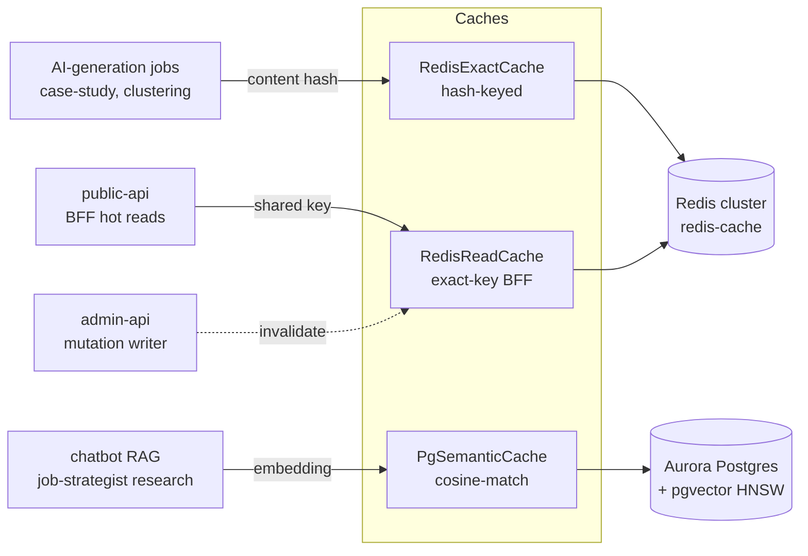

## Overview

The platform uses **three distinct caches**, each with a different
matching primitive and a different operational story. They are not
layered (an outer wrapper checking each in turn); they are *targeted*
— each path picks the one whose semantics fit the request shape, and
the picks are stable
([applications/shared/src/cache/](../../applications/shared/src/cache/)).

The canonical domain glossary is
[CONTEXT.md](../../CONTEXT.md) lines 6-26. That file defines the
vocabulary (exact AI-gen cache, read cache, semantic cache, scope,
kbTag, cache effectiveness, Redis server health). This doc explains
*why those three exist*, what they cost, and which path uses which.



## How it works

### The shared interface

Two of the three caches implement `ISemanticCache`
([applications/shared/src/cache/cache-types.ts:39-41](../../applications/shared/src/cache/cache-types.ts#L39-L41)):

```ts
interface ISemanticCache {
    get(input:    SemanticCacheGetInput):    Promise<SemanticCacheGetResult>;
    put(input:    SemanticCachePutInput):    Promise<void>;
    invalidate(input: SemanticCacheInvalidateInput): Promise<number>;
}
```

`get`/`put`/`invalidate` all take `{ scope, kbTag, queryText }`. The
naming is *deliberately* the same across the exact and semantic impls
because the caller often wants to swap implementations behind the
interface without rewiring its hit-rate metrics or invalidation
hooks. `RedisReadCache` is the exception — it does not implement
`ISemanticCache` because its primitive (`getOrCompute<T>(key,
ttlSeconds, compute, cacheName)`,
[applications/shared/src/cache/redis-read-cache.ts:30-37](../../applications/shared/src/cache/redis-read-cache.ts#L30-L37))
is structurally different: a *read-through* with a caller-supplied
compute function.

### Fail-open by construction

Every cache path returns "miss" on any error
([redis-exact-cache.ts:79-98](../../applications/shared/src/cache/redis-exact-cache.ts#L79-L98),
[pg-semantic-cache.ts:105-114](../../applications/shared/src/cache/pg-semantic-cache.ts#L105-L114),
[redis-read-cache.ts:42-50](../../applications/shared/src/cache/redis-read-cache.ts#L42-L50))
and emits a `CacheError` metric. A Redis outage, a Postgres timeout,
a JSON-parse on a corrupted value — all degrade to a cache miss and
the caller proceeds. The cache surface **must never throw into a host
request**; that invariant is enforced at every method body.

This is non-trivial: it means a `try/catch` wraps almost every
operation and the catch arms log + emit metrics. The cost is verbose
implementations; the benefit is that flipping `REDIS_CACHE_HOST=`
(empty string, default `enabled: false` per
[redis-client.ts:37-46](../../applications/shared/src/cache/redis-client.ts#L37-L46))
is a safe production action — every cache call becomes a no-op miss
and the platform keeps serving.

### scope and kbTag — the invalidation primitives

Every cache entry is keyed by **scope** + **kbTag** in addition to
the query/key
([CONTEXT.md lines 14-22](../../CONTEXT.md)):

- **scope** identifies the app/caller and operation
  (`'project_case_study'`, `'aigen:clustering'`, `'chatbot_rag'`).
  Low-cardinality. The metric label for hit/miss/error counters
  ([cache-types.ts:32-38](../../applications/shared/src/cache/cache-types.ts#L32-L38))
  and the granularity at which "cache effectiveness" is measured.
- **kbTag** is a KB-version + model identifier. Changing it rotates
  every key with that tag, giving **invalidation-on-version-change
  for free**. A KB reindex bumps the tag; a model swap bumps the
  tag; the old entries strand and TTL them out.

The semantic cache's HNSW + B-tree composite index respects this
split
([applications/platform-rds-bootstrap/migrations/022_semantic_cache.sql:24-32](../../applications/platform-rds-bootstrap/migrations/022_semantic_cache.sql#L24-L32)):
HNSW on `query_embedding`, plain B-tree on `(scope, kb_tag, created_at)`.
The query plans cosine-sort then filters by scope+tag+TTL.

### RedisExactCache — content-hash AI-gen path

For deterministic AI generation jobs (job-strategist case-study,
clustering) the input is **already a content hash** — same inputs
must produce the same outputs. An exact GET is the right primitive;
no embedding call, no pgvector cosine.

The key is built by SHA-256 of the `queryText`
([redis-exact-cache.ts:70-73](../../applications/shared/src/cache/redis-exact-cache.ts#L70-L73)):

```ts
private key(scope: string, kbTag: string, queryText: string): string {
    const hash = createHash('sha256').update(queryText).digest('hex');
    return `${this.opts.prefix}:${scope}:${kbTag}:${hash}`;
}
```

Prefix defaults to `aigen:v1`
([redis-exact-cache.ts:62](../../applications/shared/src/cache/redis-exact-cache.ts#L62));
TTL is 30 days (`REDIS_AIGEN_TTL_SECONDS=2592000`,
[redis-exact-cache.ts:59-60](../../applications/shared/src/cache/redis-exact-cache.ts#L59-L60)).
Invalidation scans the pattern `prefix:scope-or-star:kbTag-or-star:*`
and `UNLINK`s in batches of 256 keys
([redis-exact-cache.ts:104-114](../../applications/shared/src/cache/redis-exact-cache.ts#L104-L114)).

Wired by [applications/job-strategist/src/run-case-study.ts:150](../../applications/job-strategist/src/run-case-study.ts#L150).

### RedisReadCache — BFF read-through

The BFF (public-api) serves recruiter-facing reads (e.g. a project
case study). These are deterministic-but-expensive Postgres composes;
caching them at the read path cuts BFF latency without changing the
write path's correctness model.

`RedisReadCache` shares the **same Redis cluster** as
`RedisExactCache` — distinguished by key prefix
([redis-read-cache.ts:7-11](../../applications/shared/src/cache/redis-read-cache.ts#L7-L11)):

| Key prefix | Owner |
| :- | :- |
| `aigen:v1:…` | `RedisExactCache` (job-strategist AI-gen) |
| `shared:…` | `RedisReadCache` (BFF + admin-api) |

The unprefixed `shared:` keys are cross-app: the **writer**
(admin-api) invalidates them when content mutates, the **reader**
(public-api) populates them on demand
([redis-read-cache.ts:10-13](../../applications/shared/src/cache/redis-read-cache.ts#L10-L13)).
The same Redis instance keeps the surface small and the operational
story unified.

The cache's primitive is `getOrCompute<T>` with corrupt-value
recovery: a `JSON.parse` failure on a cached value evicts the key and
falls through to recompute
([redis-read-cache.ts:46-50](../../applications/shared/src/cache/redis-read-cache.ts#L46-L50))
— a corruption-in-flight (Redis bug, key collision, ill-formed
manual write) cannot wedge a hot path.

### PgSemanticCache — embedding-keyed RAG path

Chatbot RAG queries and job-strategist research queries are *not*
deterministic — small phrasing changes should hit the same cached
response. An exact-key cache misses on "what's my AWS experience?"
vs "describe my AWS background". The semantic cache matches by
**cosine similarity of the query embedding** against prior entries
with the same scope + kbTag
([pg-semantic-cache.ts:81-104](../../applications/shared/src/cache/pg-semantic-cache.ts#L81-L104)).

Pre-embedding pipeline
([pg-semantic-cache.ts:69-79](../../applications/shared/src/cache/pg-semantic-cache.ts#L69-L79)):

1. **Normalise** — lowercase, collapse whitespace, trim
2. **PII-scrub** — [PiiScrubber](../../applications/shared/src/security/)
   removes emails, phones, addresses before the embedding leaves the
   process. A user's PII never gets vectorised into a shared cache.
3. **Embed** — Titan embeddings (1024-dim) via `TitanEmbeddingProvider`

Schema ([migration 022](../../applications/platform-rds-bootstrap/migrations/022_semantic_cache.sql)):
`(id, scope, kb_tag, query_text, query_embedding vector(1024),
response jsonb, created_at, hit_count)` with HNSW + B-tree as above.

Defaults
([pg-semantic-cache.ts:54-57](../../applications/shared/src/cache/pg-semantic-cache.ts#L54-L57)):

| Parameter | Default | Env var |
| :- | :- | :- |
| Similarity threshold | `0.95` | `SEMANTIC_CACHE_THRESHOLD` |
| TTL | 7 days | `SEMANTIC_CACHE_TTL_DAYS` |
| HNSW `ef_search` | 40 | (constructor only) |

`ef_search=40` is set per-query via
`SELECT set_config('hnsw.ef_search', $1, true)`
([pg-semantic-cache.ts:84](../../applications/shared/src/cache/pg-semantic-cache.ts#L84))
— a CTE before the SELECT so the value is local to the transaction
without disturbing the connection's session state.

Hit count is incremented asynchronously (fire-and-forget UPDATE
with a swallowed catch,
[pg-semantic-cache.ts:99-102](../../applications/shared/src/cache/pg-semantic-cache.ts#L99-L102))
so a slow secondary write cannot delay the cache return.

### What the same instance shares

The Redis caches share the cluster but key-prefix isolation keeps
the bills cleanly attributable. The semantic cache lives in the
*same* Aurora Postgres as the application data (the
[platform-rds-bootstrap](../../applications/platform-rds-bootstrap/)
schema) — pgvector enabled by migration 022. There is no separate
vector-store ops surface for the semantic cache; same SLA, same
backups, same observability.

## Implementation in this codebase

| Concern | Location |
| :- | :- |
| Shared interface | [applications/shared/src/cache/cache-types.ts](../../applications/shared/src/cache/cache-types.ts) |
| Redis client factory | [applications/shared/src/cache/redis-client.ts](../../applications/shared/src/cache/redis-client.ts) |
| RedisExactCache | [applications/shared/src/cache/redis-exact-cache.ts](../../applications/shared/src/cache/redis-exact-cache.ts) |
| RedisReadCache | [applications/shared/src/cache/redis-read-cache.ts](../../applications/shared/src/cache/redis-read-cache.ts) |
| PgSemanticCache | [applications/shared/src/cache/pg-semantic-cache.ts](../../applications/shared/src/cache/pg-semantic-cache.ts) |
| Schema | [applications/platform-rds-bootstrap/migrations/022_semantic_cache.sql](../../applications/platform-rds-bootstrap/migrations/022_semantic_cache.sql) |
| Glossary | [CONTEXT.md](../../CONTEXT.md) |
| Tests | sibling `*.test.ts` files for each impl |
| Callers (exact-cache) | [applications/job-strategist/src/run-case-study.ts:150](../../applications/job-strategist/src/run-case-study.ts#L150) |
| Callers (semantic-cache) | [applications/chatbot/src/index.ts:51](../../applications/chatbot/src/index.ts#L51), [applications/job-strategist/src/run-pipeline.ts:36](../../applications/job-strategist/src/run-pipeline.ts#L36) |

## Tradeoffs

**Why not one cache with three modes.** The matching primitives are
fundamentally different: hash-equality vs key-equality vs cosine
similarity. A unified abstraction would either pick one matching
mode (limiting the others) or paper over the difference with mode
flags (turning the contract into runtime-checked spaghetti). Three
focused classes with one shared interface where it fits cleanly is
the cheapest mental model.

**Why share the Redis cluster.** Two reasons:
(1) the AI-gen cache and the read cache have *the same* operational
story — Redis health, eviction policy, memory pressure — and pretending
they are independent would double the dashboards without doubling the
insight. (2) `kbTag`-based invalidation crosses both caches: a model
swap that bumps `kbTag` strands keys in both stores at once, and a
single SCAN+UNLINK against the appropriate prefix handles either.

**Why pgvector for semantic cache, Pinecone for the KB.** The
semantic cache is small and write-heavy (every miss puts) — pgvector
is colocated with the relational data, has predictable cost
(`max=3` pool,
[pg-semantic-cache.ts:50](../../applications/shared/src/cache/pg-semantic-cache.ts#L50)),
and uses HNSW for sub-100ms cosine search at this scale. The KB
itself is read-heavy + large and managed by Bedrock Knowledge Base,
which uses Pinecone under the hood — the operational cost of running
Pinecone at KB scale would dwarf the cost of running the semantic
cache in Pinecone.

**Threshold=0.95 is conservative.** Lowering it (say 0.85) would
boost hit rate at the cost of users occasionally seeing a "similar
but not the same" answer to their question. 0.95 means hits are
near-identical queries — typically the same query with whitespace or
case noise. The PII-scrub + normalise pipeline does most of the
collapsing before embedding; the threshold catches the rest.

**Self-healing agent deliberately bypasses all three.** See
[concepts/self-healing-agent.md](self-healing-agent.md). Each agent
invocation is one-shot, the prompt is augmented with per-incident
history, and a cache hit on a different incident would actively harm
the diagnostic — so the agent has neither a scope nor a kbTag
registration in any cache.

## Deeper detail

- [CONTEXT.md](../../CONTEXT.md) — canonical domain glossary. The
  vocabulary in this doc is defined there.
- (planned) docs/runbooks/redis-cache-eviction.md — operator
  procedure when Redis hits maxmemory; eviction-policy review.
- (planned) docs/troubleshooting/semantic-cache-stale-responses.md —
  diagnosing "I asked about X but got the answer for Y" reports
  (threshold tuning, kbTag bumps, scope leakage).
- (planned) docs/concepts/pii-scrubber.md — the regex + Comprehend
  layered scrubber that runs ahead of the semantic-cache embedding.
- (planned) docs/decisions/0002-pgvector-over-pinecone-for-cache.md —
  the Pinecone-vs-pgvector ADR for the semantic cache specifically.

## Related concepts

- [self-healing-agent](self-healing-agent.md) — the explicit non-user
  of these caches.
- [tech-extractor-architecture](tech-extractor-architecture.md) —
  also bypasses these caches (each Job is one-shot per commit).
- [mcp-gateway-integration](mcp-gateway-integration.md) — the MCP
  Gateway calls are not cached either; each tool call is by design
  fresh against the live cluster.

<!--
Evidence trail (auto-generated):
- Source: applications/shared/src/cache/cache-types.ts (read on 2026-05-27)
- Source: applications/shared/src/cache/redis-exact-cache.ts (read on 2026-05-27, lines 1-120)
- Source: applications/shared/src/cache/redis-read-cache.ts (read on 2026-05-27, lines 1-50)
- Source: applications/shared/src/cache/pg-semantic-cache.ts (read on 2026-05-27, lines 1-180)
- Source: applications/shared/src/cache/redis-client.ts (read on 2026-05-27, lines 1-40)
- Source: applications/platform-rds-bootstrap/migrations/022_semantic_cache.sql (lines 1-32 on 2026-05-27)
- Source: applications/shared/src/index.ts (cache exports grep on 2026-05-27)
- Source: applications/chatbot/src/index.ts (caller on 2026-05-27)
- Source: applications/job-strategist/src/run-pipeline.ts (caller on 2026-05-27)
- Source: applications/job-strategist/src/run-case-study.ts (caller on 2026-05-27)
- Source: CONTEXT.md (lines 6-26 — domain glossary, read on 2026-05-27)
-->
