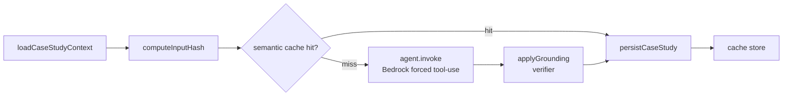

## Overview

Case-study generation turns a portfolio project (one or more repositories) into
a recruiter-facing write-up — a tagline, a pitch, and grounded sections (stack,
decisions, challenges, highlights, architecture, resume bullets). It runs as a
Kubernetes Job entered through `runCaseStudyOrchestration()`
([run-case-study.ts](../../applications/job-strategist/src/run-case-study.ts)),
and every engineering claim it emits must cite a real commit, PR, or file.

The defining design choice: the **product story leads, the engineering follows**.
The pitch's tagline and first paragraph state what the product is, who it's for,
and the problem it solves — fed from ground-truth context — before any stack or
architecture detail.

## Orchestration sequence

`case-study-orchestrator.ts` runs a fixed sequence: load context → compute an
input hash → optional semantic-cache lookup → invoke the agent → apply the
grounding verifier → persist → store in cache. The input hash makes generation
idempotent and cacheable; it includes the product context, so changing the
product description or README regenerates
([case-study-orchestrator.ts:85](../../applications/shared/src/projects/case-study-orchestrator.ts#L85)).

## Context loading and product purpose

`loadCaseStudyContext()` reads the project's components, repositories (with
`tech_stack` from `repository_profiles`), KB chunks, commits, and PRs — the
evidence the agent grounds against. It also assembles a `productContext` block in
precedence order: the user's `projects.product_description` override → repo
descriptions → the head of each repo's root `README.md` (ordered by
`chunk_index`, capped per repo). This is the ground-truth "what the product is"
the pitch leads with.

The serialised context is bounded to a token ceiling by `packContext` (≈120k
estimated tokens) so a multi-repo project cannot overflow Sonnet's window and
push the model past its output cap
([case-study-context-budget.ts:66-118](../../applications/shared/src/projects/case-study-context-budget.ts#L66-L118)).

## The agent: prompt, schema, grounding

The agent uses Bedrock forced tool-use with one tight schema, `emit_case_study`,
requiring `tagline`, `pitch`, `stack`, `decisions`, `highlights`, `challenges`,
`depthMarkers`, `architecture`, and `resumeBullets`
([case-study-agent.ts:320-346](../../applications/shared/src/projects/case-study-agent.ts#L320-L346)).

Two prompt rules carry the design intent
([case-study-agent.ts:62-98](../../applications/shared/src/projects/case-study-agent.ts#L62-L98)):

- Every decision / challenge / stack item must cite evidence in
  `sourceSignals.commits`, `.pulls`, or `.files`; uncitable rows are omitted.
- The `<productContext>` block is **authoritative and exempt** from the
  evidence-citation rule (it is a given, not a claim) and frames the tagline and
  the first pitch paragraph. The user message emits that block only when present
  ([case-study-agent.ts: buildUserMessage](../../applications/shared/src/projects/case-study-agent.ts#L350)).

An incremental **refine mode** updates a prior case study when a repo is added,
preserving still-accurate grounded rows and guaranteeing newly-added repos appear
in a highlight and a challenge.

## Product-framing eval

A deterministic, per-phase grader enforces the "lead with product" contract on
real output without an LLM call: `taglineIsProductFirst` (tagline names the
product, not a tech list), `pitchOpensWithProduct` (first paragraph overlaps the
product context), and `noInfraOpener` (rejects the "platform spanning N
repositories…" opener). The bad pitch that motivated the rule is its failing
fixture
([case-study-product-grader.ts](../../applications/shared/src/projects/case-study-product-grader.ts)).

## Implementation in this codebase

| Concern | File |
| :- | :- |
| Context load + productContext | `applications/shared/src/projects/case-study-loader.ts` |
| Token budgeting | `applications/shared/src/projects/case-study-context-budget.ts` |
| Agent (prompt + schema + refine) | `applications/shared/src/projects/case-study-agent.ts` |
| Orchestration + input hash + cache | `applications/shared/src/projects/case-study-orchestrator.ts` |
| Product-framing eval | `applications/shared/src/projects/case-study-product-grader.ts` |
| K8s Job entrypoint | `applications/job-strategist/src/run-case-study.ts` |

## Tradeoffs

Treating product purpose as ground-truth context (exempt from commit-grounding)
is the only way to surface what a product *does* — that fact lives in no commit,
so the strict grounding rule would otherwise suppress it. The risk is bounded by
sourcing it from an explicit override or the repo's own README, and by the
product-framing grader. Bounding context to a token ceiling trades some evidence
breadth on large multi-repo projects for reliable, non-truncated generation.

## Deeper detail

- [per-phase evals](per-phase-evals.md) (planned) — the grader framework this reuses
- (planned) docs/concepts/incremental-case-study-refine.md — preserve-and-extend on repo add
- (planned) docs/decisions/0008-pitch-leads-with-product.md — productContext precedence + grounding exemption

## Related concepts

- [skill-evidence-ledger](skill-evidence-ledger.md)

<!--
Evidence trail (auto-generated):
- Source: applications/shared/src/projects/case-study-loader.ts (read/edited on 2026-06-16)
- Source: applications/shared/src/projects/case-study-agent.ts (read/edited on 2026-06-16, lines 62-98, 320-387)
- Source: applications/shared/src/projects/case-study-orchestrator.ts (read/edited on 2026-06-16, computeInputHash L85)
- Source: applications/shared/src/projects/case-study-context-budget.ts (read on 2026-06-16, lines 66-118)
- Source: applications/shared/src/projects/case-study-product-grader.ts (authored on 2026-06-16)
-->
