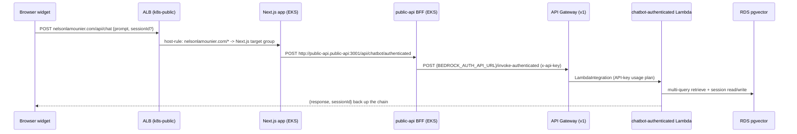

## Overview

Since the Pinecone/Agent decommission
([ADR 0011](../decisions/0011-retire-bedrock-agent-pinecone-kb.md)) every
chat message follows a single retrieval path ending at the RDS pgvector
store. This doc traces one widget message end to end — the hops, who owns
each one, and where the credentials live — as verified against the live dev
environment on 2026-07-10 (ALB rule dump, deployment env, CloudWatch
attribution, smoke tests).

## Request path

## Hop-by-hop ownership

- **Edge — ALB `k8s-public`** (AWS Load Balancer Controller, tucaken-infra
  VPC): host-header rules send `nelsonlamounier.com/*` to the Next.js
  target group and `api.nelsonlamounier.com/*` directly to public-api.
  There is no path-based `/api/*` split for the main site host — the
  Next.js handler *does* run in production (verified via listener-rule
  dump 2026-07-10; the former Traefik-era comments claiming otherwise were
  stale and have been corrected).
- **Next.js `/api/chat` handler** (frontend-portfolio repo): validates the
  prompt, forwards to the in-cluster BFF over Kubernetes service DNS with a
  30 s timeout, and normalises errors. The portfolio holds no Bedrock
  credentials.
- **public-api BFF** ([api/public-api/src/routes/chatbot.ts](../../api/public-api/src/routes/chatbot.ts)):
  injects the API key server-side (Secrets Manager, 15-minute TTL cache)
  and proxies to the API Gateway URL from the `public-api-bedrock` ESO
  secret. All three conversational routes (`/api/chat`,
  `/api/chatbot/invoke`, `/api/chatbot/authenticated`) share one
  `proxyToAuthUpstream` helper targeting the same upstream; direct callers
  on `api.nelsonlamounier.com` enter here without the Next.js hop.
- **API Gateway `bedrock-dev-agent-api` (stage v1)**: API-key usage plan,
  request-body validation, 29 s hard limit (the BFF aborts at 27 s to
  return a structured error first). Routes: `/invoke-public` (stateless)
  and `/invoke-authenticated` (session-aware)
  ([infra/lib/stacks/bedrock/api-stack.ts](../../infra/lib/stacks/bedrock/api-stack.ts)).
- **chatbot-authenticated Lambda** (VPC-attached for RDS): sanitises input,
  resolves the portfolio owner, retrieves, assembles the system prompt, and
  invokes Claude via Converse; sessions persist in `chat_sessions` /
  `chat_messages` under RLS
  ([applications/chatbot-authenticated/src/index.ts](../../applications/chatbot-authenticated/src/index.ts)).

## Retrieval step

`multiQueryRetrieve` fans one question into three query variants
(`expandQuery`), runs them concurrently through `PgVectorRetriever`, then
deduplicates and keeps the global top 8 by score
([applications/chatbot-authenticated/src/retrieval.ts](../../applications/chatbot-authenticated/src/retrieval.ts)).
Each retrieval embeds the query on Titan and searches both embedding
tables — repository profile cards (weighted 1.5x) and document chunks —
scoped to the owner's user id
([PgVectorRetriever](../../applications/shared/src/retrieval/implementations/PgVectorRetriever.ts)).
Zero-passage results emit a dedicated EMF metric so unanswerable questions
are visible rather than silently generic.

## Failure and timeout behaviour

Each hop degrades with a structured error rather than a hang: the Next.js
handler times out at 30 s, the BFF aborts upstream at 27 s (under API
Gateway's 29 s ceiling) and maps timeout/fetch failures to 503/502
envelopes, and unconfigured upstream URLs return an explicit 503
"Chatbot service is not configured". Observed healthy end-to-end latency
is ~6-7 s per answer (CloudWatch invocation logs + live smoke tests,
2026-07-10).

## Related concepts

- [ADR 0011 — retire Bedrock Agent + Pinecone KB](../decisions/0011-retire-bedrock-agent-pinecone-kb.md)
  — why this is now the only path.
- [Chatbot served stale Pinecone answers](../troubleshooting/chatbot-stale-pinecone-answers.md)
  — the routing incident that motivated verifying every hop live.
- [Invocation-ledger forensics](invocation-ledger-forensics.md)
  — how per-hop attribution was proven from `prompt_invocations` and
  CloudWatch.

<!--
Evidence trail (auto-generated):
- Source: api/public-api/src/routes/chatbot.ts (read on 2026-07-10, at 9be0c31)
- Source: applications/chatbot-authenticated/src/retrieval.ts, index.ts (read on 2026-07-10)
- Source: applications/shared/src/retrieval/implementations/PgVectorRetriever.ts (read on 2026-07-10)
- Live: ALB k8s-public listener-rule dump; public-api Deployment envFrom + public-api-bedrock secret keys; nextjs Rollout image f2a7992 (dev, 2026-07-10)
- Live: end-to-end smoke tests via nelsonlamounier.com/api/chat and api.nelsonlamounier.com/api/chat, attributed in chatbot-authenticated CloudWatch logs (2026-07-10)
-->
