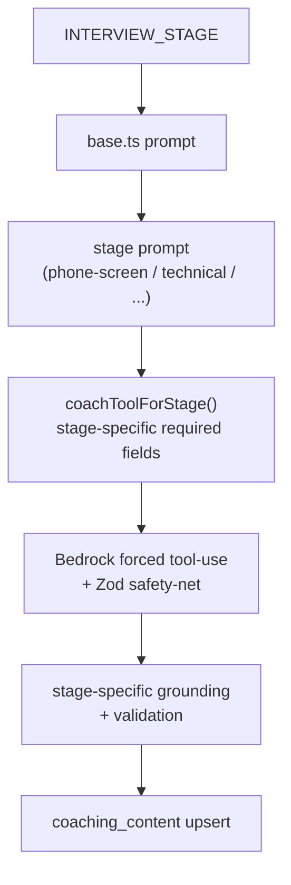

## Overview

The interview coach generates stage-specific preparation for a live job
application — phone screen, technical, behavioural, system design, and final
round. It runs as a Kubernetes Job (`run-coach.ts`) that transitions a
`pipeline_runs` row `queued → coaching → complete`, loads the strategist's
analysis as its source material, and upserts a row into `coaching_content` keyed
by `(job_application_id, stage_type)`
([run-coach.ts:1-14](../../applications/job-strategist/src/run-coach.ts#L1-L14)).

It is the reference implementation of the repository's
[LLM / Bedrock workflow design pattern](../../CLAUDE.md): phase-specific prompts,
one tight output schema per stage, Sonnet by default, and per-phase evals.

## Stages

The application lifecycle is the `InterviewStage` union — `applied`,
`phone-screen`, `technical-1`, `technical-2`, `behavioural`, `system-design`,
`take-home`, `final-round`, `offer`, `rejected`, `withdrawn`
([strategist-types.ts:30-41](../../applications/shared/src/strategist-types.ts#L30-L41)).

Each coachable stage has its own prompt module under
`applications/job-strategist/src/prompts/coach/stages/`: `phone-screen.ts`,
`technical.ts`, `behavioural.ts`, `system-design.ts`, `bar-raiser.ts`, and
`final.ts`, assembled on top of a shared `base.ts`. This is the "phase-specific
prompts, not a fat persona with branches" rule — the model reasons only about the
stage it is on.

## Phase-specific prompts and per-stage schemas

The coach agent uses Bedrock forced tool-use with a Zod safety-net, and the tool
schema is **stage-aware**: `coachToolForStage()` promotes the fields a given
stage must produce to `required`, so (for example) phone-screen guarantees its
career-arc / comp-script fields while other stages omit them
([coach-agent.ts:606-673](../../applications/job-strategist/src/agents/coach-agent.ts#L606-L673)).
Forced tool-use is constrained decoding, so the thinking budget is disabled
([coach-agent.ts:83](../../applications/job-strategist/src/agents/coach-agent.ts#L83)).

## Default to Sonnet

The coach model resolves to `INFERENCE_PROFILE_ARN ?? COACH_MODEL`, defaulting to
Sonnet
([coach-agent.ts:69](../../applications/job-strategist/src/agents/coach-agent.ts#L69)).
The code records the reason: Haiku flakiness on this nuanced multi-section
structured output (and `stopReason=max_tokens` failures) made Sonnet worth the
cost
([coach-agent.ts:77-83](../../applications/job-strategist/src/agents/coach-agent.ts#L77-L83)).

## Stage-specific grounding

Each stage grounds its output against deterministic evidence before it is
trusted, wired in `run-coach.ts`:

- **Technical** — skill transfer between JD skills and the candidate's project
  work (`stageUsesSkillTransfer`, `buildSkillCandidateBlock`).
- **System design** — concern detection + walkthrough validation
  (`detectConcernEvidence`, `validateSystemDesignWalkthrough`).
- **Behavioural / bar-raiser** — leadership-principle detection grounded against
  the target company's framework (`detectPrincipleEvidence`, `buildBarRaiserBlock`,
  `validateBarRaiserWalkthrough`).
- **Final round** — `validateFinalPrep`.

A `BedrockGroundingVerifier`, `BedrockProseLinter`, and `OutputSanitiser` apply
across stages ([run-coach.ts:22-31](../../applications/job-strategist/src/run-coach.ts#L22-L31)).

## Implementation in this codebase

| Concern | File |
| :- | :- |
| K8s Job entrypoint + status + persistence | `applications/job-strategist/src/run-coach.ts` |
| Agent: model, forced tool-use, stage tool variants | `applications/job-strategist/src/agents/coach-agent.ts` |
| Shared base + per-stage prompts | `applications/job-strategist/src/prompts/coach/{base.ts,stages/*}` |
| Stage union | `applications/shared/src/strategist-types.ts` |
| Per-stage grounding helpers | `applications/job-strategist/src/lib/`, `applications/shared/src/` |

## Tradeoffs

Per-stage prompts and schemas cost more files than one fat persona, but the model
never reasons about branches it isn't on, each stage's output contract is exact,
and a stage can be iterated without touching the others. Defaulting to Sonnet
costs more per call than Haiku, justified by reliability on forced-tool nuanced
output. Deterministic per-stage grounding adds validation code but keeps the
coaching honest — claims are checked against real evidence before they ship.

## Deeper detail

- [per-phase evals](per-phase-evals.md) (planned) — the eval suites that gate coach prompt changes
- (planned) docs/concepts/system-design-walkthrough.md — concern detection + walkthrough cards
- (planned) docs/concepts/bar-raiser-grounding.md — leadership-principle evidence detection

## Related concepts

- [skill-evidence-ledger](skill-evidence-ledger.md)
- [case-study-generation](case-study-generation.md)

<!--
Evidence trail (auto-generated):
- Source: applications/job-strategist/src/run-coach.ts (read on 2026-06-16, lines 1-60)
- Source: applications/job-strategist/src/agents/coach-agent.ts (read on 2026-06-16, lines 69-83, 606-673)
- Source: applications/job-strategist/src/prompts/coach/stages/ (listed on 2026-06-16: phone-screen, technical, behavioural, system-design, bar-raiser, final)
- Source: applications/shared/src/strategist-types.ts (read on 2026-06-16, lines 30-41)
-->
