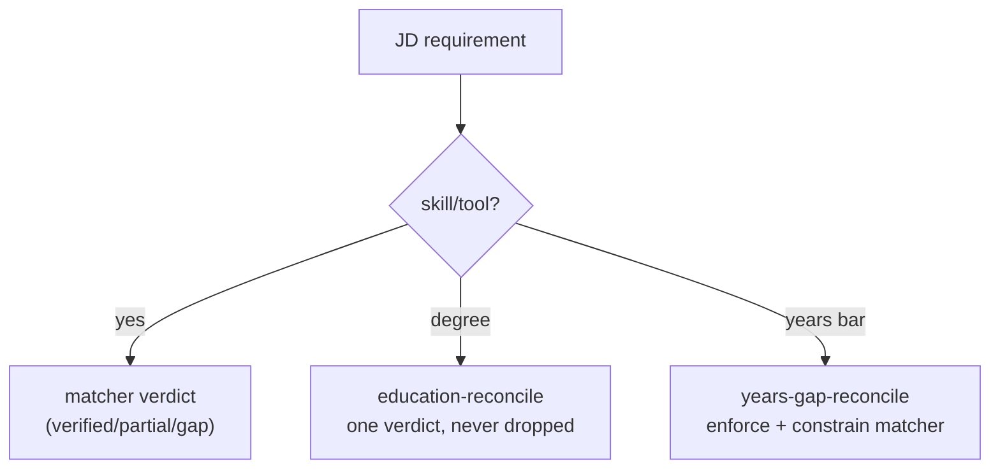

## Overview

Some JD requirements are not skills or tools — a degree, or a years-of-experience
bar — and the matcher's verified/partial/gap machinery is skill-centric, so it has
no slot for them. Two deterministic reconcilers fill those slots: they detect the
requirement, match it against the candidate's real data, and emit exactly one
verdict, so a degree line is never silently dropped and the experience bar is
always enforced.

## Education / degree reconciliation

A JD degree requirement (e.g. "Bachelor's in Computer Science, or a relevant
technical field, or equivalent practical experience") is extracted into
`softRequirements` but was never reconciled against the candidate's actual
education — so a Higher Diploma in Computing got silently dropped: neither credited
nor flagged. `education-reconcile.ts` closes that deterministically: it detects the
degree requirement, matches it against the candidate's education entries, and emits
exactly one answer — verified / partial / gap — so a degree line is never lost.
Pure, fail-open (null on no signal)
([education-reconcile.ts:1-13](../../applications/job-strategist/src/ats/education-reconcile.ts#L1-L13)).

## Years-gap enforcement

`buildYearsGap` computes stably whether the candidate clears a JD's hard
experience bar (`relevantYears` vs `requiredYears` → `disqualifying`). That signal
was only *passed* to the strategist as a separate input — it never constrained the
research agent's own `overallFitRating` / `gaps`, so the model was free to ignore
it: one run rated "STRONG FIT" with 0 gaps while carrying `disqualifying: true`; a
re-run of the same JD correctly rated "REACH". `years-gap-reconcile.ts` closes
that: when the years bar is disqualifying it demotes any verified/partial match
that claims a years-of-experience requirement and constrains the matcher's fit
verdict, so the result is stable across runs
([years-gap-reconcile.ts:1-16](../../applications/job-strategist/src/ats/years-gap-reconcile.ts#L1-L16)).

## Implementation in this codebase

| Concern | File |
| :- | :- |
| Degree reconciliation | `applications/job-strategist/src/ats/education-reconcile.ts` |
| Years-bar enforcement | `applications/job-strategist/src/ats/years-gap-reconcile.ts` |

Both run in the strategist pipeline's deterministic guard chain, alongside the
[anti-hallucination guards](../patterns/anti-hallucination-guards.md). The years
reconciler also feeds the Skill Evidence Ledger's years-bar rule (a years
requirement can never read as "transferable" — see
[skill-evidence-ledger](skill-evidence-ledger.md)).

## Tradeoffs

These requirements *could* be left to the LLM, but the runs above show it treats
them inconsistently — the same JD swings between STRONG FIT and REACH. Handling
them deterministically makes the verdict reproducible and the degree line
guaranteed-present, at the cost of explicit detection code per requirement type.
Fail-open (null on no signal) keeps the reconcilers from blocking the pipeline when
a JD carries no degree or years requirement.

## Related concepts

- [skill-evidence-ledger](skill-evidence-ledger.md)
- [jd-read-centralisation](jd-read-centralisation.md)

<!--
Evidence trail (auto-generated):
- Source: applications/job-strategist/src/ats/education-reconcile.ts (read on 2026-06-16, lines 1-13)
- Source: applications/job-strategist/src/ats/years-gap-reconcile.ts (read on 2026-06-16, lines 1-16)
-->
