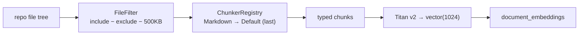

## Overview

Ingestion does not embed an entire repository — it selects a curated subset of
files, chunks each by type, and embeds the chunks. The selection is deliberate:
include code and prose that demonstrate skill, exclude dependencies, build output,
tests, and portfolio-contamination, and cap file size. It is **not** markdown-only.

## What is scanned — include and exclude

`FileFilter` applies an allowlist then a denylist. The default include set is code
and prose, **not just `.md`**: `**/*.{md,mdx,ts,tsx,js,jsx,py,yaml,yml}`. JSON is
**deliberately excluded** — "config/manifest JSON is structured noise"
([FileFilter.ts:100-110](../../applications/shared/src/ingestion/implementations/FileFilter.ts#L100-L110)).

The exclude set removes noise and contamination
([FileFilter.ts:115-167](../../applications/shared/src/ingestion/implementations/FileFilter.ts#L115-L167)):

- **Dependencies / build:** `**/node_modules/**`, `dist/**`, `**/*.d.ts`,
  `**/*.js.map`, `**/*.min.js`.
- **Tests:** `**/*.{test,spec}.{ts,tsx}`, `__tests__/**`.
- **Portfolio contamination:** `docs/superpowers/**`, `.claude/**`, `.github/**`,
  `specs/**`, `plans/**`, `prompts/**`, `**/*persona*.ts` — so the platform never
  embeds *its own* prompts/specs as if they were the user's work.

A byte cap of **500 KB** (`maxSizeBytes` default) drops pathological
auto-generated/minified files
([FileFilter.ts:93](../../applications/shared/src/ingestion/implementations/FileFilter.ts#L93),
[FileFilter.ts:168](../../applications/shared/src/ingestion/implementations/FileFilter.ts#L168)).

## Priority — exclude wins

Evaluation order is fixed: if a path matches any exclude pattern it is excluded;
else if it matches any include pattern it is included; otherwise excluded. **Exclude
takes priority over include**
([FileFilter.ts:15-21](../../applications/shared/src/ingestion/implementations/FileFilter.ts#L15-L21)) —
so a `.ts` file under `node_modules` is dropped despite matching `**/*.ts`.

## Chunking — type-aware, default last

`ChunkerRegistry` picks the first chunker whose `canHandle()` returns true.
Specialised chunkers register before the catch-all: a `MarkdownChunker`
(heading-aware) handles prose, and `DefaultChunker` (always handles, fixed-size)
must be registered **last** — placed earlier it would shadow every other chunker
([ChunkerRegistry.ts:9-22](../../applications/shared/src/ingestion/implementations/ChunkerRegistry.ts#L9-L22)).

## Embedding

Each chunk is embedded with Amazon **Titan Embeddings v2**
(`amazon.titan-embed-text-v2:0`), producing a 1024-dimensional vector (256/512/1024
configurable, default 1024)
([TitanEmbeddingProvider.ts:5-12](../../applications/shared/src/rds/implementations/TitanEmbeddingProvider.ts#L5-L12),
[TitanEmbeddingProvider.ts:24](../../applications/shared/src/rds/implementations/TitanEmbeddingProvider.ts#L24)).

## Implementation in this codebase

| Concern | File |
| :- | :- |
| File selection (include/exclude/size, priority) | `applications/shared/src/ingestion/implementations/FileFilter.ts` |
| Chunker dispatch | `applications/shared/src/ingestion/implementations/ChunkerRegistry.ts` |
| Markdown / default chunkers | `applications/shared/src/ingestion/implementations/{MarkdownChunker,DefaultChunker}.ts` |
| Embedding | `applications/shared/src/rds/implementations/TitanEmbeddingProvider.ts` |

## Tradeoffs

A code-and-prose allowlist (not markdown-only) captures real engineering evidence,
but excluding JSON and contamination paths is a deliberate recall sacrifice to keep
the index clean — a config-heavy repo loses its manifests, and the platform avoids
embedding its own prompts. The 500 KB cap drops generated files at the risk of
skipping a genuinely large source file. Exclude-wins ordering is simple and
predictable but means a misplaced exclude glob can silently drop wanted files.

## Related concepts

- [ingestion-storage-schema](ingestion-storage-schema.md) — where the embedded chunks land
- [filter-then-rank-retrieval](filter-then-rank-retrieval.md) — how the embeddings are retrieved
- [repository-profile-and-evidence-topology](repository-profile-and-evidence-topology.md)

<!--
Evidence trail (auto-generated):
- Source: applications/shared/src/ingestion/implementations/FileFilter.ts (read on 2026-06-16, lines 15-21, 93, 100-168)
- Source: applications/shared/src/ingestion/implementations/ChunkerRegistry.ts (read on 2026-06-16, lines 9-22)
- Source: applications/shared/src/rds/implementations/TitanEmbeddingProvider.ts (read on 2026-06-16, lines 5-24)
-->
