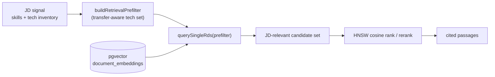

## Overview

Filter-then-rank adds a deterministic structured pre-filter in front of the JD
strategist's vector retrieval, so the model ranks a JD-relevant candidate set
instead of the whole knowledge base. It exists to fix a measured precision
problem: pure cosine retrieval surfaces semantically-near-but-irrelevant chunks
that the downstream rerank cannot rescue, because it is re-scoring an
already-polluted set.

## The problem it solves

Retrieval was pure vector — HNSW cosine scoped only by `user_id` (and optional
repo), with a hybrid HNSW+BM25 variant, and **no structured pre-filter**. The
design spec records the measured failure mode on a real run: 47 passages
retrieved, **~79% never cited**, median cosine **0.291**, with generic files
(`metrics.ts`, `composition-root.md`) ranking near the top
([retrieval-filter-then-rank-spec.md](../retrieval-filter-then-rank-spec.md)).
A cross-encoder rerank cannot fix this — it only re-scores the polluted candidate
set.

## How it works

`buildRetrievalPrefilter()` constructs a structured filter from the JD signal —
the required/preferred skills plus the technology inventory — and passes it into
retrieval, where it narrows candidates *before* the HNSW cosine ranking runs
([retrieval-prefilter.ts:24-45](../../applications/job-strategist/src/ats/retrieval-prefilter.ts#L24-L45)).

## Transfer-aware, so it never discards transferable evidence

The tech set is **transfer-aware**: each JD technology is resolved to its ontology
canonical (via the alias map) and expanded with its transfer-group siblings, so a
hard exact-tech filter never discards the transferable evidence the
vendor/tech-transfer machinery exists to surface — e.g. Bedrock chunks for an
OpenAI JD still pass the filter
([retrieval-prefilter.ts:5-9](../../applications/job-strategist/src/ats/retrieval-prefilter.ts#L5-L9),
[retrieval-prefilter.ts:40-45](../../applications/job-strategist/src/ats/retrieval-prefilter.ts#L40-L45)).
The filter is pure and deterministic.

## Env-gated, fail-open rollout

The pre-filter ships dark behind an environment flag — it is built only when
`RETRIEVAL_PREFILTER === 'on'`; absent, retrieval falls back to today's pure
vector behaviour
([run-pipeline.ts:478-488](../../applications/job-strategist/src/run-pipeline.ts#L478-L488)).
The built filter flows through `executeResearchAgent` into the per-query RDS
retrieval call
([research-agent.ts:784](../../applications/job-strategist/src/agents/research-agent.ts#L784),
[research-agent.ts:819](../../applications/job-strategist/src/agents/research-agent.ts#L819)).

## Implementation in this codebase

| Concern | File |
| :- | :- |
| Build the transfer-aware filter | `applications/job-strategist/src/ats/retrieval-prefilter.ts` |
| Env gate + filter construction inputs | `applications/job-strategist/src/run-pipeline.ts` |
| Apply during retrieval | `applications/job-strategist/src/agents/research-agent.ts` |
| Design spec (problem + measurement) | `docs/retrieval-filter-then-rank-spec.md` |

## Tradeoffs

A structured pre-filter risks discarding genuinely transferable evidence if the
tech set is too narrow — mitigated by ontology-canonical resolution plus
transfer-group expansion, so interchangeable technologies pass together. Shipping
behind an env flag with pure-vector fail-open lets the precision change be
A/B-measured against the prior behaviour before it becomes the default, at the
cost of carrying both paths during rollout.

## Deeper detail

- [skill-evidence-ledger](skill-evidence-ledger.md) — consumes the retrieved, cited evidence
- [multi-query-retrieval](multi-query-retrieval.md) — the query-generation side of retrieval
- (planned) docs/concepts/evidence-metadata-stamp.md — structural authorship-trust gating on chunks

## Related concepts

- [per-phase-evals](per-phase-evals.md) (planned) — the RAG scorers that measure retrieval precision

<!--
Evidence trail (auto-generated):
- Source: applications/job-strategist/src/ats/retrieval-prefilter.ts (read on 2026-06-16, lines 1-45)
- Source: applications/job-strategist/src/run-pipeline.ts (read on 2026-06-16, lines 478-488)
- Source: applications/job-strategist/src/agents/research-agent.ts (read on 2026-06-16, prefilter threading L223/L784/L819)
- Source: docs/retrieval-filter-then-rank-spec.md (read on 2026-06-16, Problem section — measured 47 passages / ~79% uncited / cosine 0.291)
-->
