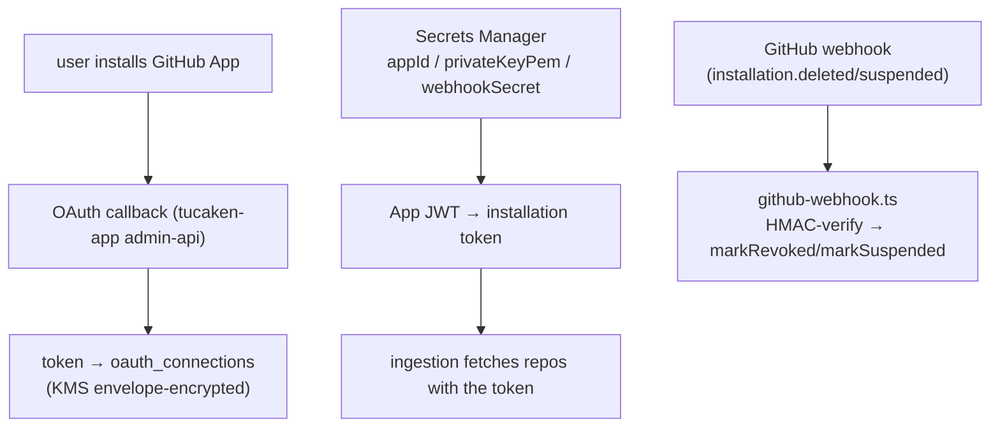

## Overview

When a user connects their GitHub account, Tucaken acts as a **GitHub App** with a
per-user installation. This doc covers the ai-applications side of that
connection: how the App authenticates (App JWT → installation token), how the
user's token is stored, and how the App reacts to install/uninstall events. The
user-facing OAuth callback and the ingestion dispatch live in the sibling
`tucaken-app` admin-api (documented there).

## App authentication — JWT from Secrets Manager

The GitHub App's credentials — `appId`, `privateKeyPem`, `webhookSecret` — live in
AWS Secrets Manager, not in the database. `githubAppSecrets.ts` fetches them via a
`SecretsManagerClient` (node instance-profile credentials) and TTL-caches the
value with transparent re-fetch after expiry
([githubAppSecrets.ts](../../api/public-api/src/lib/githubAppSecrets.ts)). The App
signs a short-lived JWT with the private key to mint per-installation tokens —
standard GitHub App auth.

## Token storage

The user's access/installation token is persisted in `oauth_connections` under
**KMS envelope encryption** — never plaintext. See
[ADR 0008](../decisions/0008-oauth-token-envelope-encryption.md) for the scheme;
tokens are read/written through `getOAuthConnectionsRepo()`
([oauth.ts:14-30](../../api/public-api/src/lib/oauth.ts#L14-L30)).

## Webhook — lifecycle events

The App's webhook endpoint verifies an HMAC-SHA256 signature against the
`webhookSecret`, then branches on installation events
([github-webhook.ts](../../api/public-api/src/routes/github-webhook.ts)):

- `installation.deleted` → the connection is marked revoked (`revoked_at`).
- `installation.suspended` → marked suspended (`suspended_at`).

This is what lets the ingestion pipeline fail closed on a connection the user has
removed in GitHub.

## Where dispatch happens

Connecting (or reinstalling) the App triggers ingestion — but the dispatcher is in
the sibling `tucaken-app` admin-api, which builds the K8s ingestion Job with
`USER_ID`, `REPO_FULL_NAME`, `FORCE_REINDEX`, and the per-user token, and posts it
to the cluster. This repo provides the App credentials, token storage, webhook,
and the ingestion Job that runs (`applications/ingestion`). See
[resync-strategy](resync-strategy.md) for what a connect vs reconnect does.

## Implementation in this codebase

| Concern | File |
| :- | :- |
| App credentials (JWT signing, secrets) | `api/public-api/src/lib/githubAppSecrets.ts` |
| Token storage (envelope) | `api/public-api/src/lib/oauth.ts` + [ADR 0008](../decisions/0008-oauth-token-envelope-encryption.md) |
| Webhook (lifecycle) | `api/public-api/src/routes/github-webhook.ts` |
| OAuth callback + dispatch | sibling `tucaken-app` admin-api (documented there) |

## Tradeoffs

A GitHub App (vs a plain OAuth app) gives per-installation, fine-grained,
revocable access and webhook lifecycle events — at the cost of App JWT signing and
installation-token plumbing. Keeping App secrets in Secrets Manager (not the DB)
and user tokens KMS-encrypted in the DB splits the two trust domains; the cost is
two secret stores to operate.

## Related concepts

- [resync-strategy](resync-strategy.md)
- [ingestion-storage-schema](ingestion-storage-schema.md)

<!--
Evidence trail (auto-generated):
- Source: api/public-api/src/lib/githubAppSecrets.ts (read on 2026-06-16)
- Source: api/public-api/src/routes/github-webhook.ts (read on 2026-06-16)
- Source: api/public-api/src/lib/oauth.ts (read on 2026-06-16, lines 1-30)
-->
