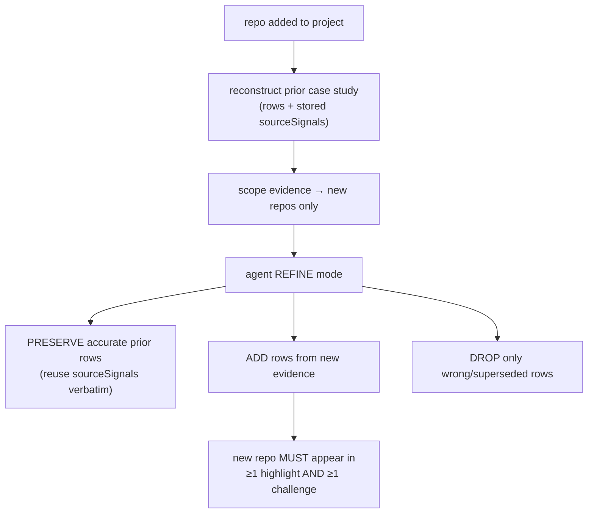

## Overview

When a project gains a repository, its case study is **refined** — updated to
reflect the new repo — rather than regenerated from scratch. Refine preserves the
still-accurate prior rows verbatim (with their grounding evidence) and mints new
rows only from the newly-added repo's commits/PRs/files. This keeps already-cited
work stable, guarantees the new repo is covered, and saves Bedrock cost by not
re-loading every repo's evidence into the prompt.

## Why reconstruct the prior case study

Every case-study row must cite `sourceSignals` (commits / pulls / files). A prior
row was grounded against commits that may no longer be in the current prompt
window. So `case-study-refine.ts` reloads each prior row **with its stored
`source_signals`** from the DB; the agent preserves those rows and their evidence
without needing the old commits re-loaded
([case-study-refine.ts:1-15](../../applications/shared/src/projects/case-study-refine.ts#L1-L15)).
It returns `null` when there is no completed case study yet, so the caller falls
back to full generation.

## How the token/cost saving works

On a refine run, the heavy evidence (commits / pulls / KB chunks) is scoped to
**only the newly-added repos**. The prior case study already carries each
preserved row's `sourceSignals`, and the grounding verifier checks a row against
its *own* signals (not the prompt context), so old repos do not need their commits
re-loaded. `repositories` and `components` are left intact so the agent still sees
the full project shape
([case-study-refine.ts:21-31](../../applications/shared/src/projects/case-study-refine.ts#L21-L31)).
Cutting old repos' commits is where the cost saving comes from.

## The refine prompt contract

In refine mode the agent receives the prior case study and is told to produce the
*updated* full case study, not a fresh one: preserve still-accurate rows and reuse
their `sourceSignals` (no new evidence needed to keep them), add rows for the new
evidence, drop a prior row only if it is now wrong, and revise the tagline / pitch
/ architecture / resume bullets to describe the project as it now stands. Newly
added repos must appear in at least one highlight **and** one challenge, grounded
— a new repo that only lands in the stack list is insufficient
([case-study-agent.ts: REFINE_PROMPT_BLOCK](../../applications/shared/src/projects/case-study-agent.ts#L108)).

## Graded contract

`case-study-refine-grader.ts` enforces the promise deterministically (no LLM), so
it runs in CI and can grade a live refine run
([case-study-refine-grader.ts](../../applications/shared/src/projects/case-study-refine-grader.ts)):

- `gradeNewRepoCoverage` — every newly-added repo appears in ≥1 highlight AND ≥1
  challenge, grounded by `sourceSignals` (the regression a live E2E surfaced:
  a new repo landed in the stack only).
- `gradeNoDuplicates` — refine must not re-emit a prior row as a reworded
  near-duplicate.
- `gradeCaps` — ≤5 decisions / highlights / challenges, ≤40 stack.
- `gradePriorContinuity` — a non-trivial prior should not be wholesale discarded.

## Implementation in this codebase

| Concern | File |
| :- | :- |
| Reconstruct prior + scope evidence | `applications/shared/src/projects/case-study-refine.ts` |
| Refine prompt block | `applications/shared/src/projects/case-study-agent.ts` |
| Refine graders | `applications/shared/src/projects/case-study-refine-grader.ts` |

## Tradeoffs

Refine trades a small amount of holistic freshness (old rows are preserved, not
re-judged against new context) for stable, already-grounded content and a real
token/cost saving on multi-repo projects. The risk that a new repo gets
under-represented is closed by `gradeNewRepoCoverage`; the risk of reworded
duplicates by `gradeNoDuplicates`.

## Deeper detail

- [case-study-generation](case-study-generation.md) — the full-generation path refine extends
- [per-phase-evals](per-phase-evals.md) — the grader framework

## Related concepts

- [skill-evidence-ledger](skill-evidence-ledger.md)

<!--
Evidence trail (auto-generated):
- Source: applications/shared/src/projects/case-study-refine.ts (read on 2026-06-16, lines 1-31)
- Source: applications/shared/src/projects/case-study-agent.ts (read on 2026-06-16, REFINE_PROMPT_BLOCK L108-126)
- Source: applications/shared/src/projects/case-study-refine-grader.ts (read on 2026-06-16, graders L57-122)
-->
