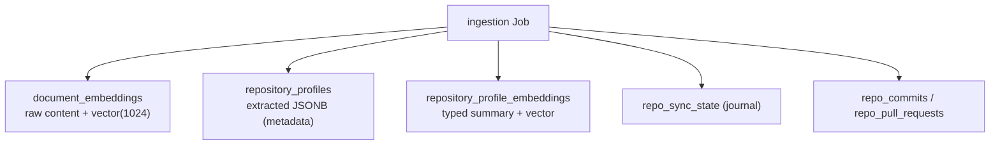

## Overview

Ingestion writes to several tables, and a common question is "do you store code or
just metadata?" The answer is **both**, in different tables: raw chunk *content*
plus its embedding for retrieval, and separately a structured per-repo *profile*
that is metadata only. Knowing which table holds what clarifies what a DB read
would expose and what each consumer reads.

## document_embeddings — raw content + vector

This is the retrieval corpus: one row per file chunk, holding the **raw chunk text
and its embedding**. Columns include `content TEXT` (the raw code/doc text),
`embedding vector(1024)` (Titan v2), `repo_full_name`, `file_path`, `chunk_index`,
`heading`, and `tags`. The natural key is
`(user_id, repo_full_name, file_path, chunk_index)`, and the table is RLS-enabled
([003_cognito_user_provisioning.sql:49-54](../../applications/platform-rds-bootstrap/migrations/003_cognito_user_provisioning.sql#L49-L54),
[003_cognito_user_provisioning.sql:142](../../applications/platform-rds-bootstrap/migrations/003_cognito_user_provisioning.sql#L142)).
`RdsVectorStore` reads `content` back alongside the cosine similarity for retrieval
([RdsVectorStore.ts](../../applications/shared/src/rds/implementations/RdsVectorStore.ts)).

So: **document_embeddings is code (and prose) content, not just metadata.**

## repository_profiles — metadata only

One row per `(user, repo)` holding the *extracted* structured profile — never raw
code. Columns: `extracted JSONB` (one-liner, description, domain, tech_stack,
highlights), `quality_score NUMERIC(3,2)`, `quality_breakdown JSONB`, and a
`classification` enum (`project` / `fork` / `tutorial` / `abandoned` / `noise` /
`stale`)
([014_repository_profiles.sql:10-21](../../applications/platform-rds-bootstrap/migrations/014_repository_profiles.sql#L10-L21)).
This is the repo *identity*, consumed by the matcher and the
[repository profile](repository-profile-and-evidence-topology.md) layer.

## repository_profile_embeddings — typed summary + vector

A small set of typed narrative chunks per profile — `chunk_type` is intentionally
narrow (`one_liner` / `description` / `highlight`) — each with its `content TEXT`,
a `content_hash`, and an `embedding vector(1024)`
([014_repository_profiles.sql:78-89](../../applications/platform-rds-bootstrap/migrations/014_repository_profiles.sql#L78-L89)).
Unlike `document_embeddings` (file-level raw chunks) these are profile-level
summary text.

## The journal + evidence tables — metadata

- `repo_sync_state` — the sync journal (status, counts, phase, error). Metadata.
- `repo_commits` / `repo_pull_requests` — commit/PR evidence the case-study and
  strategist pipelines cite. Metadata.
- `technology_evidence` (written by tech-extractor) — code-derived technologies.
  Metadata.

## Summary

| Table | Holds | Code or metadata |
| :- | :- | :- |
| `document_embeddings` | raw chunk `content` + `embedding` | **code/prose + vector** |
| `repository_profiles` | `extracted` JSONB, quality, classification | metadata |
| `repository_profile_embeddings` | typed summary chunks + `embedding` | summary text + vector |
| `repo_sync_state` | sync journal | metadata |
| `repo_commits` / `repo_pull_requests` | commit/PR evidence | metadata |

## Tradeoffs

Storing raw `content` in `document_embeddings` (not just vectors) lets retrieval
return the exact cited passage without re-fetching from GitHub — at the cost of
holding user code in the DB (hence RLS on the table). Splitting file-level chunks
from the profile-level summary keeps two retrieval granularities: precise evidence
(file chunks) and repo identity (profile). All user-scoped tables enforce RLS so a
query can only ever see one user's rows.

## Related concepts

- [file-ingestion-strategy](file-ingestion-strategy.md) — what gets chunked into document_embeddings
- [repository-profile-and-evidence-topology](repository-profile-and-evidence-topology.md)
- [per-transaction-rls](../patterns/per-transaction-rls.md)

<!--
Evidence trail (auto-generated):
- Source: applications/platform-rds-bootstrap/migrations/003_cognito_user_provisioning.sql (read on 2026-06-16, lines 49-54, 142)
- Source: applications/platform-rds-bootstrap/migrations/014_repository_profiles.sql (read on 2026-06-16, lines 10-21, 78-89)
- Source: applications/shared/src/rds/implementations/RdsVectorStore.ts (referenced on 2026-06-16)
-->
