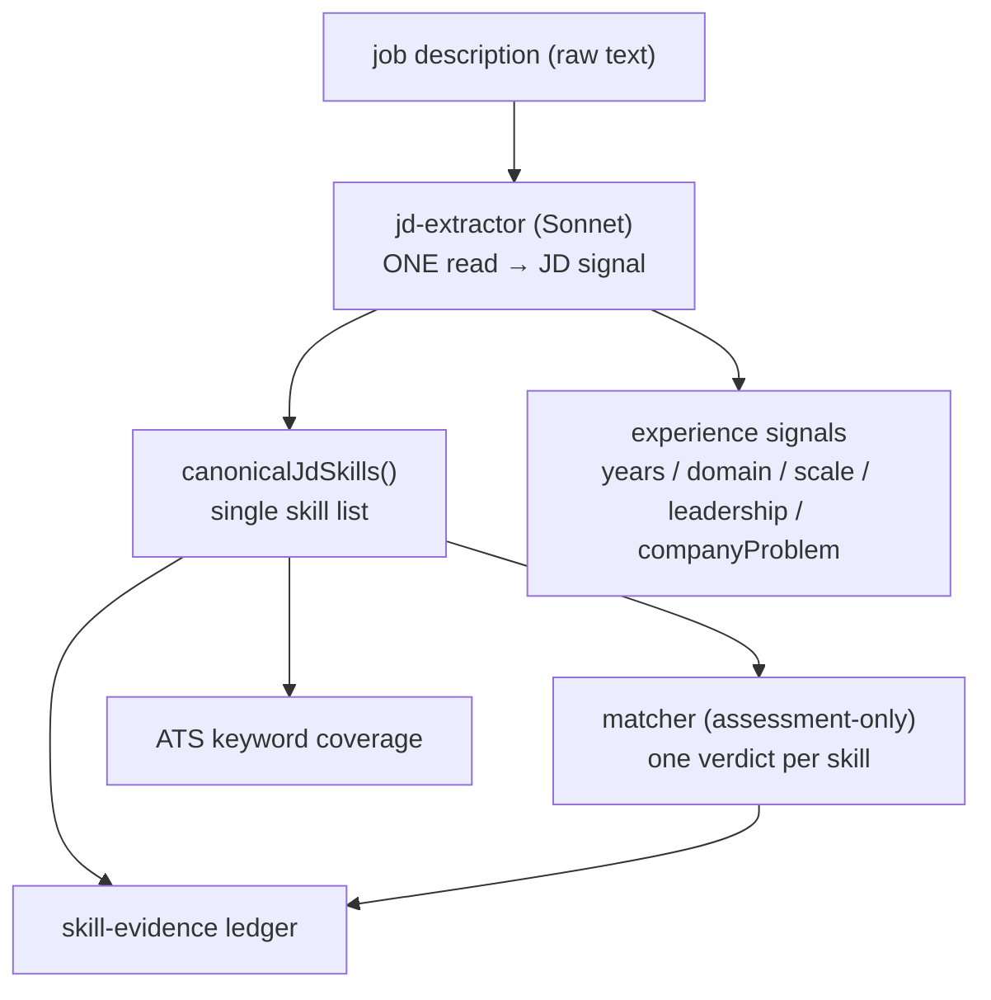

## Overview

The job description is read **once**, by the `jd-extractor`, into a structured
signal. Everything downstream — the matcher, the skill-evidence ledger, and ATS
keyword coverage — consumes that single read rather than re-reading the raw JD.
This removes the class of bug where each independent LLM read of the same JD
returned different skills, so the pipeline's counts diverged.

## The problem: two reads of one JD

Previously the JD was read twice: the `jd-extractor` produced its signal, and the
matcher (research agent) *separately* re-read the raw JD text to invent its own
verified/partial/gap skill set. Two reads of the same JD produce different output,
so the matcher's universe (e.g. 11 skills) and the extractor's canonical universe
(e.g. 18) diverged — and the UI's "Skill coverage" donut never matched the
"Evidence coverage" ledger.

## The single read: the JD signal

The `jd-extractor` is the canonical JD read. It runs on Sonnet by default — a
single source of truth, overridable via `JD_EXTRACTOR_MODEL_ID`
([jd-extractor.ts:23](../../applications/job-strategist/src/agents/jd-extractor.ts#L23)).
It emits the full signal: the technology inventory and required/preferred skills,
plus the experience signals (`yearsExpected`, domain, scale, leadership) and the
`companyProblem`. Those experience signals — "Years expected / Domain focus /
Scale expected / Leadership level" and "the problem this role solves" — all come
from the extractor, not the matcher.

## The canonical skill list

`canonicalJdSkills()` collapses the extractor's `requiredSkills` + technology
inventory (tools / languages / frameworks / infrastructure / methodologies) +
legacy `tools` + `preferredSkills` into one ordered, deduped list — the single
authoritative "what the JD needs"
([canonical-jd-skills.ts:42-64](../../applications/job-strategist/src/ats/canonical-jd-skills.ts#L42-L64)).

## Downstream consumers use the read, not the JD

The matcher is now **assessment-only** over the canonical list (see
[ADR 0007](../decisions/0007-assessment-only-matcher.md)) — it no longer embeds
the raw JD. The research message is built from a JD-signal block (including
`companyProblem` and a numbered "JD SKILLS TO ASSESS" list), not the raw JD text;
the raw JD survives only as fallback substrings for retrieval, never as a second
skill-deriving read
([research-agent.ts](../../applications/job-strategist/src/agents/research-agent.ts)).
The ledger keys off the same canonical list, so matcher verdicts and evidence
rows reconcile by construction.

## Implementation in this codebase

| Concern | File |
| :- | :- |
| The one JD read (Sonnet) | `applications/job-strategist/src/agents/jd-extractor.ts` |
| Canonical skill list | `applications/job-strategist/src/ats/canonical-jd-skills.ts` |
| Matcher fed the signal, not the JD | `applications/job-strategist/src/agents/research-agent.ts` |
| Verdict → legacy buckets adapter | `applications/job-strategist/src/agents/research-assessment.ts` |

## Tradeoffs

One read trades the matcher's freedom to surface skills the extractor missed for
full reconciliation across the pipeline and reproducible counts. Moving the
extractor to Sonnet costs more per call than Haiku, justified because it is the
single highest-leverage read — every downstream consumer inherits its quality.
The raw JD is still available for retrieval fallback, so no retrieval recall is
lost.

## Deeper detail

- [ADR 0007 — assessment-only matcher](../decisions/0007-assessment-only-matcher.md)
- [skill-evidence-ledger](skill-evidence-ledger.md) — the consumer that reconciles against the canonical list

## Related concepts

- [filter-then-rank-retrieval](filter-then-rank-retrieval.md)

<!--
Evidence trail (auto-generated):
- Source: applications/job-strategist/src/agents/jd-extractor.ts (read on 2026-06-16, MODEL_ID L23 Sonnet default)
- Source: applications/job-strategist/src/ats/canonical-jd-skills.ts (read on 2026-06-16, lines 42-64)
- Source: applications/job-strategist/src/agents/research-agent.ts (read/edited on 2026-06-16, JD-signal block, raw-JD removed)
- Source: applications/job-strategist/src/agents/research-assessment.ts (read on 2026-06-16)
-->
