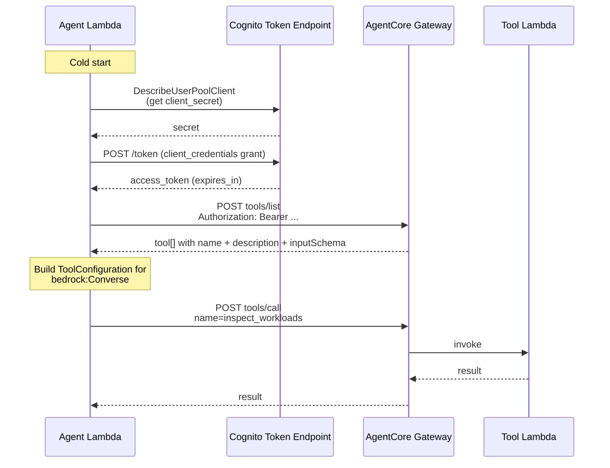

## Overview

The self-healing agent does not hardcode its remediation toolset.
Instead, the agent Lambda calls a Bedrock AgentCore Gateway at every
cold start, asks "what tools are available?" via the MCP `tools/list`
JSON-RPC method, and uses the returned schemas to build the
`ToolConfiguration` it passes to `bedrock:Converse`
([applications/self-healing/src/index.ts:651-705](../../applications/self-healing/src/index.ts#L651-L705)).
This means a tool can be added or removed by deploying the Gateway
stack alone — no code change to the agent.

The Gateway is the M2M-authenticated boundary between the agent
("what should I do?") and the operational verbs ("inspect cluster",
"remediate node"). It is provisioned by
[`SelfHealingGatewayStack`](../../infra/lib/stacks/self-healing/gateway-stack.ts)
using the official AgentCore `Gateway` L2 construct
([gateway-stack.ts:144-149](../../infra/lib/stacks/self-healing/gateway-stack.ts#L144-L149)).

## How it works



### Authentication

The Gateway L2 construct auto-creates a Cognito User Pool + User Pool
Client configured for the OAuth2 client-credentials grant
([gateway-stack.ts:138-149](../../infra/lib/stacks/self-healing/gateway-stack.ts#L138-L149)).
The stack exposes four values via SSM that the Agent stack imports:

| Export | Purpose |
| :- | :- |
| `tokenEndpointUrl` | OAuth2 token endpoint |
| `userPoolId` | For `DescribeUserPoolClient` to retrieve the client secret at runtime |
| `userPoolClientId` | Client ID for the token request |
| `oauthScopes` | Space-separated scope string |

The client secret is **not** stored as a Lambda env var. The agent
Lambda is granted `cognito-idp:DescribeUserPoolClient` on the user pool
ARN
([agent-stack.ts:516-527](../../infra/lib/stacks/self-healing/agent-stack.ts#L516-L527))
and resolves the secret once at cold start, caching it for the
container lifetime
([index.ts:563-582](../../applications/self-healing/src/index.ts#L563-L582)).

Access tokens are refreshed when within 60 seconds of expiry
([index.ts:147, 596-598](../../applications/self-healing/src/index.ts#L596-L598)).
The base64-encoded `client_id:client_secret` is sent in the
`Authorization: Basic` header alongside a
`grant_type=client_credentials` body
([index.ts:606-620](../../applications/self-healing/src/index.ts#L606-L620)).

### Tool discovery (`tools/list`)

The agent issues a JSON-RPC 2.0 request:

```json
{
  "jsonrpc": "2.0",
  "method": "tools/list",
  "params": {},
  "id": "discover"
}
```

The response shape (`McpToolsListResponse`,
[index.ts:191-199](../../applications/self-healing/src/index.ts#L191-L199))
returns an array of `{ name, description?, inputSchema? }` objects.
Each is mapped 1:1 to the Bedrock `Tool` type:

```ts
{
    toolSpec: {
        name: tool.name,
        description: tool.description,
        inputSchema: { json: tool.inputSchema },
    },
}
```
([index.ts:994-1003](../../applications/self-healing/src/index.ts#L994-L1003)).

If the Gateway is unreachable, returns no tools, or the request times
out (10 s), the agent falls back to a hardcoded set of 10 tool
definitions
([index.ts:777-898](../../applications/self-healing/src/index.ts#L777-L898))
so that a Gateway outage degrades capability but does not break the
agent. The fallback set is kept in sync with the Gateway-registered
set so that behaviour during a fallback resembles normal operation as
closely as possible.

### Tool invocation (`tools/call`)

When `bedrock:Converse` returns `stopReason: 'tool_use'`, the agent
extracts each `toolUse` block and issues:

```json
{
  "jsonrpc": "2.0",
  "method": "tools/call",
  "params": { "name": "inspect_workloads", "arguments": {…} },
  "id": "<epoch-ms>"
}
```
([index.ts:744-752](../../applications/self-healing/src/index.ts#L744-L752)).

The tool result is JSON-stringified into a `ToolResultBlock` keyed by
`toolUseId` and appended to the next Converse turn
([index.ts:1177-1183](../../applications/self-healing/src/index.ts#L1177-L1183)).
If the result blob describes a *write* tool, an extra `[REFLECT]`
prompt is injected immediately after to force the model to assess the
result before the next decision
([index.ts:1185-1190](../../applications/self-healing/src/index.ts#L1185-L1190)).

### Per-tool layout

Each tool is its own NodejsFunction with an `index.ts` entry under
[applications/self-healing/src/tools/](../../applications/self-healing/src/tools/):

```text
applications/self-healing/src/tools/
├── analyse-cluster-health/     ← K8sGPT-backed analyser
├── check-argocd-sync/          ← argocd app sync/health
├── check-cert-manager/         ← cert-manager ClusterIssuer
├── check-ingress-routes/       ← Traefik IngressRoute presence
├── check-node-health/          ← kubectl get nodes + conditions
├── check-security-group-rules/ ← EC2 SG ingress audit
├── diagnose-alarm/             ← CloudWatch alarm + recent metrics
├── get-node-diagnostic-json/   ← run_summary.json from EC2 via SSM
├── inspect-workloads/          ← cluster-wide health snapshot
└── remediate-node-bootstrap/   ← Step Functions trigger (write)
```

The Gateway stack registers each as an MCP tool via
`gateway-stack.ts` (one block per tool, each pointing at
`applications/self-healing/src/tools/<name>/index.ts`). Most are
SSM-backed `kubectl get` wrappers — `inspect-workloads` for example
runs five parallel kubectl queries inside a single SSM command on the
control-plane instance, so total round-trip time is the slowest query
(~3-5 s), not the sum
([applications/self-healing/src/tools/inspect-workloads/index.ts](../../applications/self-healing/src/tools/inspect-workloads/index.ts)).

### CDK-Nag suppressions specific to the Gateway

The auto-created Cognito User Pool carries four CDK-Nag suppressions
([gateway-stack.ts:1070-1085](../../infra/lib/stacks/self-healing/gateway-stack.ts#L1070-L1085)):

- Password policy — not applicable (no end-user sign-in)
- MFA — not applicable (M2M)
- AdvancedSecurityMode — not applicable (no end-user passwords)
- Plus tier — not required (no end-user features used)

These are recorded explicitly because the L2 construct does not let
the application opt out of creating the pool; the suppressions document
the intentional posture rather than papering over a configurable knob.

## Implementation in this codebase

| Concern | Location |
| :- | :- |
| Gateway L2 + Cognito + 10 tool registrations | [infra/lib/stacks/self-healing/gateway-stack.ts](../../infra/lib/stacks/self-healing/gateway-stack.ts) |
| Token acquisition + caching | [applications/self-healing/src/index.ts:563-637](../../applications/self-healing/src/index.ts#L563-L637) |
| `tools/list` discovery + fallback | [applications/self-healing/src/index.ts:651-705](../../applications/self-healing/src/index.ts#L651-L705) |
| `tools/call` invocation | [applications/self-healing/src/index.ts:722-765](../../applications/self-healing/src/index.ts#L722-L765) |
| Bedrock tool config mapping | [applications/self-healing/src/index.ts:994-1006](../../applications/self-healing/src/index.ts#L994-L1006) |
| Per-tool Lambdas | [applications/self-healing/src/tools/](../../applications/self-healing/src/tools/) |

## Tradeoffs

**Why MCP, not Bedrock Agent action groups?** Bedrock Agents bake the
tool catalogue into the agent definition; updates require redeploying
the agent resource. MCP via `tools/list` lets the Gateway evolve
independently — new tool, deploy the Gateway stack, the next cold start
of the agent picks it up. The cost is the extra hop (`tools/list` at
cold start) and the Cognito-mediated auth surface. Both are predictable
and bounded.

**Why a separate stack for the Gateway?** `AgentStack` and
`GatewayStack` could have been one stack. Splitting them lets the
Gateway redeploy (new tool, schema change) without touching the agent
Lambda — and prevents the agent Lambda's IAM updates from forcing a
Gateway redeploy. The dependency direction is one-way: `AgentStack`
imports SSM values that `GatewayStack` exports.

**Falling back to hardcoded tools.** A Gateway outage would otherwise
mean a fully-broken agent. The fallback preserves the same 10 tool
schemas in `getDefaultTools()` so a degraded mode still calls the
operational verbs — they just fail (the tool result includes
`status: "stub"`) and the agent reports the failure via SNS instead of
silently looping. This is a deliberate tradeoff: complete failure is
preferable to silent partial behaviour, but a known stub is preferable
to "ConverseCommand requires at least one tool".

## Deeper detail

- [concepts/self-healing-agent.md](self-healing-agent.md) — the agent
  side: prompt augmentation, write-verify enforcement, idempotency,
  session memory
- [projects/self-healing.md](../projects/self-healing.md) — the
  service-level README: deploy story, env vars, monitoring
- (planned) docs/concepts/agentcore-cdk-l2.md — what the AgentCore
  Gateway L2 construct creates vs what the user has to opt into

## Related concepts

- [Domain glossary — Caching](../../CONTEXT.md) — the agent is one
  of the few services that deliberately bypasses every cache tier
  (each invocation is one-shot).

<!--
Evidence trail (auto-generated):
- Source: infra/lib/stacks/self-healing/gateway-stack.ts (lines 80-160, 1070-1085, grep on 2026-05-27)
- Source: applications/self-healing/src/index.ts (read in full on 2026-05-27)
- Source: applications/self-healing/src/tools/inspect-workloads/index.ts (header on 2026-05-27)
- Source: applications/self-healing/src/tools/diagnose-alarm/index.ts (header on 2026-05-27)
- Source: applications/self-healing/src/tools/ (directory listing on 2026-05-27)
-->
