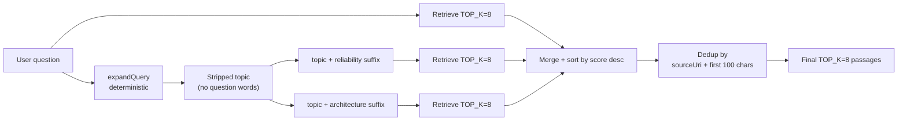

## Overview

`expandQuery` produces two reformulations of a user question so the
retrieval layer can run three parallel pgvector lookups (original +
two expansions) and merge them. The pattern closes the embedding-
similarity gap that a single phrasing inevitably leaves open — a
question framed as "What is Nelson's CDK experience?" embeds
differently from "CDK deployment reliability outcomes" even when both
should retrieve the same chunks. Three framings hedge against any
single one being a bad match for the corpus
([applications/chatbot-public/src/retrieval.ts:23-40](../../applications/chatbot-public/src/retrieval.ts#L23-L40)).

The pattern is **deterministic** — no LLM call. `expandQuery` is a
stop-word strip plus suffix join, runs in microseconds, and has no
inference cost.

## How it works



### Stop-word stripping

`expandQuery` first strips a curated list of question prefixes
([applications/shared/src/chatbot/query-expander.ts:1-22](../../applications/shared/src/chatbot/query-expander.ts#L1-L22)):

```ts
const STOP_WORDS = [
    "what's", 'what is', 'what are', 'what does', 'tell me about',
    'describe', 'explain', 'who', 'where', 'when', 'why', 'how',
    'does', 'is', 'can', 'has', 'have', 'was', 'were', 'did', 'do',
    "nelson's", 'nelson', 'about', 'the', 'his', 'he', 'your', 'you', 'a', 'an',
];
```

The list is **portfolio-aware** — `nelson's`, `nelson`, `your`, `you`
are removed because the chatbot's referent is fixed; questions are
always *about* the portfolio owner, so retaining the pronoun adds
embedding noise. The list also includes the trailing `?` strip
([query-expander.ts:9](../../applications/shared/src/chatbot/query-expander.ts#L9)).

If no prefix matches, the topic falls back to the original question
([query-expander.ts:19](../../applications/shared/src/chatbot/query-expander.ts#L19))
— rather than emitting an empty string.

### Suffix join

The two expansions append fixed, semantically distinct suffixes to
the stripped topic
([query-expander.ts:21-24](../../applications/shared/src/chatbot/query-expander.ts#L21-L24)):

| Expansion | Suffix | Bias toward |
| :- | :- | :- |
| `q2` | `deployment reliability outcomes production results` | Operational artefacts, on-call narrative |
| `q3` | `infrastructure architecture design patterns tools` | Stack choices, design decisions |

These are **production-tuned** — they map onto the two dominant
chunk categories the portfolio's pgvector store contains: code/deploy
chunks vs architectural narrative chunks. Adding a third suffix (e.g.
"security compliance audit") would require a corresponding chunk
distribution in the corpus or it adds embedding noise without recall
gain.

### Two-layer retrieval inside one call

`PgVectorRetriever.retrieve` itself runs two queries in parallel per
call: a **profile-layer** query and a **chunk-layer** query
([applications/shared/src/retrieval/implementations/PgVectorRetriever.ts:51-60](../../applications/shared/src/retrieval/implementations/PgVectorRetriever.ts#L51-L60)):

```ts
const [profilePassages, chunkPassages] = await Promise.all([
    this.queryProfileLayer(userId, vectorStr, maxProfiles, profileWeight, …),
    this.queryChunkLayer(userId, vectorStr, maxChunks),
]);
return [...profilePassages, ...chunkPassages].sort((a, b) => b.score - a.score);
```

- **Profile layer** — repository profile rows (distilled summaries).
  Multiplied by `profileWeight` (default `1.5`,
  [PgVectorRetriever.ts:27](../../applications/shared/src/retrieval/implementations/PgVectorRetriever.ts#L27))
  so a profile match outranks a raw chunk match of comparable raw
  similarity.
- **Chunk layer** — raw repository file content. Higher cardinality,
  noisier per token.

Both layers run inside an RLS-bound transaction
(`SET LOCAL app.current_user_id = $1`,
[PgVectorRetriever.ts:74](../../applications/shared/src/retrieval/implementations/PgVectorRetriever.ts#L74))
so a user's retrieval cannot leak into another user's data.

A single `expandQuery`-driven invocation therefore runs **6 pgvector
queries in parallel** (3 framings × 2 layers), all from one
Lambda invocation. Aurora absorbs the load comfortably at the
platform's scale; the latency floor is the slowest of the six.

### Deduplication

Passages from the three framings are merged then deduped
([applications/chatbot-public/src/retrieval.ts:12-20](../../applications/chatbot-public/src/retrieval.ts#L12-L20)):

```ts
const key = `${p.sourceUri}::${p.text.slice(0, 100)}`;
```

`sourceUri + first 100 chars`. The choice is deliberate:

- **Two passages from the same `sourceUri` are kept** if their
  first-100-char prefix differs (different paragraphs of the same
  document).
- **The same passage retrieved twice with slightly different
  similarity scores is collapsed** — only the first (highest-score
  after sort) survives.

`text.slice(0, 100)` is enough to distinguish paragraphs without
making the key brittle to whitespace differences in the trailing
content. A full-text hash would collapse fewer near-duplicates; the
prefix approach is a deliberate medium.

After dedup, the final `slice(0, TOP_K)` cap (default `8`,
[chatbot-public/src/retrieval.ts:9](../../applications/chatbot-public/src/retrieval.ts#L9))
trims the merged pool to the model's context budget.

### `expandQuery` is not a query rewriter

A common nearby pattern is **LLM-based query rewriting** — passing
the user's question to a small model to produce reformulations.
`expandQuery` is intentionally **not** that. The advantages:

- **Zero inference cost.** Every chatbot request runs the same fixed
  expansion in microseconds.
- **Deterministic.** Same input → same expansions. Easy to test
  ([applications/shared/src/chatbot/__tests__/query-expander.test.ts](../../applications/shared/src/chatbot/__tests__/query-expander.test.ts)).
- **No model-quality drift.** A model swap does not change retrieval
  behaviour.

The accepted residual: expansions are not custom-tailored to the
specific question. The two suffix branches are bets on what *kinds*
of answers the corpus might hold for a question. The bet is good for
this corpus (portfolio documentation, infrastructure narrative); it
would be a worse bet for a corpus where the answers were not
clustered along the operational/architectural axes.

## Implementation in this codebase

| Concern | Location |
| :- | :- |
| `expandQuery` | [applications/shared/src/chatbot/query-expander.ts](../../applications/shared/src/chatbot/query-expander.ts) |
| `PgVectorRetriever` | [applications/shared/src/retrieval/implementations/PgVectorRetriever.ts](../../applications/shared/src/retrieval/implementations/PgVectorRetriever.ts) |
| `multiQueryRetrieve` caller | [applications/chatbot-public/src/retrieval.ts](../../applications/chatbot-public/src/retrieval.ts) |
| Tests (expandQuery) | [applications/shared/src/chatbot/__tests__/query-expander.test.ts](../../applications/shared/src/chatbot/__tests__/query-expander.test.ts) |

## Tradeoffs

**Two expansions, not five.** Each expansion costs one pgvector
retrieve (two queries inside). Three framings buy most of the recall
benefit; the marginal gain from a fourth or fifth is smaller and
multiplies the latency floor. Three was the empirical choice; the
constant lives at the call site
([chatbot-public/src/retrieval.ts:32-37](../../applications/chatbot-public/src/retrieval.ts#L32-L37))
and is the easy place to tune.

**Deterministic over LLM-rewritten.** A query-rewriter LLM (Claude
Haiku or similar) would produce expansions custom-fit to the
question. The platform deliberately does not pay that cost — `expandQuery`
is a hand-tuned heuristic that captures the two dominant answer
modes of the corpus. If the corpus broadened (e.g. into customer
support transcripts) the heuristic would need new branches; the
LLM-rewriter would adapt automatically. For now, deterministic wins
on cost + reproducibility + testability.

**`profileWeight = 1.5` bakes the corpus bias.** Profile chunks are
distilled summaries — they encode more signal per token than raw
code chunks. A flat weight of `1.0` would let a high-scoring code
chunk outrank a moderately-scoring profile chunk that is in fact
more useful for the question. The `1.5` is a calibrated bias. If
the profile-chunk quality declined, this constant should drop with
it
([PgVectorRetriever.ts:27](../../applications/shared/src/retrieval/implementations/PgVectorRetriever.ts#L27)).

**`text.slice(0, 100)` dedup key.** A naive identity check
(`text === text`) would collapse fewer near-duplicates (whitespace,
casing); a full embedding-similarity check would catch more but is
expensive and adds yet another model dependency. The 100-char prefix
is a fast structural heuristic — it collapses "the same chunk
returned three times by three framings" without paying for
similarity recomputation.

## Deeper detail

- [docs/concepts/bedrock-rag-surface.md](bedrock-rag-surface.md) —
  the chatbot Lambda that drives this retrieval; the broader RAG
  context including managed-agent vs custom-retrieval paths.
- [docs/concepts/titan-embedding-provider.md](titan-embedding-provider.md)
  — the Titan v2 embedder that produces the 1024-dim vector for each
  framing.
- [docs/decisions/0002-pgvector-over-pinecone-for-cache.md](../decisions/0002-pgvector-over-pinecone-for-cache.md)
  — why this retrieval path lives in pgvector and not Pinecone.
- (planned) docs/concepts/profile-layer-vs-chunk-layer.md — deeper
  walkthrough of the SQL inside `queryProfileLayer` and
  `queryChunkLayer`, including the JSONB filters
  (`extracted->>'domain'`, `extracted->'tech_stack' @> ::jsonb`).

## Related concepts

- [pii-scrubber](pii-scrubber.md) — does *not* run ahead of
  retrieval (the user's question is not embedded for the cache by
  this path; it is embedded for the retriever). The semantic cache
  *does* scrub before embedding; the multi-query retrieval path
  does not.
- [self-healing-agent](self-healing-agent.md) — does no retrieval;
  each agent call is one-shot. The two patterns are complementary.

<!--
Evidence trail (auto-generated):
- Source: applications/shared/src/chatbot/query-expander.ts (read in full on 2026-05-27)
- Source: applications/shared/src/retrieval/implementations/PgVectorRetriever.ts (lines 1-100 on 2026-05-27)
- Source: applications/chatbot-public/src/retrieval.ts (read in full on 2026-05-27)
- Cross-reference: docs/concepts/bedrock-rag-surface.md
-->
