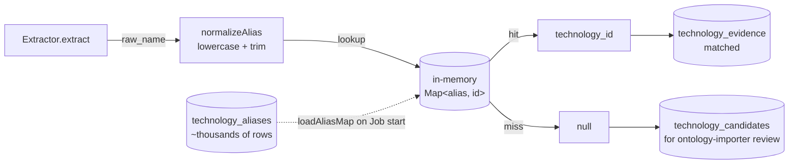

## Overview

The `OntologyResolver` is the deliberately-narrow function that turns
a `raw_name` string emitted by any extractor into a canonical
`technology_id` UUID. It is the load-bearing primitive under the
[tech-extractor pipeline](tech-extractor-architecture.md) — every
matched-vs-unmatched bucket assignment in the
`TechExtractOrchestrator` runs through it
([applications/shared/src/rds/ontology/OntologyResolver.ts:12-20](../../applications/shared/src/rds/ontology/OntologyResolver.ts#L12-L20)).

Its design is intentionally boring: a single `Map` lookup with no
fuzzy matching, no Levenshtein, no edit distance, no LLM
disambiguation. The interesting decisions live elsewhere — in the
alias table that feeds it and in the candidate-loop that handles its
nulls.

## How it works



### Strict normalisation, strict lookup

The full implementation is fifteen lines
([applications/shared/src/rds/ontology/OntologyResolver.ts:1-20](../../applications/shared/src/rds/ontology/OntologyResolver.ts#L1-L20)):

```ts
export function normalizeAlias(raw: string): string {
    return raw.toLowerCase().trim();
}

export class OntologyResolver {
    constructor(private readonly aliasToId: Map<string, string>) {}

    /** @returns technology id, or null when the token is unknown. */
    resolve(rawName: string): string | null {
        return this.aliasToId.get(normalizeAlias(rawName)) ?? null;
    }
}
```

Normalisation is lowercase + trim — **not** the candidate
normalisation in the orchestrator (`replace(/[^a-z0-9]/g, '')`,
[TechExtractOrchestrator.ts:27-29](../../applications/tech-extractor/src/orchestrator/TechExtractOrchestrator.ts#L27-L29)).
The asymmetry is deliberate: the resolver looks up exact aliases the
ontology stores (`@aws-sdk/client-s3`, `aws-cdk-lib/aws-ec2`,
`kube-prometheus-stack`), so stripping punctuation here would lose
the very tokens the ontology was curated to match. Candidate
grouping is a separate concern operating on the *unmatched* tail and
collapses `Kube-Prometheus-Stack` and `kube_prometheus_stack` into
one candidate row for human review.

### Build-once, read-many

The map is built once per K8s Job by
`TechnologyOntologyRepository.loadAliasMap()`
([applications/shared/src/rds/implementations/TechnologyOntologyRepository.ts:12-19](../../applications/shared/src/rds/implementations/TechnologyOntologyRepository.ts#L12-L19))
— a single `SELECT alias, technology_id FROM technology_aliases`,
streamed into the `Map`. The reference data is not user-scoped (it
is global ontology, not user content) so the query bypasses RLS /
`set_config`
([TechnologyOntologyRepository.ts:5-7](../../applications/shared/src/rds/implementations/TechnologyOntologyRepository.ts#L5-L7)).

A separate query loads the prose-safe subset
(`loadProseSafeAliases()`,
[TechnologyOntologyRepository.ts:35-41](../../applications/shared/src/rds/implementations/TechnologyOntologyRepository.ts#L35-L41))
hitting the partial index
`idx_technology_aliases_prose_safe` added by migration 037. That set
is passed to the prose-scanning code paths
([tech-extractor-architecture.md](tech-extractor-architecture.md))
*alongside* the full resolver — the prose scanner uses the safe-set
to decide what to emit, then the resolver runs on every emitted row
identically to imports / IaC paths.

### Ontology version stamping

Each evidence row is tagged with the `ontology_version` current at
the time of extraction
([TechExtractOrchestrator.ts:56](../../applications/tech-extractor/src/orchestrator/TechExtractOrchestrator.ts#L56)).
The version is read once per Job via
`TechnologyOntologyRepository.currentVersion()`
([TechnologyOntologyRepository.ts:43-49](../../applications/shared/src/rds/implementations/TechnologyOntologyRepository.ts#L43-L49))
from the singleton `ontology_version` row. This is the audit anchor:
"which ontology revision identified this evidence?" is one column
read, not a git-blame against the migration history.

### Why no fuzzy matching

Near-miss resolution would be tempting — `aws-sdk` vs `aws_sdk` vs
`@aws-sdk/client-s3` are clearly related — but the resolver
deliberately does not attempt it. Two reasons:

1. **Candidate loop covers it.** The orchestrator's `normalizeForCandidate`
   strips all non-alphanumerics
   ([TechExtractOrchestrator.ts:27-29](../../applications/tech-extractor/src/orchestrator/TechExtractOrchestrator.ts#L27-L29))
   and uses the normalised string as a grouping key. Multiple raw
   names that lose their distinction under that rule collapse to one
   `technology_candidate` row presented to the ontology-importer's
   review queue — the human (or LLM, see
   [Categorizer](../../applications/ontology-importer/src/categorization/Categorizer.ts))
   decides whether they should map to an existing canonical or a new
   one.
2. **Audit trail.** A miss is observable
   (`technology_candidates` row appears, `unmatched++` increments).
   A fuzzy match is silent and depends on the matching heuristic to
   remain stable. The miss-then-curate path is reproducible and
   reviewable; a heuristic match is neither.

## Implementation in this codebase

| Concern | Location |
| :- | :- |
| Resolver class (15 lines) | [applications/shared/src/rds/ontology/OntologyResolver.ts](../../applications/shared/src/rds/ontology/OntologyResolver.ts) |
| Repository (alias-map + prose-safe + version) | [applications/shared/src/rds/implementations/TechnologyOntologyRepository.ts](../../applications/shared/src/rds/implementations/TechnologyOntologyRepository.ts) |
| Schema (ontology + aliases + version singleton) | [applications/platform-rds-bootstrap/migrations/034_technology_graph.sql](../../applications/platform-rds-bootstrap/migrations/034_technology_graph.sql) |
| Caller (orchestrator) | [applications/tech-extractor/src/orchestrator/TechExtractOrchestrator.ts](../../applications/tech-extractor/src/orchestrator/TechExtractOrchestrator.ts) |
| Consumer of misses (candidate review) | [applications/ontology-importer/src/](../../applications/ontology-importer/src/) |
| Tests | [applications/shared/src/rds/ontology/OntologyResolver.test.ts](../../applications/shared/src/rds/ontology/OntologyResolver.test.ts) |

## Tradeoffs

**Strict lookup vs heuristic match.** Strict makes every match
reproducible and every miss observable. Heuristic would close some
gaps automatically but at the cost of audit clarity. The miss-and-
review path scales because the
[ontology-importer](../../applications/ontology-importer/src/) handles
the curation work — including LLM-aided categorisation
([Categorizer](../../applications/ontology-importer/src/categorization/Categorizer.ts))
— so the resolver itself stays a fifteen-line primitive.

**In-memory map vs Postgres-side lookup.** One query at Job start, one
Map traversal per `raw_name` afterwards. The alias table is thousands
of rows; even at 100× growth the Map fits comfortably in the Job's
memory budget. Per-token DB lookups would dominate Job runtime; the
build-once model puts the resolver in the same complexity class as a
local hash table.

**Why not a class hierarchy.** The interface is one function,
`resolve(rawName) → string | null`. No subclassing is needed; no
strategy pattern improves it. Other ontologies (skills, perhaps a
future capabilities map) would each get their own resolver
class — composition over inheritance.

**Asymmetric normalisation.** The resolver lowercases-and-trims; the
candidate path additionally strips non-alphanumerics. The asymmetry
costs one mental load-bearing rule (`normalizeAlias` is *not*
`normalizeForCandidate`) but allows the alias table to store
punctuation-bearing canonical strings without losing them at lookup.

## Deeper detail

- [docs/concepts/tech-extractor-architecture.md](tech-extractor-architecture.md)
  — the orchestrator that calls `resolve` for every extracted row.
- [docs/concepts/prose-safe-alias-gating.md](prose-safe-alias-gating.md)
  — how the `prose_safe` subset of the alias table gets populated.
- (planned) docs/projects/ontology-importer.md — the curation loop
  that turns `technology_candidates` rows into new `technology_aliases`.
- (planned) docs/concepts/tech-graph-schema.md — the six-table schema
  introduced by migration 034 (ontology, aliases, relationships,
  evidence, candidates, parity).

## Related concepts

- [docs/decisions/0001-deterministic-over-llm-extraction.md](../decisions/0001-deterministic-over-llm-extraction.md)
  — the decision that made this resolver the sole authority on
  `technology_id` for the `technologies` extraction role.

<!--
Evidence trail (auto-generated):
- Source: applications/shared/src/rds/ontology/OntologyResolver.ts (read in full on 2026-05-27)
- Source: applications/shared/src/rds/implementations/TechnologyOntologyRepository.ts (lines 1-50 on 2026-05-27)
- Source: applications/platform-rds-bootstrap/migrations/034_technology_graph.sql (lines 1-40 on 2026-05-27)
- Source: applications/tech-extractor/src/orchestrator/TechExtractOrchestrator.ts (lines 27-56 on 2026-05-27)
-->
