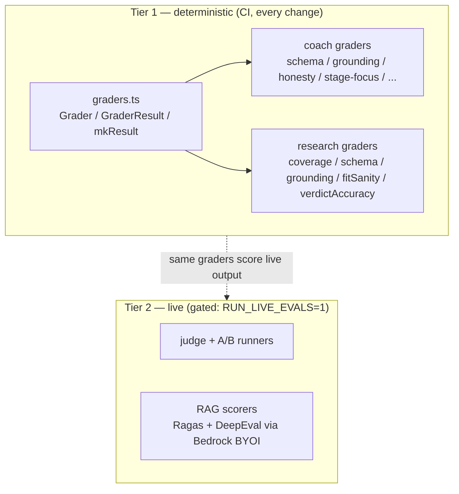

## Overview

Every LLM phase in the JD strategist has its own eval suite. The harness encodes
the repository's non-negotiable rule — *no prompt change ships without its eval*
([CLAUDE.md, "Per-phase evals"](../../CLAUDE.md)) — as deterministic graders that
run in CI on every change, plus a gated live tier that calls Bedrock only when
explicitly enabled. The graders define what "good output" means per phase:
correct grounding, correct phase focus, valid structured output, no
hallucination.

## Two tiers

## Tier 1 — deterministic structural graders

The base contract is small: a `Grader` is a pure function returning a
`GraderResult` (`{ grader, pass, score, failures }`), built with `mkResult`
([graders.ts:11-26](../../applications/job-strategist/src/evals/graders.ts#L11-L26)).
Because they are pure string/array checks with no Bedrock call, they run under
plain `jest` in CI and can also grade the output of a real model run.

Phase-specific grader sets:

- **Coach** — `applications/job-strategist/src/evals/graders/`: `schema-grader`,
  `grounding-grader`, `honesty-grader`, `stage-focus-grader`, `ats-grader`,
  `bar-raiser-grader`, `final-grader`, `system-design-grader`.
- **Research (matcher)** — `research/research-graders.ts`: `coverage` (exactly one
  assessment per canonical JD skill, none invented or duplicated), `schema` (valid
  verdict + the fields that verdict requires), `grounding` (gaps carry no
  evidence), `fitSanity` (valid rating; STRONG FIT not paired with heavy gaps),
  and `verdictAccuracy` against a labelled key
  ([research-graders.ts](../../applications/job-strategist/src/evals/research/research-graders.ts)).
  Synthetic fixtures + a golden output live in `research/fixtures.ts`.
- **Projects** — `case-study-product-grader.ts` and `case-study-refine-grader.ts`
  in `applications/shared/src/projects/` grade product framing and incremental
  refine.

## Tier 2 — gated live evals

The live tier calls Bedrock and is gated behind `RUN_LIVE_EVALS=1` so default
`jest` and CI never spend
([run-research-eval.ts:21-25](../../applications/job-strategist/src/evals/research/run-research-eval.ts#L21-L25)).
It runs real model output through the *same* Tier-1 graders (so the structural
contract is checked on live output) and adds an LLM-judge for qualities the
deterministic graders cannot capture
(`live/judge.ts`, `live/run-live-evals.ts`, `live/run-refine-eval.ts`). The
research runner supports a Haiku↔Sonnet A/B over a real JD
([run-research-eval.ts:10-13](../../applications/job-strategist/src/evals/research/run-research-eval.ts#L10-L13)).

## RAG retrieval scoring

Retrieval quality has its own scorers under `evals/rag/scorers/` — a Python
harness using **Ragas** and **DeepEval** (`ragas_harness.py`,
`deepeval_harness.py`), with adapters to run them through Bedrock
(`to_bedrock_byoi.py`, `from_bedrock_results.py`) and persistence
(`persist_eval.py`). The TypeScript side (`rag/rag-score.ts`, `rag/run-rag-eval.ts`)
drives scoring of retrieved passages — the precision signal behind
[filter-then-rank retrieval](filter-then-rank-retrieval.md).

## Implementation in this codebase

| Concern | File |
| :- | :- |
| Base grader contract | `applications/job-strategist/src/evals/graders.ts` |
| Coach stage graders | `applications/job-strategist/src/evals/graders/` |
| Matcher graders + fixtures | `applications/job-strategist/src/evals/research/` |
| Live judge + A/B runners (gated) | `applications/job-strategist/src/evals/live/` |
| RAG scorers (Ragas + DeepEval) | `applications/job-strategist/src/evals/rag/scorers/` |
| Projects graders | `applications/shared/src/projects/case-study-{product,refine}-grader.ts` |

## Tradeoffs

Deterministic structural graders cannot judge nuance (tone, persuasiveness), but
they are free, fast, reproducible, and catch the regressions that matter most —
missing skills, invalid schema, over-claiming. The live tier covers the nuance
but costs Bedrock spend, so it is opt-in. Keeping both tiers behind the same
grader interface means a live run is checked against the exact contract CI
enforces, with the judge layered on top.

## Deeper detail

- (planned) docs/runbooks/run-live-evals.md — env vars, gate, cost of `RUN_LIVE_EVALS=1`
- (planned) docs/concepts/rag-eval-ragas-deepeval.md — the Python scorer harness and Bedrock BYOI flow

## Related concepts

- [skill-evidence-ledger](skill-evidence-ledger.md)
- [coach-stages](coach-stages.md)
- [case-study-generation](case-study-generation.md)
- [filter-then-rank-retrieval](filter-then-rank-retrieval.md)

<!--
Evidence trail (auto-generated):
- Source: applications/job-strategist/src/evals/graders.ts (read on 2026-06-16, lines 11-26)
- Source: applications/job-strategist/src/evals/research/research-graders.ts (read on 2026-06-16, full)
- Source: applications/job-strategist/src/evals/ (listed on 2026-06-16: graders/, research/, rag/scorers/, live/)
- Source: applications/job-strategist/src/evals/research/run-research-eval.ts (read on 2026-06-16, RUN_LIVE_EVALS gate L21-25)
- Source: applications/job-strategist/src/evals/rag/scorers/ (listed on 2026-06-16: ragas_harness.py, deepeval_harness.py, to_bedrock_byoi.py)
-->
