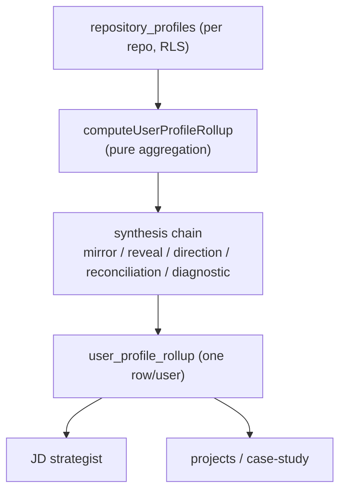

## Overview

Profile Intelligence is the per-user, code-grounded synthesis of who a candidate
is — refreshed on repo sync and stored as one `user_profile_rollup` row. It
aggregates every repository profile the user has into a single rollup with mirror,
reveal, direction, reconciliation, and diagnostic layers, which the JD strategist
and the projects pipeline then consume. It is the "one place that knows the
candidate" derived from their actual code, not their self-description.

## The rollup row

`RdsUserProfileRollupRepository` reads all of a user's `repository_profiles` rows
(RLS-scoped) and upserts the precomputed `user_profile_rollup` row. The scope and
aggregation logic is pure (`computeUserProfileRollup`); the repository is only data
access, mirroring `RepositoryProfileRepository`'s connect + `BEGIN` +
`set_config` RLS idiom
([RdsUserProfileRollupRepository.ts:1-7](../../applications/shared/src/rds/implementations/RdsUserProfileRollupRepository.ts#L1-L7)).

The row carries five JSON layers — `MirrorJson`, `RevealJson`, `DirectionJson`,
`ReconciliationJson`, `DiagnosticJson`
([RdsUserProfileRollupRepository.ts:9](../../applications/shared/src/rds/implementations/RdsUserProfileRollupRepository.ts#L9)) —
produced by the multi-agent synthesis chain.

## How it's produced

The five layers come from the ingestion synthesizer chain (Mirror+Reveal →
Direction → Reconciliation → Diagnostic) over a deterministic aggregate — see the
[profile synthesis chain](profile-synthesis-chain.md) for the agent-level detail.
Profile Intelligence is the *output side*: the persisted, queryable rollup that
chain writes.

## Who consumes it

- **JD strategist** reads the rollup (e.g. direction/seniority) to feed
  code-grounded profile context into the JD analysis.
- **Projects / case-study** uses it for stage calibration (the case-study loader
  reads `direction.seniority`).

## Implementation in this codebase

| Concern | File |
| :- | :- |
| Read profiles + upsert rollup (RLS) | `applications/shared/src/rds/implementations/RdsUserProfileRollupRepository.ts` |
| Pure aggregation | `applications/shared/src/profile/computeUserProfileRollup.ts` |
| Synthesizer agents | `applications/ingestion/src/agents/` |
| Rollup interface + JSON shapes | `applications/shared/src/rds/interfaces/IUserProfileRollupRepository.ts` |

## Tradeoffs

Precomputing one rollup per user on sync trades freshness-at-write for fast,
consistent reads — consumers never re-run synthesis. Keeping aggregation pure
(separate from data access) makes the scope logic unit-testable and the repository
a thin RLS-wrapped upsert. Grounding the rollup in `repository_profiles` (code
evidence) rather than résumé text is what makes it trustworthy as "what the code
shows", at the cost of only reflecting repos that have been ingested.

## Deeper detail

- [profile-synthesis-chain](profile-synthesis-chain.md) — the agent chain that writes the layers
- [repository-profile-and-evidence-topology](repository-profile-and-evidence-topology.md) — the per-repo signals it aggregates

## Related concepts

- [skill-evidence-ledger](skill-evidence-ledger.md)

<!--
Evidence trail (auto-generated):
- Source: applications/shared/src/rds/implementations/RdsUserProfileRollupRepository.ts (read on 2026-06-16, lines 1-14)
- Source: applications/shared/src/profile/computeUserProfileRollup.ts (referenced from the repository import on 2026-06-16)
-->
