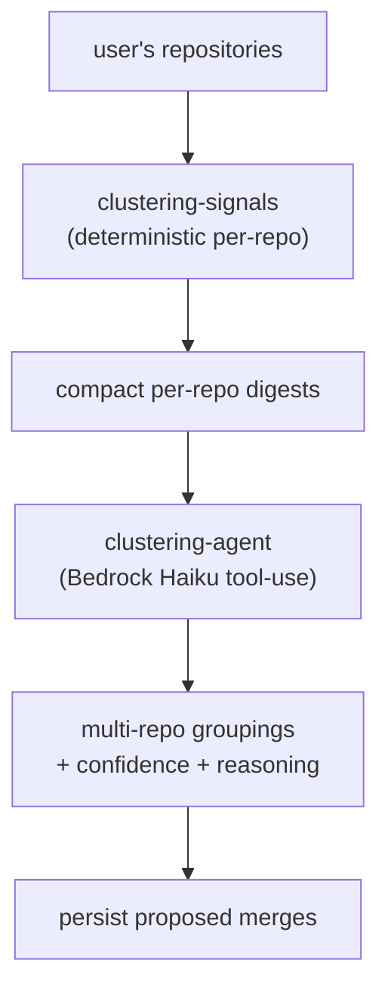

## Overview

Project clustering proposes which of a user's repositories belong together as one
multi-repo project — e.g. an app repo, its infra repo, and its GitOps repo are one
"project". It runs as a Kubernetes Job that feeds compact per-repo digests plus
deterministic signals to a Bedrock agent, which emits groupings with a confidence
and reasoning. The agent only proposes **merges**: a backfill migration already
created a default single-repo project per repo, so clustering's job is to group
those, not to create them.

## How it works

`run-clustering.ts` drives a Job through a fixed status sequence — `queued →
signals_extracting → analysing → persisting → complete`. Deterministic per-repo
signals are extracted first (`clustering-signals.ts`), then the agent reasons over
the digests
([clustering-agent.ts:9-11](../../applications/shared/src/projects/clustering-agent.ts#L9-L11)).

`runClusteringAgent` uses Bedrock tool-use on Haiku 4.5. It receives compact
per-repo digests + deterministic signals and emits multi-repo groupings with
confidence + reasoning; single-repo proposals are not emitted
([clustering-agent.ts:1-8](../../applications/shared/src/projects/clustering-agent.ts#L1-L8)).

## Testable by construction

`runClusteringAgent` is a thin function over `runAgent<T>()`, not a class, so tests
inject an alternative implementation via the `agent` dependency in `runClustering()`
([clustering-agent.ts:13-17](../../applications/shared/src/projects/clustering-agent.ts#L13-L17)).
This is the same dependency-injection shape the rest of the projects pipeline uses
to keep Bedrock out of unit tests.

## Implementation in this codebase

| Concern | File |
| :- | :- |
| Clustering agent (Haiku tool-use) | `applications/shared/src/projects/clustering-agent.ts` |
| Deterministic per-repo signals | `applications/shared/src/projects/clustering-signals.ts` |
| Loader / orchestrator / persistence | `applications/shared/src/projects/clustering-{loader,orchestrator,persistence}.ts` |
| K8s Job entrypoint | `applications/job-strategist/src/run-clustering.ts` |

## Tradeoffs

Pre-creating a default project per repo (via backfill) and limiting the agent to
*merge* proposals keeps the LLM's job narrow and its output low-risk — it can only
suggest grouping, never invent or delete projects. Haiku is used here (rather than
Sonnet) because the task is a constrained grouping over deterministic signals, not
nuanced multi-section generation. The cost is that a genuinely ambiguous grouping
gets a confidence the user must adjudicate, which is why proposals carry reasoning.

## Deeper detail

- [case-study-generation](case-study-generation.md) — runs per project once a project exists
- [repository-profile-and-evidence-topology](repository-profile-and-evidence-topology.md) — the per-repo signals clustering reasons over

## Related concepts

- [system-tour](system-tour.md)

<!--
Evidence trail (auto-generated):
- Source: applications/shared/src/projects/clustering-agent.ts (read on 2026-06-16, lines 1-17)
-->
