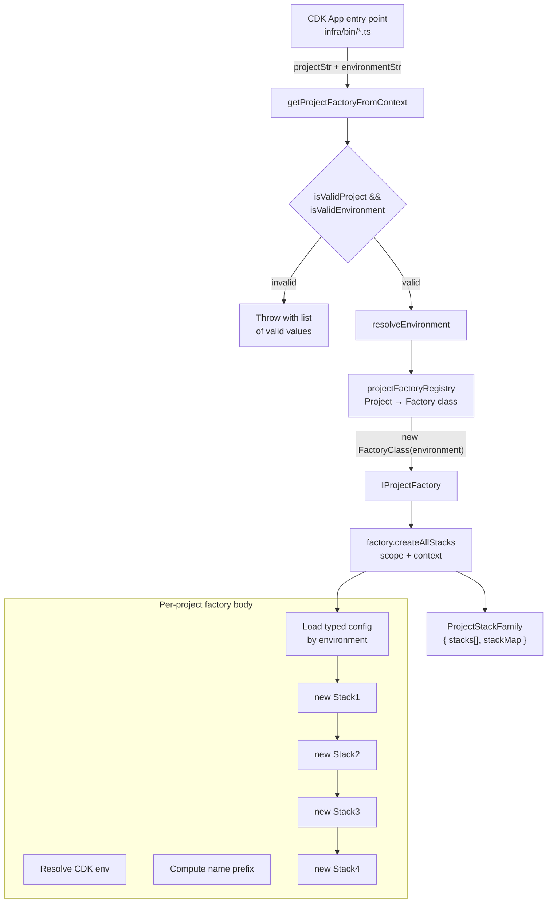

## Overview

The platform's CDK app entry point doesn't instantiate stacks
directly. It calls into a **project factory registry** which maps a
`(project, environment)` pair to a typed factory class. Each
factory owns its own context resolution (VPC lookup, env vars,
secrets) and returns a `ProjectStackFamily` — the set of stacks
that comprise the project
([infra/lib/factories/project-interfaces.ts:1-9](../../infra/lib/factories/project-interfaces.ts#L1-L9)).

Two project factories exist today: `BedrockProjectFactory`
(4 stacks — Data + Kb + Agent + Api) and `SelfHealingProjectFactory`
(2 stacks — Gateway + Agent). Both implement the same
`IProjectFactory<TContext>` interface; both are registered in a
single map; the entry point dispatches via the registry.

This is **the canonical L3 composition pattern** in this CDK
codebase — multiple L2/L1 constructs composed into a project,
projects composed into the app via a registry, environment
resolution at the entry-point boundary only.

## When to apply

**Use this pattern when:**

- A logical "project" requires **more than one CDK stack** with
  inter-stack dependencies (e.g. Bedrock's `Data → Kb → Agent → Api`
  chain).
- Each project's stacks share **environment-specific configuration**
  (dev/staging/prod) that the factory should resolve uniformly.
- Multiple projects exist and the entry point shouldn't grow a
  per-project switch statement.

**Do not apply when:**

- The project is a single stack. The factory layer is ceremony with
  no return.
- The project's stacks are unrelated to each other. Use independent
  CDK apps instead.

## Structure



### `IProjectFactory<TContext>` interface

The factory contract
([infra/lib/factories/project-interfaces.ts:42-62](../../infra/lib/factories/project-interfaces.ts#L42-L62)):

```ts
export interface IProjectFactory<TContext extends ProjectFactoryContext = ProjectFactoryContext> {
    readonly project: Project;
    readonly environment: Environment;
    readonly namespace: string;
    createAllStacks(scope: cdk.App, context: TContext): ProjectStackFamily;
}
```

Three load-bearing properties:

- **Typed `TContext`.** Each factory declares its own extended
  context. `BedrockFactoryContext` adds `agentInstruction` and
  `foundationModel` override fields ([projects/bedrock/factory.ts:51-56](../../infra/lib/projects/bedrock/factory.ts#L51-L56));
  `SelfHealingFactoryContext` adds just `foundationModel` ([projects/self-healing/factory.ts:42-44](../../infra/lib/projects/self-healing/factory.ts#L42-L44)).
  The base context type allows arbitrary string-keyed overrides
  ([project-interfaces.ts:16-23](../../infra/lib/factories/project-interfaces.ts#L16-L23))
  so the registry can store heterogeneous factories.
- **`namespace` is computed at construction time.** Each factory
  reads it from `getProjectConfig(Project.X).namespace` so renames
  happen in one place.
- **`createAllStacks(scope, context)`** is the single entry point.
  No public constructor parameters for individual stacks; the
  factory body composes them in order.

### `ProjectFactoryContext` — environment + arbitrary overrides

The base context interface
([project-interfaces.ts:16-23](../../infra/lib/factories/project-interfaces.ts#L16-L23)):

```ts
export interface ProjectFactoryContext {
    readonly environment: Environment;
    readonly [key: string]: unknown;
}
```

`[key: string]: unknown` is the **deliberate-loose** part. It lets
each project's extended context add fields without changing the base.
Tests pass partial overrides (`{ environment: 'dev',
foundationModel: 'test-model' }`); the production entry point passes
the resolved environment with no overrides.

### `ProjectStackFamily` — the return type

```ts
export interface ProjectStackFamily {
    readonly stacks: cdk.Stack[];
    readonly stackMap: Record<string, cdk.Stack>;
}
```

Two views of the same data:

- `stacks[]` — deterministic order matching the factory's
  composition. Useful for snapshot tests + CDK diff iteration.
- `stackMap` — name-keyed access for cross-stack lookups in tests.

### The registry — `projectFactoryRegistry`

A single source of truth for project-to-factory mapping
([infra/lib/factories/project-registry.ts:15-19](../../infra/lib/factories/project-registry.ts#L15-L19)):

```ts
const projectFactoryRegistry: Record<Project, ProjectFactoryConstructor> = {
    [Project.BEDROCK]: BedrockProjectFactory,
    [Project.SELF_HEALING]: SelfHealingProjectFactory,
};
```

`Project` is a TypeScript `enum` (defined in
[infra/lib/config/projects.ts](../../infra/lib/config/projects.ts)).
The registry uses **`Record<Project, …>`** rather than
`Record<string, …>` so the type system enforces exhaustiveness —
adding a `Project.MONITORING` enum value without a corresponding
registry entry is a compile error.

`getProjectFactoryFromContext(projectStr, environmentStr)` is the
**entry-point boundary** ([project-registry.ts:34-49](../../infra/lib/factories/project-registry.ts#L34-L49)):

1. Validate `projectStr` is a recognised `Project`; throw with the
   list of valid options if not.
2. Validate `environmentStr`; throw with valid options if not.
3. Resolve the typed `Environment`.
4. Look up the factory class.
5. `new FactoryClass(environment)` returns the typed `IProjectFactory`.

The CDK app's `bin/` entry point reads `process.env` for project +
environment, calls this function, and calls `createAllStacks` on the
result. **No project-specific logic at the entry point.**

### Two concrete factories on develop

**`BedrockProjectFactory`** — 4-stack composition
([infra/lib/projects/bedrock/factory.ts](../../infra/lib/projects/bedrock/factory.ts)):

| Order | Stack | Purpose |
| -: | :- | :- |
| 1 | `BedrockDataStack` | S3 bucket for KB sources, customer-managed KMS key, 4 Application Inference Profiles |
| 2 | `BedrockKbStack` | Bedrock Knowledge Base backed by Pinecone, Titan Embeddings v2 |
| 3 | `BedrockAgentStack` | Bedrock Agent + Guardrail + Agent Alias |
| 4 | `BedrockApiStack` | API Gateway + chatbot Lambdas (chatbot + chatbot-public + chatbot-authenticated) |

The Data stack is the only stateful one — explicitly designed to
outlive the others
([projects/bedrock/factory.ts:7-10](../../infra/lib/projects/bedrock/factory.ts#L7-L10)).

**`SelfHealingProjectFactory`** — 2-stack composition
([infra/lib/projects/self-healing/factory.ts](../../infra/lib/projects/self-healing/factory.ts)):

| Order | Stack | Purpose |
| -: | :- | :- |
| 1 | `SelfHealingGatewayStack` | AgentCore MCP Gateway + Cognito + 10 tool Lambdas + 1 Application Inference Profile |
| 2 | `SelfHealingAgentStack` | Bedrock ConverseCommand agent Lambda + 2 DynamoDB tables + SQS FIFO + SNS topic |

The Gateway must be deployed first so the Agent stack can resolve
its SSM exports — the factory enforces this order by calling them
sequentially within `createAllStacks`.

## Implementation in this codebase

| Concern | Location |
| :- | :- |
| `IProjectFactory<TContext>` interface | [infra/lib/factories/project-interfaces.ts](../../infra/lib/factories/project-interfaces.ts) |
| `projectFactoryRegistry` | [infra/lib/factories/project-registry.ts:15-19](../../infra/lib/factories/project-registry.ts#L15-L19) |
| Entry-point dispatcher | [infra/lib/factories/project-registry.ts:34-49](../../infra/lib/factories/project-registry.ts#L34-L49) |
| `BedrockProjectFactory` | [infra/lib/projects/bedrock/factory.ts](../../infra/lib/projects/bedrock/factory.ts) |
| `SelfHealingProjectFactory` | [infra/lib/projects/self-healing/factory.ts](../../infra/lib/projects/self-healing/factory.ts) |
| `Project` enum + config | [infra/lib/config/projects.ts](../../infra/lib/config/projects.ts) |
| `Environment` enum + resolver | [infra/lib/config/environments.ts](../../infra/lib/config/environments.ts) |

## Tradeoffs

**Why a registry, not a `switch` on project name.** The
`Record<Project, ProjectFactoryConstructor>` type forces exhaustive
coverage — adding a new project enum value without registering a
factory is a TypeScript error. A `switch` statement defaults to
"fall through silently" or "throw at runtime"; the registry
default is "fail at compile time." For a CDK codebase where the
cost of a misconfigured deploy is high, compile-time exhaustiveness
is worth the registry's modest indirection.

**Why one factory class per project, not a configurable factory.**
A single `GenericProjectFactory` that takes `stacks: StackSpec[]` as
a constructor argument was considered. Rejected because:

- Per-project factories let each declare its **typed extended
  context** (Bedrock's `agentInstruction` vs Self-Healing's plain
  `foundationModel`). A generic factory would lose this typing.
- The **inter-stack dependency** logic (Data → Kb → Agent → Api) is
  expressed naturally as imperative code in `createAllStacks`. A
  generic factory's `StackSpec[]` would need to encode dependencies
  declaratively, reintroducing complexity.
- Project-specific factories let each project's directory
  (`projects/bedrock/`, `projects/self-healing/`) own its config +
  factory + tests in one place.

**Context flexibility via `[key: string]: unknown`.** Loose typing
on the base context lets the registry hold heterogeneous factories
without `any`. The cost is that each factory's `createAllStacks`
has to assume its context is the right shape (the typed `TContext`
generic is what enforces this on the caller side). In practice this
works because the entry-point dispatcher is the only caller passing
contexts, and it doesn't add unknown fields.

**Heavy ordering inside `createAllStacks`.** The factory's body is
~100+ lines of `new XStack(scope, id, { … })` calls with explicit
dependencies between them. This **is** the project's composition
graph — there isn't a more concise representation that preserves
the per-stack typed props. The trade is readability over brevity:
the factory reads as a literal description of what gets created.

## Deeper detail

- [docs/concepts/bedrock-rag-surface.md](bedrock-rag-surface.md) —
  what the Bedrock 4-stack composition produces at runtime
- [docs/concepts/self-healing-agent.md](self-healing-agent.md) —
  what the Self-Healing 2-stack composition produces at runtime
- [docs/concepts/application-inference-profile.md](application-inference-profile.md)
  — the custom L2 construct instantiated by both factories' stacks
- [docs/patterns/composition-root.md](../patterns/composition-root.md)
  — the *application-side* analogue of this pattern (one wiring
  file per service); both apply the same dependency-injection
  principle at different layers

## Related concepts

- [docs/patterns/hexagonal-rds-architecture.md](../patterns/hexagonal-rds-architecture.md)
  — the runtime-side counterpart: interfaces are bound to Rds-
  implementations at the composition root; here, stacks are
  bound to a project at the factory.

<!--
Evidence trail (auto-generated):
- Source: infra/lib/factories/project-interfaces.ts (read in full on 2026-05-27)
- Source: infra/lib/factories/project-registry.ts (read in full on 2026-05-27)
- Source: infra/lib/projects/bedrock/factory.ts (lines 40-120 on 2026-05-27)
- Source: infra/lib/projects/self-healing/factory.ts (lines 1-50 on 2026-05-27)
- Source: infra/lib/stacks/bedrock/data-stack.ts (referenced from concept docs prior session)
- Source: infra/lib/stacks/self-healing/gateway-stack.ts (referenced from concept docs prior session)
-->
