> **Consumer relocated (2026-07-18):** the ReadmeParser this doc
> describes as the consumer of `prose_safe` used to live in a
> standalone `applications/tech-extractor/` service. That service has
> been retired; the parser now runs in-process inside
> `applications/ingestion/src/facts/` as part of the unified ingestion
> Job. See [docs/concepts/tech-extractor-architecture.md](tech-extractor-architecture.md)
> for the retirement note. Nothing about the `prose_safe` gating
> mechanism itself changed — only where the consumer runs.

## Overview

The `technology_aliases.prose_safe` column records whether an alias is
safe to substring-match against arbitrary English. The
[ProseSafeTagger](../../applications/ontology-importer/src/categorization/ProseSafeTagger.ts)
uses Bedrock Converse + Claude Haiku 4.5 with a calibrated few-shot
prompt to classify every alias as `yes` / `no` / `maybe`, persisted as
`true` / `false` / `null` on the column
([applications/ontology-importer/src/categorization/ProseSafeTagger.ts:151-156](../../applications/ontology-importer/src/categorization/ProseSafeTagger.ts#L151-L156)).
This is the boundary control that lets the
[tech-extractor](tech-extractor-architecture.md) scan free-form prose
without producing false positives every time an English sentence
contains "go", "rust", "next" or "swift".

It is the **bootstrap** for ReadmeParser v2 — the parser itself does
not know about prose_safe; it consumes a `ReadonlySet<string>` of
already-safe aliases passed by the caller
(`ontologyRepo.loadProseSafeAliases()`,
[applications/ingestion/src/facts/run-facts-stage.ts:227](../../applications/ingestion/src/facts/run-facts-stage.ts#L227)).

## How it works

```mermaid
flowchart LR
    Tag[run-tag-aliases-prose-safe<br/>K8s Job] --> Q[Query: WHERE prose_safe IS NULL]
    Q --> Each[For each alias]
    Each --> Build[buildConverseRequest<br/>system + few-shot + tool_use]
    Build --> Bedrock[Bedrock Converse<br/>claude-haiku-4-5]
    Bedrock --> Parse[parseConverseResponse<br/>extract tag_alias toolUse]
    Parse --> Coerce[verdictToProseSafe<br/>yes→true / no→false / maybe→null]
    Coerce --> Write[(UPDATE technology_aliases<br/>SET prose_safe = ?)]
    Write -.-> Reader[tech-extractor reads<br/>WHERE prose_safe = true]
    Reader --> ScanProse[scanProseRanges]
```



### The calibration prompt

The system prompt embeds **15 worked examples** — 5 obviously-safe, 5
obviously-unsafe, 5 edge cases — that establish the safety boundary
([ProseSafeTagger.ts:36-92](../../applications/ontology-importer/src/categorization/ProseSafeTagger.ts#L36-L92)).
Calibration anchors the verdict in concrete cases rather than the
model's general intuition:

| Verdict | Examples |
| :- | :- |
| `yes` (safe) | `kubernetes`, `grafana`, `prometheus`, `terraform`, `fastapi`, `@aws-sdk/client-s3`, `kube-prometheus-stack`, `pgvector`, `argocd`, `cloudflare` |
| `no` (unsafe) | `go`, `js`, `ts`, `py`, `sh`, `tf`, `s3`, `ec2`, `acm`, `alb` |
| `no` (edge) | `react`, `next`, `swift`, `rust`, `spark` |

The "edge" group is load-bearing. A naïve model might tag `react` as
safe because it is a famous technology. The few-shot teaches that
the question is *not* "is this a technology?" but "does substring-matching
this against English produce false positives?" — and `react` is a
common verb that does.

### Cloud-prefix compounds (post-F4)

After the F4 bigram scanner shipped, the system prompt was updated
to handle compound forms differently
([ProseSafeTagger.ts:48-58](../../applications/ontology-importer/src/categorization/ProseSafeTagger.ts#L48-L58)).
Aliases matching the regex `^(aws|amazon|azure|google|gcp|apache)_`
are tagged `yes` unconditionally because the only way the
[tech-extractor's bigram scanner](tech-extractor-architecture.md)
ever matches them is when the source prose contains the literal
two-word phrase (`aws bedrock`, `azure sql`). They cannot match
arbitrary English.

This is the **calibration-as-code** pattern: when the parser's matching
rule changed (single-token → prefix-guarded bigram), the calibration
prompt followed. The two are deliberately co-evolved.

### Tool-use enforcement

The Bedrock request configures `toolChoice: { tool: { name: 'tag_alias' } }`
([ProseSafeTagger.ts:128-130](../../applications/ontology-importer/src/categorization/ProseSafeTagger.ts#L128-L130))
which forces the model to emit a `tag_alias` tool call rather than
free-form text. The tool's input schema rejects anything outside
`['yes', 'no', 'maybe']`
([ProseSafeTagger.ts:96-105](../../applications/ontology-importer/src/categorization/ProseSafeTagger.ts#L96-L105)):

```ts
prose_safe: { type: 'string', enum: ['yes', 'no', 'maybe'] },
reasoning: { type: 'string', maxLength: 200 },
```

`temperature: 0` and `maxTokens: 200` keep the call deterministic and
cheap; the entire job for the current ontology is hundreds of dollars
of inference cost, not thousands.

### Pure-function shell

The class deliberately separates pure functions from the SDK shell so
the tests do not need a Bedrock mock:

| Function | Purity | Role |
| :- | :- | :- |
| `buildConverseRequest(item)` | Pure | Build the request body |
| `parseConverseResponse(resp)` | Pure | Extract `tag_alias` from the toolUse blocks |
| `verdictToProseSafe(v)` | Pure | `yes→true / no→false / maybe→null` |
| `ProseSafeTagger.tag(item)` | Side-effecting | The SDK call only |

The pure functions are exercised by
[ProseSafeTagger.test.ts](../../applications/ontology-importer/src/categorization/ProseSafeTagger.test.ts);
the class itself is exercised in integration tests with a real
Converse call against a recorded fixture.

### Idempotent re-tagging

`run-tag-aliases-prose-safe.ts` scans `WHERE prose_safe IS NULL`, so
running it repeatedly only processes aliases that have not yet been
classified
([applications/ontology-importer/src/run-tag-aliases-prose-safe.ts](../../applications/ontology-importer/src/run-tag-aliases-prose-safe.ts)).
This preserves any manual overrides written to the column (e.g. the
post-F4 backfill `UPDATE … SET prose_safe = true WHERE alias ~
'^(aws|amazon|azure|google|gcp|apache)_'` described in the
[decommission appendix](../../applications/ingestion/docs/tech-extractor/parity/2026-05-27-decommission.md)).

## Implementation in this codebase

| Concern | Location |
| :- | :- |
| Tagger class + few-shot prompt | [applications/ontology-importer/src/categorization/ProseSafeTagger.ts](../../applications/ontology-importer/src/categorization/ProseSafeTagger.ts) |
| Job entry point | [applications/ontology-importer/src/run-tag-aliases-prose-safe.ts](../../applications/ontology-importer/src/run-tag-aliases-prose-safe.ts) |
| Schema migration | [applications/platform-rds-bootstrap/migrations/037_alias_prose_safe.sql](../../applications/platform-rds-bootstrap/migrations/037_alias_prose_safe.sql) |
| Consumer (parser) | [applications/ingestion/src/facts/extractors/iac/ReadmeParser.ts](../../applications/ingestion/src/facts/extractors/iac/ReadmeParser.ts) |
| Caller wiring (load-and-pass) | [applications/ingestion/src/facts/run-facts-stage.ts](../../applications/ingestion/src/facts/run-facts-stage.ts) |
| Tests (pure functions) | [applications/ontology-importer/src/categorization/ProseSafeTagger.test.ts](../../applications/ontology-importer/src/categorization/ProseSafeTagger.test.ts) |

## Tradeoffs

**Why Claude Haiku 4.5 instead of Sonnet.** The task is a per-alias
binary classification with a strong calibration. Haiku is roughly
3× cheaper per token at similar accuracy on simple-categorisation
tasks. The full ontology (thousands of aliases) tags in under an
hour for tens of dollars rather than hundreds.

**Why `maybe → null` rather than `maybe → false`.** A `maybe` verdict
keeps the alias out of the prose-safe set (the parser only matches
`prose_safe = true`), so behaviour is identical to `false` for the
matching pipeline. The distinction matters for review: `null` means
"the model declined to commit, look at this manually"; `false` means
"the model judged it unsafe, the system has acted on that judgement."
Conflating them would obscure the cases that benefit from human
review.

**Why an LLM for the boundary at all.** This is the converse argument
to [ADR 0001](../decisions/0001-deterministic-over-llm-extraction.md):
the *extraction* path is deterministic, but the *calibration* of which
aliases enter that path is an open-ended linguistic judgement that an
LLM does well and a parser cannot do at all. The LLM cost lives at
the boundary, runs once per ontology revision, and produces a stable
artefact (a column value) that the hot path reads.

**Calibration drift is a real risk.** When the parser's matching rule
changes, the prompt's calibration must change with it. The post-F4
prompt update is the worked example
([ProseSafeTagger.ts:48-58](../../applications/ontology-importer/src/categorization/ProseSafeTagger.ts#L48-L58));
without that update, the F4 bigrams would have continued to be
rejected by `prose_safe = false` rows even though the parser's rule
had become safe. **Treat the prompt as code under change control.**

## Deeper detail

- [docs/concepts/tech-extractor-architecture.md](tech-extractor-architecture.md)
  — the consumer of `prose_safe = true`. Read together for the full
  prose-safety story.
- [docs/decisions/0001-deterministic-over-llm-extraction.md](../decisions/0001-deterministic-over-llm-extraction.md)
  — the parity story. The F4 bigram path that motivated the post-decommission
  prompt update lives in the appendix.
- (planned) docs/concepts/ontology-resolver.md — the resolver that
  consumes the alias table; explains the strict-lookup semantics.

## Related concepts

- [self-healing-agent](self-healing-agent.md) — also a Bedrock
  ConverseCommand caller, also using tool-use to force structured
  output. Different surface (open agentic loop vs single-call
  classification), same primitives.

<!--
Evidence trail (auto-generated):
- Source: applications/ontology-importer/src/categorization/ProseSafeTagger.ts (read in full on 2026-05-27)
- Source: applications/ontology-importer/src/run-tag-aliases-prose-safe.ts (referenced on 2026-05-27)
- Source: applications/platform-rds-bootstrap/migrations/037_alias_prose_safe.sql (referenced on 2026-05-27)
- Source: applications/ingestion/src/facts/extractors/iac/ReadmeParser.ts (read on 2026-07-18)
- Source: applications/ingestion/src/facts/run-facts-stage.ts (line 227 on 2026-07-18)
- Source: applications/ingestion/docs/tech-extractor/parity/2026-05-27-decommission.md (appendix on 2026-05-27)
- Commits: 9a4bae9, 71853a6
-->
