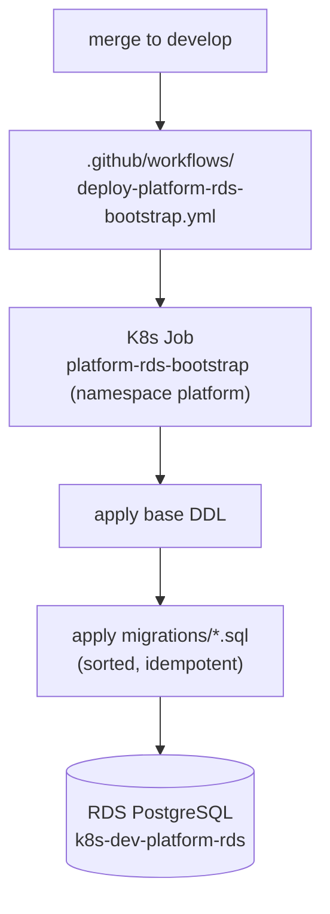

## Overview

All RDS PostgreSQL schema is created by the `platform-rds-bootstrap` service — a
one-shot Kubernetes Job that applies a base DDL block and then every numbered
migration file in order. It is the single source of truth for the database schema.
Each migration is applied **exactly once**, tracked by a checksummed
`schema_migrations` ledger
([ADR 0010](../decisions/0010-checksummed-migration-ledger.md)). The earlier
re-apply-every-boot model and why it was replaced are recorded in
[ADR 0009](../decisions/0009-idempotent-re-apply-bootstrap.md) (superseded).

## How tables are created

`runBootstrap(pool)` delegates to `applyMigrations(client)`, which
([bootstrap.ts](../../applications/platform-rds-bootstrap/src/bootstrap.ts)):

1. Applies a single base **DDL** string that creates the core tables, extensions
   (`pgvector`, `uuid-ossp`), and the `tucaken_app` role
   ([bootstrap.ts:24-293](../../applications/platform-rds-bootstrap/src/bootstrap.ts#L24-L293)),
   and ensures the `schema_migrations` ledger table.
2. Loads every `.sql` in `migrations/` and, for each, consults the ledger:

```ts
const ledger = await loadLedger(client);              // name → checksum
for (const { name, sql } of migrations) {
    const decision = decideMigration(checksum(sql), ledger.get(name));
    if (decision === 'skip')   continue;              // already applied, unchanged
    if (decision === 'reject') throw new Error(...);  // edited historical migration
    await client.query(sql);                          // apply once…
    await recordMigration(client, name, checksum(sql)); // …then record
}
```

`loadMigrations()` reads the directory, filters `.sql`, and **sorts lexically** —
so the numeric prefix (`001_…`, `002_…`, … `081_…`) defines apply order
([bootstrap.ts:295-307](../../applications/platform-rds-bootstrap/src/bootstrap.ts#L295-L307)).

## The ledger — apply once, reject edited history

`schema_migrations(name PRIMARY KEY, checksum, applied_at)` records every applied
migration by name + SHA-256 of its SQL. The pure `decideMigration()` decides per
file: never-applied → **apply**; applied with the same checksum → **skip**; applied
with a different checksum → **reject** (a historical migration was edited — add a
new one instead). When the ledger is adopted on a database the old runner already
populated, the existing migrations are **baselined** (recorded as applied without
re-running them), so a non-idempotent historical migration never re-runs — see
[ADR 0010](../decisions/0010-checksummed-migration-ledger.md). Migrations remain
written idempotently (`CREATE TABLE IF NOT EXISTS`, etc.) as defence in depth.

## Where the schema lives

- Base tables: the DDL string in `bootstrap.ts`.
- Everything else: `applications/platform-rds-bootstrap/migrations/*.sql` — **80
  files, latest `081_projects_product_description.sql`**.



## Who runs it

A one-time Kubernetes Job (`k8s/bootstrap-job.yaml`, namespace `platform`,
`generateName: platform-rds-bootstrap-ondemand-`) connects directly to RDS using
the `platform-rds-credentials` / `platform-rds-config` secrets and runs the
compiled bootstrap. It is deployed by
`.github/workflows/deploy-platform-rds-bootstrap.yml` on merge to develop. Because
the run is idempotent, re-running it is safe.

## Implementation in this codebase

| Concern | Location |
| :- | :- |
| Runner + base DDL | `applications/platform-rds-bootstrap/src/bootstrap.ts` |
| Migrations (source of truth) | `applications/platform-rds-bootstrap/migrations/*.sql` |
| K8s Job | `applications/platform-rds-bootstrap/k8s/bootstrap-job.yaml` |
| Deploy | `.github/workflows/deploy-platform-rds-bootstrap.yml` |

## Tradeoffs

The checksummed ledger applies each migration once, makes data-only migrations
safe, and turns an accidental edit to a shipped migration into a clear error
instead of a silent re-apply. The cost is ledger state to keep with the DB and a
one-time baseline on adoption — both handled by the runner. The full trade is in
[ADR 0010](../decisions/0010-checksummed-migration-ledger.md); the prior
no-ledger model it replaced is [ADR 0009](../decisions/0009-idempotent-re-apply-bootstrap.md).

## Related concepts

- [user-scoped-tables](user-scoped-tables.md) — what the schema contains
- [per-transaction-rls](../patterns/per-transaction-rls.md) — how user isolation is enforced
- [ADR 0010 — checksummed migration ledger](../decisions/0010-checksummed-migration-ledger.md)
- [ADR 0009 — idempotent re-apply bootstrap](../decisions/0009-idempotent-re-apply-bootstrap.md) (superseded)

<!--
Evidence trail (auto-generated):
- Source: applications/platform-rds-bootstrap/src/bootstrap.ts (read on 2026-06-16, lines 295-335)
- Source: applications/platform-rds-bootstrap/migrations/030_projects.sql:22, 044_enable_project_features.sql:10 (read on 2026-06-16)
- Source: applications/platform-rds-bootstrap/k8s/bootstrap-job.yaml (confirmed on 2026-06-16)
- Source: .github/workflows/deploy-platform-rds-bootstrap.yml (confirmed on 2026-06-16)
-->
