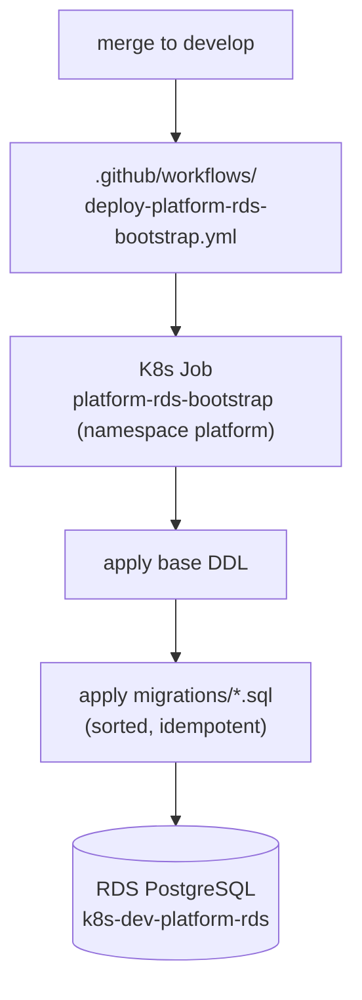

## Overview

All RDS PostgreSQL schema is created by the `platform-rds-bootstrap` service — a
one-shot Kubernetes Job that applies a base DDL block and then every numbered
migration file in order. It is the single source of truth for the database schema.
The model is **re-apply-every-boot, idempotent** — there is no migration ledger;
see [ADR 0009](../decisions/0009-idempotent-re-apply-bootstrap.md) for that
decision and its trade-offs.

## How tables are created

`runBootstrap(pool)` does two things, in order
([bootstrap.ts:323-335](../../applications/platform-rds-bootstrap/src/bootstrap.ts#L323-L335)):

1. Applies a single base **DDL** string that creates the core tables, extensions
   (`pgvector`, `uuid-ossp`), and the `tucaken_app` role
   ([bootstrap.ts:24-293](../../applications/platform-rds-bootstrap/src/bootstrap.ts#L24-L293)).
2. Loads every `.sql` in `migrations/` and applies each:

```ts
await client.query(DDL);
const migrations = loadMigrations();      // readdir + .sql + .sort()
for (const { name, sql } of migrations) {
    await client.query(sql);              // applied in lexical order, no ledger
}
```

`loadMigrations()` reads the directory, filters `.sql`, and **sorts lexically** —
so the numeric prefix (`001_…`, `002_…`, … `081_…`) defines apply order
([bootstrap.ts:295-307](../../applications/platform-rds-bootstrap/src/bootstrap.ts#L295-L307)).

## Idempotence is in the SQL, not the runner

There is no `schema_migrations` table and no checksum tracking — every migration is
applied on every boot. Correctness depends entirely on each file being idempotent:
`CREATE TABLE IF NOT EXISTS`, `ADD COLUMN IF NOT EXISTS`, `DROP POLICY IF EXISTS` +
`CREATE POLICY`, and `DO $$ … IF EXISTS … END$$` guards. Two migrations record the
model explicitly
([030_projects.sql:22](../../applications/platform-rds-bootstrap/migrations/030_projects.sql#L22),
[044_enable_project_features.sql:10](../../applications/platform-rds-bootstrap/migrations/044_enable_project_features.sql#L10)).
The risk this carries (a non-idempotent migration re-running, a changed historical
migration going undetected) is the subject of
[ADR 0009](../decisions/0009-idempotent-re-apply-bootstrap.md).

## Where the schema lives

- Base tables: the DDL string in `bootstrap.ts`.
- Everything else: `applications/platform-rds-bootstrap/migrations/*.sql` — **80
  files, latest `081_projects_product_description.sql`**.



## Who runs it

A one-time Kubernetes Job (`k8s/bootstrap-job.yaml`, namespace `platform`,
`generateName: platform-rds-bootstrap-ondemand-`) connects directly to RDS using
the `platform-rds-credentials` / `platform-rds-config` secrets and runs the
compiled bootstrap. It is deployed by
`.github/workflows/deploy-platform-rds-bootstrap.yml` on merge to develop. Because
the run is idempotent, re-running it is safe.

## Implementation in this codebase

| Concern | Location |
| :- | :- |
| Runner + base DDL | `applications/platform-rds-bootstrap/src/bootstrap.ts` |
| Migrations (source of truth) | `applications/platform-rds-bootstrap/migrations/*.sql` |
| K8s Job | `applications/platform-rds-bootstrap/k8s/bootstrap-job.yaml` |
| Deploy | `.github/workflows/deploy-platform-rds-bootstrap.yml` |

## Tradeoffs

A re-apply-every-boot runner has zero ledger state to drift or repair, and a fresh
DB and an existing DB take the identical code path. The cost is that every
migration must stay perfectly idempotent forever, boot time grows with the file
count, and an accidental edit to an old migration is re-applied silently — the
trade [ADR 0009](../decisions/0009-idempotent-re-apply-bootstrap.md) records.

## Related concepts

- [user-scoped-tables](user-scoped-tables.md) — what the schema contains
- [per-transaction-rls](../patterns/per-transaction-rls.md) — how user isolation is enforced
- [ADR 0009 — idempotent re-apply bootstrap](../decisions/0009-idempotent-re-apply-bootstrap.md)

<!--
Evidence trail (auto-generated):
- Source: applications/platform-rds-bootstrap/src/bootstrap.ts (read on 2026-06-16, lines 295-335)
- Source: applications/platform-rds-bootstrap/migrations/030_projects.sql:22, 044_enable_project_features.sql:10 (read on 2026-06-16)
- Source: applications/platform-rds-bootstrap/k8s/bootstrap-job.yaml (confirmed on 2026-06-16)
- Source: .github/workflows/deploy-platform-rds-bootstrap.yml (confirmed on 2026-06-16)
-->
