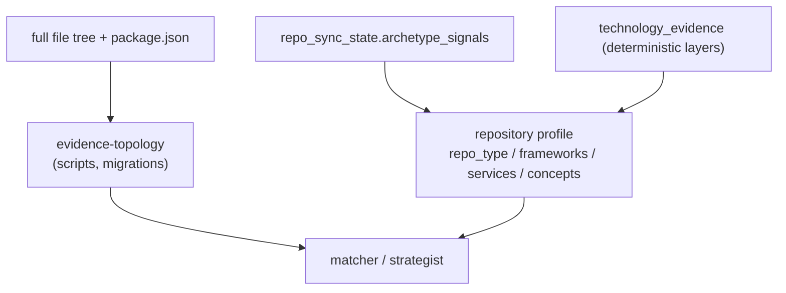

## Overview

Before any LLM sees a repository, the platform derives deterministic, high-signal
facts about it: what kind of repo it is, what it actually uses, and whether it
shows engineering rigour. These deterministic signals — evidence topology plus a
repository identity — let the matcher and strategist reason about "this repo *is*
the EKS infra" instead of a bag of isolated tech names, and reward real evidence
(a test script, a migrations folder) over README claims.

## Evidence topology — facts, not claims

`evidence-topology.ts` derives repo facts from the **full file tree + parsed
`package.json`**, before any LLM call — no I/O, no clock, no randomness. It is
evidence (real files + manifest scripts), never README assertions
([evidence-topology.ts:1-14](../../applications/shared/src/projects/evidence-topology.ts#L1-L14)). It
closes two gaps that path-only archetype signals miss:

- **`package.json` scripts** — a real `test` / `lint` / `build` / `typecheck`
  script is manifest evidence of engineering rigour, stronger than a README claim.
- **Database migrations** — detected generically across ecosystems (raw SQL,
  Prisma, TypeORM, Sequelize, Knex, Drizzle, node-pg-migrate, Alembic, Django,
  Rails, Flyway, Liquibase, Go migrate/goose/atlas, dbmate, EF Core, Laravel,
  Phinx, migrate-mongo) — not one user's SQL layout.

## Repository profile — a repo identity

`repo-profile.ts` assembles a repo-level **identity** from two already-stored
deterministic sources: archetype signals (`repo_sync_state.archetype_signals`, a
folder-structure scan) and the code-derived tech set (`technology_evidence`
deterministic layers, via `TechnologyOntologyRepository.loadRepoCodeTech`)
([repo-profile.ts:1-14](../../applications/job-strategist/src/ats/repo-profile.ts#L1-L14)).

The output per repo is a `repo_type`, the `frameworks` and `services` it actually
uses, and higher-level `concepts` — e.g. an infra repo resolves to
`{ type: cdk-infra, frameworks: [aws cdk], services: [aws eks, …], concepts:
[provisions-managed-kubernetes] }`. The matcher can then say "this repo IS the EKS
infra" rather than listing "cdk, eks, typescript".

## Implementation in this codebase

| Concern | File |
| :- | :- |
| Evidence topology (scripts, migrations) | `applications/shared/src/projects/evidence-topology.ts` |
| Repository identity | `applications/job-strategist/src/ats/repo-profile.ts` |
| Strategy / phasing | [docs/repository-profile-strategy.md](../repository-profile-strategy.md), [docs/evidence-provenance-strategy.md](../evidence-provenance-strategy.md) |

## Tradeoffs

Deriving signals deterministically (no LLM, no README trust) makes them
reproducible and resistant to doc drift — a repo that *claims* tests in its README
but has no test script gets no rigour credit. The cost is breadth: generic
migration/script detection must enumerate ecosystems explicitly, and a genuinely
novel layout can be missed until its pattern is added. Reducing a repo to a single
identity aids reasoning but flattens nuance, mitigated by keeping the raw
`frameworks`/`services`/`concepts` arrays alongside the `repo_type`.

## Deeper detail

- [profile-intelligence](profile-intelligence.md) — aggregates per-repo profiles into the user rollup
- [skill-evidence-ledger](skill-evidence-ledger.md) — consumes code-derived evidence
- [evidence-provenance-strategy](../evidence-provenance-strategy.md) — the provenance/data-quality phasing

## Related concepts

- [anti-hallucination-guards](../patterns/anti-hallucination-guards.md)

<!--
Evidence trail (auto-generated):
- Source: applications/shared/src/projects/evidence-topology.ts (read on 2026-06-16, lines 1-14)
- Source: applications/job-strategist/src/ats/repo-profile.ts (read on 2026-06-16, lines 1-14)
-->
