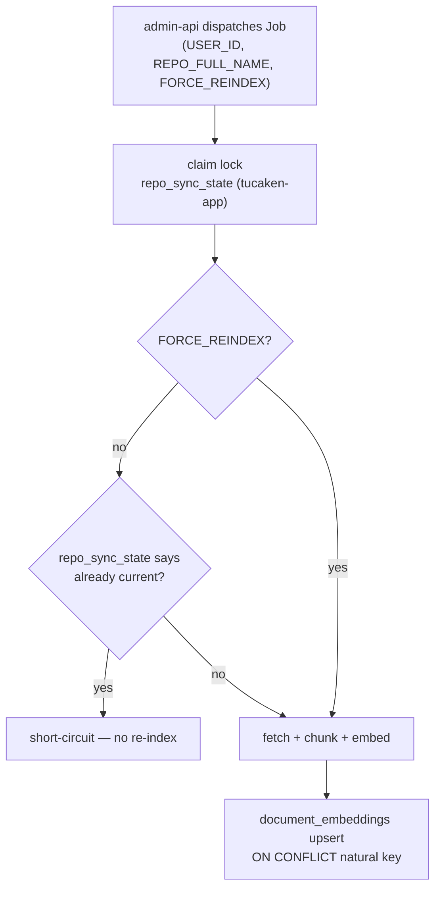

## Overview

A "sync" runs the ingestion K8s Job for one `(userId, repoFullName)` pair. A
"resync" is the same Job run again — triggered by a repo push, a reinstall, or a
user action. Two mechanisms keep resyncs safe and cheap: a short-circuit that skips
unchanged repos, a `FORCE_REINDEX` override, and row-level idempotency so a re-run
overwrites rather than duplicates.

## First sync vs resync

The Job is identical for both; only the prior `repo_sync_state` differs. On a first
sync there is no prior state, so it runs fully. On a resync the Job consults
`repo_sync_state` and short-circuits when nothing warrants re-indexing — unless
`FORCE_REINDEX` is set
([ingestion env contract](../projects/ingestion.md)).

## The claim lock (dispatcher side)

Before the Job is even created, the dispatcher (sibling `tucaken-app` admin-api)
takes a race-free claim on `repo_sync_state` with a single
`INSERT … ON CONFLICT … DO UPDATE … WHERE sync_status NOT IN ('pending','syncing')`,
plus a 30-minute push debounce. This prevents two concurrent Jobs for the same
repo. That logic is documented in `tucaken-app`; this repo provides the Job that
runs once the claim is held.

## FORCE_REINDEX

`FORCE_REINDEX=true` skips the `repo_sync_state` short-circuit, forcing a full
re-index even if the repo looks current. It is set on GitHub App reinstall (the
installation token changed and the prior state may be stale). Absent or `false`,
the Job honours the short-circuit. The flag is part of the env contract the Job
parses ([env.ts](../../applications/ingestion/src/env.ts);
[ingestion.md](../projects/ingestion.md)).

## Idempotency — row-level upsert, no incremental diff yet

A sync fetches the repo's files and re-embeds them; **there is no blob-SHA or
commit-watermark incremental file diff** in the current ingestion path. Idempotency
comes from the embedding store instead: `document_embeddings` has the natural key
`(user_id, repo_full_name, file_path, chunk_index)`, so a re-run **upserts** each
chunk (ON CONFLICT) rather than duplicating it
([003_cognito_user_provisioning.sql:53-54](../../applications/platform-rds-bootstrap/migrations/003_cognito_user_provisioning.sql#L53-L54)).
An incremental sync that fetches only changed blobs (by commit watermark + blob
SHA) is a planned follow-up, not current behaviour.

## Implementation in this codebase

| Concern | File |
| :- | :- |
| Job entrypoint + short-circuit | `applications/ingestion/src/run-ingestion.ts` |
| Env contract (`FORCE_REINDEX`) | `applications/ingestion/src/env.ts` |
| Row-level idempotency (natural key) | `migrations/003_cognito_user_provisioning.sql` |
| Claim lock + debounce (dispatcher) | sibling `tucaken-app` admin-api (documented there) |

## Tradeoffs

Re-fetching and re-embedding the whole repo on every resync is simple and correct
(the upsert guarantees no duplicates) but costs GitHub fetches and Titan
embeddings proportional to repo size, every time — the motivation for the planned
incremental sync. The short-circuit + 30-minute debounce bound how often a push
storm can trigger work, at the cost of a small staleness window. `FORCE_REINDEX`
is the escape hatch when the short-circuit's "already current" judgement is wrong
(e.g. a reinstall).

## Related concepts

- [github-app-connection](github-app-connection.md)
- [file-ingestion-strategy](file-ingestion-strategy.md)
- [ingestion-storage-schema](ingestion-storage-schema.md)

<!--
Evidence trail (auto-generated):
- Source: applications/ingestion/src/run-ingestion.ts (read on 2026-06-16)
- Source: applications/ingestion/src/env.ts (via ingestion.md env contract, 2026-06-16)
- Source: applications/platform-rds-bootstrap/migrations/003_cognito_user_provisioning.sql (read on 2026-06-16, lines 53-54)
- Note: no incremental blob-SHA diff exists in the ingestion path as of 2026-06-16 (planned follow-up).
-->
