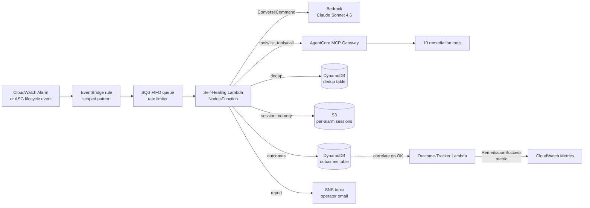
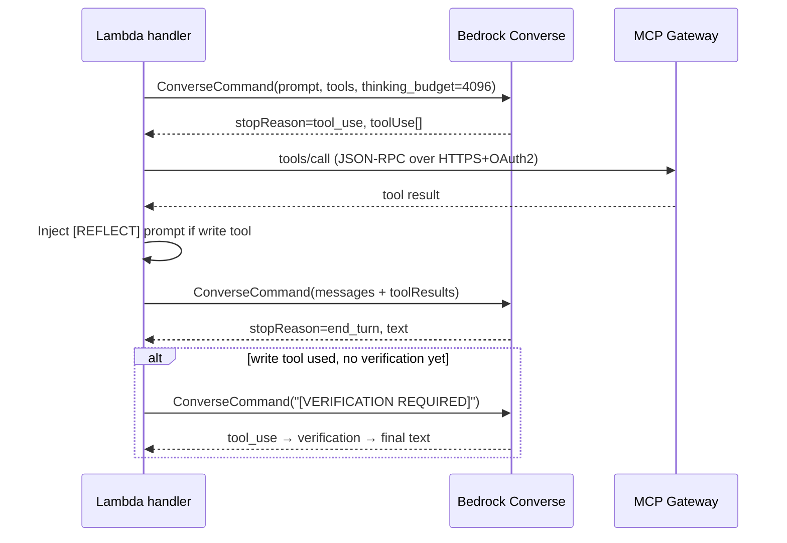

## Overview

The self-healing agent is a production Lambda that consumes scoped
CloudWatch Alarms and EC2 Auto Scaling lifecycle events and decides
how to remediate the underlying infrastructure problem. It runs a
Bedrock `ConverseCommand` loop with dynamic tool discovery against an
MCP Gateway, so the catalogue of remediation actions can be added or
removed without redeploying the agent
([applications/self-healing/src/index.ts:5-25](../../applications/self-healing/src/index.ts#L5-L25)).

The agent is the closed-loop counterpart to the rest of the
ai-applications platform: ingestion, article-pipeline, job-strategist,
and chatbot push *content* through Bedrock; self-healing pushes
*operational state* through it. It is opt-out destructive — every
deployment defaults to `DRY_RUN=true`
([applications/self-healing/src/index.ts:67-69](../../applications/self-healing/src/index.ts#L67-L69)).

## How it works

The Lambda is wrapped in `withSpan('self-healing.handler', …)`
so every invocation produces an OpenTelemetry span even when ADOT
auto-instrumentation skips the entrypoint
([applications/self-healing/src/index.ts:1472-1477](../../applications/self-healing/src/index.ts#L1472-L1477)).
The in-app `correlationId` (`sh-{epoch}-{rand}`) is the primary trace
key, used across S3 session keys and the DynamoDB dedup record;
`trace_id` is the cross-service pivot for Grafana.

### Event → prompt path

The handler accepts CloudWatch Alarm state-changes (`source: aws.cloudwatch`)
and Auto Scaling lifecycle events (`source: aws.autoscaling`). Each
event class has its own prompt template
([applications/self-healing/src/index.ts:448-538](../../applications/self-healing/src/index.ts#L448-L538));
ASG events additionally branch on whether the affected ASG is a
worker pool or a control-plane node, by matching `-general-pool-` or
`-monitoring-pool-` in the ASG name
([applications/self-healing/src/index.ts:487-509](../../applications/self-healing/src/index.ts#L487-L509)).

User-controlled fields (alarm name, state reason, ASG cause) are
sanitised before interpolation: control characters stripped, length
capped, and seven prompt-injection patterns (`ignore previous
instructions`, `[INST]`, `<|`, `|>`, etc.) replaced with `[REDACTED]`
([applications/self-healing/src/index.ts:404-436](../../applications/self-healing/src/index.ts#L404-L436)).
A `[WARN] Prompt injection pattern detected` log line is emitted
whenever a redaction occurs.

### Bootstrap-aware prompt augmentation

When an alarm name matches one of four bootstrap patterns
(`bootstrap-orchestrator`, `ssm-automation`, `step-function`,
`k8s-bootstrap`), the prompt is augmented with a six-step diagnostic
playbook covering inspect → diagnose → classify → remediate → verify
→ post-bootstrap health
([applications/self-healing/src/index.ts:918-985](../../applications/self-healing/src/index.ts#L918-L985)).
This converts an open-ended "alarm fired, do something" prompt into a
constrained workflow the model follows deterministically — and embeds
hard-won operational knowledge (e.g. "empty IPAllowList sourceRanges
immediately after bootstrap is EXPECTED behaviour — the PostSync
patcher Job fills them in after ArgoCD sync completes") directly in
the prompt rather than relying on the model to recall it.

### Agent loop

The loop is bounded by three hard limits, each labelled in the source
with an SH-Cn / SH-Rn control identifier:

| Control | Limit | Purpose |
| :- | :- | :- |
| `MAX_ITERATIONS` | 10 | Prevent runaway agent loops ([index.ts:99](../../applications/self-healing/src/index.ts#L99)) |
| `MAX_TOKENS_PER_INVOCATION` (SH-C1) | 20,000 | Hard per-invocation token cap ([index.ts:101-102](../../applications/self-healing/src/index.ts#L101-L102)) |
| `MAX_HISTORY_MESSAGES` (SH-C2) | 12 | Sliding-window truncation keeps the original prompt + last 11 turns ([index.ts:104-105](../../applications/self-healing/src/index.ts#L104-L105)) |

When the token gate fires mid-loop, the function returns the partial
assistant text prefixed with `[TOKEN GATE]` rather than truncating
silently
([applications/self-healing/src/index.ts:1094-1108](../../applications/self-healing/src/index.ts#L1094-L1108)).

Extended Thinking is enabled with a per-iteration budget of 4,096
tokens (SH-R1)
([applications/self-healing/src/index.ts:110-120](../../applications/self-healing/src/index.ts#L110-L120)).
Thinking blocks are filtered out of assistant content before the
message is appended to the conversation history, so they do not
pollute subsequent turns or count against the sliding window
([applications/self-healing/src/index.ts:1074-1078](../../applications/self-healing/src/index.ts#L1074-L1078)).

### Write-and-verify enforcement

Tools are partitioned into three classes
([applications/self-healing/src/index.ts:129-144](../../applications/self-healing/src/index.ts#L129-L144)):

- **Read tools** (the default): inspect cluster, diagnose alarms,
  fetch SSM-stored diagnostic JSON.
- **Write tools** (SH-R3): only `remediate_node_bootstrap` triggers a
  Step Functions bootstrap orchestrator that mutates infrastructure
  state.
- **Verification tools** (SH-R4): `inspect_workloads`,
  `check_node_health`, `analyse_cluster_health`.

Two reflection mechanisms surround every write:

1. **Immediate reflection (SH-R3)** — after the tool result is appended
   to the conversation, a `[REFLECT]` prompt is injected asking the
   model to assess success or failure before proceeding
   ([applications/self-healing/src/index.ts:1185-1190](../../applications/self-healing/src/index.ts#L1185-L1190)).
2. **Verification enforcement (SH-R4)** — if the model attempts to
   produce a final response while `writeToolInvoked && !verificationPerformed`,
   the loop injects a `[VERIFICATION REQUIRED]` prompt forcing at
   least one verification tool call before the report is allowed
   ([applications/self-healing/src/index.ts:1210-1232](../../applications/self-healing/src/index.ts#L1210-L1232)).
   The flag `verificationEnforced` guards against infinite loops if
   the model still refuses to verify.

### Dynamic tool discovery

At every cold start the Lambda calls `tools/list` on the MCP Gateway
([applications/self-healing/src/index.ts:651-705](../../applications/self-healing/src/index.ts#L651-L705)).
If the Gateway is unreachable, returns no tools, or times out (10 s),
the agent falls back to a hardcoded default set of 10 tools
([applications/self-healing/src/index.ts:777-898](../../applications/self-healing/src/index.ts#L777-L898))
so a Gateway outage degrades capability but does not break the agent.

Gateway calls use OAuth2 client-credentials against a Cognito user
pool. The client secret is resolved once at cold start via
`DescribeUserPoolClient` and cached for the container lifetime; access
tokens are refreshed when within 60 seconds of expiry
([applications/self-healing/src/index.ts:563-637](../../applications/self-healing/src/index.ts#L563-L637)).

### Idempotency

Two layers protect against duplicate alarm deliveries:

1. **In-memory cache** keyed by `alarmName#eventTime`, capped at 100
   entries with a 5-minute window
   ([applications/self-healing/src/index.ts:318-360](../../applications/self-healing/src/index.ts#L318-L360)).
2. **DynamoDB conditional put (SH-S4)** — `attribute_not_exists(dedupKey)`
   makes the first writer win across cold starts and concurrent
   containers; a `ConditionalCheckFailedException` is the duplicate
   signal
   ([applications/self-healing/src/index.ts:363-388](../../applications/self-healing/src/index.ts#L363-L388)).

### Session memory

Per-alarm session records are written to S3 under
`sessions/{sanitised-alarm-name}/{ISO-timestamp}.json` after every
successful invocation
([applications/self-healing/src/index.ts:1409-1428](../../applications/self-healing/src/index.ts#L1409-L1428)).
On the next invocation for the same alarm, the most recent record is
loaded and injected into the prompt under a `PREVIOUS REMEDIATION
ATTEMPT (do NOT repeat the same actions)` block
([applications/self-healing/src/index.ts:1439-1456](../../applications/self-healing/src/index.ts#L1439-L1456)).
This prevents the agent from infinitely re-running the same failing
remediation across a flapping alarm.

### Outcome correlation

A second Lambda, the outcome-tracker
([applications/self-healing/src/outcome-tracker.ts](../../applications/self-healing/src/outcome-tracker.ts)),
subscribes to ALARM → OK transitions and queries the outcomes
DynamoDB table for a matching invocation within a 30-minute look-back
window. It emits `RemediationSuccess=1` or `RemediationFailure=0`
into the `SelfHealing` CloudWatch namespace, giving a measurable
"did the agent actually fix things" KPI rather than only counting
invocations.

## Implementation in this codebase

| Concern | Location |
| :- | :- |
| Handler | [applications/self-healing/src/index.ts](../../applications/self-healing/src/index.ts) |
| Outcome tracker | [applications/self-healing/src/outcome-tracker.ts](../../applications/self-healing/src/outcome-tracker.ts) |
| Tool sources (built into the MCP Gateway) | [applications/self-healing/src/tools/](../../applications/self-healing/src/tools/) — 10 sub-directories, one per tool |
| Lambda + queues + DynamoDB + alarms (CDK) | [infra/lib/stacks/self-healing/agent-stack.ts](../../infra/lib/stacks/self-healing/agent-stack.ts) |
| AgentCore Gateway (CDK) | [infra/lib/stacks/self-healing/gateway-stack.ts](../../infra/lib/stacks/self-healing/gateway-stack.ts) |

The CDK stack provisions: a `NodejsFunction` (esbuild-bundled
TypeScript), an SQS FIFO trigger queue with a FIFO DLQ as rate
limiter, two DynamoDB tables (dedup + outcomes), an EventBridge rule
scoped to specific alarm patterns, an SNS topic with an
EmailSubscription for operator notifications, a SecureString SSM
parameter for the system prompt, and a `MonthlyTokenBudgetAlarm`
backed by `logs.MetricFilter` extractions of `inputTokens` /
`outputTokens` from the structured log lines
([infra/lib/stacks/self-healing/agent-stack.ts:349-370, 630](../../infra/lib/stacks/self-healing/agent-stack.ts#L349-L370)).

## Tradeoffs

**Why an agent at all?** Two alternatives were considered: (1) classic
Step Functions runbooks per failure class, and (2) a Bedrock Agent
with action groups. (1) is brittle — every new failure pattern
requires a code change, and the diagnostic step is exactly the kind of
"read these five signals, classify, and act" work LLMs are good at.
(2) was rejected because Bedrock Agents bake the tool catalogue into
the agent definition; the MCP-native approach lets the Gateway evolve
independently, and `tools/list` discovery means a new tool ships by
deploying the gateway, not the agent Lambda. The decommissioning of
`BedrockChunkEnricher` informed this — see
[ADR: deterministic over LLM extraction](../decisions/0001-deterministic-over-llm-extraction.md)
*(planned)* for the converse argument: not every problem should be
agentic.

**Cost ceiling vs autonomy.** The hard 20k token gate per invocation
plus the 4,096-token thinking budget per iteration cap a single
remediation at roughly `(20k + 10 × 4k) × $cost-per-token`. Combined
with the SQS FIFO rate limiter, this puts a predictable upper bound
on what a stuck alarm can cost. The MonthlyTokenBudgetAlarm closes
the loop at the account level. The tradeoff is that a genuinely hard
incident may hit the gate before the agent reaches a conclusion;
the partial-result response (prefixed `[TOKEN GATE]`) is still
returned and published to SNS so operators can take over.

**DRY_RUN default.** `DRY_RUN=true` is the default, meaning the
deployed agent will propose remediation but not invoke
`remediate_node_bootstrap`. Operators flip to `DRY_RUN=false` once
they trust the prompt + tool surface for a given environment. The
cost is that a fully autonomous remediation requires explicit
opt-in per environment; the benefit is that a misconfigured prompt
cannot trigger Step Functions in prod by accident.

**S3 session memory vs vector store.** Session records are stored as
plain JSON, listed by lexicographic key (ISO timestamps sort
naturally), with the most recent loaded on the next invocation. A
vector-store approach (e.g. pgvector against the existing semantic
cache) would enable cross-alarm recall — "we had a similar problem on
node X last week" — but adds embedding cost on every save and ties
the agent to the relational stack. Per-alarm JSON is sufficient for
the current scope (one alarm = one root cause to remember) and keeps
the Lambda dependency surface to just AWS SDKs.

## Deeper detail

- [docs/projects/self-healing.md](../projects/self-healing.md)
  — service-level README: deploy story, environment variables,
  monitoring dashboard links.
- [docs/runbooks/self-healing-token-budget.md](../runbooks/self-healing-token-budget.md)
  — what to do when `MonthlyTokenBudgetAlarm` fires (operator actions,
  forced-disable procedure).
- [docs/troubleshooting/self-healing-stuck-remediation.md](../troubleshooting/self-healing-stuck-remediation.md)
  — diagnosing a flapping alarm: inspecting the dedup table, reading
  session memory, manually clearing state.
- [docs/concepts/mcp-gateway-integration.md](mcp-gateway-integration.md)
  — the AgentCore Gateway side: Cognito M2M, `tools/list` JSON-RPC,
  per-tool source layout.
- [docs/decisions/0001-deterministic-over-llm-extraction.md](../decisions/0001-deterministic-over-llm-extraction.md)
  — the converse case: where LLM-based approaches were *removed* from
  the platform (see also [tech-extractor parity artefacts](../../applications/ingestion/docs/tech-extractor/parity/2026-05-27-decommission.md)).

## Related concepts

- [Three-tier caching](caching-tiers.md) *(planned)* — explains the
  `RedisExactCache` and `pg-semantic-cache` primitives used elsewhere
  in the platform. The self-healing agent deliberately does *not*
  use either; each invocation is one-shot.
- Domain glossary: [CONTEXT.md](../../CONTEXT.md).

<!--
Evidence trail (auto-generated):
- Source: applications/self-healing/src/index.ts (read on 2026-05-27)
- Source: applications/self-healing/src/outcome-tracker.ts (read on 2026-05-27, lines 1-40)
- Source: infra/lib/stacks/self-healing/agent-stack.ts (resource grep on 2026-05-27, lines 263-763)
- Source: infra/lib/stacks/self-healing/gateway-stack.ts (resource grep on 2026-05-27, lines 130-1215)
- Cross-ref: kb-discovery report .claude/skills/kb-discovery/reports/2026-05-27-ai-applications.md (entry: "Self-healing Bedrock agent")
-->
