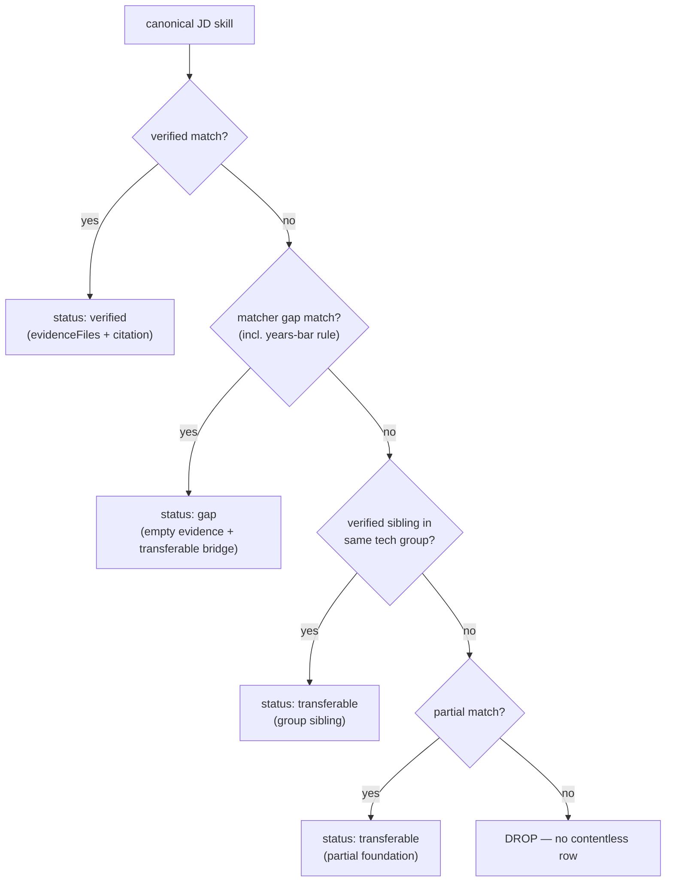

## Overview

The Skill Evidence Ledger is the deterministic core of the JD strategist's
"what your repos actually prove" panel. For each skill a job description
requires, it produces one file-cited row classifying the candidate's evidence
as **verified**, **transferable**, or **gap** — never inventing evidence, and
never masking a real gap. It is pure, deterministic, and unit-tested; no LLM is
involved in the ledger itself
([skill-evidence-ledger.ts:18](../../applications/job-strategist/src/ats/skill-evidence-ledger.ts#L18)).

It exists to keep the resume honest: recruiters and ATS filters reward keywords,
which pushes resumes toward unverifiable claims. The ledger grounds every skill
in concrete repository evidence and is explicit about what the candidate cannot
yet prove.

## The single source of truth — canonical JD skills

The ledger does not invent its own notion of "what the JD needs". It keys off one
canonical, deduped skill list derived once from the `jd-extractor` signal:
`canonicalJdSkills()` collapses `requiredSkills` + the technology inventory
(tools / languages / frameworks / infrastructure / methodologies) + the legacy
`tools` field + `preferredSkills` into one ordered, case-insensitively deduped
list, required/inventory first
([canonical-jd-skills.ts:42-64](../../applications/job-strategist/src/ats/canonical-jd-skills.ts#L42-L64)).

The matcher (research agent) is **assessment-only** over this same list — it
emits exactly one verdict per canonical skill, and unassessed skills are filled
as honest gaps. So the matcher's verified/partial/gap universe *is* the canonical
list, and the ledger covers everything the matcher assessed by iterating the
canonical list once
([skill-evidence-ledger.ts:153-167](../../applications/job-strategist/src/ats/skill-evidence-ledger.ts#L153-L167)).

## How resolution works

`buildSkillEvidenceLedger(tools, matching, opts)` iterates the canonical list and
resolves each skill to at most one row, with two layers of dedupe: an exact-label
set and a matched-assessment set so two canonical labels that fuzzy-match the same
underlying assessment (e.g. "OpenAI" and "OpenAI API") yield a single row
([skill-evidence-ledger.ts:169-187](../../applications/job-strategist/src/ats/skill-evidence-ledger.ts#L169-L187)).

`resolveLedgerEntry()` applies a fixed precedence
([skill-evidence-ledger.ts:113-151](../../applications/job-strategist/src/ats/skill-evidence-ledger.ts#L113-L151)):

Matching is "semantic-ish": bidirectional literal match OR significant
token-overlap, so differently-phrased competencies bridge (e.g. "Critical
thinking and root cause analysis" ↔ "…root-cause analysis")
([skill-evidence-ledger.ts:24-31](../../applications/job-strategist/src/ats/skill-evidence-ledger.ts#L24-L31)).

## The honesty model

Three rules keep the ledger from over- or under-claiming
([skill-evidence-ledger.ts:11-16](../../applications/job-strategist/src/ats/skill-evidence-ledger.ts#L11-L16)):

- **Gaps win over transferable.** The matcher's gaps are the authoritative
  "what's missing", so a gapped skill stays a gap — but it keeps its transferable
  foundation as a *bridge* rather than being silently upgraded
  ([skill-evidence-ledger.ts:120-128](../../applications/job-strategist/src/ats/skill-evidence-ledger.ts#L120-L128)).
- **The years bar is never transferable.** A years-of-experience requirement
  (e.g. "8+ years …") maps to a years gap even when the wording differs, so the
  hard experience bar can never read as "transferable"
  ([skill-evidence-ledger.ts:74-78](../../applications/job-strategist/src/ats/skill-evidence-ledger.ts#L74-L78)).
- **No contentless rows.** A canonical skill that matches nothing the matcher
  assessed is dropped, not shown as an empty row
  ([skill-evidence-ledger.ts:147-150](../../applications/job-strategist/src/ats/skill-evidence-ledger.ts#L147-L150)).

## Source-lane provenance

After the ledger is built, each row is tagged with where its evidence came from.
`classifyLanes()` credits the **repo** lane for any file-backed evidence (the
concrete code path — the lead signal), the **project** lane when the evidence
prose names a documented project case study (written context), and the
**career** lane when it names a résumé company or title
([evidence-lane.ts:56-77](../../applications/job-strategist/src/ats/evidence-lane.ts#L56-L77)).
The pipeline attaches lanes after code evidence is attached, in
`run-pipeline.ts`.

## Implementation in this codebase

| Concern | File |
| :- | :- |
| Canonical JD skill list | `applications/job-strategist/src/ats/canonical-jd-skills.ts` |
| Ledger build + resolution | `applications/job-strategist/src/ats/skill-evidence-ledger.ts` |
| Source-lane classification | `applications/job-strategist/src/ats/evidence-lane.ts` |
| Wiring (canonical → ledger → code evidence → lanes) | `applications/job-strategist/src/run-pipeline.ts` |

The strategist pipeline computes `ledgerTools = canonicalJdSkills(jdExtraction)`,
builds the ledger, attaches code evidence, then attaches source lanes — so the
donut "Skill coverage" (matcher verdicts) and the "Evidence coverage" (ledger)
reconcile by construction.

## Tradeoffs

Keying everything off one canonical list trades a little flexibility (the ledger
cannot surface a skill the JD read didn't name) for full reconciliation between
the matcher's verdicts and the evidence panel — eliminating the earlier
"18 skills vs 11 evidence rows" divergence that came from two independent JD
reads. Determinism (no LLM in the ledger) trades nuance for reproducibility,
testability, and zero hallucination risk on the highest-stakes honesty surface.

## Deeper detail

- (planned) docs/concepts/jd-read-centralisation.md — one canonical JD read feeding matcher + ledger + ATS, and why the dual-read was removed
- (planned) docs/decisions/0007-assessment-only-matcher.md — one verdict per canonical skill over free-form matching
- (planned) docs/concepts/source-lane-provenance.md — repo/project/career lane classification in depth

## Related concepts

- [multi-query retrieval](multi-query-retrieval.md)
- [filter-then-rank retrieval](filter-then-rank-retrieval.md) (planned)

<!--
Evidence trail (auto-generated):
- Source: applications/job-strategist/src/ats/skill-evidence-ledger.ts (read on 2026-06-16, lines 1-188)
- Source: applications/job-strategist/src/ats/canonical-jd-skills.ts (read on 2026-06-16, lines 1-64)
- Source: applications/job-strategist/src/ats/evidence-lane.ts (read/edited on 2026-06-16, lines 1-92)
- Source: applications/job-strategist/src/run-pipeline.ts (read on 2026-06-16, ledgerTools + attachSourceLanes wiring)
-->
