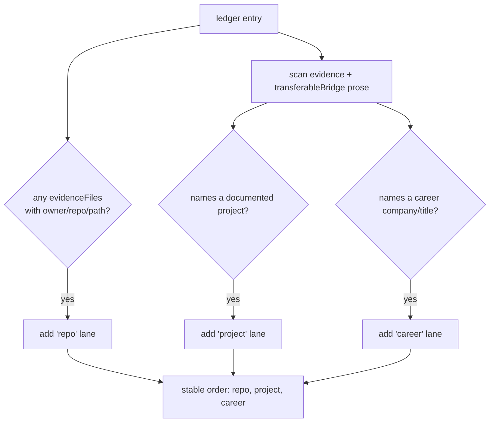

## Overview

Source-lane provenance tags each Skill Evidence Ledger row with *where* its
evidence came from: a **repo** lane (code), a **project** lane (a documented case
study), or a **career** lane (résumé history). It lets the UI show, per skill,
whether a claim is proven in code, described in a project write-up, or asserted
from work history. The classification is pure and deterministic — no LLM
([evidence-lane.ts:17](../../applications/job-strategist/src/ats/evidence-lane.ts#L17)).

## The three lanes — code leads, the rest add context

The design intent is that **code is the lead signal** and the write-up adds
context ([evidence-lane.ts:4-16](../../applications/job-strategist/src/ats/evidence-lane.ts#L4-L16)):

- **REPO** — any cited `owner/repo/path` file. The concrete code path, regardless
  of whether the repo is also catalogued as a project. This is the lead.
- **PROJECT** — a documented project case study named in the evidence *prose*.
  Written context that corroborates the code, never the lead.
- **CAREER** — a résumé company or job title named in the prose.

## How classification works

`classifyLanes()` runs two checks per entry
([evidence-lane.ts:56-77](../../applications/job-strategist/src/ats/evidence-lane.ts#L56-L77)):

A file's `owner/repo` is parsed by `repoOfFile()` (first two path segments)
([evidence-lane.ts:32-40](../../applications/job-strategist/src/ats/evidence-lane.ts#L32-L40)).
`attachSourceLanes()` maps the classifier over a ledger, adding `sourceLanes` only
to entries that classify to at least one lane and never mutating the input
([evidence-lane.ts:84-92](../../applications/job-strategist/src/ats/evidence-lane.ts#L84-L92)).

## Why code presence, not project linkage

An earlier version split code by *project linkage* — a file went to PROJECT if its
repo was catalogued as a project, else REPO. Because every indexed repo is
registered as a project, all code evidence routed to PROJECT and the REPO lane was
permanently empty ("0 Repos"). The redefinition makes any file-backed evidence
credit REPO; the PROJECT lane is now prose-only (a case study naming the work). So
"proven in code" and "described in a write-up" are cleanly separated, and a row
can legitimately carry both — `[repo, project, career]`, repo first.

## Implementation in this codebase

| Concern | File |
| :- | :- |
| Lane classification + `owner/repo` parse | `applications/job-strategist/src/ats/evidence-lane.ts` |
| Lane index (project names, career terms) load | `applications/shared/src/projects/project-evidence-block.ts` (`loadProjectLaneIndex`) |
| Wiring (after code evidence attach) | `applications/job-strategist/src/run-pipeline.ts` |

The pipeline calls `attachSourceLanes(ledgerWithCode, { projectNames, careerTerms })`
after code evidence is attached, so lanes reflect the final, code-cited ledger.

## Tradeoffs

Classifying by code presence rather than project linkage means a repo promoted to
a project still shows its code as REPO — which is the point: it answers "is this
proven in code?" not "is this catalogued?". Determinism (prose substring matching)
trades nuance for reproducibility and zero hallucination; the cost is that a
project mentioned by a synonym the index doesn't carry won't credit the project
lane, which is acceptable because the repo lane (the lead) is unaffected.

## Deeper detail

- [skill-evidence-ledger](skill-evidence-ledger.md) — the ledger these lanes annotate

## Related concepts

- [jd-read-centralisation](jd-read-centralisation.md)

<!--
Evidence trail (auto-generated):
- Source: applications/job-strategist/src/ats/evidence-lane.ts (read/edited on 2026-06-16, lines 1-92)
- Source: applications/job-strategist/src/run-pipeline.ts (read on 2026-06-16, attachSourceLanes wiring)
-->
