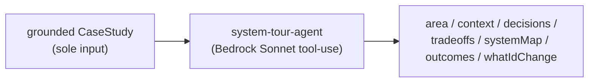

## Overview

A system tour re-projects a project's already-generated case study into the
narrative order a candidate would use in an architecture-review interview: area,
context, key decisions, tradeoffs, the system map, outcomes, and one genuinely-new
reflection — `whatIdChange`. It generates nothing new about the system; it
reframes verified material for a different audience, which keeps it honest while
making the same work presentable as a walkthrough.

## How it works

The system-tour agent runs Bedrock tool-use on Sonnet 4.6, one invocation per
project. Unlike the case-study agent, its **only** input is an already-generated,
already-grounded `CaseStudy` — that case study is the sole evidence source
([system-tour-agent.ts:1-9](../../applications/shared/src/projects/system-tour-agent.ts#L1-L9)).

## Honesty discipline

The honesty rules are asserted in the agent's tests
([system-tour-agent.ts:12-20](../../applications/shared/src/projects/system-tour-agent.ts#L12-L20)):

- Ground **every** element strictly in the provided case study — never introduce
  un-evidenced claims.
- `systemMap` must reuse the case study's `architecture` diagram verbatim — no new
  diagram is invented.

This is the defining property: because the tour can only reframe a case study that
was itself grounded in commits/PRs/files, the walkthrough inherits that grounding
and cannot drift into fabrication.

## Implementation in this codebase

| Concern | File |
| :- | :- |
| System-tour agent (Sonnet, case-study → tour) | `applications/shared/src/projects/system-tour-agent.ts` |
| Orchestration + persistence | `applications/shared/src/projects/system-tour-{orchestrator,persistence}.ts` |
| Types | `applications/shared/src/projects/system-tour-types.ts` |

## Tradeoffs

Constraining the input to a single grounded case study (rather than re-reading the
repos) makes the tour cheap, fast, and incapable of inventing un-evidenced claims —
at the cost of being only as good as the case study it reframes. Reusing the
architecture diagram verbatim avoids a second, possibly-inconsistent diagram, at
the cost of not tailoring the visual to the walkthrough's narrative order.

## Deeper detail

- [case-study-generation](case-study-generation.md) — produces the grounded case study this consumes
- [coach-stages](coach-stages.md) — the system-design coaching stage this complements

## Related concepts

- [project-clustering](project-clustering.md)

<!--
Evidence trail (auto-generated):
- Source: applications/shared/src/projects/system-tour-agent.ts (read on 2026-06-16, lines 1-20)
-->
