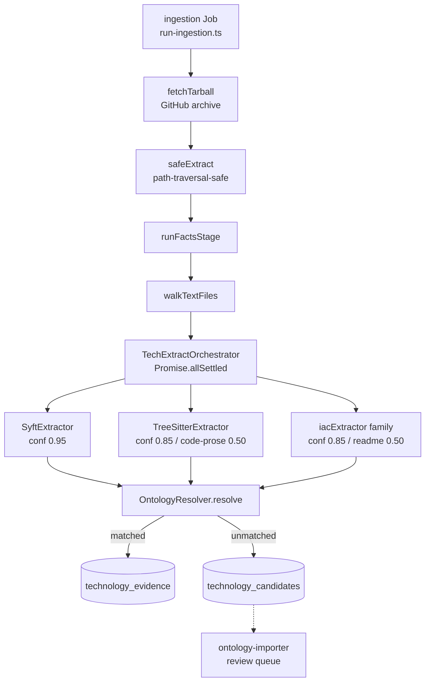

> **Now runs inside unified ingestion (2026-07-18).** The standalone
> `tech-extractor` Job, its Dockerfile and deploy workflow have been
> deleted. Everything below still describes *how the extraction
> works* — the extractor families, the ontology resolution, the
> source-layer confidence model — it just runs in-process inside the
> `ingestion` K8s Job's facts stage (`applications/ingestion/src/facts/`,
> entry point `runFactsStage`) instead of a sibling Job, dispatched
> whenever `UNIFIED_INGESTION=on` (the dispatched default). See
> [docs/projects/tech-extractor.md](../projects/tech-extractor.md) for
> the retirement note and the cutover history.

## Overview

`tech-extractor` is the deterministic pipeline that produces the
`technology_evidence` rows the rest of the platform takes as ground
truth for "what stacks does this repository use." It fetches a commit
tarball, walks it, runs three independent extractor families in
parallel, resolves every raw token through the
[OntologyResolver](../../applications/shared/src/) and persists one
row per occurrence with a confidence score derived from the extractor
that produced it
([applications/ingestion/src/facts/TechExtractOrchestrator.ts:37-79](../../applications/ingestion/src/facts/TechExtractOrchestrator.ts#L37-L79)).

As of [ADR 0001](../decisions/0001-deterministic-over-llm-extraction.md)
(2026-05-27) it is the **sole** source of truth for technologies; the
LLM `BedrockChunkEnricher` no longer extracts them.

## How it works



The trigger is the single `ingestion` K8s Job — there is no longer a
sibling Job. `runFactsStage` is called in-process from
`run-ingestion.ts` after the tarball is fetched and extracted, before
chunking proceeds.

### Extractor families and source-layer confidence

Six values of `source_layer` exist, each with a fixed confidence
([applications/shared/src/rds/types/techgraph.ts:3-12](../../applications/shared/src/rds/types/techgraph.ts#L3-L12)):

| `source_layer` | Confidence | Produced by | Signal |
| :- | -: | :- | :- |
| `syft` | 0.95 | SyftExtractor (SBOM) | Dependency manifest — strongest |
| `treesitter` | 0.85 | TreeSitterExtractor | Import statements / SDK call patterns |
| `iac` | 0.85 | iacExtractor (composite) | Structured IaC declarations |
| `dockerfile` | 0.80 | DockerfileParser | `FROM` / `RUN` directives |
| `readme` | 0.50 | ReadmeParser badges + prose | Shields.io badges, prose mentions |
| `code-prose` | 0.50 | CommentExtractor + scanProseRanges | Code comments, doc strings |

The CHECK constraint on the column enforces the value set
([applications/platform-rds-bootstrap/migrations/038_evidence_source_layer_code_prose.sql](../../applications/platform-rds-bootstrap/migrations/038_evidence_source_layer_code_prose.sql))
— `code-prose` was added by migration 038 to support the F2 detector
strengthening pass.

### TreeSitterExtractor — code and code-prose

Two passes over each source file:

1. **Imports / SDK calls.** Currently regex-driven
   (`extractImportsByRegex`,
   [applications/ingestion/src/facts/extractors/TreeSitterExtractor.ts:30](../../applications/ingestion/src/facts/extractors/TreeSitterExtractor.ts#L30))
   covering Python `import`, TS/JS `import`/`require`, with AWS SDK
   sub-token emission so `aws-cdk-lib/aws-ec2` and
   `@aws-sdk/client-ec2` both emit the token `ec2`
   ([TreeSitterExtractor.ts](../../applications/ingestion/src/facts/extractors/TreeSitterExtractor.ts)).
   The file is named "TreeSitter" because a later phase replaces the
   regex pass with `web-tree-sitter` AST traversal behind the same
   `Extractor` interface.
2. **Code-prose (F2).** `extractProseRanges` lifts comments and
   triple-quoted doc strings out of TypeScript/JavaScript/Python/Go
   source ([CommentExtractor.ts](../../applications/ingestion/src/facts/extractors/CommentExtractor.ts)),
   then `scanProseRanges` substring-matches against a caller-supplied
   set of prose-safe aliases.

### iacExtractor — one fault boundary, many parsers

A single `Extractor` instance dispatches by file shape inside its
`extract()` method
([applications/ingestion/src/facts/run-facts-stage.ts:169](../../applications/ingestion/src/facts/run-facts-stage.ts#L169),
function `iacExtractor` — folded into the unified facts stage's own
module, no longer a separate `run-tech-extract.ts` entry point).
The dispatch order is meaningful:

```text
Dockerfile               → parseDockerfile
.github/workflows/*.yml  → parseGithubActions
*.tf / *.hcl             → parseTerraform
Chart.yaml               → parseHelmChart
argocd-apps/*.yaml       → parseArgoApplication
values*.yaml             → parseHelmValues   (image: lines, monitoring umbrellas)
*.yaml / *.yml (other)   → parseK8sManifest  (structural)
README.md                → parseReadme + parseReadmeProse
```

Then, **regardless of which structural parser ran**, every YAML file is
re-scanned by:

- `parseK8sManifestValues` — ARN strings + ECR image URIs +
  AWS-bound annotation keys
- `scanProseRanges` on YAML comments (F3) — re-tagged as
  `source_layer: 'iac'`, `ecosystem: 'yaml-comment'` so the CHECK
  constraint stays satisfied without a migration.

This belt-and-braces ordering is *deliberate*: structural shape and
content carry different evidence; both are kept. The dispatch fix
that ensured `parseK8sManifestValues` always runs landed as commit
`ca34a64 fix(tech-extractor): always run parseK8sManifestValues on every YAML file`
(now folded into `iacExtractor` in
[applications/ingestion/src/facts/run-facts-stage.ts](../../applications/ingestion/src/facts/run-facts-stage.ts)).

### ReadmeParser v2 — prose with four mitigations

README/YAML-comment/code-prose scanning is the highest-risk path: free
English text contains tokens like "go", "rust", "react" that the
ontology must match exactly to identify a real technology — but those
same tokens are common English verbs. Four mitigations are layered
([applications/ingestion/src/facts/extractors/iac/ReadmeParser.ts](../../applications/ingestion/src/facts/extractors/iac/ReadmeParser.ts)):

1. **prose_safe filter (boundary).** `run-facts-stage.ts` loads only
   aliases tagged `prose_safe = true` from the ontology
   (`ontologyRepo.loadProseSafeAliases()`) and passes the Set to every
   prose scanner. The parser does not know about `prose_safe`; it
   consumes a `ReadonlySet<string>`.
2. **Length floor.** `opts.minAliasLength` (default 4) rejects 2–3-char
   aliases even if mis-tagged.
3. **Context-window scoring (v2.1).** Boost confidence when a
   category-related word (`dashboard`/`metrics`/`observability`/…)
   appears within N tokens of the match.
4. **Negation detection (v2.2 / F4).** Suppress matches whose
   surrounding sentence contains `not using` / `rejected` /
   `considered but` / `instead of`.

Plus the **F4 prefix-guarded bigram scanner** (cloud-prefix compounds:
`aws_*`, `amazon_*`, `azure_*`, `google_*`, `gcp_*`, `apache_*`) which
emits bigram canonicals like `aws_bedrock` only when the source prose
contains `aws bedrock` adjacent
([decommission artefact appendix](../../applications/ingestion/docs/tech-extractor/parity/2026-05-27-decommission.md)).

Across 120 manually-inspected rows (30 README + 30 code-prose + 30
YAML-comment + 30 bigram), the cumulative false-positive count is
0–3 (the 3 borderlines are all `aws_profile` matches referring to the
env var rather than a service).

### Orchestration — `Promise.allSettled` for fault isolation

`TechExtractOrchestrator.run`
([applications/ingestion/src/facts/TechExtractOrchestrator.ts:76-108](../../applications/ingestion/src/facts/TechExtractOrchestrator.ts#L76-L108))
fires every extractor as a settled promise. A single extractor crash
(out-of-memory tarball, malformed YAML, regex blow-up) is recorded
in `failedExtractors[]` and surfaced in the `unified_facts.complete`
structured log line
([applications/ingestion/src/run-ingestion.ts:861-867](../../applications/ingestion/src/run-ingestion.ts#L861-L867))
— the other extractors complete normally and the run still produces
evidence rows. There is no longer a dedicated Prometheus counter for
this (the standalone Job's `tech_extractor_extractor_failed_total`
metric was retired with it); grep the ingestion Job's logs for
`failedExtractors` instead — see
[docs/troubleshooting/tech-extractor-stuck-extraction.md](../troubleshooting/tech-extractor-stuck-extraction.md).

For each raw row:

- `OntologyResolver.resolve(raw_name)` returns a canonical
  `technologyId` or `null`.
- Matched rows accumulate in `evidence[]` for bulk
  `evidenceRepo.insertMany`.
- Unmatched rows are normalised
  (`raw.toLowerCase().replace(/[^a-z0-9]/g, '')`,
  [TechExtractOrchestrator.ts:38-40](../../applications/ingestion/src/facts/TechExtractOrchestrator.ts#L38-L40))
  and upserted into `technology_candidates` for the
  ontology-importer to review. This is how new technologies enter the
  ontology — not via a code change, but as a side-effect of every
  ingestion.

### Tarball safety

The extractor accepts an untrusted GitHub archive. `safeExtract`
guards against path-traversal (`../../etc/passwd`) and `MAX_TARBALL_BYTES`
(default 200 MB) caps decompression
([applications/ingestion/src/run-ingestion.ts:688](../../applications/ingestion/src/run-ingestion.ts#L688)).
Cleanup of the extraction directory (`cleanupUnifiedExtractDir`,
[applications/ingestion/src/run-ingestion.ts:724-727](../../applications/ingestion/src/run-ingestion.ts#L724-L727))
is a best-effort `fs.rm(..., { force: true }).catch(() => {})` — it
swallows a failed unlink rather than the standalone Job's old
deadline-guarded `withTimeout` teardown step; a hung filesystem call
would now be bounded only by the pod's own `activeDeadlineSeconds`,
not a dedicated per-step timer.

### Parity watchdog — retired, superseded by shadow-mode parity

`ParityReporter.computeParity`
([applications/ingestion/src/facts/parity/ParityReporter.ts](../../applications/ingestion/src/facts/parity/ParityReporter.ts))
is **no longer called anywhere** in the current pipeline — it was the
L1-vs-LLM watchdog against `BedrockChunkEnricher`'s free-text output,
which itself stopped emitting technologies at the 2026-05-27
decommission (see the code comment in
[run-facts-stage.ts](../../applications/ingestion/src/facts/run-facts-stage.ts)
explaining why it was removed rather than left to emit a permanently-empty
`recall`). Its replacement is a different comparison for a different
purpose: `computeLayerParity`
([applications/ingestion/src/facts/parity/layer-parity.ts](../../applications/ingestion/src/facts/parity/layer-parity.ts)),
which compares the legacy two-job path's persisted `technology_evidence`
rows against the unified job's in-memory rows, grouped by
`source_layer`, and writes to `unified_parity_runs` (migration 122).
It only runs when `UNIFIED_INGESTION=shadow` — the dispatched default
is `on`, so in production this comparator is not currently exercised
either; see `applications/ingestion/README.md`'s `UNIFIED_INGESTION`
table for why shadow mode has no live comparison target now that the
standalone tech-extract Job is gone.

## Implementation in this codebase

| Concern | Location |
| :- | :- |
| Entry point (K8s Job) | [applications/ingestion/src/run-ingestion.ts](../../applications/ingestion/src/run-ingestion.ts) (facts stage invoked in-process) |
| Facts stage | [applications/ingestion/src/facts/run-facts-stage.ts](../../applications/ingestion/src/facts/run-facts-stage.ts) |
| Orchestrator | [applications/ingestion/src/facts/TechExtractOrchestrator.ts](../../applications/ingestion/src/facts/TechExtractOrchestrator.ts) |
| Extractor interface | [applications/ingestion/src/facts/extractors/Extractor.ts](../../applications/ingestion/src/facts/extractors/Extractor.ts) |
| SBOM / dependency extractor | [applications/ingestion/src/facts/extractors/SyftExtractor.ts](../../applications/ingestion/src/facts/extractors/SyftExtractor.ts) |
| Code (imports + code-prose) | [applications/ingestion/src/facts/extractors/TreeSitterExtractor.ts](../../applications/ingestion/src/facts/extractors/TreeSitterExtractor.ts), [CommentExtractor.ts](../../applications/ingestion/src/facts/extractors/CommentExtractor.ts) |
| IaC family (10 parsers + 2 scanners) | [applications/ingestion/src/facts/extractors/iac/](../../applications/ingestion/src/facts/extractors/iac/) |
| Source-layer confidences | [applications/shared/src/rds/types/techgraph.ts](../../applications/shared/src/rds/types/techgraph.ts) |
| Source-layer CHECK constraint | [applications/platform-rds-bootstrap/migrations/038_evidence_source_layer_code_prose.sql](../../applications/platform-rds-bootstrap/migrations/038_evidence_source_layer_code_prose.sql) |
| Parity reporter (dead code, kept for reference) | [applications/ingestion/src/facts/parity/ParityReporter.ts](../../applications/ingestion/src/facts/parity/ParityReporter.ts) |
| Shadow-mode parity (shadow gate only) | [applications/ingestion/src/facts/parity/layer-parity.ts](../../applications/ingestion/src/facts/parity/layer-parity.ts) |
| Tarball safety | [applications/ingestion/src/acquisition/tarball/](../../applications/ingestion/src/acquisition/tarball/) |
| Metrics surface | No dedicated Prometheus metrics (the standalone Job's `tech_extractor_layer1_recall` Gauge and `tech_extractor_extractor_failed_total` Counter were retired with it). `failedExtractors[]` is logged on the `unified_facts.complete` structured log event — [run-ingestion.ts:861-867](../../applications/ingestion/src/run-ingestion.ts#L861-L867). |

## Tradeoffs

**Why one composite `iacExtractor` instead of one per shape.** The IaC
family contains 10 parsers + 2 universal scanners that all read text
files. Wiring each as a separate `Extractor` would multiply the file
walk by N. Folding them into a single extractor walks the file list
once and dispatches per-file; on extractor failure the whole IaC
family fails together (recorded as a single `failedExtractors[]`
entry) and the other two families (Syft, Tree-sitter) continue
normally. The cost is coarser failure granularity in metrics; the
benefit is one file walk and one read per file regardless of how many
parsers want to look at it.

**Why deterministic at all.** Captured in
[ADR 0001](../decisions/0001-deterministic-over-llm-extraction.md).
Reproducibility, cost, and parseable-residual were the three pressures.

**The carve-out is documented, not closed.** 80 LLM-only canonicals
remained at v2.4 — dominated by single-token identifiers (`bash`,
`curl`, `jwt`, `cors`, `pino`, `vite`, `yarn`) whose `prose_safe`
classification is a judgement call per token rather than a code
change. Closing them is bounded incremental work on the ontology
side, not the parser side. The decommission shipped before they were
closed because the operational pain of an LLM stream was higher than
the operational pain of a documented 80-token gap.

**Why YAML files get scanned twice.** Once structurally (K8s manifest /
Helm chart / Argo Application / Helm values), then unconditionally
again for ARNs, ECR URIs, AWS annotation keys, and YAML-comment
prose. The structural path catches *declarations* (image, kind,
metadata.annotations); the value scanner catches *strings* (ARNs,
ECR URIs) that appear in any YAML regardless of shape. Together they
cover the bucket-a residual (~50 of 89 at v2.3) that single-pass
parsing missed.

**Tree-sitter is currently regex.** The package is wired in
(`web-tree-sitter@^0.25.0`, still present in
[applications/ingestion/package.json](../../applications/ingestion/package.json))
and the file is named for the eventual AST pass, but the current
implementation is regex. A future phase replaces the body of
`extractImportsByRegex` with AST traversal behind the same
`Extractor` interface — no caller change required. The regex pass is
good enough for the present language coverage but blocks detection of
unusual import forms (dynamic `require`, `await import`, re-exports).

## Deeper detail

- [docs/decisions/0001-deterministic-over-llm-extraction.md](../decisions/0001-deterministic-over-llm-extraction.md)
  — the ADR. Pair-read for the why.
- [docs/concepts/prose-safe-alias-gating.md](prose-safe-alias-gating.md)
  — the `ProseSafeTagger` Bedrock-Converse-based bootstrap that
  populates `technology_aliases.prose_safe`, plus the F4 cloud-prefix
  calibration few-shot.
- [docs/concepts/ontology-resolver.md](ontology-resolver.md) — how a
  `raw_name` becomes a `canonical technologyId`, alias collision
  rules, per-ecosystem disambiguation.
- [docs/runbooks/tech-extractor-rerun.md](../runbooks/tech-extractor-rerun.md)
  — re-running the facts extractors for a user/repo after an ontology
  version bump.
- [docs/projects/tech-extractor.md](../projects/tech-extractor.md) —
  the retired service-level README, kept for historical reference.
- [docs/troubleshooting/tech-extractor-stuck-extraction.md](../troubleshooting/tech-extractor-stuck-extraction.md)
  — diagnosing a hung tarball, OOM extractor, extractor crash in the
  `ingestion` Job.
- [applications/ingestion/docs/tech-extractor/parity/2026-05-27-decommission.md](../../applications/ingestion/docs/tech-extractor/parity/2026-05-27-decommission.md)
  — measurement artefact: six-iteration trajectory, FP audit, bucket
  recount, residual classification.

## Related concepts

- [self-healing-agent](self-healing-agent.md) — the LLM-adopting
  counterpart. The pair demonstrates the heuristic in [ADR 0001](../decisions/0001-deterministic-over-llm-extraction.md).
- Domain glossary: [CONTEXT.md](../../CONTEXT.md).

<!--
Evidence trail (auto-generated):
- Source: applications/ingestion/src/facts/run-facts-stage.ts (read on 2026-07-18)
- Source: applications/ingestion/src/facts/TechExtractOrchestrator.ts (read on 2026-07-18)
- Source: applications/ingestion/src/facts/extractors/Extractor.ts (read on 2026-07-18)
- Source: applications/ingestion/src/facts/extractors/TreeSitterExtractor.ts (read on 2026-07-18)
- Source: applications/ingestion/src/facts/extractors/CommentExtractor.ts (read on 2026-07-18)
- Source: applications/ingestion/src/facts/extractors/iac/ReadmeParser.ts (read on 2026-07-18)
- Source: applications/ingestion/src/facts/extractors/iac/ (directory listing on 2026-07-18)
- Source: applications/shared/src/rds/types/techgraph.ts (lines 1-30 on 2026-05-27)
- Source: applications/platform-rds-bootstrap/migrations/038_evidence_source_layer_code_prose.sql (read on 2026-05-27)
- Source: applications/ingestion/docs/tech-extractor/parity/2026-05-27-decommission.md (read on 2026-05-27)
- Source: applications/ingestion/src/facts/parity/ParityReporter.ts (read on 2026-07-18)
- Source: applications/ingestion/src/facts/parity/layer-parity.ts (read on 2026-07-18)
- Source: applications/ingestion/src/run-ingestion.ts (lines 680-870 on 2026-07-18)
- Source: applications/ingestion/README.md (read on 2026-07-18)
- Commits: ca34a64, 69eae87, d1e6f34, 33d319e3
-->
