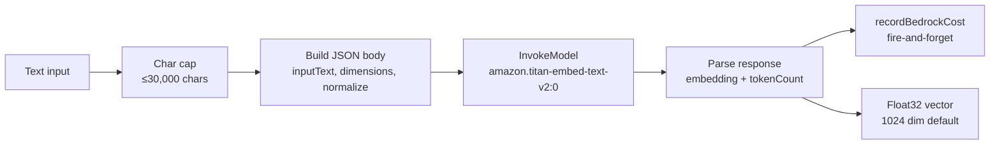

## Overview

`TitanEmbeddingProvider` is the single class through which any
application code in this monorepo turns text into a vector. It wraps
Amazon Titan Embed Text v2 via Bedrock's `InvokeModel` API and
implements the `IEmbeddingProvider` interface so callers can
test-double the embedding step
([applications/shared/src/rds/implementations/TitanEmbeddingProvider.ts:38-46](../../applications/shared/src/rds/implementations/TitanEmbeddingProvider.ts#L38-L46)).

It has exactly two production callers:

- The [`PgSemanticCache`](caching-tiers.md) — embeds every cache
  GET/PUT query
  ([pg-semantic-cache.ts:43](../../applications/shared/src/cache/pg-semantic-cache.ts#L43)).
- The Bedrock Knowledge Base ingestion pipeline (configured via CDK,
  [infra/lib/stacks/bedrock/kb-stack.ts:84-86](../../infra/lib/stacks/bedrock/kb-stack.ts#L84-L86)) —
  same model id, same dimensions, embedded on the AWS side rather
  than in app code.

Same model on both sides of the platform's vector boundary keeps
similarity scores comparable.

## How it works



### Model contract

The model id is `amazon.titan-embed-text-v2:0`
([TitanEmbeddingProvider.ts:25](../../applications/shared/src/rds/implementations/TitanEmbeddingProvider.ts#L25))
— hardcoded; not swappable per call. The Bedrock body shape:

| Field | Value | Source |
| :- | :- | :- |
| `inputText` | Truncated text (see below) | Caller |
| `dimensions` | `256 | 512 | 1024` (default `1024`) | Constructor |
| `normalize` | `true` (always) | [TitanEmbeddingProvider.ts:74](../../applications/shared/src/rds/implementations/TitanEmbeddingProvider.ts#L74) |

Output shape: `{ embedding: number[], inputTextTokenCount: number }`
([TitanEmbeddingProvider.ts:85-88](../../applications/shared/src/rds/implementations/TitanEmbeddingProvider.ts#L85-L88)).
The token count is consumed by the cost-tracking sidecar (next
section); the embedding is returned to the caller as a plain
`number[]`.

### Defensive char cap

Titan v2 enforces an 8,192-token input limit. At ~4 chars/token for
English the cap should sit around 32,000 characters, but the API has
a separate 50,000-char hard limit. The provider truncates to **30,000
chars** as the binding safety guard
([TitanEmbeddingProvider.ts:30-33, 70-72](../../applications/shared/src/rds/implementations/TitanEmbeddingProvider.ts#L30-L33)):

```ts
const MAX_INPUT_CHARS = 30_000;
…
inputText: text.length > MAX_INPUT_CHARS
  ? text.slice(0, MAX_INPUT_CHARS) : text,
```

Truncation **preserves leading content** — important because the
cache callers pre-normalise (lowercase, collapse whitespace, trim)
and the head of a query carries the most discriminative tokens.

### Dimension choice

256/512/1024 are the model's three configurable output dimensions.
The default is **1024** — Titan v2's maximum
([TitanEmbeddingProvider.ts:47, 57-61](../../applications/shared/src/rds/implementations/TitanEmbeddingProvider.ts#L47-L61)).

| Dim | Vector size on disk | Cosine quality |
| -: | -: | :- |
| 256 | 1 KB | Roughest |
| 512 | 2 KB | Middle |
| 1024 | 4 KB | Best |

The semantic-cache table is `vector(1024)`
([migration 022](../../applications/platform-rds-bootstrap/migrations/022_semantic_cache.sql))
and the Bedrock KB ingestion is configured at 1024 dims (Pinecone
vector store metadata field
[kb-stack.ts:35](../../infra/lib/stacks/bedrock/kb-stack.ts#L35)).
Both sides being 1024 means embeddings from one path could in
principle be compared against the other; the platform does not do
this today, but the dimensions match so the option remains open.

### Cost tracking sidecar

When constructed with a `TitanCostContext` (an optional argument
carrying `pool`, `userId`, `repoName`,
[TitanEmbeddingProvider.ts:32-37](../../applications/shared/src/rds/implementations/TitanEmbeddingProvider.ts#L32-L37)),
every `embed()` call writes a row to the platform's Bedrock cost
tracking table via `recordBedrockCost`
([TitanEmbeddingProvider.ts:90-101](../../applications/shared/src/rds/implementations/TitanEmbeddingProvider.ts#L90-L101)):

```ts
recordBedrockCost(this.costCtx.pool, {
    userId, modelId, pipeline: 'repo-sync',
    inputTokens: parsed.inputTextTokenCount ?? 0,
    outputTokens: 0,
    repoName,
}).catch((err) => console.warn(…non-fatal));
```

The catch swallows errors — cost tracking is observability, not
critical path. Misses do not block embedding. The semantic cache
omits the cost context (it instantiates with no args via
`fromEnvironment()`,
[pg-semantic-cache.ts:43](../../applications/shared/src/cache/pg-semantic-cache.ts#L43))
because the cache's spend is captured at the *callers'* aggregate
level via Prometheus, not per-row.

### `fromEnvironment` shortcut

The static factory reads two env vars
([TitanEmbeddingProvider.ts:57-61](../../applications/shared/src/rds/implementations/TitanEmbeddingProvider.ts#L57-L61)):

| Env var | Default | Notes |
| :- | :- | :- |
| `AWS_REGION` | `us-east-1` | Lambda runtime sets this automatically |
| `EMBEDDING_DIMENSION` | `1024` | Cast to `256 | 512 | 1024` after parse |

No cost context — meant for places that don't need per-user spend
attribution (the semantic cache, ad-hoc scripts).

## Implementation in this codebase

| Concern | Location |
| :- | :- |
| Provider class | [applications/shared/src/rds/implementations/TitanEmbeddingProvider.ts](../../applications/shared/src/rds/implementations/TitanEmbeddingProvider.ts) |
| Interface | [applications/shared/src/rds/interfaces/IEmbeddingProvider.ts](../../applications/shared/src/rds/interfaces/IEmbeddingProvider.ts) |
| Cost recorder | [applications/shared/src/rds/bedrock-cost.ts](../../applications/shared/src/rds/bedrock-cost.ts) |
| Cache caller (no cost ctx) | [applications/shared/src/cache/pg-semantic-cache.ts:43](../../applications/shared/src/cache/pg-semantic-cache.ts#L43) |
| KB caller (configured in CDK, not code) | [infra/lib/stacks/bedrock/kb-stack.ts](../../infra/lib/stacks/bedrock/kb-stack.ts) (Bedrock-managed) |
| Test mock pattern | [pg-semantic-cache.test.ts:5](../../applications/shared/src/cache/pg-semantic-cache.test.ts#L5) — replaces `TitanEmbeddingProvider.fromEnvironment` with a stub |

## Tradeoffs

**Hardcoded model id.** No multi-model flexibility today —
`amazon.titan-embed-text-v2:0` is fixed at module top
([TitanEmbeddingProvider.ts:25](../../applications/shared/src/rds/implementations/TitanEmbeddingProvider.ts#L25)).
Reasonable now because Titan v2 sits at a stable price/quality
point for the platform's scale and switching models would require
re-embedding the KB *and* the semantic cache for similarity to stay
comparable. If a swap becomes necessary the change is two lines plus
a re-ingestion pipeline run; until then the constant keeps the
contract simple.

**`normalize: true` always.** Titan's `normalize` flag scales the
output vector to unit length, which makes cosine distance equivalent
to inner product and removes a per-call normalisation step in the
caller. pgvector's `<=>` operator computes cosine distance regardless,
so the savings are notional but the consistency is real: every
embedding the platform produces has the same magnitude semantics.

**Default to max dimensions (1024).** The smaller dimensions exist;
the platform never uses them. Reasoning: at the platform's scale
the embedding storage cost is dominated by row count, not vector
size; the quality difference between 1024 and 256 matters at the
margin (semantic cache near-misses, KB retrieval recall) and is
worth the storage. Lower dimensions remain available behind the
`EMBEDDING_DIMENSION` env var for an explicit cost play.

**Char cap, not token cap, for safety.** Titan v2's *binding* limit
is tokens (8,192) but the platform truncates by characters. Token
counting requires a tokenizer call, which is itself a Bedrock or
local-model cost. The 30,000-char heuristic stays comfortably under
both the token (≈7,500 tokens worst case at 4 chars/token) and char
(50,000 hard limit) ceilings without needing tokenization
pre-flight.

**Fire-and-forget cost recording.** A cost row failure must not
block the embedding return — the spend has already happened on the
Bedrock side; the only thing failing the call would cost is the
*record*. The `.catch(err => console.warn(...))` pattern
([TitanEmbeddingProvider.ts:97-101](../../applications/shared/src/rds/implementations/TitanEmbeddingProvider.ts#L97-L101))
keeps embedding hot-path independent of the cost tracking SLA.

## Deeper detail

- [docs/concepts/caching-tiers.md](caching-tiers.md) — the highest-
  volume caller; explains the pre-embedding normalise + PII-scrub
  pipeline that feeds this provider.
- [docs/decisions/0002-pgvector-over-pinecone-for-cache.md](../decisions/0002-pgvector-over-pinecone-for-cache.md)
  — the asymmetric split between cache and KB; both sides use this
  embedder so cross-comparison stays possible.
- (planned) docs/concepts/bedrock-cost-tracking.md — the
  `recordBedrockCost` table + dashboard surface; covers how the
  cost context here threads into the per-user spend ledger.

## Related concepts

- [pii-scrubber](pii-scrubber.md) — runs ahead of every cache
  embedding; the redacted output is what reaches this provider.
- [self-healing-agent](self-healing-agent.md) — does *not* use this
  provider (no embeddings; pure ConverseCommand + tool-use).
- [tech-extractor-architecture](tech-extractor-architecture.md) —
  also does not use this provider (deterministic extraction; no
  embeddings).

<!--
Evidence trail (auto-generated):
- Source: applications/shared/src/rds/implementations/TitanEmbeddingProvider.ts (read in full on 2026-05-27)
- Source: applications/shared/src/cache/pg-semantic-cache.ts (line 43 on 2026-05-27)
- Source: applications/shared/src/cache/pg-semantic-cache.test.ts (line 5 on 2026-05-27)
- Source: infra/lib/stacks/bedrock/kb-stack.ts (lines 35, 84-86 on 2026-05-27)
- Source: applications/platform-rds-bootstrap/migrations/022_semantic_cache.sql (vector(1024) on 2026-05-27)
-->
