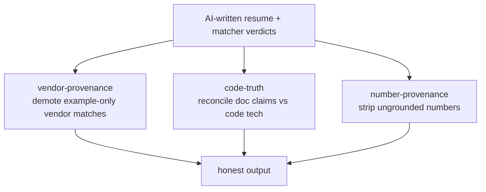

## Intent

LLM prompts can ask a model to "never invent a metric" or "only claim real
experience", but instructions are probabilistic. This pattern adds a
**deterministic backstop** behind every AI-written claim on the resume: pure
functions that strip or demote any claim not grounded in evidence, guaranteeing
the output cannot over-state what the candidate's code and history actually show.

## When to apply

Apply wherever an LLM rewrites user-facing claims that must stay truthful — here,
the strategist's resume text and skill verdicts. Each guard targets one
fabrication mode and runs *after* generation. Do not rely on prompt wording alone
for a high-stakes honesty surface; do add a deterministic guard. The guards are
not a substitute for grounding the generation in evidence — they are the last
line, catching what slips through.

## Structure

Three pure, deterministic guards, each closing a specific fabrication:

- **Vendor provenance** — demotes a competing-vendor match backed *only* by
  reference/example documentation, not authored production work. Kills the bug
  where a candidate's how-to doc contains an "OpenAI example (Python)" snippet
  while their real stack is Bedrock/Anthropic: the matcher cites the doc, marks
  the vendor verified, and the writer states it as first-person production
  experience — a fabrication
  ([vendor-provenance.ts:1-12](../../applications/job-strategist/src/ats/vendor-provenance.ts#L1-L12)).
- **Code truth (doc-vs-code drift)** — reconciles documentation claims against the
  deterministic, code-derived technology truth. Kills the bug where a repo migrates
  (self-hosted Kubernetes → EKS) but its `.md` docs aren't updated; the KB ingests
  the stale doc and the matcher cites it as current, while code extraction already
  knows the repo's current stack
  ([code-truth.ts:1-13](../../applications/job-strategist/src/ats/code-truth.ts#L1-L13)).
- **Number provenance** — a strict net over any AI-rewritten text: it strips any
  number from the resume's experience highlights, summary, and key achievements
  that is not in the allowed set (numbers from the original resume + grounding
  facts). Guarantee: after `stripUngroundedNumbers`, no number outside `allowed`
  survives
  ([number-provenance.ts:1-12](../../applications/job-strategist/src/ats/number-provenance.ts#L1-L12)).

## Implementation in this codebase

| Guard | File | Fabrication killed |
| :- | :- | :- |
| Vendor provenance | `applications/job-strategist/src/ats/vendor-provenance.ts` | "production X" from an example snippet |
| Code truth | `applications/job-strategist/src/ats/code-truth.ts` | stale-doc tech claim vs current code |
| Number provenance | `applications/job-strategist/src/ats/number-provenance.ts` | invented metric in rewritten text |

All three are pure + deterministic + unit-tested, run as a guard chain in
`run-pipeline.ts` after the matcher and before/around the strategist writer.

## Variants

The same "deterministic backstop behind a probabilistic generator" shape appears
in the case-study [product-framing grader](../concepts/case-study-generation.md)
and the [per-phase eval graders](../concepts/per-phase-evals.md) — there it
*detects* violations rather than stripping them, but the principle (a pure check
the LLM cannot talk its way past) is identical.

<!--
Evidence trail (auto-generated):
- Source: applications/job-strategist/src/ats/vendor-provenance.ts (read on 2026-06-16, lines 1-12)
- Source: applications/job-strategist/src/ats/code-truth.ts (read on 2026-06-16, lines 1-13)
- Source: applications/job-strategist/src/ats/number-provenance.ts (read on 2026-06-16, lines 1-12)
-->
