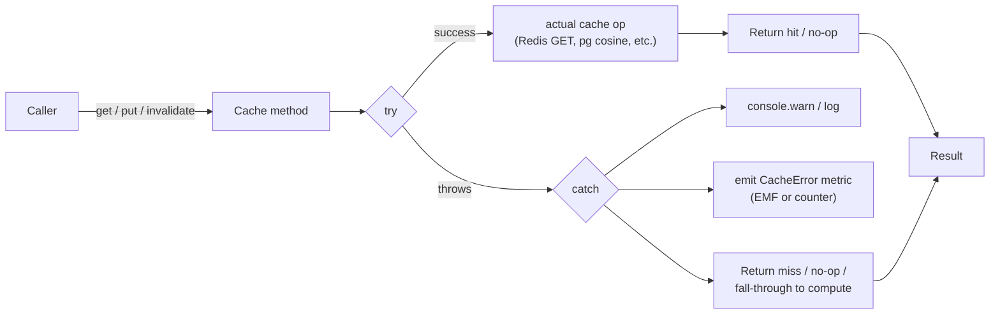

## Intent

Make a cache a **strictly-additive optimisation** — every cache
method (`get`, `put`, `invalidate`, `getOrCompute`) is wrapped in
`try / catch` whose catch arm degrades to **miss / no-op** and
emits a `CacheError` telemetry signal. The cache **must never
throw** into the host request. If Redis is down, if pgvector is
unreachable, if a cached JSON blob is corrupt — the caller still
serves successfully, just uncached.

## When to apply

**Use this pattern when:**

- A cache is fronting a **derivable** answer (the underlying
  compute can always be re-run).
- The cache adds latency or cost reduction but is **not load-bearing
  for correctness** — the system functions without it.
- The cache and the caller cross a **fault boundary** (different
  process, different infrastructure, different SLA).

**Do not apply when:**

- The cache is the **only** writer of state (e.g. a session store
  whose values cannot be reconstructed). Use it as a primary store,
  not a fail-open cache.
- The cache backs a **strongly-consistent** read path where stale
  or missing results have correctness implications.

## Structure



### Every method's catch arm degrades, not rethrows

The shared `ISemanticCache` interface
([cache-types.ts:39-41](../../applications/shared/src/cache/cache-types.ts#L39-L41))
specifies three operations. Every implementation wraps every
operation
([redis-exact-cache.ts:79-98](../../applications/shared/src/cache/redis-exact-cache.ts#L79-L98),
[pg-semantic-cache.ts:81-114](../../applications/shared/src/cache/pg-semantic-cache.ts#L81-L114),
[redis-read-cache.ts:42-50](../../applications/shared/src/cache/redis-read-cache.ts#L42-L50)):

```ts
async get(input: SemanticCacheGetInput): Promise<SemanticCacheGetResult> {
    if (!this.opts.enabled) return { hit: false };
    try {
        const raw = await this.client.get(this.key(...));
        if (raw === null) {
            this.metrics.onMiss?.(input.scope);
            return { hit: false };
        }
        this.metrics.onHit?.(input.scope);
        return { hit: true, response: JSON.parse(raw), similarity: 1 };
    } catch (e) {
        this.metrics.onError?.(input.scope);
        console.warn('[cache] get failed — treating as miss:', e.message);
        return { hit: false };
    }
}
```

Three load-bearing properties of the catch arm:

1. **Always return the structural "miss" shape** (`{ hit: false }`)
   so the caller's contract is uniform.
2. **Log a warning, never an error.** The cache failing is not a
   service-failure event; it's an observability event.
3. **Emit a `CacheError` metric.** The dashboard shows the rate;
   sustained non-zero is the operator's signal that the cache is
   genuinely broken (vs intermittent timeouts).

### Disable-by-empty-env-var

The Redis caches encode "disabled" via empty `REDIS_CACHE_HOST`
([redis-client.ts:36-46](../../applications/shared/src/cache/redis-client.ts#L36-L46)):

```ts
const host = process.env.REDIS_CACHE_HOST ?? '';
return {
    enabled: host.length > 0,
    // …
};
```

When `enabled: false`, the cache stays a no-op for the entire
process lifetime:

```ts
get enabled(): boolean { return this.opts.enabled; }
// …
async get(input) {
    if (!this.opts.enabled) return { hit: false };
    // …
}
```

This is **operator-controlled disable** as well as fail-open.
Setting `REDIS_CACHE_HOST=` deploys a cache-disabled environment
without code changes — useful for incident response (force-disable
the cache while diagnosing) or local dev (no Redis dependency).

### Corrupt-value recovery (RedisReadCache)

`RedisReadCache.getOrCompute` adds a third recovery path — if a
cached value parses badly, **evict and recompute**
([redis-read-cache.ts:46-50](../../applications/shared/src/cache/redis-read-cache.ts#L46-L50)):

```ts
try {
    const parsed = JSON.parse(cached) as T;
    this.metrics.onHit?.(cacheName);
    return parsed;
} catch (err) {
    // Corrupt cached value — evict and fall through to recompute.
    console.warn('[redis-read-cache] corrupt cached value — evicting:', err);
    this.metrics.onError?.(cacheName);
    await this.client.unlink(key).catch(() => { /* fail-open */ });
}
// Fall through to compute()
```

The nested `await client.unlink(key).catch(() => {})` is the
pattern recursing into itself — the eviction is itself fail-open.
A Redis outage during eviction does not block the recompute path.

### Fire-and-forget secondary writes

The semantic cache's hit-count increment is fire-and-forget
([pg-semantic-cache.ts:99-102](../../applications/shared/src/cache/pg-semantic-cache.ts#L99-L102)):

```ts
void this.pool.query(
    'UPDATE semantic_cache SET hit_count = hit_count + 1 WHERE id = $1',
    [row.id],
).catch(() => {});
```

`void` + `.catch(() => {})` — the `UPDATE` is best-effort
telemetry. A failure does not delay or block the hit return. Same
philosophy: the cache's primary job (return a hit) cannot be
blocked by its secondary job (update hit-count).

### Telemetry is the **only** signal

A fail-open cache by definition silently degrades. The only way to
notice degradation is the telemetry:

- `redis_cache_requests_total{outcome="error"}` — per-cache error
  rate (caller-side counter)
- `CacheError` EMF metric in the `BedrockSharedSafety` namespace —
  for PgSemanticCache
- `[cache] … failed` warning log lines — for human-eye operator
  inspection

The
[redis-cache-eviction runbook](../runbooks/redis-cache-eviction.md)
explicitly opens with these signals as the "is the cache
healthy?" check.

## Implementation in this codebase

| Cache | Get fail-open | Put fail-open | Invalidate fail-open |
| :- | :- | :- | :- |
| `RedisExactCache` | [L79-98](../../applications/shared/src/cache/redis-exact-cache.ts#L79-L98) | yes ([L100-105](../../applications/shared/src/cache/redis-exact-cache.ts#L100-L105)) | yes ([L104-118](../../applications/shared/src/cache/redis-exact-cache.ts#L104-L118)) |
| `RedisReadCache.getOrCompute` | [L42-50](../../applications/shared/src/cache/redis-read-cache.ts#L42-L50) (incl. corrupt-value recovery) | n/a (combined with get) | n/a |
| `PgSemanticCache` | [L81-114](../../applications/shared/src/cache/pg-semantic-cache.ts#L81-L114) | yes ([L118-132](../../applications/shared/src/cache/pg-semantic-cache.ts#L118-L132)) | yes ([L137-162](../../applications/shared/src/cache/pg-semantic-cache.ts#L137-L162)) |

Three caches, ten methods, every one wrapped. Test files include
a "fail-open" suite per cache that asserts the catch arm returns
the correct degraded shape and emits the error metric.

## Variants

### `recordBedrockCost` follows the same shape

Outside the cache module proper, the per-user cost ledger has
identical semantics
([applications/chatbot-public/src/invoke-claude.ts:35-42](../../applications/chatbot-public/src/invoke-claude.ts#L35-L42),
[applications/shared/src/rds/implementations/TitanEmbeddingProvider.ts:97-101](../../applications/shared/src/rds/implementations/TitanEmbeddingProvider.ts#L97-L101)):

```ts
recordBedrockCost(pool, { … })
    .catch((err) => console.warn('[…] cost record failed (non-fatal)', err));
```

The Bedrock spend already happened; failing to record it should
not fail the chatbot response. The pattern generalises beyond
caches to **any observability sidecar**.

### Operator-controlled disable

Per the **disable-by-empty-env-var** mechanism, the Redis caches
can be force-disabled via `REDIS_CACHE_HOST=`. The
[redis-cache-eviction runbook](../runbooks/redis-cache-eviction.md)
relies on this as the emergency control: setting concurrency to 0
on the Lambda is one option; flipping the env var to disable the
cache from the inside is another.

## Deeper detail

- [docs/concepts/caching-tiers.md](../concepts/caching-tiers.md)
  — the three caches this pattern is applied to (RedisExactCache,
  RedisReadCache, PgSemanticCache) with their shared `scope` +
  `kbTag` invalidation vocabulary.
- [docs/runbooks/redis-cache-eviction.md](../runbooks/redis-cache-eviction.md)
  — the operator procedure that relies on the fail-open property
  (the cache being effectively off while you diagnose Redis is a
  safe state).
- [docs/troubleshooting/semantic-cache-stale-responses.md](../troubleshooting/semantic-cache-stale-responses.md)
  — investigates wrong-answer reports without breaking the
  fail-open invariant (eviction is on the operator, not on the
  cache code).

## Related concepts

- [docs/concepts/bedrock-cost-tracking.md](../concepts/bedrock-cost-tracking.md)
  — `recordBedrockCost` extends the fail-open philosophy beyond
  caches to the per-user spend ledger.
- [docs/concepts/self-healing-agent.md](../concepts/self-healing-agent.md)
  — the self-healing agent **deliberately bypasses** all three
  caches; this pattern's fail-open doesn't apply to its hot path.

<!--
Evidence trail (auto-generated):
- Source: applications/shared/src/cache/redis-exact-cache.ts (lines 79-118 on 2026-05-27)
- Source: applications/shared/src/cache/redis-read-cache.ts (lines 42-50 on 2026-05-27)
- Source: applications/shared/src/cache/pg-semantic-cache.ts (lines 81-162 on 2026-05-27)
- Source: applications/shared/src/cache/redis-client.ts (lines 36-46 on 2026-05-27)
- Source: applications/shared/src/cache/cache-types.ts (lines 30-41 on 2026-05-27)
- Source: applications/chatbot-public/src/invoke-claude.ts (lines 35-42 on 2026-05-27)
-->
