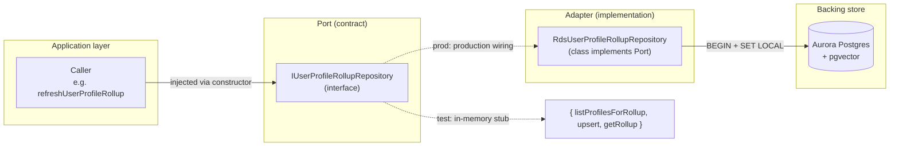

## Intent

Decouple the platform's business logic from the persistence engine
behind a set of **typed contracts**. Application code calls an
`I<Domain>Repository` interface; the running process injects an
`Rds<Domain>Repository` implementation that knows how to talk to
Aurora Postgres. Tests inject in-memory stubs of the same interface.
The pattern lives under
[applications/shared/src/rds/](../../applications/shared/src/rds/)
and is the load-bearing piece behind every user-scoped data access
in the codebase.

This is **ports-and-adapters** (also known as **hexagonal
architecture**, Cockburn 2005), narrowly applied to the RDS surface
rather than the whole application. The reasoning for *narrow*
application: external integrations like Bedrock and Redis already
have their own abstractions; the high-value place to invest in
testable seams is the persistence boundary where RLS, transactions,
and `set_config` make mocks brittle.

## When to apply

**Use this pattern when:**

- A persistence concern is touched by **more than one** caller (e.g.
  `IUserProfileRollupRepository` is consumed by `ingestion` *and* by
  the read paths in `api/public-api`).
- The persistence call requires **transactional setup** (`BEGIN` +
  `SET LOCAL app.current_user_id = $1`) that hand-written tests
  would have to replicate. The hexagonal split lets tests stub the
  interface rather than reproduce the RLS choreography.
- The contract has **multiple plausible implementations** — today
  Aurora Postgres, tomorrow potentially a different backend or a
  read-replica with relaxed consistency
  ([IEmbeddingProvider](../../applications/shared/src/rds/interfaces/IEmbeddingProvider.ts)
  comments explicitly call this out: *"The pipeline never imports a
  concrete model client — it calls this interface. Swap Titan for
  Cohere or any other model by providing a different implementation."*).

**Do not apply when:**

- The persistence concern is **single-use** and lives in one service
  (e.g. tech-extractor's `TechnologyEvidenceRepository`,
  `TechnologyCandidateRepository`,
  `TechnologyOntologyRepository` — all live as **concrete classes
  without `I` interfaces** under
  [implementations/](../../applications/shared/src/rds/implementations/)
  because they have one caller and a single backing implementation).
- The contract would have **only one method** — adding an interface
  for a trivial single-method primitive is ceremony, not safety.
- The caller is itself a **pure function** that already has its
  contract in the function signature.

## Structure



### Naming convention

The convention is **mechanical**, deliberately so:

| Concern | Interface | Implementation |
| :- | :- | :- |
| User profile rollup | `IUserProfileRollupRepository` | `RdsUserProfileRollupRepository` |
| OAuth connections | `IOAuthConnectionsRepository` | `RdsOAuthConnectionsRepository` |
| Career history (read-only) | `ICareerHistoryReadRepository` | `RdsCareerHistoryReadRepository` |
| Diagnostic inputs (read-only) | `IDiagnosticInputsReadRepository` | `RdsDiagnosticInputsReadRepository` |
| Sync state | `ISyncStateRepository` | `RdsSyncStateRepository` |
| Embedding provider | `IEmbeddingProvider` | `TitanEmbeddingProvider` |
| Vector store | `IVectorStore` | `RdsVectorStore` |
| Chunk enricher | `IChunkEnricher` | `BedrockChunkEnricher` |

`I` prefix on interfaces; **vendor-or-backend prefix** on
implementations (`Rds` for Aurora, `Titan` for the Bedrock embedding
model, `Bedrock` for the chunk-enrichment Bedrock client). The
prefix carries the swap point — `Rds` says "swappable with a
different RDS-backed adapter or a non-RDS backend at all."

### Read-only contracts

Three of the interfaces are explicitly **read-only** by name:

- `ICareerHistoryReadRepository`
- `IDiagnosticInputsReadRepository`
- (and the read-side of `ISyncStateRepository`)

The `Read` suffix is **load-bearing**: the contract makes clear that
implementations should not expose mutation. The pattern is used
where one side of the platform (ingestion) writes a table and
another side (synthesizer chain, diagnostic narrator) reads it.
Splitting the read interface from the write interface prevents the
read-side from accidentally taking a dependency on write-side
machinery.

### Transactional choreography

Every `Rds<X>Repository` that touches a user-scoped table follows
the same per-method scaffold
([RdsUserProfileRollupRepository:18-50](../../applications/shared/src/rds/implementations/RdsUserProfileRollupRepository.ts#L18-L50)):

```ts
const client = await this.pool.connect();
try {
    await client.query('BEGIN');
    await client.query(
        `SELECT set_config('app.current_user_id', $1, true)`,
        [userId],
    );
    // … work …
    await client.query('COMMIT');
} catch (err) {
    await client.query('ROLLBACK').catch(() => {});
    throw err;
} finally {
    client.release();
}
```

`SET LOCAL` scopes the parameter to the transaction so RLS policies
filtering by `current_setting('app.current_user_id')::uuid = user_id`
cannot leak across pool connections. This is the same pattern
documented in
[bedrock-rag-surface § Custom-retrieval auth](../concepts/bedrock-rag-surface.md#custom-retrieval-auth--session-memory-with-rls)
for the chatbot sessions table.

The hexagonal split **hides this choreography from callers**. The
synthesizer chain calls
`repo.listProfilesForRollup(userId)` — it does not know about
`BEGIN`, `SET LOCAL`, `set_config`, or `ROLLBACK`. Refactoring the
choreography (e.g. swapping `SET LOCAL` for a per-statement bind
parameter, switching pool implementations) touches only the
implementation file; the interface contract holds.

### Barrel export

The interfaces and the prod implementations are **both exported**
from
[applications/shared/src/rds/index.ts](../../applications/shared/src/rds/index.ts):

```ts
export type { ISyncStateRepository } from './interfaces/ISyncStateRepository.js';
export { RdsSyncStateRepository } from './implementations/RdsSyncStateRepository.js';

export type { IEmbeddingProvider } from './interfaces/IEmbeddingProvider.js';
export { TitanEmbeddingProvider } from './implementations/TitanEmbeddingProvider.js';

// … 7 more pairs …
```

Callers import the interface (`import type { ... }`) for typing and
the implementation class for wiring at the composition root.
TypeScript's `import type` ensures the interface is erased at
runtime — so a test that imports the interface only and stubs it
does not transitively pull `pg` into the test bundle.

### Composition at the application boundary

Wiring happens once per service entry point, not per call site. For
example, `ingestion`'s `run-ingestion.ts`:

```ts
const pool = new Pool({ /* env-derived config */ });
const rollupRepo: IUserProfileRollupRepository =
    new RdsUserProfileRollupRepository(pool);
const careerRepo: ICareerHistoryReadRepository =
    new RdsCareerHistoryReadRepository(pool);
// … inject into refreshUserProfileRollup …
```

The `refreshUserProfileRollup` function
([applications/ingestion/src/util/refreshUserProfileRollup.ts](../../applications/ingestion/src/util/refreshUserProfileRollup.ts))
takes the interfaces as parameters, not the concrete classes. This
is what makes the function unit-testable without a live Postgres —
the tests pass in-memory stubs of `IUserProfileRollupRepository`
and `ICareerHistoryReadRepository`.

## Implementation in this codebase

### Hexagonal pairs (interface + Rds-impl)

8 contracts under
[applications/shared/src/rds/interfaces/](../../applications/shared/src/rds/interfaces/)
with corresponding `Rds*` adapters under
[applications/shared/src/rds/implementations/](../../applications/shared/src/rds/implementations/):

| Interface | Adapter | Purpose |
| :- | :- | :- |
| `IUserProfileRollupRepository` | `RdsUserProfileRollupRepository` | Profile synthesis (5 synth steps) |
| `IOAuthConnectionsRepository` | `RdsOAuthConnectionsRepository` | GitHub App + envelope-encrypted tokens |
| `ICareerHistoryReadRepository` | `RdsCareerHistoryReadRepository` | Read résumé for reconciliation |
| `IDiagnosticInputsReadRepository` | `RdsDiagnosticInputsReadRepository` | Read inputs for the diagnostic score |
| `ISyncStateRepository` | `RdsSyncStateRepository` | Ingestion journal `repo_sync_state` |
| `IEmbeddingProvider` | `TitanEmbeddingProvider` | Text → 1024-dim vector |
| `IVectorStore` | `RdsVectorStore` | pgvector-backed write path |
| `IChunkEnricher` | `BedrockChunkEnricher` | LLM-enrich chunks (skills only post-decommission, see [ADR 0001](../decisions/0001-deterministic-over-llm-extraction.md)) |

### Concrete-only implementations (no interface)

Six implementations live as **concrete classes** without an
`I` interface — single-caller persistence concerns where the
abstraction would add ceremony without buying testability:

- `TechnologyOntologyRepository`
- `TechnologyEvidenceRepository`
- `TechnologyCandidateRepository`
- `TechnologyParityRunRepository`
- `OntologyImportRunRepository`, `OntologyImportSourceRepository`,
  `OntologyReviewQueueRepository`, `OntologySkippedImportRepository`,
  `OntologyWriteRepository`

These are tech-extractor and ontology-importer internals: one
service writes them, one service reads them. If a second caller
arrives, the refactor to introduce an `I` interface is mechanical
(extract the public method shape; rename the concrete; update
imports). The pattern doesn't insist on prophetic abstraction.

## Variants

### Read-only suffix variant

Three interfaces split read from write at the type level
(`ICareerHistoryReadRepository`,
`IDiagnosticInputsReadRepository`, and implicit read-only on
`ISyncStateRepository`). Used when the caller should not be able
to write a table even if it had the connection.

### Vendor-prefixed implementation variant

`TitanEmbeddingProvider` and `BedrockChunkEnricher` use a
**vendor prefix** rather than the `Rds` prefix because their
backing store is Bedrock, not RDS. Same hexagonal pattern; different
adapter type. Swapping Titan for Cohere is a class swap; swapping
Bedrock-enrichment for a self-hosted model is the same.

### Test-double convention

Tests **do not** subclass `Rds<X>Repository`. They construct
plain objects that satisfy the interface and pass them in
directly. Pattern visible across
[applications/shared/src/rds/implementations/*.test.ts](../../applications/shared/src/rds/implementations/):

```ts
const stubRepo: IUserProfileRollupRepository = {
    listProfilesForRollup: jest.fn().mockResolvedValue([...]),
    upsert:                 jest.fn().mockResolvedValue(undefined),
    getRollup:              jest.fn().mockResolvedValue(null),
};
```

Plain-object stubs keep the test surface narrow — no class
hierarchy to maintain, no `mock<I...>` library to learn. Jest's
`jest.fn()` is the only dependency.

## Deeper detail

- [docs/concepts/profile-synthesis-chain.md](../concepts/profile-synthesis-chain.md)
  — the synthesizer chain that consumes
  `IUserProfileRollupRepository` + `ICareerHistoryReadRepository` +
  `IDiagnosticInputsReadRepository`. The largest single consumer of
  this pattern.
- [docs/concepts/ontology-resolver.md](../concepts/ontology-resolver.md)
  — the concrete-only `TechnologyOntologyRepository` and why it
  doesn't need an interface today.
- [docs/concepts/titan-embedding-provider.md](../concepts/titan-embedding-provider.md)
  — the vendor-prefixed `IEmbeddingProvider` / `TitanEmbeddingProvider`
  pair.
- [docs/decisions/0001-deterministic-over-llm-extraction.md](../decisions/0001-deterministic-over-llm-extraction.md)
  — the `BedrockChunkEnricher` decommission of its `technologies`
  field. Same `IChunkEnricher` contract before and after; the impl
  changed, callers did not.
- (planned) docs/patterns/per-transaction-rls.md — the
  `SET LOCAL app.current_user_id` choreography that every
  user-scoped `Rds<X>Repository` repeats. Extracted as its own
  pattern doc.

## Related concepts

- [docs/concepts/tech-extractor-architecture.md](../concepts/tech-extractor-architecture.md)
  — the tech-extractor uses concrete repositories rather than the
  hexagonal split; the doc explains why (single caller, no test
  benefit).
- [docs/concepts/bedrock-rag-surface.md](../concepts/bedrock-rag-surface.md)
  — the `chatbot-authenticated` Lambda uses the same RLS-via-`SET LOCAL`
  pattern for its `chat_sessions` access; that path does not yet have
  an `IChatSessionsRepository` interface (single-service caller —
  see "When to apply").

<!--
Evidence trail (auto-generated):
- Source: applications/shared/src/rds/interfaces/ (directory listing on 2026-05-27)
- Source: applications/shared/src/rds/implementations/ (directory listing on 2026-05-27)
- Source: applications/shared/src/rds/index.ts (export grep on 2026-05-27)
- Source: applications/shared/src/rds/interfaces/IUserProfileRollupRepository.ts (read on 2026-05-27, lines 1-60)
- Source: applications/shared/src/rds/implementations/RdsUserProfileRollupRepository.ts (read on 2026-05-27, lines 1-50)
- Source: applications/shared/src/rds/interfaces/IOAuthConnectionsRepository.ts (read on 2026-05-27)
- Source: applications/shared/src/rds/interfaces/IEmbeddingProvider.ts (read in full on 2026-05-27)
-->
