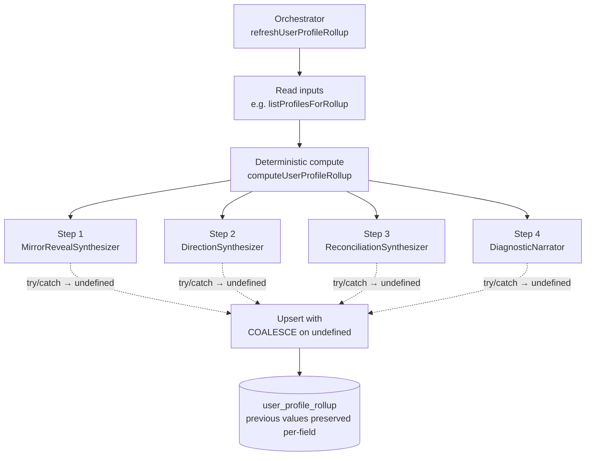

## Intent

When an orchestrator drives a chain of independent best-effort
steps — each producing an output that should be persisted if it
succeeds — make every step **must-not-throw**: catch internally,
return `undefined` on failure, and let a `COALESCE`-on-undefined
`upsert` preserve the previous value. The orchestrator never aborts;
the most-recent-successful result wins per field.

The contract: a downstream observer of the persisted row cannot
distinguish "this synthesizer didn't run this time" from "the
previous result is still authoritative" — both are correct.

## When to apply

**Use this pattern when:**

- An orchestrator drives **independent** steps (a failure in step 3
  shouldn't invalidate step 1's output).
- The persistence layer **already has prior values** that are
  still valid in the absence of fresh output (i.e. previous-result-
  preserving semantics are well-defined for the data shape).
- The steps are **observable** at the trace level (each emits an
  OTel span) so silent degradation can still be diagnosed.

**Do not apply when:**

- The orchestrator's steps form a **strict pipeline** where step N
  depends on step N-1's output and partial completion is incoherent.
- The persistence layer is **append-only** (no upsert semantics) —
  preservation is meaningless without an existing row to preserve
  *over*.
- Silent failure of any single step is a **safety or data
  integrity issue** rather than a degradation.

## Structure



### The orchestrator's try/catch shape

Every step is wrapped in a local `try/catch` that swallows the
error and leaves the local at `undefined`
([applications/ingestion/src/util/refreshUserProfileRollup.ts:40-60](../../applications/ingestion/src/util/refreshUserProfileRollup.ts#L40-L60)):

```ts
let synth: Awaited<ReturnType<MirrorRevealSynthesizer['synthesize']>> | undefined;
if (synthesizer) {
    try { synth = await synthesizer.synthesize(result.rollup); }
    catch { synth = undefined; }
}
let dir: Awaited<ReturnType<DirectionSynthesizer['synthesize']>> | undefined;
if (directionSynthesizer) {
    try { dir = await directionSynthesizer.synthesize(result.rollup); }
    catch { dir = undefined; }
}
// … repeated for reconciliation, diagnostic …
```

After every step has either succeeded or been caught, the
orchestrator calls a single `upsert` that takes every result as
**optional** ([refreshUserProfileRollup.ts:82-89](../../applications/ingestion/src/util/refreshUserProfileRollup.ts#L82-L89)):

```ts
await repo.upsert(
    userId,
    result,
    synth?.mirror,
    synth?.reveal,
    dir?.direction,
    recon?.reconciliation,
    diagnostic,
);
```

The repository implementation uses **`COALESCE` on each column**:

```sql
INSERT INTO user_profile_rollup (user_id, rollup, mirror, reveal, …)
VALUES ($1, $2, $3, $4, …)
ON CONFLICT (user_id) DO UPDATE
SET
    rollup = EXCLUDED.rollup,
    mirror = COALESCE(EXCLUDED.mirror, user_profile_rollup.mirror),
    reveal = COALESCE(EXCLUDED.reveal, user_profile_rollup.reveal),
    -- … etc.
```

`EXCLUDED.mirror` is the value passed by the orchestrator (possibly
`null` when `synth?.mirror` was `undefined`); `COALESCE` falls
through to the existing row's value when the new value is null.
The net effect: **`undefined` inputs preserve the existing column
value**.

### Per-step degradation contracts

The pattern isn't uniform across all steps — each synthesizer
defines **what counts as a partial success vs total failure**:

| Step | Partial result semantics |
| :- | :- |
| `MirrorRevealSynthesizer` | If `reveals` parse-validates but all items fail keyword grounding → drop all; if `mirror` parses and at least 1 reveal grounds → keep both |
| `DirectionSynthesizer` | If **all** archetypes drop the keyword grounding → return `undefined` (preserve prior). One archetype surviving is enough. |
| `ReconciliationSynthesizer` | If **both** `unsupportedClaims` and `undersold` lists end empty → return `undefined`. One list empty + other grounded is **VALID** (deliberate partial). |
| `DiagnosticNarrator` | Never affects the score. Score is always written from the deterministic `computeUserDiagnostic`; narrator's `explanation` is `null` on failure. |

Each contract is documented in the synthesizer's class header. The
[profile-synthesis-chain concept doc](../concepts/profile-synthesis-chain.md#per-synthesizer-degradation-contracts)
enumerates them. The orchestrator only needs to know "did
synthesize return undefined?" — the synthesizer is responsible for
deciding internally whether a partial result still meets its own
contract.

### Spans capture what ran

The orchestrator emits an OTel span per refresh with attributes
recording which steps succeeded
([refreshUserProfileRollup.ts:75-81](../../applications/ingestion/src/util/refreshUserProfileRollup.ts#L75-L81)):

```ts
span.setAttributes({
    'profile_rollup.project_repos': result.projectRepoCount,
    'profile_rollup.synthesized':   Boolean(synth),
    'profile_rollup.directioned':   Boolean(dir),
    'profile_rollup.reconciled':    Boolean(recon),
    'profile_rollup.diagnosed':     Boolean(diagnostic),
});
```

A debugging operator can see "Mirror+Reveal didn't run on this
refresh" via the trace, even though the persisted row looks
identical to before. Without these span attributes the silent
degradation would be invisible.

### The outermost try/catch protects ingestion

The orchestrator itself is wrapped in one final `try/catch` that
attaches the error to the span and continues
([refreshUserProfileRollup.ts:91-97](../../applications/ingestion/src/util/refreshUserProfileRollup.ts#L91-L97)):

```ts
} catch (err) {
    // Best-effort: a rollup failure MUST NOT break ingestion.
    // Log to the span, swallow, continue.
    span.recordException(err instanceof Error ? err : new Error(String(err)));
    span.setStatus({ code: SpanStatusCode.ERROR, message: String(err) });
} finally {
    span.end();
}
```

The header comment is explicit: *"a rollup failure MUST NOT break
ingestion"* ([line 4-7](../../applications/ingestion/src/util/refreshUserProfileRollup.ts#L4-L7)).
The pattern is **two layers** of must-not-throw:

1. **Inner** — each step's `try/catch` → `undefined`. Step-local
   failures don't halt the orchestrator.
2. **Outer** — the orchestrator's `try/catch` → `span.recordException`.
   An orchestrator-level failure (e.g. the repository's `upsert`
   throws because the database is down) doesn't fail ingestion.

## Implementation in this codebase

### Primary example — `refreshUserProfileRollup`

[applications/ingestion/src/util/refreshUserProfileRollup.ts](../../applications/ingestion/src/util/refreshUserProfileRollup.ts)
is the canonical example. Five steps (4 synthesizers + 1
deterministic diagnostic compute + 1 narrator), each independently
must-not-throw, with `COALESCE`-on-undefined preservation.

### Secondary example — RetrievalProbe

`applications/ingestion/src/agents/RetrievalProbe.ts` follows the
same must-not-throw contract (the
[refreshUserProfileRollup header](../../applications/ingestion/src/util/refreshUserProfileRollup.ts#L4-L7)
names it explicitly: *"same best-effort contract as the retrieval
probe"*).

### Self-healing agent — variant

The self-healing agent
([applications/self-healing/src/index.ts](../../applications/self-healing/src/index.ts))
uses a related but **distinct** pattern: it catches at the tool-call
boundary but **does** throw all the way out of `handler` on
unrecoverable failures, surfacing them as `statusCode: 500`. The
agent is a single-tenant remediation surface where silent
degradation is **worse** than visible failure — so the must-not-throw
discipline is applied only to specific layers (memory load, dedup
write) and not to the loop itself.

## Variants

### `COALESCE` on the **entire** row vs per-column

This codebase uses **per-column** `COALESCE`. The whole-row variant
would be: if the orchestrator produced no new values at all, skip
the upsert entirely. That works for some shapes but loses the
"rollup-itself-updated + 3-of-4-synths-undefined" case. Per-column
is the right granularity for the synthesizer chain.

### Span attributes as the operator's signal

Replacing per-step metrics with span attributes is the **deliberate
choice** here — synthesis is low-frequency (once per repo
ingestion); spans are cheap; per-synthesizer Prometheus counters
would be over-engineered. The reverse trade applies for hot paths:
the chatbot's grounding verifier publishes a counter, not span
attributes.

### Outer-catch logs but doesn't re-throw

The outer `catch` records the exception on the span but does not
re-throw. The caller of `refreshUserProfileRollup` sees a
successful return whether the rollup succeeded or not. **Ingestion
keeps going**. The trace is the only place the failure surfaces.

The asymmetry — orchestrator failure is observable but does not
propagate — is the load-bearing piece. Without it, every Bedrock
hiccup would fail the K8s Job; with it, the rollup converges
eventually (next ingestion runs it again with fresh evidence).

## Deeper detail

- [docs/concepts/profile-synthesis-chain.md](../concepts/profile-synthesis-chain.md)
  — the chain orchestrated by `refreshUserProfileRollup`. Documents
  each synthesizer's per-step degradation contract.
- [docs/patterns/zod-tool-use.md](zod-tool-use.md) — the
  inside-the-synthesizer contract. The synthesizer's own try/catch
  catches zod parse failures and converts them to `undefined`; the
  orchestrator's catch is the safety net.
- [docs/patterns/fail-open-cache.md](fail-open-cache.md) — sibling
  pattern. The cache's "fail-open" is shape-symmetric to the
  orchestrator's "must-not-throw": both have try/catch wrappers
  that degrade to a structurally-uniform output.
- (planned) docs/patterns/per-item-grounding-filter.md — the
  inside-the-synthesizer keyword filter that drops items between
  zod-parse and the synthesizer's return. Sits between this
  pattern and the zod-tool-use pattern.

## Related concepts

- [docs/concepts/self-healing-agent.md](../concepts/self-healing-agent.md)
  — explicit counter-example. Same author, deliberate inversion of
  this pattern: silent degradation in remediation is worse than
  loud failure.
- [docs/concepts/bedrock-cost-tracking.md](../concepts/bedrock-cost-tracking.md)
  — the cost ledger uses must-not-throw at the *write* site
  (fire-and-forget `recordBedrockCost`), the same disposition with
  a different consequence (lost telemetry row instead of lost
  synthesis output).

<!--
Evidence trail (auto-generated):
- Source: applications/ingestion/src/util/refreshUserProfileRollup.ts (lines 1-100 on 2026-05-27)
- Source: applications/ingestion/src/agents/MirrorRevealSynthesizer.ts (lines 1-70 on 2026-05-27)
- Source: applications/ingestion/src/agents/DirectionSynthesizer.ts (lines 1-70 on 2026-05-27)
- Source: applications/ingestion/src/agents/ReconciliationSynthesizer.ts (lines 1-80 on 2026-05-27)
- Source: applications/ingestion/src/agents/DiagnosticNarrator.ts (lines 1-80 on 2026-05-27)
-->
