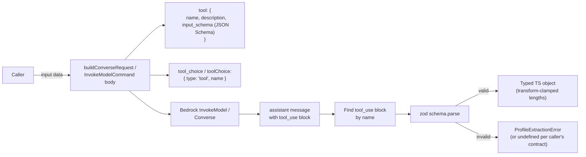

## Intent

Force Bedrock LLM responses into a strictly-typed shape by combining
**forced tool-use** (the model cannot reply free-text — it must
invoke a named tool) with **zod schema validation** (the tool's
input is parsed and rejected on shape mismatch) and
**transform-clamp** semantics (over-length string fields are
truncated rather than throwing). The result is callers that consume
plain TypeScript types with no narrative-parsing logic of their own.

## When to apply

**Use this pattern when:**

- The LLM is producing **structured output** (a classification, a
  list of typed records, a JSON object) — not narrative text.
- Downstream consumers are TypeScript code that needs typed access
  to the result.
- Failure modes from unparseable output are unacceptable (the
  consumer needs either a valid result or a clear error).

**Do not apply when:**

- The model is producing genuine prose (a chatbot answer, a
  narration). Forcing tool-use on prose is ceremony that obscures
  the actual return.
- The output shape is itself unbounded (an arbitrary nested
  JSON-of-JSON) — zod's strictness becomes painful without bounds.

## Structure



### The four ingredients

Every instance of the pattern in this codebase shares four
ingredients:

1. **Tool definition** (`{ name, description, input_schema }`) where
   the input schema is a JSON Schema (Bedrock's required format for
   tool definitions). The schema repeats the constraints from the
   zod schema below — Bedrock-side validation is best-effort, zod
   is the strict check.
2. **Forced tool-use** via `tool_choice: { type: 'tool', name }`
   (InvokeModel API) or `toolChoice: { tool: { name } }` (Converse
   API). The model cannot reply with anything but a `tool_use`
   block invoking the named tool.
3. **Zod schema** with `.strict()` + `additionalProperties: false`
   propagation through every nested object. Reject any extra
   property the model invents.
4. **Transform-clamp** on string-length fields rather than `.max()`
   (which would throw on overrun)
   ([ProfileExtractor.ts:14-22](../../applications/ingestion/src/agents/ProfileExtractor.ts#L14-L22)):

   ```ts
   project_name:  z.string().min(1).transform(s => s.slice(0, 120)),
   one_liner:     z.string().min(20).transform(s => s.slice(0, 140)),
   description:   z.string().min(40).transform(s => s.slice(0, 800)),
   ```

   The header comment explains why: *"Clamp the upper bound instead
   of hard-failing: an LLM tagline a few chars over the limit must
   not fail the whole repo ingestion. Min still validates (quality
   floor)."*

### Why both JSON Schema and zod

Bedrock validates against the tool's JSON Schema **on the model
side** — the API may reject obvious shape violations before the
response is even returned. zod validates **on the caller side** —
the binding contract is what the caller receives.

The two serve different roles:

- **JSON Schema** is the model's contract. It tells the model what
  to produce. Constraints in the JSON Schema (e.g. `maxLength`,
  `enum`, `required`) shape the model's behaviour.
- **zod** is the caller's contract. It's the type-safe runtime
  check that runs against whatever actually came back. zod can do
  transforms (clamp lengths, default empty arrays) that JSON
  Schema cannot.

Having both isn't redundant — the JSON Schema steers the model,
the zod schema guarantees the consumer's types.

### Variant shapes

The pattern appears in three distinct shapes:

**Shape A — single classification.** One in, one out. Used by
`ProseSafeTagger` ([categorization/ProseSafeTagger.ts](../../applications/ontology-importer/src/categorization/ProseSafeTagger.ts)):

```ts
{ verdict: 'yes' | 'no' | 'maybe', reasoning: string }
```

One Bedrock call per alias. `temperature: 0`, `maxTokens: 200`. The
tool name is `tag_alias`. Deterministic and cheap.

**Shape B — composite structured extraction.** One in, structured
output with multiple fields. Used by `ProfileExtractor`
([agents/ProfileExtractor.ts](../../applications/ingestion/src/agents/ProfileExtractor.ts)):

```ts
ExtractedRepoData = {
    project_name, one_liner, description, domain,
    tech_stack, role_inferred, complexity,
    highlights, signals, confidence, missing,
}
```

10 fields, several with enums (`domain ∈ { web, ml, devops, ... }`,
`role_inferred ∈ { creator, maintainer, contributor }`,
`complexity ∈ { simple, moderate, complex }`). Transform-clamping
on string lengths. Per-array `.max(N)` on `highlights` and
`tech_stack`.

**Shape C — structured generation with per-item grounding.** One in,
list-of-records out, with **post-parse per-item filtering** that
drops items failing a grounding keyword check. Used by all four
profile synthesizers
([MirrorRevealSynthesizer.ts](../../applications/ingestion/src/agents/MirrorRevealSynthesizer.ts),
DirectionSynthesizer, ReconciliationSynthesizer, DiagnosticNarrator):

```ts
SynthSchema = z.object({
    mirror: z.object({ paragraph: z.string().min(120).max(900) }).strict(),
    reveals: z.array(z.object({
        insight: z.string().min(20).max(280),
        evidence: z.string().min(8).max(160),
    }).strict()).min(1).max(5),
}).strict();
```

After zod parse, the synthesizer **filters out reveals** whose
`evidence` field does not match any of a `GROUNDING_KEYWORDS` list.
Items that pass zod but fail the keyword check are dropped — not
returned.

### Failure modes

Per the
[profile-synthesis-chain](../concepts/profile-synthesis-chain.md)
concept, all four synthesizers follow the **must-not-throw**
contract (see [docs/patterns/must-not-throw-orchestrator.md](must-not-throw-orchestrator.md)).
The pattern's interaction with that contract:

| Failure | Behaviour |
| :- | :- |
| Model returns no `tool_use` block | Throw `'no tool_use block'` (caller catches) |
| zod schema fails | Throw `'schema validation failed'` (caller catches) |
| Per-item grounding check fails | Drop item silently; if all items drop, return `undefined` |
| Bedrock call itself errors | Throw the SDK error (caller catches) |

The grounding verifier
([bedrock-grounding-verifier.ts](../../applications/shared/src/grounding/bedrock-grounding-verifier.ts))
is the **odd one out** — it does *not* use tool-use today. It parses
free-text and defaults to `NOT_GROUNDED` on ambiguity. The
[docs/troubleshooting/grounding-verifier-blocks-good-answer.md](../troubleshooting/grounding-verifier-blocks-good-answer.md)
doc recommends migrating it to this pattern (Shape A, tool name
`grounding_verdict`) as the structural fix for false positives.

## Implementation in this codebase

| Consumer | Tool name | Shape | Schema |
| :- | :- | :- | :- |
| `ProfileExtractor` | `extract_repo_profile` | B | `ExtractedRepoDataSchema` ([ProfileExtractor.ts:13-37](../../applications/ingestion/src/agents/ProfileExtractor.ts#L13-L37)) |
| `MirrorRevealSynthesizer` | `synthesize_profile` | C | `SynthSchema` ([MirrorRevealSynthesizer.ts:16-22](../../applications/ingestion/src/agents/MirrorRevealSynthesizer.ts#L16-L22)) |
| `DirectionSynthesizer` | `synthesize_direction` | C | `DirectionSchema` ([DirectionSynthesizer.ts:22-36](../../applications/ingestion/src/agents/DirectionSynthesizer.ts#L22-L36)) |
| `ReconciliationSynthesizer` | `synthesize_reconciliation` | C | `ReconciliationSchema` ([ReconciliationSynthesizer.ts:25-39](../../applications/ingestion/src/agents/ReconciliationSynthesizer.ts#L25-L39)) |
| `DiagnosticNarrator` | `narrate_diagnostic` | A | `NarrationSchema` ([DiagnosticNarrator.ts:19-21](../../applications/ingestion/src/agents/DiagnosticNarrator.ts#L19-L21)) |
| `ProseSafeTagger` | `tag_alias` | A | inline ([ProseSafeTagger.ts:94-106](../../applications/ontology-importer/src/categorization/ProseSafeTagger.ts#L94-L106)) |

Six instances. The grounding verifier is **planned** as a 7th (per
the troubleshooting doc's recommended fix).

## Variants

### Pure-function shell + side-effecting class

`ProseSafeTagger` exposes the pattern as **two layers**:

- Pure functions: `buildConverseRequest`, `parseConverseResponse`,
  `verdictToProseSafe` — unit-testable without a Bedrock mock.
- Thin SDK shell: `ProseSafeTagger.tag()` — wraps the pure
  functions around an `await client.send(new ConverseCommand(...))`.

The synthesizer family uses a similar split: a `BedrockSynthInvoker`
class implements the `ISynthInvoker` interface, and the synthesizer's
`synthesize()` method composes invoker + schema validation.

### Forced tool with `tool_choice` syntax

The Bedrock InvokeModel API (Anthropic Claude path):

```ts
tool_choice: { type: 'tool', name: 'extract_repo_profile' }
```

The Bedrock Converse API:

```ts
toolConfig: {
    tools: [{ toolSpec: { name, description, inputSchema: { json: ... }}}],
    toolChoice: { tool: { name } },
}
```

Same semantics; different API. The codebase uses both — InvokeModel
in `ProfileExtractor` (anthropic-version-tagged body), Converse in
`ProseSafeTagger` and `BedrockGroundingVerifier`.

### `temperature: 0` for deterministic classifications

`ProseSafeTagger` uses `temperature: 0, maxTokens: 200`
([ProseSafeTagger.ts](../../applications/ontology-importer/src/categorization/ProseSafeTagger.ts)).
`DiagnosticNarrator` uses `temperature: 0.3, max_tokens: 600`
(narration needs some variation in phrasing). The temperature is
the **calibrated knob** per consumer; the pattern itself is
temperature-agnostic.

## Deeper detail

- [docs/concepts/profile-synthesis-chain.md](../concepts/profile-synthesis-chain.md)
  — the largest single concentration of the pattern (4 synthesizers
  + 1 narrator + 1 extractor all using forced tool-use with zod).
- [docs/concepts/prose-safe-alias-gating.md](../concepts/prose-safe-alias-gating.md)
  — the calibration few-shot prompt that `ProseSafeTagger` ships
  with; pattern in Shape A.
- [docs/troubleshooting/grounding-verifier-blocks-good-answer.md](../troubleshooting/grounding-verifier-blocks-good-answer.md)
  — recommends migrating the grounding verifier to this pattern as
  the structural fix for parser-fall-through false positives.
- (planned) docs/patterns/per-item-grounding-filter.md —
  Shape C's post-parse keyword filter as its own pattern. The
  `GROUNDING_KEYWORDS` list is shared across all four synthesizers.

## Related concepts

- [docs/patterns/must-not-throw-orchestrator.md](must-not-throw-orchestrator.md)
  — every synthesizer using this pattern is wrapped in must-not-throw
  semantics; the two patterns are designed together.
- [docs/concepts/bedrock-cost-tracking.md](../concepts/bedrock-cost-tracking.md)
  — every tool-use call books a `prompt_invocations` row via
  `recordBedrockCost`; the pattern threads the cost context through
  the invoker.

<!--
Evidence trail (auto-generated):
- Source: applications/ingestion/src/agents/ProfileExtractor.ts (lines 13-80 on 2026-05-27)
- Source: applications/ingestion/src/agents/MirrorRevealSynthesizer.ts (lines 1-70 on 2026-05-27)
- Source: applications/ingestion/src/agents/DirectionSynthesizer.ts (lines 1-70 on 2026-05-27)
- Source: applications/ingestion/src/agents/ReconciliationSynthesizer.ts (lines 1-80 on 2026-05-27)
- Source: applications/ingestion/src/agents/DiagnosticNarrator.ts (lines 1-80 on 2026-05-27)
- Source: applications/ontology-importer/src/categorization/ProseSafeTagger.ts (lines 94-180 on 2026-05-27)
- Source: applications/shared/src/grounding/bedrock-grounding-verifier.ts (lines 1-80 on 2026-05-27)
-->
