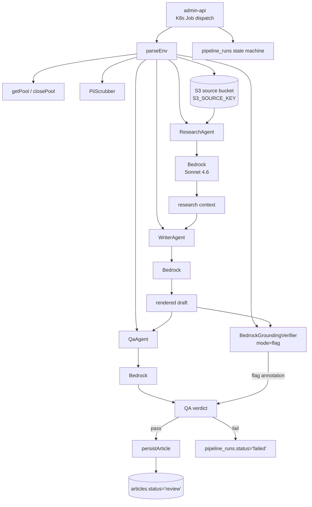

## What it does

The `article-pipeline` is a Kubernetes Job that turns a Markdown
draft uploaded to S3 into a published-ready article. Three
Bedrock-backed agents run in sequence (`Research → Writer → QA`)
over the source markdown, producing a rendered draft persisted to
the `articles` table with `status = 'review'`. The admin-api owns
the eventual transition to `'published'`
([applications/article-pipeline/src/run-pipeline.ts:1-11](../../applications/article-pipeline/src/run-pipeline.ts#L1-L11)).

State machine on every run
([applications/article-pipeline/src/run-pipeline.ts:6-9](../../applications/article-pipeline/src/run-pipeline.ts#L6-L9)):

```text
pipeline_runs.status:
queued → researching → writing → qa → complete | failed
```

Replaces the previous Trigger / Research / Writer / QA Lambda chain
orchestrated by Step Functions. The K8s Job consolidates those into
a single process with one composition point
([composition-root pattern](../patterns/composition-root.md)).

## Architecture



The grounding verifier runs in `flag` mode rather than `block` —
the article path produces narrative content where a borderline-grounded
claim is worth surfacing to the admin reviewer rather than
silently discarding. Compare to
[job-strategist](job-strategist.md) which uses `block`.

## Runtime contract

### Required environment variables

([applications/article-pipeline/src/env.ts:9-50](../../applications/article-pipeline/src/env.ts#L9-L50)):

| Variable | Default | Purpose |
| :- | :- | :- |
| `USER_ID` | — (required) | Portfolio owner UUID — author of the resulting article + cost ledger scope |
| `PIPELINE_RUN_ID` | — (required) | FK into `pipeline_runs` |
| `SLUG` | — (required) | URL slug for the article |
| `S3_BUCKET` | — (required) | Source bucket holding the Markdown draft |
| `S3_SOURCE_KEY` | — (required) | Key within the bucket |
| `MODE` | `standard` | PipelineMode-compatible mode flag |
| `PIPELINE_ID` | `PIPELINE_RUN_ID` | Logical pipeline id |
| `ENVIRONMENT` | `production` | Environment label |
| `PG_HOST` / `PG_PORT` / `PG_DATABASE` / `PG_USER` / `PG_PASSWORD` | — (required) | Aurora Postgres connection |

### Inputs

- **S3 markdown** at `s3://${S3_BUCKET}/${S3_SOURCE_KEY}` — the
  draft to process.
- **`pipeline_runs` row** keyed by `PIPELINE_RUN_ID` — read at start.
- **Bedrock Knowledge Base** — Research agent retrieves context.

### Outputs

- **`articles` row** with `status = 'review'`, the rendered draft,
  the QA annotations, and `slug`.
- **`pipeline_runs.status`** transitions through the state machine;
  `metadata` carries the research citations + QA verdict.
- **`prompt_invocations`** — three rows per run, `pipeline:
  'article-pipeline'`.
- **Prom metrics** to Pushgateway (`article_pipeline_runs_total`
  + `article_pipeline_duration_seconds`).

## Repository layout

```text
applications/article-pipeline/
├── src/
│   ├── run-pipeline.ts        ← K8s Job entrypoint
│   ├── env.ts
│   ├── agents/
│   │   ├── research-agent.ts
│   │   ├── writer-agent.ts
│   │   ├── qa-agent.ts
│   │   └── qa-legacy-bridge.ts  ← transitional shim (slated for removal)
│   ├── prompts/
│   │   ├── research-persona.ts
│   │   ├── blog-persona.ts
│   │   └── qa-persona.ts
│   └── lib/{pg.ts,pipeline-runs.ts}
├── Dockerfile
├── jest.config.js
└── package.json
```

## How to run locally

```bash
yarn workspace @bedrock/article-pipeline build
yarn workspace @bedrock/article-pipeline test
just smoke-article-pipeline   # smoke test against deployed dev
```

Local invocation isn't supported — the agent chain requires
Bedrock + the platform's `pipeline_runs` table + S3 source. The
[scripts/smoke/article-pipeline.smoke.test.ts](../../scripts/smoke/article-pipeline.smoke.test.ts)
harness covers the end-to-end path against the development env.

## Deploy

CI/CD via [deploy-article-pipeline.yml](../../.github/workflows/deploy-article-pipeline.yml):

- Triggers on push to `develop` against
  `applications/article-pipeline/**` or `applications/shared/**`
- Calls reusable `_build-push-image.yml`:
  - `image-ssm-path: /k8s/development/job-images/article-pipeline`

The K8s Job is dispatched **per article draft** by admin-api when a
markdown file lands in the source bucket.

## Related projects

| Project | Relationship |
| :- | :- |
| `tucaken-app` (private) | Reads the resulting `articles.status='published'` rows for the public blog. |
| `tucaken-app` admin path | Triggers Job dispatch when an admin uploads a draft. |
| [job-strategist](job-strategist.md) | Sibling K8s pipeline Job. Same `pipeline_runs` state machine pattern; same grounding verifier; different mode (`block` vs `flag`). |

## Deeper detail

- [docs/concepts/bedrock-rag-surface.md](../concepts/bedrock-rag-surface.md)
  — the BedrockGroundingVerifier this Job uses in `flag` mode; the
  multi-query retrieval that feeds the Research agent
- [docs/concepts/bedrock-cost-tracking.md](../concepts/bedrock-cost-tracking.md)
  — `pipeline: 'article-pipeline'` cost ledger label
- [docs/patterns/composition-root.md](../patterns/composition-root.md)
  — K8s pipeline-job variant of the composition root
- [docs/concepts/pii-scrubber.md](../concepts/pii-scrubber.md) —
  the Research agent's input passes through this scrubber

<!--
Evidence trail (auto-generated):
- Source: applications/article-pipeline/src/run-pipeline.ts (lines 1-40 on 2026-05-27)
- Source: applications/article-pipeline/src/env.ts (lines 1-50 on 2026-05-27)
- Source: applications/article-pipeline/src/agents/ (directory listing on 2026-05-27)
- Source: applications/article-pipeline/src/prompts/ (directory listing on 2026-05-27)
- Source: .github/workflows/deploy-article-pipeline.yml (referenced on 2026-05-27)
-->
