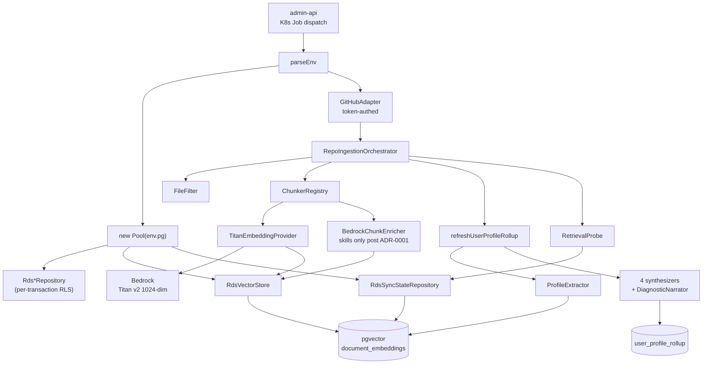

## What it does

The `ingestion` service is a Kubernetes Job that runs once per
`(userId, repoFullName)` pair. It pulls a GitHub repository's
metadata, embeds the content into Aurora pgvector for retrieval, and
runs the [profile synthesis chain](../concepts/profile-synthesis-chain.md)
to produce identity / archetype-fit / résumé-reconciliation /
diagnostic outputs for the user's portfolio rollup.

Two distinct outputs:

- **`document_embeddings`** rows (per chunk, pgvector 1024-dim) for
  the [chatbot-public + chatbot-authenticated](../concepts/bedrock-rag-surface.md)
  custom-retrieval path.
- **`user_profile_rollup`** row (one per user) refreshed at the end
  of every successful ingestion, with mirror / reveal / direction /
  reconciliation / diagnostic columns from the synthesizer chain.

Replaces a previous 3-Lambda chain (Trigger → Fetcher → Worker)
orchestrated by Step Functions
([applications/ingestion/src/run-ingestion.ts:3-8](../../applications/ingestion/src/run-ingestion.ts#L3-L8)).
The K8s Job consolidates those into a single process with a single
composition point — see
[composition-root pattern](../patterns/composition-root.md).

## Architecture



The orchestrator + synthesizer chain are the load-bearing pieces.
Both follow the
[must-not-throw orchestrator pattern](../patterns/must-not-throw-orchestrator.md)
so that synthesizer failures degrade gracefully — the rollup row's
previous values survive via `COALESCE`-on-undefined.

## Runtime contract

### Required environment variables

Set by the K8s Job spec (sibling `kubernetes-platform`)
([applications/ingestion/src/env.ts:23-42](../../applications/ingestion/src/env.ts#L23-L42)):

| Variable | Default | Purpose |
| :- | :- | :- |
| `USER_ID` | — (required) | UUID of the portfolio owner |
| `REPO_FULL_NAME` | — (required) | `owner/repo` to ingest |
| `FORCE_REINDEX` | `false` | Skip the `repo_sync_state` short-circuit |
| `GITHUB_TOKEN` | — (required) | Bearer token for GitHub API + archive |
| `PROFILE_EXTRACTOR_MODEL_ID` | `eu.anthropic.claude-haiku-4-5-20251001-v1:0` | Bedrock model for the `ProfileExtractor` step |
| `PG_HOST` / `PG_PORT` / `PG_DATABASE` / `PG_USER` / `PG_PASSWORD` | — (required) | Aurora Postgres connection |
| `MIRROR_REVEAL_MODEL_ID` | falls back to `PROFILE_EXTRACTOR_MODEL_ID` | Synthesis disabled when neither is set |
| `DIRECTION_MODEL_ID` | falls back to `PROFILE_EXTRACTOR_MODEL_ID` | Synthesis disabled when neither is set |
| `RECONCILIATION_MODEL_ID` | falls back to `PROFILE_EXTRACTOR_MODEL_ID` | Synthesis disabled when neither is set |
| `DIAGNOSTIC_MODEL_ID` | falls back to `PROFILE_EXTRACTOR_MODEL_ID` | Score is deterministic; the LLM paragraph is skipped when neither is set |
| `RETRIEVAL_PROBE_DISABLED` | unset | Set to `"1"` to skip the retrieval-quality probe |
| `RETRIEVAL_PROBE_MODEL_ID` | falls back to `PROFILE_EXTRACTOR_MODEL_ID` | Question generation for the probe |

### Inputs

- **GitHub REST API.** Repository metadata, file contents, recent
  commit messages.
- **Aurora reference data.** Reads existing `repo_sync_state` for
  short-circuit deduplication; reads existing `user_profile_rollup`
  for synthesizer COALESCE preservation.

### Outputs

- **`document_embeddings`** (pgvector 1024-dim) — one row per chunk.
- **`repository_profiles`** — one row per repo per user.
- **`user_profile_rollup`** — one row per user, refreshed at end.
- **`repo_sync_state`** — journal row recording success / failure +
  retrieval probe results.
- **`prompt_invocations`** — per-Bedrock-call cost ledger
  ([bedrock-cost-tracking](../concepts/bedrock-cost-tracking.md)).
- **Prom metrics** pushed to Pushgateway at end of Job.

### Exit codes

- `0` — ingestion complete; `repo_sync_state` set to `complete`
- `1` — error; `repo_sync_state` set to `error`; K8s `backoffLimit`
  triggers retry

## Repository layout

```text
applications/ingestion/
├── src/
│   ├── run-ingestion.ts       ← K8s Job entrypoint (composition root)
│   ├── env.ts                 ← env-var contract
│   ├── agents/
│   │   ├── ProfileExtractor.ts           ← per-repo Bedrock extraction
│   │   ├── ProfileInputCollector.ts      ← PII-scrubbed bundle
│   │   ├── MirrorRevealSynthesizer.ts    ← SP2 — identity + reveals
│   │   ├── DirectionSynthesizer.ts       ← SP3 — archetype fit
│   │   ├── ReconciliationSynthesizer.ts  ← SP4 — résumé↔GitHub gap
│   │   ├── DiagnosticNarrator.ts         ← SP5 — explanation only
│   │   └── RetrievalProbe.ts             ← RAG canary
│   ├── repositories/
│   │   ├── RepositoryProfileRepository.ts
│   │   └── RepositoryProfileEmbeddingsRepository.ts
│   ├── util/
│   │   ├── refreshUserProfileRollup.ts   ← must-not-throw orchestrator
│   │   ├── classifyRepo.ts
│   │   ├── FileFetchCache.ts
│   │   └── scoreProfile.ts
│   ├── env.ts
│   ├── metrics.ts
│   └── run-ingestion.ts
├── Dockerfile
├── jest.config.js
├── package.json
└── tsconfig.json
```

## How to run locally

```bash
yarn workspace @bedrock/ingestion build
yarn workspace @bedrock/ingestion test
```

A live local ingestion run requires a real Aurora cluster + GitHub
token; the development environment's K8s Job is the practical
local test surface. The `__tests__/` suites cover the orchestration
+ synthesizer contracts in isolation with in-memory stubs.

## Deploy

CI/CD via [deploy-ingestion.yml](../../.github/workflows/deploy-ingestion.yml):

- Triggers on push to `develop` against `applications/ingestion/**`
- Calls the reusable `_build-push-image.yml` workflow:
  - `app-name: ingestion`
  - `dockerfile: applications/ingestion/Dockerfile`
  - `ecr-ssm-path: /shared/ecr-ingestion/development/repository-uri`
  - `image-ssm-path: /k8s/development/job-images/ingestion`
- Posts a Loki deploy marker

The image URI lives in SSM at `/k8s/development/job-images/ingestion`;
the K8s Job manifest (in the sibling cluster repo) reads from that
path.

## Related projects

| Project | Relationship |
| :- | :- |
| [tech-extractor](tech-extractor.md) | Runs in parallel for the same `(userId, repoFullName)`. The technologies field of `repository_profiles` is owned by tech-extractor post-ADR 0001. |
| [chatbot-public + chatbot-authenticated](../concepts/bedrock-rag-surface.md) | Consumers of the `document_embeddings` rows this service writes. |
| [ontology-importer](ontology-importer.md) | Reads the ontology this service uses; writes new aliases that this service then resolves. |
| `tucaken-app` (private) | Reads `user_profile_rollup` to render the public profile. |

## Deeper detail

- [docs/concepts/profile-synthesis-chain.md](../concepts/profile-synthesis-chain.md)
  — the 5-agent synthesis pipeline this Job runs
- [docs/patterns/composition-root.md](../patterns/composition-root.md)
  — the K8s-Job variant of the composition-root pattern
- [docs/patterns/must-not-throw-orchestrator.md](../patterns/must-not-throw-orchestrator.md)
  — `refreshUserProfileRollup`'s discipline
- [docs/patterns/per-transaction-rls.md](../patterns/per-transaction-rls.md)
  — every `Rds*Repository` use of `SET LOCAL`
- [docs/decisions/0001-deterministic-over-llm-extraction.md](../decisions/0001-deterministic-over-llm-extraction.md)
  — why `BedrockChunkEnricher` only enriches skills here, not
  technologies
- [docs/concepts/pii-scrubber.md](../concepts/pii-scrubber.md) —
  runs ahead of every `ProfileInputCollector` field

<!--
Evidence trail (auto-generated):
- Source: applications/ingestion/src/run-ingestion.ts (lines 1-50 on 2026-05-27)
- Source: applications/ingestion/src/env.ts (read in full on 2026-05-27)
- Source: applications/ingestion/src/agents/ (directory listing on 2026-05-27)
- Source: applications/ingestion/src/util/ (directory listing on 2026-05-27)
- Source: .github/workflows/deploy-ingestion.yml (lines 1-40 on 2026-05-27)
-->
