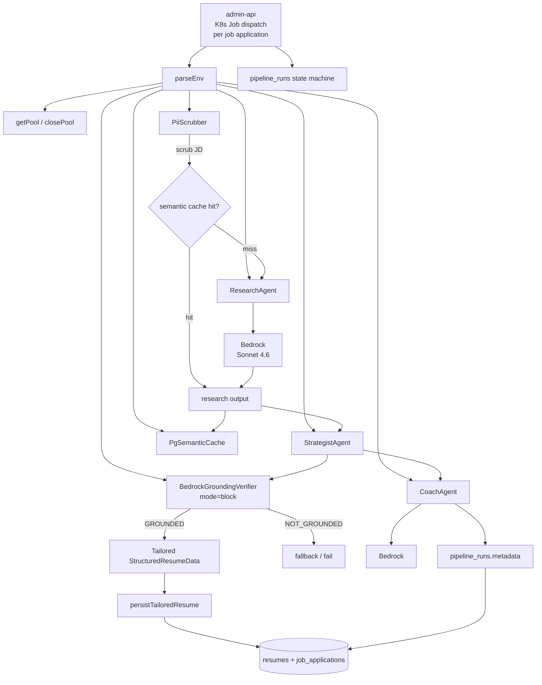

## What it does

The `job-strategist` is a Kubernetes Job that turns a job
description (`job_applications` row) into a tailored résumé +
case-study + coach plan for one of the platform's users. Three
Bedrock-backed agents run in sequence (`Research → Strategist →
Coach`), with state persisted to the RDS `pipeline_runs` state
machine between steps so a mid-pipeline failure can be inspected
and retried.

Two parallel state machines tracked on every run
([applications/job-strategist/src/run-pipeline.ts:1-13](../../applications/job-strategist/src/run-pipeline.ts#L1-L13)):

- **`pipeline_runs.status`** — `queued → researching → analysing →
  persisting → complete | failed`
- **`job_applications.kanban_status`** — `<prior> → analysing →
  analysis-ready | failed`

The Strategist agent produces a structured `tailoredResume`
([applications/job-strategist/src/schemas/resume-data.schema.ts](../../applications/job-strategist/src/schemas/resume-data.schema.ts))
that is persisted alongside the existing `resumes` row. The Coach
plan lives on `pipeline_runs.metadata`. Three entrypoints
(`run-pipeline.ts`, `run-case-study.ts`, `run-coach.ts`) target
different downstream consumers.

## Architecture



The Research agent's KB-context retrieval is fronted by the
[PgSemanticCache](../concepts/caching-tiers.md) keyed by a
PII-scrubbed version of the job description — repeated runs against
the same JD share the embedding + retrieval. The Strategist's
output passes through the
[BedrockGroundingVerifier](../concepts/bedrock-rag-surface.md#grounding-verifier-haiku-second-pass)
in `block` mode; a NOT_GROUNDED verdict replaces the tailored
résumé with a fallback rather than letting a hallucination reach
the user.

## Runtime contract

### Required environment variables

([applications/job-strategist/src/env.ts:11-58](../../applications/job-strategist/src/env.ts#L11-L58)):

| Variable | Default | Purpose |
| :- | :- | :- |
| `PIPELINE_RUN_ID` | — (required) | Foreign key into `pipeline_runs` |
| `APPLICATION_ID` | — (required) | `job_applications.id` for the run |
| `APPLICATION_SLUG` | — (required) | URL-safe slug for the application |
| `USER_ID` | — (required) | Portfolio owner UUID — cost ledger + retrieval scope |
| `TARGET_COMPANY` | — (required) | Company name (free text) |
| `TARGET_ROLE` | — (required) | Role title (free text) |
| `JOB_DESCRIPTION` | — (required) | Raw JD; scrubbed via `PiiScrubber` before any embedding |
| `RESUME_ID` | empty | Optional starting résumé to tailor |
| `MODE` | `standard` | `PipelineMode`-compatible mode flag |
| `PIPELINE_ID` | `PIPELINE_RUN_ID` | Logical pipeline id (e.g. `job-strategist-v2`) |
| `PIPELINE_VERSION` | `1` | Integer version for output schema migrations |
| `ENVIRONMENT` | `production` | Environment label |
| `PG_HOST` / `PG_PORT` / `PG_DATABASE` / `PG_USER` / `PG_PASSWORD` | — (required) | Aurora Postgres connection |

### Inputs

- **`job_applications` + `users` rows** read at start.
- **`resumes`** read when `RESUME_ID` is provided (tailoring base).
- **Bedrock Knowledge Base** via Bedrock-Agent retrieval — feeds the
  Research agent's context.
- **`semantic_cache`** read against `scope: 'strategist-research'`
  + `kbTag: <model+kb-revision>`.

### Outputs

- **`pipeline_runs.status`** transitions through the state machine.
- **`pipeline_runs.metadata`** carries the Coach plan + research
  citations.
- **`resumes`** — a new row written by `persistTailoredResume`
  ([applications/job-strategist/src/lib/pipeline-runs.ts](../../applications/job-strategist/src/lib/pipeline-runs.ts)).
- **`job_applications.kanban_status`** transitions in parallel.
- **`prompt_invocations`** — three rows per run (Research +
  Strategist + Coach), each with the agent + model + cost.
- **Prom metrics** to Pushgateway.

## Repository layout

```text
applications/job-strategist/
├── src/
│   ├── run-pipeline.ts        ← K8s Job entrypoint (Research → Strategist → Coach)
│   ├── run-case-study.ts      ← K8s Job entrypoint (case-study generation, RedisExactCache)
│   ├── run-clustering.ts      ← K8s Job entrypoint (project clustering)
│   ├── run-coach.ts           ← K8s Job entrypoint (Coach-only re-run)
│   ├── env.ts
│   ├── env-case-study.ts
│   ├── env-clustering.ts
│   ├── env-coach.ts
│   ├── agents/
│   │   ├── research-agent.ts
│   │   ├── strategist-agent.ts
│   │   └── coach-agent.ts
│   ├── prompts/
│   │   ├── research-persona.ts
│   │   ├── strategist-persona.ts
│   │   ├── coach-persona.ts
│   │   ├── resume-builder-persona.ts
│   │   └── resume-constraints.ts
│   ├── schemas/
│   │   ├── trigger.schema.ts
│   │   ├── environment.schema.ts
│   │   ├── resume-data.schema.ts
│   │   ├── dynamo-record.schema.ts
│   │   └── index.ts
│   ├── services/resume-service.ts
│   ├── security/{input-sanitiser,output-sanitiser}.ts
│   └── lib/{pg.ts,pipeline-runs.ts}
├── Dockerfile
├── jest.config.js
└── package.json
```

## How to run locally

```bash
yarn workspace @bedrock/job-strategist build
yarn workspace @bedrock/job-strategist test

# Integration test against the live development cluster
just smoke-job-strategist   # (see justfile)
```

Local-only invocation isn't supported — the agent chain requires
Bedrock + the platform's `pipeline_runs` table. The
[scripts/smoke/job-strategist.smoke.test.ts](../../scripts/smoke/job-strategist.smoke.test.ts)
harness covers the end-to-end path against a development env.

## Deploy

CI/CD via [deploy-job-strategist.yml](../../.github/workflows/deploy-job-strategist.yml):

- Triggers on push to `develop` against
  `applications/job-strategist/**` or `applications/shared/**`
- Calls reusable `_build-push-image.yml`:
  - `image-ssm-path: /k8s/development/job-images/job-strategist`

The K8s Job is dispatched **per job application** by admin-api,
not on a schedule — the workflow only refreshes the image URI.

## Related projects

| Project | Relationship |
| :- | :- |
| `tucaken-app` (private) | Posts new `job_applications` rows + reads the resulting `resumes` + Coach metadata. |
| `tucaken-quota-app` (private) | Gates job-strategist Job dispatch behind the user's Stripe-backed quota. |
| [ingestion](ingestion.md) | Writes the `user_profile_rollup` row this Job reads as input. |
| [self-healing](self-healing.md) | Same K8s cluster; orthogonal concern. |

## Deeper detail

- [docs/concepts/bedrock-rag-surface.md](../concepts/bedrock-rag-surface.md)
  — the BedrockGroundingVerifier this Job uses in `block` mode +
  the multi-query retrieval that feeds the Research agent
- [docs/concepts/caching-tiers.md](../concepts/caching-tiers.md) —
  `PgSemanticCache` + `RedisExactCache` (used by `run-case-study`)
- [docs/concepts/bedrock-cost-tracking.md](../concepts/bedrock-cost-tracking.md)
  — `pipeline: 'job-strategist'` cost ledger label
- [docs/patterns/composition-root.md](../patterns/composition-root.md)
  — K8s pipeline-job variant of the composition root
- [docs/patterns/zod-tool-use.md](../patterns/zod-tool-use.md) —
  the StructuredResumeData zod schema + forced tool-use
- [docs/concepts/pii-scrubber.md](../concepts/pii-scrubber.md) —
  runs ahead of every semantic-cache lookup keyed by the JD

<!--
Evidence trail (auto-generated):
- Source: applications/job-strategist/src/run-pipeline.ts (lines 1-40 on 2026-05-27)
- Source: applications/job-strategist/src/env.ts (lines 1-60 on 2026-05-27)
- Source: applications/job-strategist/src/agents/ (directory listing on 2026-05-27)
- Source: applications/job-strategist/src/prompts/ (directory listing on 2026-05-27)
- Source: applications/job-strategist/src/schemas/ (directory listing on 2026-05-27)
- Source: .github/workflows/deploy-job-strategist.yml (referenced on 2026-05-27)
-->
