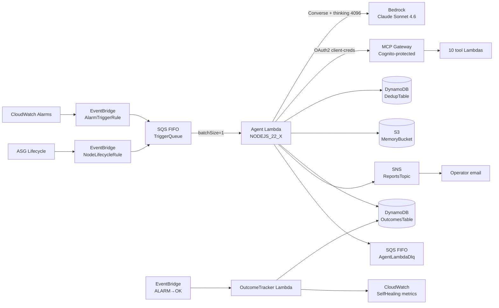

## What it does

The `self-healing` service is a TypeScript Lambda that consumes scoped
CloudWatch Alarms and EC2 Auto Scaling lifecycle events and runs a
Bedrock-backed remediation agent against them. The agent discovers its
remediation toolset dynamically from an AgentCore MCP Gateway, decides
what to inspect or change, and produces a human-readable report
published to an operator SNS topic. Default mode is `DRY_RUN=true` —
the agent reasons and proposes but does not mutate infrastructure
unless the environment explicitly opts in
([applications/self-healing/src/index.ts:69](../../applications/self-healing/src/index.ts#L69)).

For the design rationale and loop mechanics see
[the concept doc](../concepts/self-healing-agent.md). This README is
the deployment / operator view.

## Architecture



Two Lambdas, two CDK stacks:

- **`AgentStack`** ([infra/lib/stacks/self-healing/agent-stack.ts](../../infra/lib/stacks/self-healing/agent-stack.ts))
  provisions the agent Lambda, the outcome-tracker Lambda, the SQS
  FIFO trigger queue + DLQ, both DynamoDB tables, the EventBridge
  rules, the SNS topic, the SSM-stored system prompt, the memory
  bucket, and the two token-budget alarms.
- **`GatewayStack`** ([infra/lib/stacks/self-healing/gateway-stack.ts](../../infra/lib/stacks/self-healing/gateway-stack.ts))
  provisions the AgentCore Gateway, a Cognito User Pool + Client for
  M2M auth, and the 10 tool Lambdas the Gateway exposes
  ([gateway-stack.ts:24-95](../../infra/lib/stacks/self-healing/gateway-stack.ts#L24-L95)).
  Tools live at [applications/self-healing/src/tools/](../../applications/self-healing/src/tools/),
  one sub-directory each.

## Runtime contract

### Required environment variables

Set by `AgentStack` via the Lambda environment block
([agent-stack.ts:305-322](../../infra/lib/stacks/self-healing/agent-stack.ts#L305-L322)):

| Variable | Source | Purpose |
| :- | :- | :- |
| `GATEWAY_URL` | `GatewayStack` SSM export | MCP Gateway endpoint for `tools/list` + `tools/call` |
| `FOUNDATION_MODEL` | Project config | Bedrock model id (default `eu.anthropic.claude-sonnet-4-6`) |
| `INFERENCE_PROFILE_ARN` | Application Inference Profile | Cost-attribution profile |
| `DRY_RUN` | Stack prop | `'true'` (default) or `'false'` — enables write tools |
| `SYSTEM_PROMPT_SSM_PATH` | Stack-created SSM parameter | Path to SecureString system prompt |
| `COGNITO_TOKEN_ENDPOINT` | `GatewayStack` SSM export | OAuth2 token endpoint |
| `COGNITO_USER_POOL_ID` | `GatewayStack` SSM export | For `DescribeUserPoolClient` |
| `COGNITO_CLIENT_ID` | `GatewayStack` SSM export | Client credentials client id |
| `COGNITO_SCOPES` | `GatewayStack` SSM export | Scope(s) requested in the token grant |
| `SNS_TOPIC_ARN` | Stack-created topic | Operator notification target |
| `MEMORY_BUCKET` | Stack-created bucket | S3 session memory |
| `DEDUP_TABLE_NAME` | Stack-created DynamoDB | Cross-container dedup (SH-S4) |
| `OUTCOMES_TABLE_NAME` | Stack-created DynamoDB | Outcome correlation (SH-R5) |

### Inputs (system boundary)

- **CloudWatch Alarm state changes** filtered by EventBridge: source
  `aws.cloudwatch`, detail-type `CloudWatch Alarm State Change`, state
  `ALARM`, and *not* the agent's own alarms (`anything-but` prefix
  `${namePrefix}-agent`)
  ([agent-stack.ts AlarmTriggerRule](../../infra/lib/stacks/self-healing/agent-stack.ts)).
  The exclusion prevents the agent triggering on its own token-budget
  alarm.
- **EC2 ASG terminations** scoped to ASGs whose name matches
  `props.k8sAsgPrefix` (`NodeLifecycleRule`). Both inputs flow into the
  same FIFO queue.

### Outputs

- **Bedrock invocations** against the supplied inference profile +
  foundation model ARN (`bedrock:InvokeModel` /
  `bedrock:InvokeModelWithResponseStream`).
- **MCP tool calls** to the Gateway over HTTPS with a Cognito bearer
  token. Tool calls land on the 10 tool Lambdas; each is `kubectl get` /
  `aws describe-*` only, except `remediate_node_bootstrap` which starts
  a Step Functions execution.
- **CloudWatch Logs** with structured JSON lines extracted by metric
  filters into `${namePrefix}/SelfHealing` `InputTokens` and
  `OutputTokens` metrics
  ([agent-stack.ts:343-365](../../infra/lib/stacks/self-healing/agent-stack.ts#L343-L365)).
- **SNS Email** notification per invocation (success or error) with
  the full remediation report.
- **DynamoDB writes** to dedup + outcomes tables.
- **S3 writes** to the memory bucket under
  `sessions/{sanitised-alarm-name}/{ISO-timestamp}.json`.

## Repository layout

```text
applications/self-healing/
├── src/
│   ├── index.ts              ← agent handler (1622 lines)
│   ├── outcome-tracker.ts    ← ALARM→OK correlator
│   ├── tools/                ← 10 tool Lambdas (Gateway-side)
│   │   ├── analyse-cluster-health/
│   │   ├── check-argocd-sync/
│   │   ├── check-cert-manager/
│   │   ├── check-ingress-routes/
│   │   ├── check-node-health/
│   │   ├── check-security-group-rules/
│   │   ├── diagnose-alarm/
│   │   ├── get-node-diagnostic-json/
│   │   ├── inspect-workloads/
│   │   └── remediate-node-bootstrap/  ← only write tool
│   └── handler.test.ts
├── package.json
└── tsconfig.json

infra/lib/stacks/self-healing/
├── agent-stack.ts            ← agent + outcomes + queues + alarms
├── gateway-stack.ts          ← Gateway + Cognito + tool Lambdas
└── index.ts
```

## How to run locally

The agent runs unmodified in Lambda; it is not exercised locally as a
service. For development:

```bash
# Type check + lint
yarn workspace @bedrock/self-healing typecheck
yarn workspace @bedrock/self-healing build

# Unit tests
yarn workspace @bedrock/self-healing test
```

Smoke / integration testing is performed against a deployed dev
environment via the broader `just smoke-e2e` harness — the self-healing
agent is not directly invoked there; instead a contrived alarm is
fired and the agent's published SNS report is asserted.

## Deploy

Both stacks deploy via the project's CDK pipeline. Trigger:

```bash
# From infra/
yarn cdk deploy SelfHealing-Gateway-${env} SelfHealing-Agent-${env}
```

The Agent stack depends on SSM parameters exported by the Gateway
stack (`GatewayUrl`, `GatewayId`, plus the Cognito client values), so
the Gateway must be deployed first on initial setup
([gateway-stack.ts:1188-1215](../../infra/lib/stacks/self-healing/gateway-stack.ts#L1188-L1215)).

CDK-Nag suppressions are applied at the Agent Lambda (foundation-model
ARN wildcard pattern), at the reports SNS topic (email-only delivery —
no SSL enforcement), at the memory bucket (internal session data —
server access logging not required), and at the Gateway Cognito User
Pool (M2M only — password policy / MFA / advanced security inapplicable)
([agent-stack.ts L1 suppression block](../../infra/lib/stacks/self-healing/agent-stack.ts), [gateway-stack.ts:1075-1084](../../infra/lib/stacks/self-healing/gateway-stack.ts#L1075-L1084)).

## Related projects

| Project | Relationship |
| :- | :- |
| [tech-extractor (retired, now `ingestion`'s facts stage)](../concepts/tech-extractor-architecture.md) | Same monorepo, *opposite* design point — see [ADR 0001](../decisions/0001-deterministic-over-llm-extraction.md). |
| `kubernetes-platform` / `kubernetes-bootstrap` (sibling repos) | The cluster the agent operates against. Bootstrap step semantics referenced by the agent's diagnostic guidance live there. |
| [ingestion](../../applications/ingestion/) | Uses the same `@bedrock/shared` observability primitives (`withSpan`, structured logger). |

## Deeper detail

- [concepts/self-healing-agent.md](../concepts/self-healing-agent.md)
  — design and loop mechanics
- (planned) [concepts/mcp-gateway-integration.md](../concepts/mcp-gateway-integration.md)
  — the gateway side: Cognito M2M, `tools/list`, per-tool layout
- (planned) [runbooks/self-healing-token-budget.md](../runbooks/self-healing-token-budget.md)
  — what to do when the token-budget alarms fire
- (planned) [troubleshooting/self-healing-stuck-remediation.md](../troubleshooting/self-healing-stuck-remediation.md)
  — diagnosing a flapping alarm
- [decisions/0001-deterministic-over-llm-extraction.md](../decisions/0001-deterministic-over-llm-extraction.md)
  — the counter-decision; pair-read for the heuristic

<!--
Evidence trail (auto-generated):
- Source: applications/self-healing/src/index.ts (read in full on 2026-05-27)
- Source: applications/self-healing/package.json (read on 2026-05-27)
- Source: applications/self-healing/src/tools/ (directory listing on 2026-05-27)
- Source: infra/lib/stacks/self-healing/agent-stack.ts (lines 280-580, 630-770 on 2026-05-27)
- Source: infra/lib/stacks/self-healing/gateway-stack.ts (grep + read on 2026-05-27)
-->
