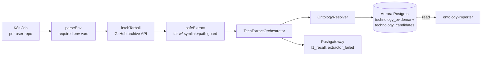

## What it does

The `tech-extractor` service runs as a Kubernetes Job per user-repo
pair. It fetches the repo's tarball from GitHub, walks the file tree,
runs three deterministic extractor families in parallel, resolves
every raw token through the
[ontology resolver](../concepts/ontology-resolver.md), and writes
matched evidence rows into `technology_evidence` plus unmatched
candidates into `technology_candidates` for the
[ontology-importer](../../applications/ontology-importer/) to review.

For the architecture and source-layer confidence model see the
[concept doc](../concepts/tech-extractor-architecture.md). For the
strategic reason this exists see
[ADR 0001](../decisions/0001-deterministic-over-llm-extraction.md).

## Architecture



Single-purpose service. No long-running process — every invocation is
a Job that fetches, extracts, persists, and exits.

## Runtime contract

### Required environment variables

Set by the K8s Job spec (sibling repos:
`kubernetes-platform` / `kubernetes-bootstrap`)
([applications/tech-extractor/src/env.ts:20-35](../../applications/tech-extractor/src/env.ts#L20-L35)):

| Variable | Default | Purpose |
| :- | :- | :- |
| `USER_ID` | — (required) | User the extraction is for; tagged on every evidence row |
| `REPO_FULL_NAME` | — (required) | `owner/repo` — input to GitHub archive API |
| `COMMIT_SHA` | `HEAD` | Tarball ref; recorded on every evidence row |
| `GITHUB_TOKEN` | — (required) | Bearer token for the archive request |
| `WORK_DIR` | `/work` | Working directory for tarball + extract |
| `PG_HOST` / `PG_PORT` / `PG_DATABASE` / `PG_USER` / `PG_PASSWORD` | — (required) | Aurora Postgres connection |
| `MAX_TARBALL_BYTES` | `209715200` (200 MB) | Refuses tarballs above the cap |

### Inputs (system boundary)

- **GitHub archive API.** Single tarball fetch per Job, follows the
  302 to codeload, enforces `Content-Length` against `MAX_TARBALL_BYTES`
  ([applications/tech-extractor/src/tarball/fetchTarball.ts:10-30](../../applications/tech-extractor/src/tarball/fetchTarball.ts#L10-L30)).
- **Postgres reference data.** `technology_aliases`, `ontology_version`
  loaded once per Job by
  [TechnologyOntologyRepository](../../applications/shared/src/rds/implementations/TechnologyOntologyRepository.ts).

### Outputs

- **`technology_evidence` rows.** One per matched extractor occurrence,
  tagged with `userId`, `repoFullName`, `commitSha`, `technologyId`,
  `sourceLayer`, `confidence`, `ontologyVersion`, file path + line range.
- **`technology_candidates` upserts.** One per distinct
  `(normalized_name, ecosystem)` pair the resolver could not match —
  the input the [ontology-importer](../../applications/ontology-importer/)
  curation loop consumes.
- **`technology_parity_runs` row.** One per Job (watchdog; LLM
  comparison now always shows zero post-decommission).
- **Prom metrics** (pushed to Pushgateway at end of Job):
  `tech_extractor_layer1_recall{repo}` Gauge,
  `tech_extractor_extractor_failed_total{extractor}` Counter
  ([applications/tech-extractor/src/run-tech-extract.ts:28-40](../../applications/tech-extractor/src/run-tech-extract.ts#L28-L40)).

## Repository layout

```text
applications/tech-extractor/
├── src/
│   ├── run-tech-extract.ts            ← Job entrypoint
│   ├── env.ts                         ← env-var contract
│   ├── orchestrator/
│   │   └── TechExtractOrchestrator.ts ← Promise.allSettled fan-out
│   ├── extractors/
│   │   ├── Extractor.ts               ← interface
│   │   ├── SyftExtractor.ts           ← SBOM / dependency manifest
│   │   ├── TreeSitterExtractor.ts     ← imports + SDK call patterns
│   │   ├── CommentExtractor.ts        ← code-prose range extraction
│   │   └── iac/                       ← 10 parsers + 2 universal scanners
│   ├── tarball/
│   │   ├── fetchTarball.ts            ← GitHub archive + max-size cap
│   │   └── safeExtract.ts             ← symlink/path-traversal guard
│   ├── util/fileWalk.ts               ← text-file enumeration
│   ├── parity/ParityReporter.ts       ← watchdog (post-decommission)
│   └── config/sdkCallPatterns.json    ← regex patterns by language
├── parity/                            ← measurement artefacts (CSVs + analysis)
├── specs/                             ← design specs
├── Dockerfile
├── jest.config.js
├── package.json
└── tsconfig.json
```

## How to run locally

Local invocation requires a live ontology database. With one
available (or via the smoke harness):

```bash
yarn workspace @bedrock/tech-extractor build
yarn workspace @bedrock/tech-extractor test
yarn workspace @bedrock/tech-extractor lint   # tsc --noEmit only

# Single repo extraction (requires env)
USER_ID=test REPO_FULL_NAME=owner/repo GITHUB_TOKEN=$GH_TOKEN \
  PG_HOST=... PG_PORT=5432 PG_DATABASE=... PG_USER=... PG_PASSWORD=... \
  node applications/tech-extractor/dist/run-tech-extract.js
```

The compiled entry point sits at
`applications/tech-extractor/dist/run-tech-extract.js`
(matches `"main"` in
[package.json:6](../../applications/tech-extractor/package.json#L6)).

## Deploy

CI/CD via
[.github/workflows/deploy-tech-extractor.yml](../../.github/workflows/deploy-tech-extractor.yml).
The workflow:

1. Triggers on `push` to `develop` against
   `applications/tech-extractor/**`, `applications/shared/**`, or the
   workflow file itself.
2. Calls the reusable `_build-push-image.yml` workflow with:
   - `app-name: tech-extractor`
   - `dockerfile: applications/tech-extractor/Dockerfile`
   - `ecr-ssm-path: /shared/ecr-tech-extractor/development/repository-uri`
   - `image-ssm-path: /k8s/development/job-images/tech-extractor`
3. Posts a Loki deploy marker.

The reusable workflow builds with `corepack enable && corepack prepare
yarn@4.12.0 --activate` then `yarn install --immutable`
([applications/tech-extractor/Dockerfile:6-30](../../applications/tech-extractor/Dockerfile#L6-L30)).
The Dockerfile copies *every* workspace manifest before
`yarn install` because Yarn 4's immutable mode resolves the entire
workspace graph and refuses incomplete inputs.

The image URI is written to SSM at
`/k8s/development/job-images/tech-extractor`; the K8s Job manifest
(in the sibling cluster repo) reads from that path so a deploy is a
re-tag, not a manifest edit.

## Related projects

| Project | Relationship |
| :- | :- |
| [ontology-importer](../../applications/ontology-importer/) | Consumes the candidates this service produces; populates the alias table this service reads. |
| [ingestion](../../applications/ingestion/) | Used to extract technologies via BedrockChunkEnricher; that role decommissioned 2026-05-27 (see [ADR 0001](../decisions/0001-deterministic-over-llm-extraction.md)). |
| `kubernetes-platform` / `kubernetes-bootstrap` | Defines the K8s Job spec that runs this image. |

## Deeper detail

- [docs/concepts/tech-extractor-architecture.md](../concepts/tech-extractor-architecture.md)
  — extractor families, source-layer confidence, orchestration
- [docs/concepts/ontology-resolver.md](../concepts/ontology-resolver.md)
  — `OntologyResolver.resolve()` semantics
- [docs/concepts/prose-safe-alias-gating.md](../concepts/prose-safe-alias-gating.md)
  — how the `prose_safe` set that powers the prose scanners gets populated
- [docs/decisions/0001-deterministic-over-llm-extraction.md](../decisions/0001-deterministic-over-llm-extraction.md)
  — why this service is the sole source of truth for technologies
- (planned) [docs/runbooks/tech-extractor-rerun.md](../runbooks/tech-extractor-rerun.md)
  — re-extracting a user/repo after an ontology version bump
- (planned) [docs/troubleshooting/tech-extractor-stuck-extraction.md](../troubleshooting/tech-extractor-stuck-extraction.md)
  — diagnosing a hung Job

<!--
Evidence trail (auto-generated):
- Source: applications/tech-extractor/src/env.ts (read in full on 2026-05-27)
- Source: applications/tech-extractor/src/run-tech-extract.ts (read on 2026-05-27)
- Source: applications/tech-extractor/src/tarball/fetchTarball.ts (lines 1-30 on 2026-05-27)
- Source: applications/tech-extractor/src/tarball/safeExtract.ts (lines 1-30 on 2026-05-27)
- Source: applications/tech-extractor/Dockerfile (lines 1-30 on 2026-05-27)
- Source: applications/tech-extractor/package.json (read on 2026-05-27)
- Source: .github/workflows/deploy-tech-extractor.yml (lines 1-50 on 2026-05-27)
-->
