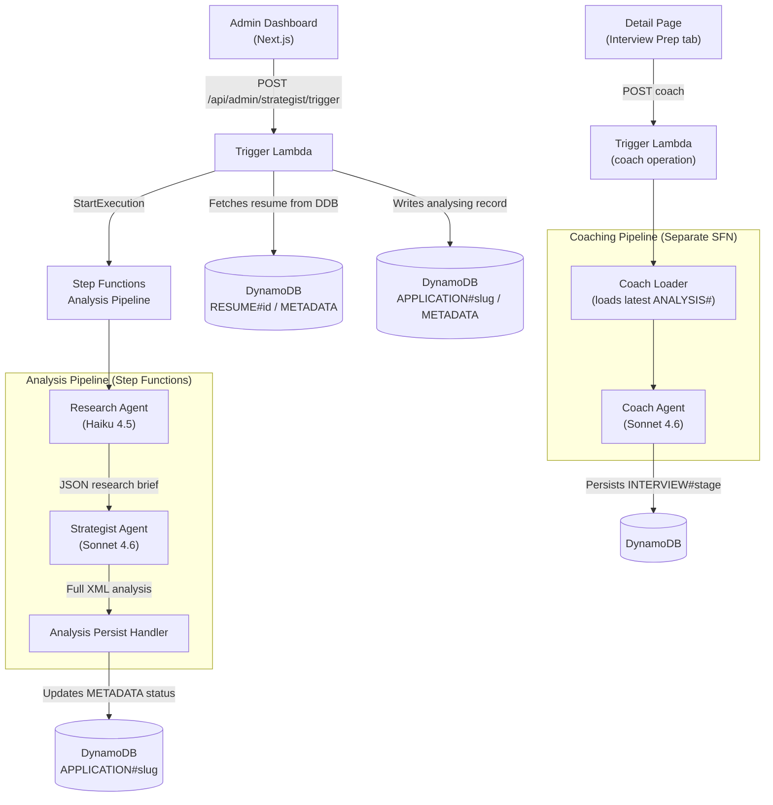

# Strategist pipeline — pre-K8s architecture (historical)

> **Status:** Historical — describes the **Lambda + Step Functions +
> DynamoDB** architecture of the strategist pipeline when it lived in
> sibling `cdk-monitoring` repo (file references in the doc point at
> `cdk-monitoring/bedrock-applications/job-strategist/src/…` paths).
> **The current implementation is documented in
> [docs/projects/job-strategist.md](../projects/job-strategist.md)**;
> that README explicitly notes "Replaces the Trigger / Research /
> Strategist / Resume-builder / Analysis-persist Lambda chain
> orchestrated by Step Functions."
>
> The **agent boundaries themselves** (Trigger → Research →
> Strategist → Coach) carried over to the K8s Job. What changed:
>
> - Step Functions Analysis Pipeline → single K8s Job
>   (`run-pipeline.ts`) with the same agent chain inlined.
> - Step Functions Coaching Pipeline → separate K8s Job
>   (`run-coach.ts`).
> - DynamoDB `APPLICATION#slug` state machine → Aurora Postgres
>   `pipeline_runs` table.
> - Lambda `trigger-handler.ts` → admin-api endpoint dispatching the
>   K8s Job.
>
> The prompt design + zod schemas described here are still the basis
> for the current
> [profile synthesis + grounding patterns](../patterns/zod-tool-use.md).
>
> Originally migrated from sibling `cdk-monitoring` repo on 2026-04-28;
> integrated here on 2026-05-27 per the kb-doc migrate-internal plan.

---

## Strategist Pipeline — Backend Workflow Review (original cdk-monitoring text below)

## Pipeline Architecture Overview



---

## Step-by-Step Data Flow

### Stage 0: Trigger (Frontend → Lambda → Step Functions)

| Step | Source | Action |
|---|---|---|
| 1 | Dashboard UI | User pastes JD, selects company, role, resume version |
| 2 | [trigger-handler.ts](file:///Users/nelsonlamounier/Desktop/portfolio/cdk-monitoring/bedrock-applications/job-strategist/src/handlers/trigger-handler.ts) | Zod-validates input via `TriggerRequestSchema` |
| 3 | Trigger Lambda | Fetches resume from DDB: `pk=RESUME#<resumeId>, sk=METADATA` |
| 4 | Trigger Lambda | Zod-validates resume via `StructuredResumeDataSchema` |
| 5 | Trigger Lambda | Writes initial `APPLICATION#<slug>` record with `status: 'analysing'` |
| 6 | Trigger Lambda | Starts Analysis State Machine with full `StrategistPipelineContext` |

> [!IMPORTANT]
> The resume is passed **as structured JSON** in the Step Functions payload (`ctx.resumeData`). It is **not** fetched from S3 or re-read during the pipeline — the Trigger Lambda reads it once and embeds it.

---

### Stage 1: Research Agent (Haiku 4.5)

**File:** [research-agent.ts](file:///Users/nelsonlamounier/Desktop/portfolio/cdk-monitoring/bedrock-applications/job-strategist/src/agents/research-agent.ts)

| Input | Action | Output |
|---|---|---|
| `ctx.jobDescription` | Sanitises via `sanitiseInput()` | Clean JD text |
| Sanitised JD | Queries Pinecone KB (3 targeted queries, 15 passages each) | Portfolio evidence |
| `ctx.resumeData` | Formats via [resume-service.ts](file:///Users/nelsonlamounier/Desktop/portfolio/cdk-monitoring/bedrock-applications/job-strategist/src/services/resume-service.ts) `formatResumeForPrompt()` | Sectioned plain text |
| Combined prompt | Runs Haiku 4.5 with 4K thinking budget | Structured JSON |

**Output type:** `StrategistResearchResult` (JSON) — contains:
- `verifiedMatches[]`, `partialMatches[]`, `gaps[]`
- `technologyInventory`, `experienceSignals`
- `overallFitRating`, `fitSummary`
- `resumeData` (pass-through), `kbContext` (pass-through)

> [!NOTE]
> The Research Agent does **not** modify the resume. It classifies skills into verified/partial/gap categories and passes the original resume data through unchanged.

---

### Stage 2: Strategist Agent (Sonnet 4.6)

**File:** [strategist-agent.ts](file:///Users/nelsonlamounier/Desktop/portfolio/cdk-monitoring/bedrock-applications/job-strategist/src/agents/strategist-agent.ts)

| Input | Action | Output |
|---|---|---|
| Research brief | Formats to structured markdown for prompt | User message |
| System prompt | 5-phase XML framework ([strategist-persona.ts](file:///Users/nelsonlamounier/Desktop/portfolio/cdk-monitoring/bedrock-applications/job-strategist/src/prompts/strategist-persona.ts)) | Instructions |
| Combined | Runs Sonnet 4.6 (16K output tokens, 12K thinking) | **Raw XML string** |

**What gets generated (XML structure):**

```xml
<job_application_analysis>
  <metadata>...</metadata>
  <phase_1_jd_analysis>...</phase_1_jd_analysis>
  <phase_2_gap_analysis>...</phase_2_gap_analysis>
  <phase_3_strategy>
    <positioning_narrative>...</positioning_narrative>
    <key_strengths>...</key_strengths>
    <gap_mitigation>...</gap_mitigation>
  </phase_3_strategy>
  <phase_4_documents>
    <resume_tailoring>
      <additions><addition>...</addition></additions>     ← Suggested NEW bullets
      <reframes><reframe>...</reframe></reframes>         ← Suggested REWORDING of existing bullets
      <esl_corrections><correction>...</correction></esl_corrections>
    </resume_tailoring>
    <cover_letter><![CDATA[...]]></cover_letter>           ← Full cover letter text
  </phase_4_documents>
  <analysis_notes>...</analysis_notes>
</job_application_analysis>
```

**Post-processing (regex extraction from XML):**

| Field | Extraction Function | Data Type |
|---|---|---|
| `metadata` | `extractMetadataFromXml()` | Object with fitRating, recommendation |
| `coverLetter` | `extractCoverLetter()` | **Plain text string** (from CDATA) |
| `resumeSuggestions.additions[]` | `extractAdditions()` | `{ section, suggestedBullet, sourceCitation }[]` |
| `resumeSuggestions.reframes[]` | `extractReframes()` | `{ original, suggested, rationale }[]` |
| `resumeSuggestions.eslCorrections[]` | `extractEslCorrections()` | `{ original, corrected }[]` |
| `analysisXml` | Raw string pass-through | Full XML preserved |

---

### Stage 3: Analysis Persist Handler

**File:** [analysis-persist-handler.ts](file:///Users/nelsonlamounier/Desktop/portfolio/cdk-monitoring/bedrock-applications/job-strategist/src/handlers/analysis-persist-handler.ts)

**Two DynamoDB writes:**

#### Write 1: Update METADATA record
```
pk: APPLICATION#<slug>
sk: METADATA
status: 'analysis-ready'
fitRating: <extracted>
recommendation: <extracted>
gsi1pk: APP_STATUS#analysis-ready
gsi1sk: <date>#<slug>
totalCostUsd, totalTokens
```

#### Write 2: Create ANALYSIS record
```
pk: APPLICATION#<slug>
sk: ANALYSIS#<pipelineId>
analysisXml: <full XML string>
coverLetter: <plain text>
metadata: { candidateName, targetRole, ... }
resumeSuggestions: { additions[], reframes[], eslCorrections[] }
resumeAdditions: <count>     (deprecated)
resumeReframes: <count>      (deprecated)
eslCorrections: <count>      (deprecated)
```

---

## Critical Findings: What the Pipeline Does NOT Do

> [!CAUTION]
> ### The pipeline does NOT generate a rebuilt/updated resume
>
> The Strategist Agent produces **resume edit suggestions** (additions, reframes, ESL corrections) but does **not** produce a new resume document. The user must manually apply these suggestions to their existing resume.
>
> There is **no reconstructed resume** saved anywhere — not in DynamoDB, not in S3, not as a file.

> [!CAUTION]
> ### The cover letter has no rich formatting
>
> The cover letter is stored as a **plain text string** extracted from XML CDATA. It is:
> - **Not Markdown** — no headers, bold, or structured formatting
> - **Not PDF** — no downloadable document
> - **Not HTML** — no rich rendering
>
> The frontend downloads it as `.md` (via Blob) but the content itself has no Markdown formatting.

---

## Storage & Format Summary

| Artefact | Stored In | Format | File Output? |
|---|---|---|---|
| Research brief | Step Functions state (transient) | JSON | ❌ Not persisted separately |
| Full XML analysis | DynamoDB `ANALYSIS#<pipelineId>` | Raw XML string | ❌ No file |
| Cover letter | DynamoDB `ANALYSIS#<pipelineId>.coverLetter` | **Plain text** | ❌ No file |
| Resume suggestions | DynamoDB `ANALYSIS#<pipelineId>.resumeSuggestions` | JSON object | ❌ No file |
| Fit rating / recommendation | DynamoDB `METADATA` record | String enum values | ❌ No file |
| Interview coaching | DynamoDB `INTERVIEW#<stage>` | JSON (serialised) | ❌ No file |
| Updated resume | ⚠️ **DOES NOT EXIST** | — | ❌ Not generated |


## Frontend Readiness Matrix

| Data Field | Backend Produces | Frontend Renders | Gap? |
|---|---|---|---|
| Status badge (analysing/ready/failed) | ✅ | ✅ | — |
| Fit rating chip | ✅ | ✅ | — |
| Recommendation banner | ✅ | ✅ | — |
| Verified matches list | ✅ | ✅ | — |
| Partial matches list | ✅ | ✅ | — |
| Gaps list | ✅ | ✅ | — |
| Technology inventory | ✅ | ✅ | — |
| Experience signals | ✅ | ✅ | — |
| Cover letter text | ✅ Plain text | ✅ `<pre>` block + copy/download | ⚠️ No formatting |
| Resume additions (structured) | ✅ `{ section, bullet, citation }[]` | ✅ Cards with section badge | — |
| Resume reframes (structured) | ✅ `{ original, suggested, rationale }[]` | ✅ Before/after diff cards | — |
| ESL corrections (structured) | ✅ `{ original, corrected }[]` | ✅ Inline diff display | — |
| Token/cost stats | ✅ | ✅ | — |
| **Rebuilt resume document** | ❌ Not generated | ❌ N/A | 🔴 **Missing** |
| **PDF export (cover letter)** | ❌ Not generated | ❌ N/A | 🟡 Optional |
| **PDF export (resume)** | ❌ Not generated | ❌ N/A | 🟡 Optional |
| Interview questions | ✅ Structured JSON | ✅ Rendered in Interview tab | — |

---

## 🐛 Bugs Found During Review

> [!CAUTION]
> ### Bug 1: Research data is never persisted — Skills Matrix tab will always be empty
>
> **Root cause:** The Analysis Persist Handler ([analysis-persist-handler.ts:89-105](file:///Users/nelsonlamounier/Desktop/portfolio/cdk-monitoring/bedrock-applications/job-strategist/src/handlers/analysis-persist-handler.ts#L89-L105)) writes `analysisXml`, `coverLetter`, `metadata`, and `resumeSuggestions` to the `ANALYSIS#<pipelineId>` DynamoDB record, but **never writes the `research` field**.
>
> The frontend detail API ([route.ts:153](file:///Users/nelsonlamounier/Desktop/portfolio/frontend-portfolio/src/app/api/admin/strategist/applications/%5Bslug%5D/route.ts#L153)) reads `analysisRecord?.['research']` — this will **always** be `null` because the field was never stored.
>
> **Impact:** The entire **Skills Matrix** tab (verified matches, partial matches, gaps, technology inventory) and the **Overview** tab's fit summary and experience signals will all render as empty/loading spinners.
>
> **Fix:** Add `research: research.data` to the PutCommand Item in the persist handler.

> [!WARNING]
> ### Bug 2: Metadata field name mismatch — fit rating & recommendation use hardcoded fallbacks
>
> **Root cause:** The persist handler stores metadata under the key `metadata` (line 96), but the frontend API route reads it as `analysisRecord['analysisMetadata']` (line 158).
>
> ```
> // Persist handler writes:
> metadata: analysis.data.metadata        ← key: "metadata"
>
> // Frontend API reads:
> analysisRecord['analysisMetadata']       ← key: "analysisMetadata" ≠ "metadata"
> ```
>
> This means the frontend **always falls back** to `{ overallFitRating: 'STRETCH', applicationRecommendation: 'APPLY_WITH_CAVEATS' }` regardless of the actual analysis output.
>
> **Fix:** Either rename the persist handler field to `analysisMetadata`, or update the frontend API to read `analysisRecord['metadata']`.

---

## Open Questions for Decision

> [!IMPORTANT]
> ### 1. Resume Generation — Do you want the pipeline to produce a fully rebuilt resume?
>
> **Current behaviour:** The pipeline gives you a list of suggestions (add this bullet to section X, reword this sentence, fix this grammar). You manually apply them.
>
> **Possible enhancement:** Add a Phase 4b agent that takes the original `StructuredResumeData` + the suggestions and produces a complete modified `StructuredResumeData` object. This could be persisted back to DynamoDB as a new resume version and rendered/exported as Markdown or PDF.

> [!IMPORTANT]
> ### 2. Cover Letter Format — Do you want Markdown or PDF formatting?
>
> **Current behaviour:** Plain text stored in DDB, downloaded as `.md` but contains no Markdown syntax.
>
> **Option A:** Update the Strategist prompt to instruct the LLM to produce the cover letter in Markdown format (headers, bold, etc.)
>
> **Option B:** Add a PDF generation step (e.g., via `puppeteer` or `@react-pdf/renderer`) to produce a downloadable PDF from the plain text.

> [!IMPORTANT]
> ### 3. Research Data Persistence — Should the research brief be stored separately?
>
> **Current behaviour:** The research data flows through Step Functions state but is NOT persisted to DynamoDB. The frontend detail API reads `analysisRecord?.['research']` but the persist handler **never writes a `research` field to the ANALYSIS record**.
>
> This means the Skills Matrix tab on the frontend may show empty data if the `research` field doesn't exist on the DDB record.
