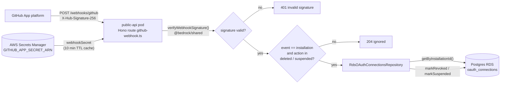
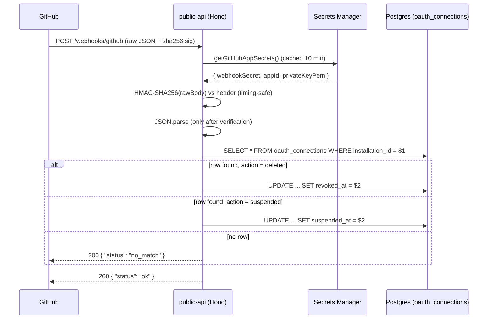

# GitHub App Webhook — public-api revocation listener

This document explains the single webhook implemented in this repository:
`POST /webhooks/github` on the **public-api** service. It covers what it does,
why it exists, the security model, the exact data formats on the wire, the full
dataflow, and the folder/file structure that implements it.

> Scope note: this repo contains **one inbound webhook only**. There are no
> Stripe webhooks and no outbound webhooks here. The *ingestion-triggering*
> GitHub webhook (push events, job dispatch) lives in the companion repo
> `tucaken-app` under `admin-api/` — see
> `tucaken-app/admin-api/docs/webhooks/README.md`. The two webhooks are
> deliberately separate: this one only **revokes access**, that one **creates
> work**.

---

## 1. What it does

When a user uninstalls or suspends the Tucaken GitHub App from their GitHub
account, GitHub delivers an `installation` event to this endpoint. The handler
verifies the delivery is genuinely from GitHub (HMAC-SHA256 signature), then
soft-marks the user's stored GitHub connection as revoked or suspended:

| GitHub event                | Handler action                                        |
| --------------------------- | ----------------------------------------------------- |
| `installation` / `deleted`  | `UPDATE oauth_connections SET revoked_at = now()`     |
| `installation` / `suspended`| `UPDATE oauth_connections SET suspended_at = now()`   |
| any other event type        | Ignored — `204 No Content`                            |
| any other action            | Ignored — `204 No Content`                            |

Nothing else happens: no queues, no Kubernetes Jobs, no fan-out. The single
database write is the whole side effect.

## 2. What problem it solves

The ingestion pipeline authenticates to GitHub using **installation access
tokens** minted from the GitHub App's private key. If a user removes the App,
those tokens stop working — but without this webhook the platform would only
discover that at the next failed API call, and the `oauth_connections` row
would silently claim a live connection that no longer exists.

This webhook closes that gap: the moment GitHub tells us the installation is
gone, the connection row is stamped `revoked_at`/`suspended_at`, so:

- ingestion and token-minting code can skip dead installations up front;
- the UI can show the user an accurate "reconnect GitHub" state;
- we honour the user's revocation intent promptly, which is the correct
  privacy behaviour (their consent was withdrawn — stop acting on it).

## 3. Why a webhook (and not polling)?

- **Push beats poll for rare events.** Uninstalls are infrequent; polling the
  GitHub API for installation status would burn rate limit continuously to
  detect something that happens rarely. GitHub pushes the event once, exactly
  when it happens.
- **GitHub is the source of truth** for installation lifecycle. There is no
  local action that can observe an uninstall — it happens entirely on
  GitHub's side, so GitHub must initiate the notification.
- **At-least-once with retries.** GitHub retries failed deliveries, which is
  why the handler's status-code contract matters (see section 6) — 2xx means
  "consumed, do not retry".

## 4. Concepts applied

- **HMAC-SHA256 shared-secret authentication** (`X-Hub-Signature-256`). The
  endpoint is unauthenticated in the JWT/Cognito sense; the signature over the
  raw body *is* the authentication. Prompt-level or header-level checks are
  not trusted — the cryptographic check is the gate.
- **Constant-time comparison** (`crypto.timingSafeEqual`) so signature
  checking does not leak digest bytes through response-timing differences.
- **Raw-bytes discipline.** The HMAC is computed by GitHub over the exact
  wire bytes. The handler therefore reads `c.req.arrayBuffer()` into a
  `Buffer` *before* any JSON parsing — re-stringifying a parsed body would
  change the bytes and break verification. JSON.parse only runs after the
  signature passes.
- **Soft delete over hard delete.** `revoked_at`/`suspended_at` timestamps
  preserve the row (audit trail, easy reconnect) instead of destroying it.
- **Fail-closed secret handling.** The webhook secret lives in AWS Secrets
  Manager; misconfiguration surfaces as a 500 from the secret fetcher, never
  as a misleading 401.
- **Pure-function crypto core.** The verifier is a dependency-free function in
  `@bedrock/shared`, unit-tested in isolation from the HTTP layer.

## 5. Dataflow



Sequence view of the happy path:



## 6. Data formats

### Request (from GitHub)

Headers consumed:

| Header                 | Purpose                                        |
| ---------------------- | ---------------------------------------------- |
| `X-GitHub-Delivery`    | Delivery UUID, used only for log correlation   |
| `X-GitHub-Event`       | Event type; anything other than `installation` is ignored |
| `X-Hub-Signature-256`  | `sha256=<hex>` — HMAC-SHA256 of the raw body   |

Body (the handler only reads this subset of GitHub's payload):

```json
{
  "action": "deleted",
  "installation": { "id": 12345678 }
}
```

`installation.id` may arrive as number or string; it is coerced to string
before the lookup, matching the `installation_id TEXT` column.

### Responses (status-code contract)

| Condition                                   | Status | Body                          |
| ------------------------------------------- | ------ | ----------------------------- |
| Signature missing/invalid                   | 401    | `{ "error": "invalid signature" }` |
| Event is not `installation`                 | 204    | (empty)                       |
| Body is not valid JSON (signature was valid)| 400    | `{ "error": "bad json" }`     |
| `installation.id` missing                   | 400    | `{ "error": "missing installation.id" }` |
| Action not `deleted`/`suspended`            | 204    | (empty)                       |
| Unknown `installation_id`                   | 200    | `{ "status": "no_match" }`    |
| Row updated                                 | 200    | `{ "status": "ok" }`          |
| Repository/DB failure                       | 500    | (Hono default error)          |

2xx tells GitHub the delivery is consumed; non-2xx makes GitHub retry, which
is exactly what we want for transient DB failures and never want for
malformed-but-authentic deliveries.

### Signature scheme

`X-Hub-Signature-256: sha256=<hex(HMAC_SHA256(webhookSecret, rawBody))>`

The verifier (`verifyWebhookSignature`) requires the `sha256=` prefix,
hex-decodes the digest, rejects on length mismatch (which also catches
malformed hex), and compares with `timingSafeEqual`. It returns `false` on
every malformed input — it never throws.

## 7. Security model

- **Secret storage:** a single Secrets Manager secret (JSON blob
  `{ appId, privateKeyPem, webhookSecret }`) referenced by the
  `GITHUB_APP_SECRET_ARN` environment variable, which is required at boot.
  Only `webhookSecret` is used on the webhook path. The secret value is
  cached in-process for 10 minutes.
- **No static AWS credentials:** the SDK default chain resolves the EC2 node
  instance profile.
- **No JWT on this route:** GitHub cannot present a Cognito token; the HMAC
  signature is the sole and sufficient authenticator.
- **CORS is irrelevant here:** this is a server-to-server POST; GitHub sends
  no `Origin` header, and CORS is a browser mechanism anyway.

## 8. Folder / file structure

```text
applications/shared/src/github/
  webhookSignature.ts         # pure HMAC-SHA256 verifier (no I/O, no HTTP)
  webhookSignature.test.ts    # 9 unit tests (tampered body/header, sha1=, bad hex, ...)
  appJwt.ts                   # GitHub App JWT signer (companion, not webhook path)
  index.ts                    # barrel: re-exports via @bedrock/shared

api/public-api/src/
  routes/github-webhook.ts    # the POST /webhooks/github handler (Hono)
  lib/githubAppSecrets.ts     # Secrets Manager fetch + validation + 10 min TTL cache
  lib/config.ts               # requires GITHUB_APP_SECRET_ARN at boot
  lib/oauth.ts                # getOAuthConnectionsRepo() factory
  index.ts                    # mounts the route into the Hono app

api/public-api/__tests__/
  routes/github-webhook.test.ts   # 10 integration tests over the full route
  lib/githubAppSecrets.test.ts    # secret fetch/validation tests

applications/shared/src/rds/
  interfaces/IOAuthConnectionsRepository.ts
  implementations/RdsOAuthConnectionsRepository.ts  # SELECT by installation_id,
                                                    # markRevoked / markSuspended
```

The split is intentional: the **crypto core** is a pure function in the shared
workspace (testable without HTTP), the **HTTP handler** owns status-code
policy, and the **repository** owns SQL. Infrastructure (the ingress that
exposes `/webhooks/github` to the internet) lives in the separate GitOps
repo, not here.

## 9. Persistence

Table: `oauth_connections` (Postgres/RDS). Columns relevant to this webhook:

| Column            | Role                                                  |
| ----------------- | ----------------------------------------------------- |
| `installation_id` | TEXT; lookup key from the webhook payload             |
| `revoked_at`      | stamped on `installation.deleted`                     |
| `suspended_at`    | stamped on `installation.suspended`                   |

The `installation_id` column is added by
`applications/platform-rds-bootstrap/src/bootstrap.ts`. Note: there is
currently **no UNIQUE constraint** on `installation_id` (tracked in the design
doc below).

## 10. Tests

- `applications/shared/src/github/webhookSignature.test.ts` — 9 verifier
  cases: valid signature, tampered body, tampered header, wrong secret,
  undefined/empty header, `sha1=` prefix rejection, malformed hex, truncated
  header.
- `api/public-api/__tests__/routes/github-webhook.test.ts` — 10 route cases
  covering every row of the status-code table above, including "repository
  throws leads to 500".

## 11. Known gotchas

- `installation_id` has no UNIQUE constraint yet; the handler operates on the
  first matching row.
- This webhook does **not** clean up repositories, embeddings or sync state —
  that cascade lives in the `tucaken-app` admin-api webhook, which handles the
  same `installation.deleted` event independently.

## 12. Related documents

- Design/status contract:
  `docs/superpowers/specs/2026-05-21-github-webhook-and-app-jwt-design.md`
- Implementation plan:
  `docs/superpowers/plans/2026-05-21-github-webhook-and-app-jwt.md`
- Concept overview: `docs/concepts/github-app-connection.md`
- Companion (ingestion-triggering) webhook:
  `tucaken-app/admin-api/docs/webhooks/README.md`
